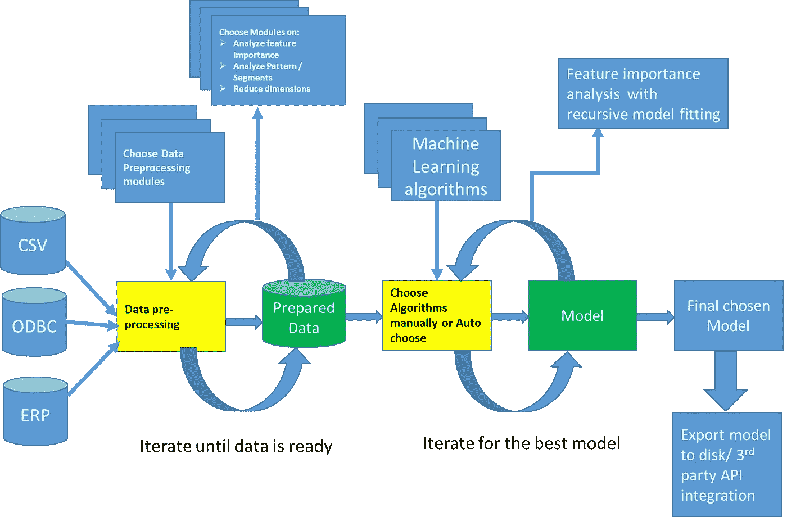
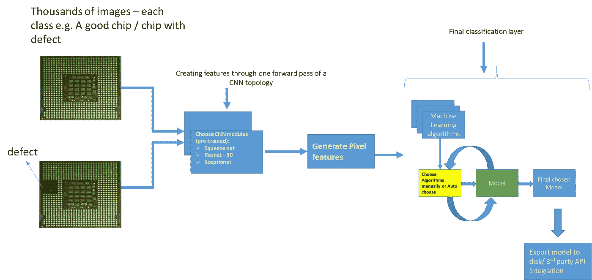

# 为硬件设计和制造领域的公民数据科学家提供支持

> 原文：<https://towardsdatascience.com/empowering-a-citizen-data-scientist-for-hardware-design-manufacturing-6f5af585594?source=collection_archive---------25----------------------->

利用先进的人工智能工具提高硬件设计和制造专业人员的工作效率

**作者:帕萨·德卡和罗希特·米塔尔**

# 什么是公民数据科学家？

专家数据科学家依靠自定义编码来理解数据。用例可以是数据清理、数据插补、创建分段、查找数据中的模式、构建监督模型以预测目标、分类/回归问题的特征重要性分析、了解结果的可能原因、查找可能影响结果的可调参数，甚至深度学习问题的图像预处理等。

如上所述，公民数据科学家是高级分析的超级用户。但公民数据科学家的特质不同于专家数据科学家。他们的主要职责在统计和分析领域之外，他们是专家数据科学家的补充。公民数据科学家更有背景，对业务领域有独特的视角，更关注应用分析技术的业务问题，对与业务优先级相关的问题有更大的兴趣，并有能力证明业务价值。

在制造组织中，硬件设计工程师或工厂车间制造工程师也可以戴上公民数据科学家的帽子。优化设计流程或提高工厂的生产能力/产量可能是他们的目标，以便从流程中获得更多商业价值。

# 利用内部构建的硬件工具自动执行高级分析:

我们为硬件专业人员构建了一个高级分析工具。所谓硬件，我们指的是半导体和电路板级系统。我们的目标是使包括 AI 和 ML 在内的分析民主化，以便公民数据科学家可以更加专注于商业价值，而无需花费时间编写程序/代码来执行高级分析。我们的工具在不断发展，我们已经在工具中内置了一些功能:

自动数据预处理和数据清理

自动特征分析包括但不限于:

过滤方法，如皮尔逊相关、方差分析、线性判别分析、卡方检验

递归特征消除

主成分分析(PCA) &了解特性的影响→了解数据中具有各自过载特性的片段

主成分分析降维

无监督学习问题的各种聚类技术

深度学习能力:

图像识别:使用流行的 CNN 模型创建像素特征，并在 ImageNet 图像上预先训练权重(【http://www.image-net.org/】T2)

使用上一步中的特征自动寻找分类问题的最佳模型

通过对数据训练各种模型，自动找到最佳监督模型(分类/回归)。这是一个关键特性，使未经培训的专业人员能够利用 ML 解决他们的问题。

可以根据特定的制造需求增加额外的功能。例如，通过超参数调整或 ROC 阈值来微调模型的假阳性和假阴性。不太常见的用例特定建模。

以下是关于 ML 功能的模块化流程:

深度学习能力的模块化流程如下:

# 数据集内的搜索模式示例:

我们的“**分析模式/片段**”模块(内置于我们的工具中)可自动洞察数据中与特征权重相关的现有片段。我们的工具自动对数据进行主成分分析，并自动绘制一个由特征权重解释的信息方差图。此外，它还提供关于数据中现有模式/聚类的智能自动建议。我们发现这种能力在根据特性重要性寻找产品测试失败模式时非常有用。下面是使用我们的工具进行模式分析的流程:

# 结论:

我们已经建立了一个先进的分析工具，并不断增强其功能。我们的目标是在我们组织的硬件工程/制造社区中普及 AI & ML 的使用。借助我们的工具，我们在许多设计和制造用例上实现了良好的投资回报，例如产量提高、生产量优化、硬件材料缺陷检测、识别优化硬件设计的可调参数等。我们看到越来越多的人采用我们的工具，并设想引入特定但通用的可重用分析，这将满足我们组织内各种子组织的关键业务用例。

# 参考资料:

https://scikit-learn.org/stable/

【https://www.tensorflow.org/ 

[http://www.image-net.org/](http://www.image-net.org/)