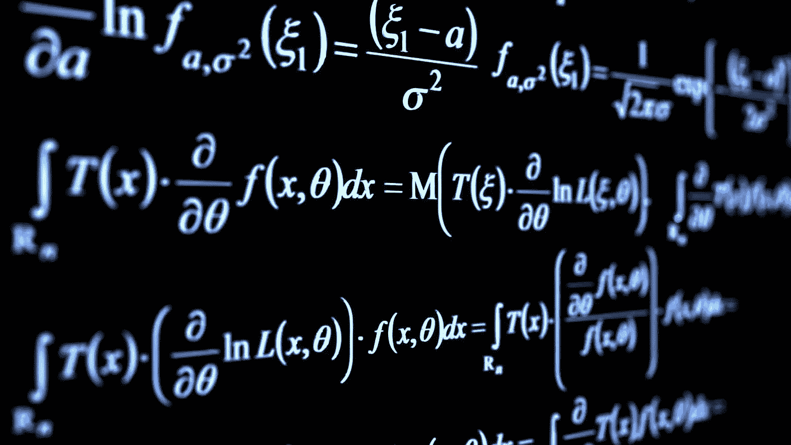
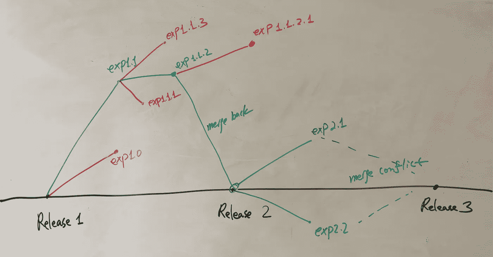
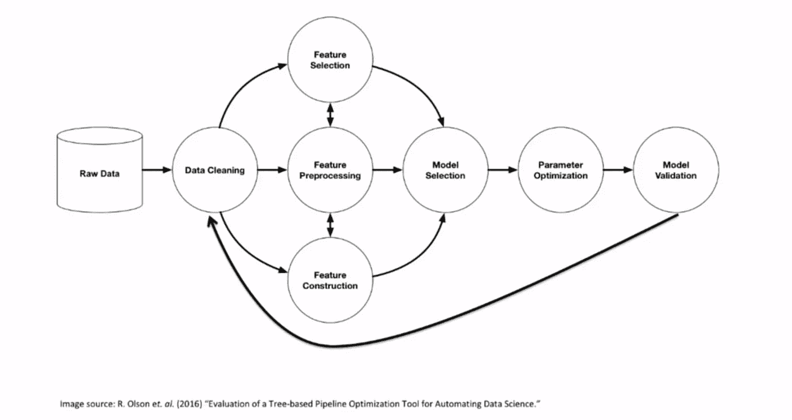
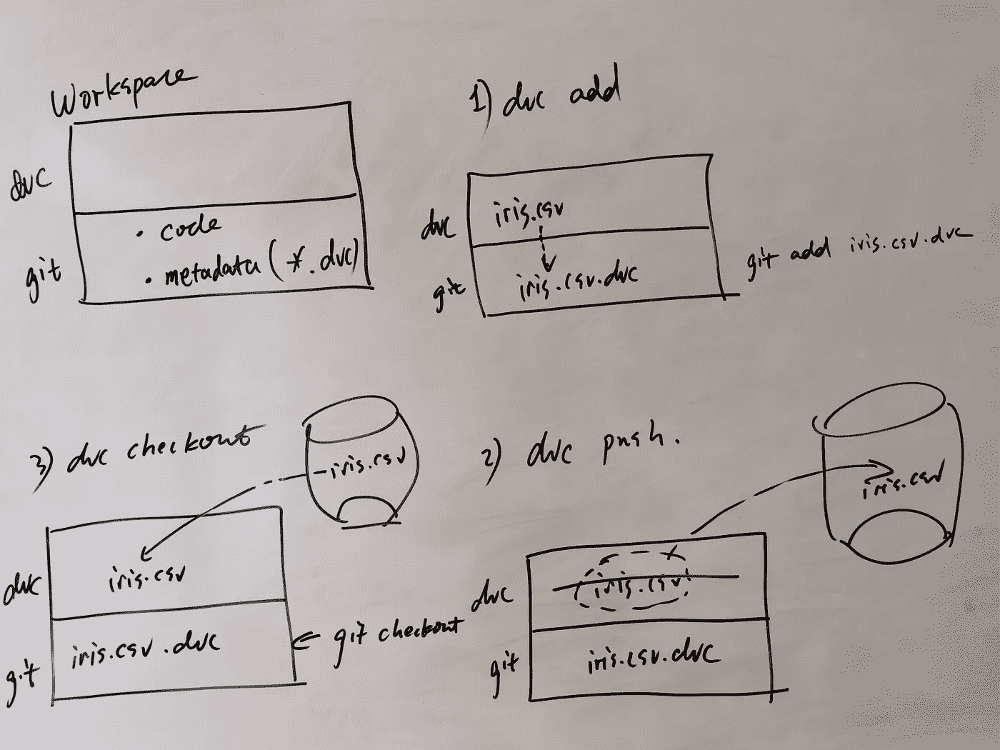
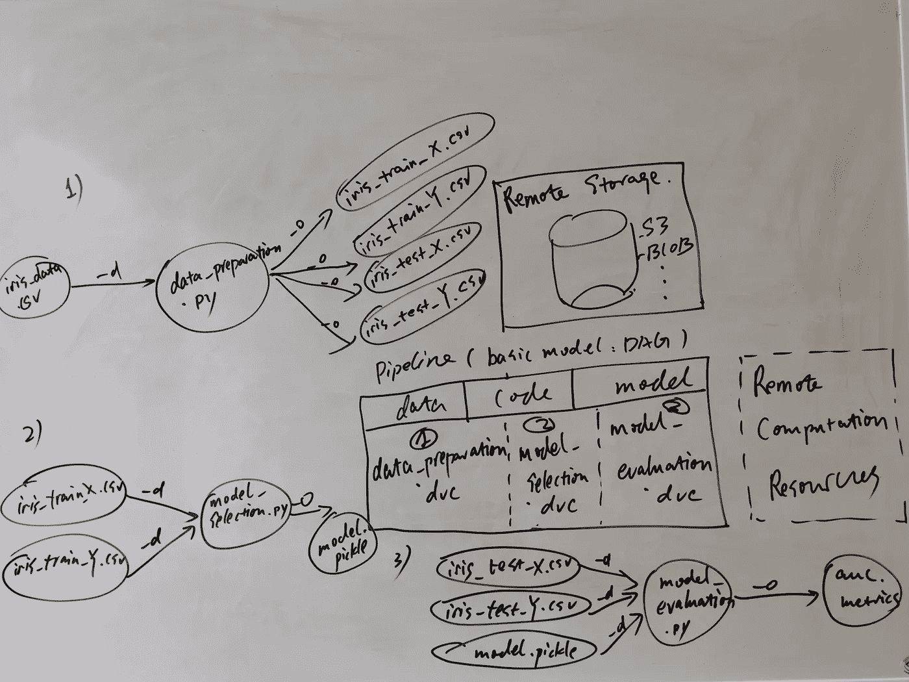

# 启用 ML 实验

> 原文：<https://towardsdatascience.com/enable-ml-experiments-4ba8c3c8bdc2?source=collection_archive---------17----------------------->



# 向前

最近受到 Dmitry Petrov 关于[机器学习模型和数据集版本化实践](https://www.youtube.com/watch?v=jkfh2PM5Sz8)和[机器学习](https://www.youtube.com/watch?v=BneW7jgB298)项目中数据版本化的演讲的启发。

在大多数当前的 ML 系统中，[缺乏有效和系统的方式](https://papers.nips.cc/paper/5656-hidden-technical-debt-in-machine-learning-systems) s 来以敏捷、持续和可维护的方式通过数据科学将数据的价值传递到市场中。

马丁·福勒关于[连续交付机器学习](https://martinfowler.com/articles/cd4ml.html) (CD4ML)的优秀著作中已经指出了一个解决方案。

这篇文章提出了一个关于系统地进行 ML 实验的思路，这是机器学习应用程序持续交付的重要一步。



# **工作流程—模型**

> 数据科学与软件开发的不同之处在于它是基于实验的，而不是基于特性的。

工作流模型的核心思想是 ML 实验的编码和随之而来的优势(版本化、可再现性、自动化)。

## 实验

> ML 实验被建模为位于 git 分支中的 ML 管道代码

ML 实验的组件视角是:

```
ML Experiment = Code + Data + Model
```

所有这三个元素都可以编码成“管道代码”或元数据。

所以 ML 实验的另一个角度:

```
# ML experiment can be perceived as procedure which takes data as input and ML model as output along with a score telling how good the model performsroutine ML Experiment(data):
body        
    pipeline code
    ...return ML Model, score
```

一般来说，这个过程遵循常见的模式，例如，Olson 的一篇论文中的[所示的模式。](https://arxiv.org/pdf/1603.06212.pdf)



***【压缩】数据和模型—元数据***

git 系统很难跟踪大型数据集。解决方法是通过为每个数据和模型创建一个元数据文件来“分而治之”。

元数据很小(因此适合 git 系统),同时包含恢复原始数据和模型的所有信息。[参见:[版本控制 ML 模型](/version-control-ml-model-4adb2db5f87c)



***“管道”代码— DAG***

ML 管道代码通常用 DAG ( [***有向无环图***](https://en.wikipedia.org/wiki/Directed_acyclic_graph) )建模，这也是 Apache Spark、Apache Airflow 和大多数现代数据操作工具的基础数据模型。

这就是为什么 [***dvc 管道***](https://dvc.org/doc/get-started/pipeline) 也可以整合成 [***阿帕奇气流***](https://airflow.apache.org/) 。

## 工作空间

> Workspace 是 ML 实验的快照，建模为 git 分支上的提交。可以用 git 标签做书签。ML 实验是工作空间的进化。

工作空间包括我们在给定的时间点重现实验所需的所有信息。

工作区有两种常见的操作。

*   ***改变一个工作区***

这可能是数据更改:

```
# first create metadata
$ dvc add dataset.csv
# then put metadata under version control
$ git add dataset.csv.dvc
```

这可能是管道代码更改:

```
$ dvc run new-pipeline-script
$ git add new-pipeline-script.dvc
```

*   ***恢复一个工作区***

检查代码和元数据，使用元数据恢复数据集

```
$ git clone [https://gitlab.com/wutianchen/blog-enable-ml-experiments.git](https://gitlab.com/wutianchen/blog-enable-ml-experiments.git)
$ git checkout tags/baseline
# Now we have code and metadata restored, to completely restore the workspace from that.
# dvc looks for metadata and checkout data according to the path stored in metadata.
$ dvc checkout
$ dvc pull
```



# 工作流—示例

工作区的结构，例如 ML 实验，如上图所示。工作区应该一直使用 s3 这样的远程云 BLOB 作为后端存储。但是在这个演示中，local-remote 被用作远程存储的模拟，因此云提供商帐户不是重现它的必要条件。(git repo for demo 可以在 [***这里找到***](https://gitlab.com/wutianchen/blog-enable-ml-experiments) )

此外，工作空间可以“安装”到远程计算单元，如 AWS EC2、AWS Sagemaker 来进行计算，但是本地桌面也足够了。

## 实验:基线

快速浏览基线实验(存储库/标签:基线)。包括三个流水线步骤( [data_preparation.dvc](https://gitlab.com/wutianchen/blog-enable-ml-experiments/blob/8ef110acd9541ba39c6b0e13aa43ea9239fe1c86/data_preparation.dvc) 、 [model_selection.dvc](https://gitlab.com/wutianchen/blog-enable-ml-experiments/blob/8ef110acd9541ba39c6b0e13aa43ea9239fe1c86/model_selection.dvc) 、 [model_evaluation.dvc](https://gitlab.com/wutianchen/blog-enable-ml-experiments/blob/8ef110acd9541ba39c6b0e13aa43ea9239fe1c86/model_evaluation.dvc) )。

数据准备步骤将整个数据集作为输入，并输出四个数据集 iris_train_X.csv、iris_train_Y.csv、iris_test_X.csv、iris_test_Y.csv。这些信息记录在管道元数据(data_preparation.dvc)中

基线模型的性能被写入一个名为 [auc.metric](https://gitlab.com/wutianchen/blog-enable-ml-experiments/blob/8ef110acd9541ba39c6b0e13aa43ea9239fe1c86/auc.metric) 的文件，该文件稍后可用于 e [实验比较](https://dvc.org/doc/get-started/compare-experiments)。跟踪 ML 实验度量和管理模型比较的更好选择是***ML***[***flow***](https://www.mlflow.org/docs/latest/tracking.html)***tracking***(其中不在本文的讨论范围内)。

## 实验:特征多模型

现在，从基线实验开始，我们想通过进行另一个实验来探索和提高系统的性能，尝试新的想法。

1.  ***恢复基线实验工作空间在另一个分支进行新实验*** 【特征-多模型】

```
$ git clone [https://gitlab.com/wutianchen/blog-enable-ml-experiments.git](https://gitlab.com/wutianchen/blog-enable-ml-experiments.git)# checkout baseline and create feature branch
$ git checkout -b feature-multiple-models tags/baseline# restore remote dataset into workspace
$ dvc checkout
$ dvc pull
```

**2*2。添加更改*和**

通过尝试一堆模型来试验增强 model_selection.dvc 的新想法，并最终选择在训练数据集上具有最佳性能的模型。

***3。在特征多模型分支*** 上运行新的 ML 实验

```
$ dvc run -d data/iris_X_train.csv -d data/iris_Y_train.csv -o model/model.pickle -f model_selection.dvc python code/model_selection.py# keep model_selection.dvc under git control
$ git add model_selection.dvc
$ dvc run -d data/iris_X_test.csv -d data/iris_Y_test.csv -d model/model.pickle -M auc.metric -f model_evaluation.dvc python code/model_evaluation.py
$ git add model_evaluation.py
```

现在，我们有了一个新的模型和分数来衡量新模型在测试数据集上的性能。

***4。比较两个实验(基线和特征多模型)***

```
$ dvc metrics show -a
```

产出:

```
working tree:
        auc.metric: 0.896551724137931
feature-multiple-models:
        auc.metric: 0.8275862068965517
master:
        auc.metric: 0.8275862068965517
```

在新想法上观察到性能提升，因此我们希望保留它。

***5。存储工作区*和**

```
$ dvc add
$ dvc push
$ git add .
$ git commit -m “add feature-multiple-models”
$ git tag -a "improved-multiple-models" -m "feature-multiple-models"
$ git push origin feature-multiple-models --tags
```

***6。合并回发布分支***

因为我们现在有了一个得分更高的模型，我们可以通过将它合并到主分支中来发布新的模型。

```
$ git checkout master
$ git merge master feature-multiple-models
```

在它被合并回主版本后，我们有两个选择:

1.  保留特征多模型以供进一步分析
2.  删除特征-多模型分支

# 编后记

我们以系统的方式建立了进行 ML 实验的基本工作流程，并用一个例子展示了它的可用性。但它只是触及了这个领域的表面。这一行还可以包含更多的主题，例如:

1.  ***高级实验场景:特征-pca 和特征-滤波器-噪声***

想象一下，两个数据科学家在两个实验分支上协同工作，但又分开工作(程序与实验相同:特征多模型)。数据科学家 1 希望对要素运行 PCA。数据科学家 2 想要过滤原始数据集的记录以清理数据。

问题是我们如何解决这两个实验的合并冲突。

***谁打谁？***

*   分数较好的实验总是赢吗？那会不会太合适了？
*   有没有可能把两个实验的方法结合起来？

**2*。实验对比、管理和自动化***

对于大型项目，我们可能会有成百上千个实验分支。可视化，比较实验和合并实验将变得越来越困难。

有为 ML 实验管理搭建的商业解决方案，比如 Neptune。向他们学习会很有趣。

[](https://deepsense.ai/neptune-machine-learning-platform-post/) [## 海王星-机器学习平台

### 2016 年 1 月，deepsense.ai 在 Kaggle 上赢得了露脊鲸识别大赛。竞赛的目标是自动化…

deepsense.ai](https://deepsense.ai/neptune-machine-learning-platform-post/) 

***3。AutoML***

最后但同样重要的是，由于 ML 实验的编纂，实验过程也可以以某种方式自动化，这导致了一个热门的研究领域 autoML[参见:[自动化机器学习的过去、现在和未来](https://www.youtube.com/watch?v=ULO7ZBfcJQU) ]。

快乐实验！:)

# 结论

*   机器学习是基于实验的
*   ML 实验=代码+模型+数据
*   ML 实验可以首先被编码，然后被版本化和自动化
*   使用 git 分支对 ML 实验建模
*   使用 git commit 对 ML 实验工作区建模
*   使用 git 标记来标记实验，以便进一步恢复和比较