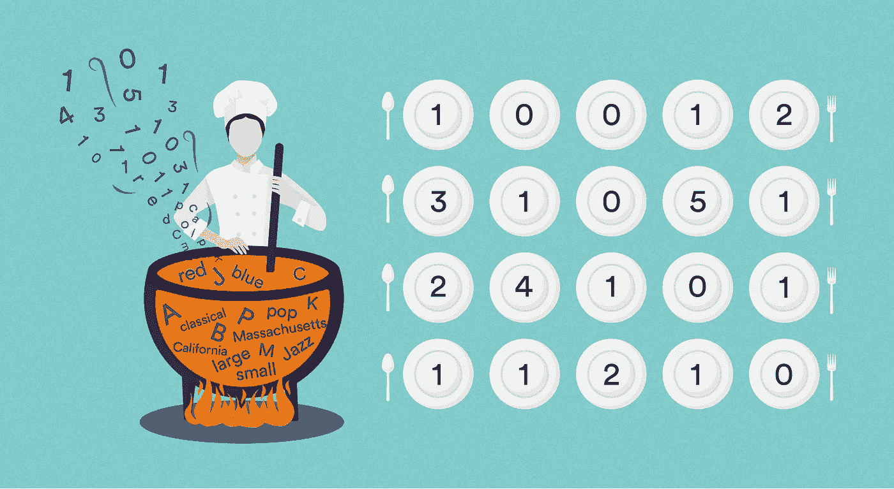
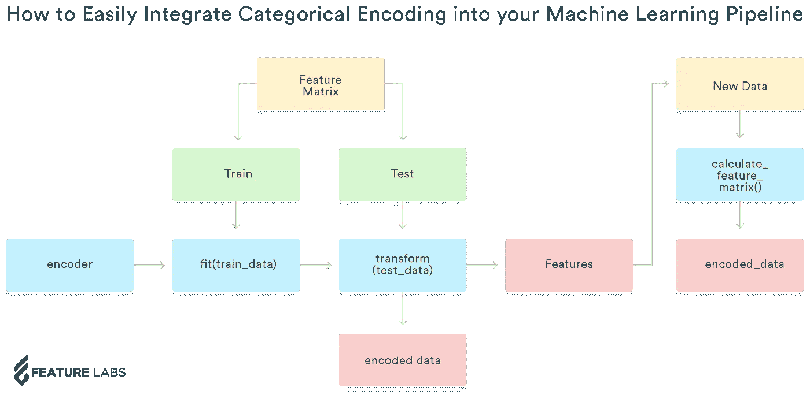
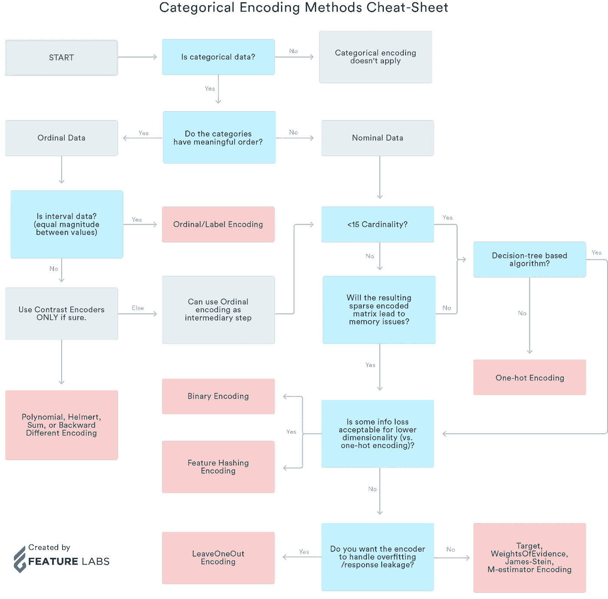

# 更聪明地编码:如何轻松地将分类编码集成到您的机器学习管道中

> 原文：<https://towardsdatascience.com/encode-smarter-how-to-easily-integrate-categorical-encoding-into-your-machine-learning-pipeline-89debe3ce24c?source=collection_archive---------26----------------------->



自动化特征工程通过简化 ML 管道中一个关键的、但手动密集的步骤，解决了应用机器学习中最大的问题之一。然而，即使在特征工程之后，处理非数字数据以供机器学习算法使用也是不可避免的，并且提出了自己的一系列独特挑战。

这篇文章既是分类编码的指南，也是对用于自动分类编码的 Python 库的介绍，Python 库的设计考虑到了易于集成到 T2 特征工程工作流程中。

# 分类编码:是什么/为什么

当谈到自动机器学习时，传统上主要关注的是选择特定的算法或细化模型的参数，但应用机器学习的大部分工作往往源于过程中的其他步骤。例如，必须首先从原始数据中提取相关的预测变量、特征——这一步被称为[特征工程，是必不可少的，但它也可能是应用 ML 过程中最需要手动操作的步骤之一。](https://blog.featurelabs.com/secret-to-data-science-success/)

类似地，处理非数字数据几乎是每个机器学习过程的关键组成部分。在应用机器学习中，两种最常见的数据类型是数字数据(如年龄:5、17、35)和分类数据(如颜色:红、蓝、绿)。处理数字数据通常比处理分类数据更容易，因为机器学习算法对不知道上下文的数学向量进行操作。

相比之下，许多机器学习模型无法直接处理分类数据。分类值没有任何内在的数学关系，因此我们必须先对数据做一些工作，然后才能将其输入到机器学习模型中。将分类数据转化为可用的、机器学习就绪的数学数据的过程称为分类编码。

# 分类编码 API:在哪里

为了创建普遍适用于任何机器学习流水线的编码器，必须考虑需要对数据进行分类编码的三种不同情况:训练数据、测试数据和我们训练的 ML 模型将对其执行预测的新输入数据。

分类编码库旨在处理所有三种情况，以便与其相邻的特征工程和机器学习模型训练步骤无缝集成。下面的流程图说明了在机器学习管道中使用分类编码的典型工作流程。



在标准的机器学习管道中，在对数据集执行特征工程后，您会得到一个数据表，称为特征矩阵，其中包含与手头的预测问题相关的特征。在机器学习管道的这一点上，我们必须首先对我们的数据执行训练测试分割——我们需要训练数据来训练我们的模型，并测试数据来验证它。

下面是我们代码的基本设置。你可以在这个 [Jupyter 笔记本上获得完整的代码。](https://github.com/FeatureLabs/categorical_encoding/blob/master/guides/notebooks/categorical-encoding-DEMO.ipynb)

```
import categorical_encoding as ce
import featuretools as ft
from featuretools.tests.testing_utils import make_ecommerce_entitysetes = make_ecommerce_entityset()
f1 = ft.Feature(es["log"]["product_id"])
f2 = ft.Feature(es["log"]["purchased"])
f3 = ft.Feature(es["log"]["value"])
f4 = ft.Feature(es["log"]["countrycode"])features = [f1, f2, f3, f4]
ids = [0, 1, 2, 3, 4, 5]
feature_matrix = ft.calculate_feature_matrix(features, es,
                                             instance_ids=ids)print(feature_matrix)product_id  purchased  value countrycode
id                                          
0    coke zero       True    0.0          US
1    coke zero       True    5.0          US
2    coke zero       True   10.0          US
3          car       True   15.0          US
4          car       True   20.0          US
5   toothpaste       True    0.0          ALtrain_data = feature_matrix.iloc[[0, 1, 4, 5]]
print(train_data)product_id  purchased  value countrycode
id                                          
0    coke zero       True    0.0          US
1    coke zero       True    5.0          US
4          car       True   20.0          US
5   toothpaste       True    0.0          ALtest_data = feature_matrix.iloc[[2, 3]]
print(test_data)product_id  purchased  value countrycode
id                                         
2   coke zero       True   10.0          US
3         car       True   15.0          US
```

我们必须分别处理这两组而不是直接编码整个特征矩阵的原因是因为在转换数据之前必须训练许多编码器。例如，目标编码器依赖于某个类别的平均值——将测试数据的值合并到我们的编码中会导致标签泄漏。

因此，在用我们选择的方法初始化我们的编码器之后(见上面如何决定选择哪个编码器)，我们拟合(和转换)我们的训练数据，并且我们只转换而不拟合我们的测试数据。在我们对数据进行编码后，我们当然会得到编码后的数据，我们还会生成特征。

```
enc = ce.Encoder(method='leave_one_out')

train_enc = enc.fit_transform(train_data, features, train_data['value'])

test_enc = enc.transform(test_data)print(train_enc)PRODUCT_ID_leave_one_out  purchased  value  COUNTRYCODE_leave_one_out
id                                                                       
0                       5.00       True    0.0                      12.50
1                       0.00       True    5.0                      10.00
4                       6.25       True   20.0                       2.50
5                       6.25       True    0.0                       6.25print(test_enc)PRODUCT_ID_leave_one_out  purchased  value  COUNTRYCODE_leave_one_out
id                                                                       
2                       2.50       True   10.0                   8.333333
3                       6.25       True   15.0                   8.333333
```

在机器学习管道的最后一步，我们将获得新的数据，我们现在使用我们训练的模型来执行预测。为此，我们利用上一步生成的特征，利用 Featuretools 的`calculate_feature_matrix()`功能立即创建编码数据——我们不必创建单独的编码器，也不必再次经历整个编码过程。现在，我们有数据可以立即应用到我们的机器学习模型中。

```
fm2 = ft.calculate_feature_matrix(features, es, instance_ids=[6,7])
print(fm2)product_id  purchased  value countrycode
id                                          
6   toothpaste       True    1.0          AL
7   toothpaste       True    2.0          ALfeatures_encoded = enc.get_features()

fm2_encoded = ft.calculate_feature_matrix(features_encoded, es, instance_ids=[6,7])

print(fm2_encoded)PRODUCT_ID_leave_one_out  purchased  value  COUNTRYCODE_leave_one_out
id                                                                       
6                       6.25       True    1.0                       6.25
7                       6.25       True    2.0                       6.25
```

# 分类编码:何时/如何

分类编码最难的部分有时可能是找到正确的分类编码方法——有许多研究论文和研究致力于分析分类编码方法对不同数据集的性能。通过汇编使用相同编码方法的数据集所共有的所有公共因素，我创建了以下流程图，作为找到最适合您的数据的方法的指南。请注意，这个流程图是一个起点，您可以随意尝试不同的编码方法，甚至是这里没有列出的方法，看看哪种方法最适合您的特定数据和机器学习问题。

也就是说，这个流程图反映了常用分类编码方法的基本原则。此外，如果你想要一个更全面的分类编码指南，这里有一个 [Jupyter 笔记本](https://github.com/FeatureLabs/categorical_encoding/blob/master/guides/notebooks/categorical-encoding-guide.ipynb)，它涵盖了每种分类编码方法及其更详细的应用场合。



# 分类编码方法

编码方法可以大致分为几类。

## 经典编码器

经典编码器是最简单易懂的，这使得它们在 ML 从业者中非常有用和受欢迎。

如果您不确定使用哪种编码方法，一键编码几乎总是一个好的起点。由于其易于使用和理解、通用性和准确性，它是分类编码的首选方法。

已经位于分类编码库中的经典编码器有:顺序编码器、一键编码器、二进制编码器和散列编码器。下面是代码示例，详细说明了每一个是如何实现的。如果你想继续学习，这些例子也可以在 [Jupyter 笔记本](https://github.com/FeatureLabs/categorical_encoding/blob/master/guides/notebooks/categorical-encoding-DEMO.ipynb)中找到。

```
# Creates a new column for each unique value. 
enc_one_hot = ce.Encoder(method='one_hot')
fm_enc_one_hot = enc_one_hot.fit_transform(feature_matrix, features)
print(fm_enc_one_hot)product_id = coke zero  product_id = car  product_id = toothpaste  \
id                                                                      
0                        1                 0                        0   
1                        1                 0                        0   
2                        1                 0                        0   
3                        0                 1                        0   
4                        0                 1                        0   
5                        0                 0                        1   

    purchased  value  countrycode = US  countrycode = AL  
id                                                        
0        True    0.0                 1                 0  
1        True    5.0                 1                 0  
2        True   10.0                 1                 0  
3        True   15.0                 1                 0  
4        True   20.0                 1                 0  
5        True    0.0                 0                 1# Each unique string value is assigned a counting number specific to that value.
enc_ord = ce.Encoder(method='ordinal')
fm_enc_ord = enc_ord.fit_transform(feature_matrix, features)
fm_enc_ordPRODUCT_ID_ordinal  purchased  value  COUNTRYCODE_ordinal
id                                                           
0                    1       True    0.0                    1
1                    1       True    5.0                    1
2                    1       True   10.0                    1
3                    2       True   15.0                    1
4                    2       True   20.0                    1
5                    3       True    0.0                    2# The categories' values are first Ordinal encoded,
# the resulting integers are converted to binary,
# then the resulting digits are split into columns.
enc_bin = ce.Encoder(method='binary')
fm_enc_bin = enc_bin.fit_transform(feature_matrix, features)
fm_enc_binPRODUCT_ID_binary[0]  PRODUCT_ID_binary[1]  PRODUCT_ID_binary[2]  \
id                                                                     
0                      0                     0                     1   
1                      0                     0                     1   
2                      0                     0                     1   
3                      0                     1                     0   
4                      0                     1                     0   
5                      0                     1                     1   

    purchased  value  COUNTRYCODE_binary[0]  COUNTRYCODE_binary[1]  
id                                                                  
0        True    0.0                      0                      1  
1        True    5.0                      0                      1  
2        True   10.0                      0                      1  
3        True   15.0                      0                      1  
4        True   20.0                      0                      1  
5        True    0.0                      1                      0# Use a hashing algorithm to map category values to corresponding columns
enc_hash = ce.Encoder(method='hashing')
fm_enc_hash = enc_hash.fit_transform(feature_matrix, features)
fm_enc_hashPRODUCT_ID_hashing[0]  PRODUCT_ID_hashing[1]  PRODUCT_ID_hashing[2]  \
id                                                                        
0                       0                      0                      0   
1                       0                      0                      0   
2                       0                      0                      0   
3                       0                      1                      0   
4                       0                      1                      0   
5                       0                      0                      0   

    PRODUCT_ID_hashing[3]  PRODUCT_ID_hashing[4]  PRODUCT_ID_hashing[5]  \
id                                                                        
0                       0                      1                      0   
1                       0                      1                      0   
2                       0                      1                      0   
3                       0                      0                      0   
4                       0                      0                      0   
5                       1                      0                      0   

    PRODUCT_ID_hashing[6]  PRODUCT_ID_hashing[7]  purchased  value  \
id                                                                   
0                       0                      0       True    0.0   
1                       0                      0       True    5.0   
2                       0                      0       True   10.0   
3                       0                      0       True   15.0   
4                       0                      0       True   20.0   
5                       0                      0       True    0.0   

    COUNTRYCODE_hashing[0]  COUNTRYCODE_hashing[1]  COUNTRYCODE_hashing[2]  \
id                                                                           
0                        0                       0                       1   
1                        0                       0                       1   
2                        0                       0                       1   
3                        0                       0                       1   
4                        0                       0                       1   
5                        0                       1                       0   

    COUNTRYCODE_hashing[3]  COUNTRYCODE_hashing[4]  COUNTRYCODE_hashing[5]  \
id                                                                           
0                        0                       0                       0   
1                        0                       0                       0   
2                        0                       0                       0   
3                        0                       0                       0   
4                        0                       0                       0   
5                        0                       0                       0   

    COUNTRYCODE_hashing[6]  COUNTRYCODE_hashing[7]  
id                                                  
0                        0                       0  
1                        0                       0  
2                        0                       0  
3                        0                       0  
4                        0                       0  
5                        0                       0
```

## 贝叶斯编码器

贝叶斯编码器和经典编码器之间最显著的区别在于，贝叶斯编码器除了使用分类变量之外，还使用因变量的信息。此外，它们只输出一列，这消除了有时会影响其他编码器的任何高维度问题。

除了 One-Hot 编码，LeaveOneOut 编码是我强烈推荐的另一种分类编码方法。

已经在分类编码库中实现的贝叶斯编码器有:Target 和 LeaveOneOut。我在下面提供了它们的代码示例:

```
# Replaces each specific category value with a weighted average of the dependent variable.
enc_targ = ce.Encoder(method='target')
fm_enc_targ = enc_targ.fit_transform(feature_matrix, features, feature_matrix['value'])
print(fm_enc_targ)PRODUCT_ID_target  purchased  value  COUNTRYCODE_target
id                                                         
0            5.397343       True    0.0            9.970023
1            5.397343       True    5.0            9.970023
2            5.397343       True   10.0            9.970023
3           15.034704       True   15.0            9.970023
4           15.034704       True   20.0            9.970023
5            8.333333       True    0.0            8.333333# Identical to target except leaves own row out when calculating average
enc_leave = ce.Encoder(method='leave_one_out')
fm_enc_leave = enc_leave.fit_transform(feature_matrix, features, feature_matrix['value'])
fm_enc_leavePRODUCT_ID_leave_one_out  purchased  value  COUNTRYCODE_leave_one_out
id                                                                       
0                   7.500000       True    0.0                  12.500000
1                   5.000000       True    5.0                  11.250000
2                   2.500000       True   10.0                  10.000000
3                  20.000000       True   15.0                   8.750000
4                  15.000000       True   20.0                   7.500000
5                   8.333333       True    0.0                   8.333333
```

您可能会发现，在某些情况下，您会更喜欢当前位于库中的编码器的不同实现(例如，对于我的目标编码实现，我有一个用于平均值计算的特定权重)。如果您希望进行修改，比如采用不同的权重来计算平均值，请随意创建一个新的编码器类，进行修改，并使用编码器 API 调用您的新类。

## 替代编码器

第三组编码器是对比编码器——它们通过在类别中寻找数学模式来工作。您可以考虑常见的对比度编码方法，如赫尔默特、求和、后向差分或多项式编码。

此外，还存在其他贝叶斯编码器，例如 James-Stein、M-Estimator 或证据权重。请随时尝试编码方法，找到最适合您的数据的方法。然而，如果你需要一个好的起点，看看库中已经实现的默认经典/贝叶斯编码器。One-Hot 和 LeaveOneOut 编码是最流行的编码器，这是有原因的。

# 摘要

分类编码是特征工程和机器学习中的一个重要步骤，但处理分类数据可能会很棘手且耗时。利用上述指南来确定如何开始更智能地编码，以及如何将[分类编码库](https://github.com/FeatureLabs/categorical_encoding)应用于任何[功能工具](https://github.com/Featuretools/featuretools)机器学习管道。请随时尝试多种分类编码方法 API 为您提供了灵活性，让您可以调整自己版本的通用编码器，使其最适合您的特定数据集。

最终，分类编码通过与特征工程以及模型创建、训练和应用的无缝集成，使您更容易处理机器学习管道中的分类数据。

试试分类编码库，并在 [Github](https://github.com/FeatureLabs/categorical_encoding) 上留下任何反馈！我们总是欢迎任何新的编码方法实现。有关更多信息和说明，请查看[自述文件](https://github.com/FeatureLabs/categorical_encoding/blob/master/README.md)和[指南](https://github.com/FeatureLabs/categorical_encoding/tree/master/guides)。

*原载于 2019 年 8 月 26 日*[*https://blog.featurelabs.com*](https://blog.featurelabs.com/encode-smarter/)*。*