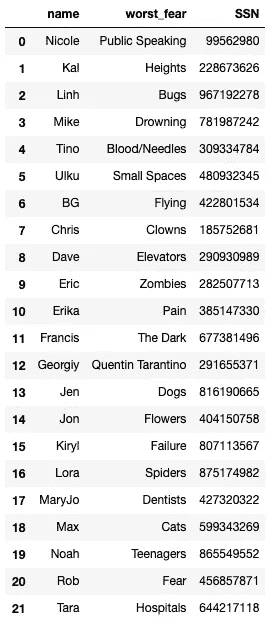
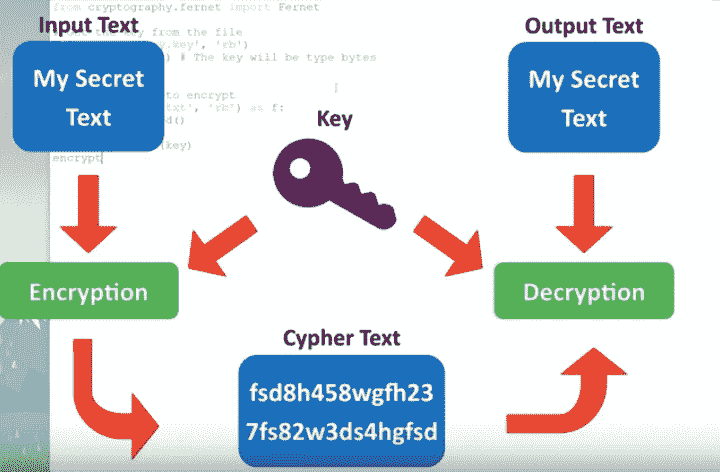
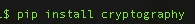
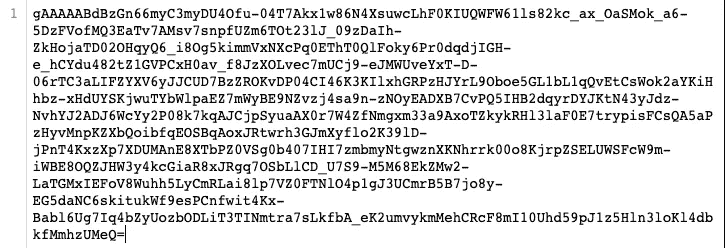

# 加密您的数据

> 原文：<https://towardsdatascience.com/encrypting-your-data-9eac85364cb?source=collection_archive---------6----------------------->

## 使用 Python 进行对称加密

Unlock the Lock

美国泄密者爱德华·斯诺登和前国家安全局(NSA)局长迈克尔·海登[说](https://thehill.com/blogs/blog-briefing-room/news/278320-snowden-without-encryption-everything-stops)美国有了“牢不可破的端到端加密技术”更加安全斯诺登继续说道，“我可以向你保证……有一件事:如果我在某件事情上与国家安全局局长并肩站在一起，那一定有一个非常好的理由。”

任何与数据打交道的人都有责任确保敏感数据不会面临被盗的风险。已经实施的网络安全政策往往被当作一个最低限度的检查清单，而事实证明，这是不够的。2018 年，T-Mobile、Quora、脸书和 [18 家其他大公司](https://www.businessinsider.com/data-hacks-breaches-biggest-of-2018-2018-12#7-cambridge-analytica-87-million-15)都屈服于数据泄露。不幸的是，数据伦理和数据安全经常被忽视。将这篇文章作为加密您自己的数据的快速教程，请进一步学习如何在数据库系统上正确地实现加密。

Insert hologram of padlock

加密的思想很简单:发送方可以用加密密钥对数据进行加密，然后接收方用解密密钥对数据进行解密。对称加密意味着加密密钥和解密密钥是相同的。这是效率较低的方法，因为密钥的传递可能会被数字截获。不对称加密意味着加密密钥和解密密钥不同。不对称加密或公钥加密是通过使用公钥和私钥来实现的。私钥用于解密数据。

好的加密密钥应该不小于 2048 位。由于巨大的计算负担，很少使用大于这个值的键；然而，这种大小的密钥已经足够好了，因为一台普通的计算机需要 140 亿年才能破解一个 2048 位的证书，而没有人有时间做这个。

Sweet Brown

[瑟里奥特先生](https://medium.com/@andrew.therriault/data-security-for-data-scientists-2f1fcd8c261b)指出，没有任何借口不加密你的数据。它在您的设备上，因此您有责任对您使用的数据进行加密，尤其是当您使用敏感数据时。我现在有一个数据库，里面有我朋友的名字、社保号码和他们最害怕的事情。如果任何人得到这个信息，它可能意味着危险！

让我们来看看如何使用对称密钥系统最好地加密这个熊猫数据帧的步骤。下面的模型简化了加密过程。

Symmetric Encryption

在开始之前，我们需要安装 Python 加密模块。此模块的文档可在[这里](https://cryptography.io/en/latest/)找到。危险材料层激起了我的兴趣。此外，检查他们的开源项目！

C.R.E.A.M.

我想加密我的非常敏感的数据，所以我打算先将它保存为一个文件—一个 CSV 文件。

导入加密模块并创建新密钥。每次运行这段代码，都会打印一个新的密钥。密钥是一个 [Base64](https://en.wikipedia.org/wiki/Base64) 编码器字符串的字节对象。

我们需要保存一个密钥，这样我们就可以用它来加密。为了保存密钥，我们可以将其写入文件。下面的代码会将它保存在您当前工作的文件夹中的一个文件中。

如果您想要检索密钥，我们可以从用 read bytes 保存的文件中检索密钥。

如果您想创建一个新的带密码的加密密钥，您也可以这样做。使用这种方法，将为使用的每个新密码创建一个新的加密密钥。您需要创建一个 [salt](https://en.wikipedia.org/wiki/Salt_(cryptography)) ，使用 OS 模块可以轻松完成。

我们可以复制并粘贴输出，并在下面的代码中将其指定为 salt。

有了所有这些参数，我们就可以简单地更改提供的密码，我们将被分配一个新的密钥。每个唯一的密码都有一个唯一的密钥。

有了我们的密钥，我们现在可以加密和解密一个文件，[甚至是一个字符串！使用下面的代码，你可以加密一个文件。](https://www.youtube.com/watch?time_continue=326&v=H8t4DJ3Tdrg)

文件现在看起来像这样:

Encrypted!

要解密，我们可以简单地切换一个文件名和一些如下所示的命令:

现在你应该有三个文件。原始文件、该文件的加密版本和该文件的解密版本。只要您有密钥，您就可以删除原始文件，只保留加密版本。正确的密钥管理对于加密的有效性至关重要。钥匙应始终保存在一个单独且安全的地方。您不应该将加密密钥保存在一个文件或同一个文件夹中。这就像把前门的钥匙放在门垫下面一样。

你甚至可以加密你的加密密钥！这被称为密钥加密密钥(KEK ),应该与它解锁的数据隔离开来。最佳实践包括用主加密密钥和主签名密钥保护您的 KEKs。对数据的不同部分使用不同的键也是一个好的做法。这可能很困难，因为它要求用户知道每次加密或解密数据时要获取哪个密钥。遵循适当的加密协议有可能减少你被黑客攻击的机会，但不幸的是，大多数程序员在数据安全方面做得很少。太多的开发人员遵循 HIPAA 或公司政策等指导原则所要求的清单，但是这些指导原则通常不足以对数据泄露进行适当的防御。这里有一些你应该避免的常见加密错误。

权力越大，责任越大，如果您在计算机上处理敏感数据，保护这些数据就是您的责任。自学加密的细节和最佳实施方法应该可以防止数据泄露发生在您身上。练习加密你的文件，因为你永远不知道谁会在看。