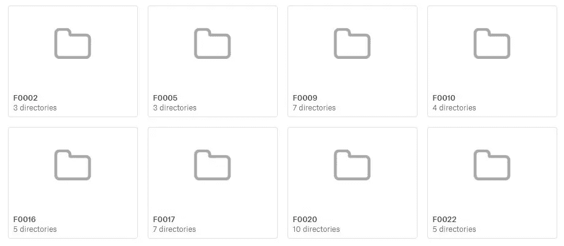
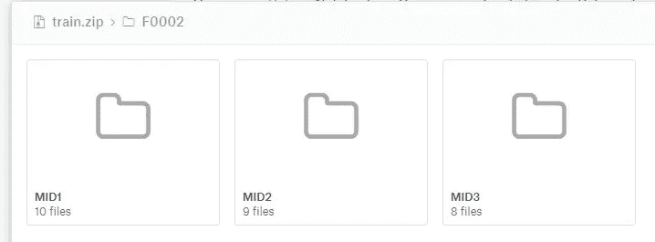
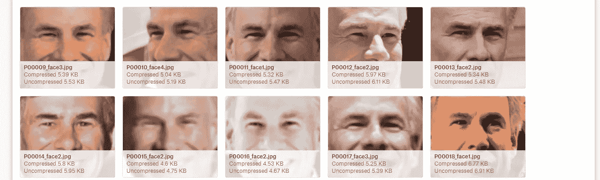
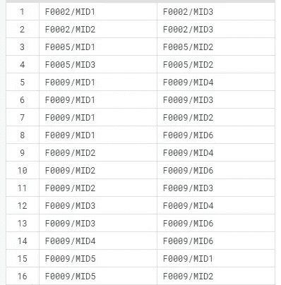
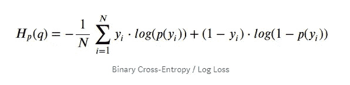

# 从人脸中检测亲缘关系的端到端解决方案。

> 原文：<https://towardsdatascience.com/end-to-end-solution-of-detecting-kin-relationship-from-faces-c70b9e9ecda6?source=collection_archive---------24----------------------->

这篇博客将一步一步地指导你如何用 Keras 构建一个*深度神经网络模型，从无到有，最后用 Flask 将其部署到网络上。这个问题是由 Kaggle 主办的一个比赛，可以在这里找到。*


Photo by [Priscilla Du Preez](https://unsplash.com/@priscilladupreez?utm_source=medium&utm_medium=referral) on [Unsplash](https://unsplash.com?utm_source=medium&utm_medium=referral)

# 目录:

1-定义我们的目标

2-数据及其描述

3-建筑模型

4-评估

5-生产模型

6-视频

7 项待办任务

8-参考文献

# **定义我们的目标:**

你的鼻子长在你身上了吗？

血亲往往有共同的面部特征。现在，东北大学的研究人员希望改进他们的面部图像分类算法，以弥合研究与 DNA 结果等其他家族标记之间的差距。

由于以下几个原因，这项技术在实践中仍然鲜为人知:

1.用于亲属关系识别任务的现有图像数据库不够大，不足以捕捉和反映世界上家庭的真实数据分布。

2.许多隐藏因素会影响家族面部关系，因此需要一个比最常用于更高级别分类(例如面部识别或对象分类)的计算机视觉算法更具判别力的模型。

因此，我们将建立一个复杂的模型，通过仅仅基于他们的面部图像来确定两个人是否有血缘关系。

# 数据:

我们将使用 [Families In the Wild (FIW)](https://web.northeastern.edu/smilelab/fiw/) 提供的数据，这是最大、最全面的自动亲属识别图像数据库。

FIW 的数据集是从名人的公开图片中获取的。有关他们贴标过程的更多信息，请访问他们的[数据库页面](https://web.northeastern.edu/smilelab/fiw/database.html)。

## 文件描述:

文件夹“train”由名为(`F0123`)的族的子文件夹组成，这些族文件夹包含个人的子文件夹(`MIDx`)。同一个`MIDx`文件夹中的图片属于同一个人。同一`F0123`文件夹中的图像属于同一家族。

列车文件夹如下所示:



Train Folder

“train”的每个子文件夹如下所示:



每个个人文件夹都包含此人的面孔:



文件夹“test”包含需要与另一个随机图像测试是否有血缘关系的人脸图像。

下面显示的文件“train_relationships.csv”包含训练标签。记住，不是每个家庭成员都有亲属关系。例如，父母和他们的孩子是亲戚，但彼此不是。



train_relationships.csv

## 设置所需的库以便在需要时使用:

> 注意:如果您的系统中不存在库“keras_vggface ”,导入时可能会出错。要下载它，您可以参考/运行/使用以下代码:

```
!pip install git+https://github.com/rcmalli/keras-vggface.git
```

深入数据文件夹并分析 *train_relationship.csv* 文件，我发现了一些问题。例如:在 *train_relationship.csv* 文件中有一个‘f 0039/mid 1’和‘f 0039/mid 3’的关系，但是在 train 文件夹中没有‘f 0039/mid 3’的文件夹。

我能看到一些类似的问题是因为缺少了下面的文件夹
f 0039/mid 4
f 0041/mid 5
f 0041/mid 7
f 0051/mid 5
…等等。

解决上述问题的一个简单方法是忽略这些空目录，只考虑那些对我们可用的目录。

加载数据并将其分成训练和验证集。

“val_images”包含文件夹名称以“F09”开头的系列文件夹，而“train_images”包含所有其他系列文件夹。

现在，这两个文件夹也包含空目录，这是我们上面讨论过的问题。是时候忽略它们了:

我们有“train”和“val ”,它们分别包含用于培训和验证过程的系列文件夹。

在定义了这个问题的目标之后，我们探索并理解了我们所拥有的数据的本质，我们也克服了我们所面临的一个简单的问题。现在是做一些建模的时候了。回想一下我们一开始为自己设定的目标:

> "预测，给定两张脸是否有血缘关系."

所以基本上我们手头有一个分类问题需要解决。

# 深度学习模型:

与以前的经典方法相比，使用深度学习架构，人脸识别的任务显示出高度提高的准确性。当用巨大的数据集训练时，最先进的模型现在甚至可以胜过人类。

对于我们的问题，我们将使用两种不同的架构，在一系列人脸识别基准数据集上取得了最先进的结果。这两个系统都可以用来从人脸中提取高质量的特征，称为人脸嵌入，然后可以用来比较两张相似或不相似的人脸。

1- *Facenet* :是谷歌的研究人员在 2015 年开发的人脸识别系统。它以图像为输入，预测 128 维向量或人脸嵌入。所以简单来说，这个矢量/人脸嵌入现在用数字来表示输入的人脸。

2- *VGGFace* :它是由牛津大学视觉几何组(Visual Geometry Group)的研究人员开发的，该组是图像处理领域最著名的小组之一。它将图像作为输入，并预测 2048 维向量或人脸嵌入。

这两个模型将作为我们的基础模型，也就是说，我们将把我们的输入图像对传递给这两个模型，并获得代表输入人脸的人脸嵌入。一旦我们建立了下面的实际模型，就很清楚了。

## 输入:

我们有两个人脸图像，图像 1 和图像 2，我们的两个基本模型将采取这些图像中的每一个。Facenet 会把 image_1 和 image_2 作为 input_1 和 input_2。VGGFace 会把 image_1 和 image_2 作为 input_3 和 input_4。

> 注:不同型号的图像输入尺寸不同。

在将输入图像通过两个基本模型后，我们将得到两个图像的人脸嵌入。我们有

来自 Facenet 模型的图像 1 的 x1-面部嵌入

来自面网模型的图像 2 的 x2 面嵌入

来自 VGGFace 模型的图像 1 的 x3-人脸嵌入

来自 VGGFace 模型的图像 2 的 x4-人脸嵌入

我们可以将这些嵌入直接用于我们的分类任务，方法是将它们通过密集的 FC 层，但不是这样做，而是将这些嵌入组合或合并以获得更好的结果，这将是一个很好的特征工程技巧。

例如:对向量 x1 求平方可以给出关于 image_1 的更多信息。

像这样，我们可以使用许多不同的组合，如加法(x1，x2)乘法(x3，x4)等。这方面的代码如下所示:

我们已经准备好了模型架构。下一步是开始用一些损耗和优化器来训练它。在训练模型之前，我们需要定义一些帮助函数，它们将在训练和推理步骤中帮助我们。

read_img_fn '将采用输入图像的路径，并返回具有预定义大小的相同图像。请记住，我们对不同的基本模型使用不同的图像输入尺寸。与此类似，另一个函数‘read _ img _ vgg’将为 VGGFace 模型做同样的事情。

一个特殊的辅助函数“生成”用于生成具有某个固定 bath_size 的成批图像对。对于每一批，它将返回四个图像的组合(每一对用于两个模型的输入)和标签。

# 损失函数和模型配置:

正如我们在开始时讨论的，这是一个二元分类问题。我们将使用二元交叉熵或对数损失作为这个问题的损失函数。



为了配置模型，我们将使用准确性作为工具来跟踪性能，而训练和优化器将是学习率= 1e-5 的 Adam。

# **训练:**

最后，我们准备好训练上面定义的模型。使用回调在各个点存储和使用训练好的模型，训练的最终代码看起来是这样的。

您可以看到，我们正在使用“生成”辅助函数来生成批量大小为 16 的图像。在几个时期的训练之后，模型收敛，并且精度没有从那里提高。

最后，用文件名' ***facenet_vgg.h5 '保存训练好的模型。***

# 评估:

现在，我们可以使用这个训练好的模型来预测给定两个输入图像的概率。为此，我们将使用 Kaggle 提供的“sample_submission.csv”文件。该文件包含成对的图像，模型需要预测亲属关系的概率。

然后将这个文件“face_vgg.csv”提交给 Kaggle 来检查分数。我们的模型表现良好，在私有 lb 上给出的 AUC 分数为“0.887”，在公共 lb 上给出的 AUC 分数为“0.881”。

> 由此，我们可以说，我们复杂的深度学习模型在这项任务中表现良好，并准备投入生产。

# 生产途径:

我们将使用基于 Python 的微型 web 框架 Flask 在本地主机上制作一个简单的 web 服务器，它将充当 API，并帮助最终用户与我们训练过的模型进行通信。所以现在任何人都可以访问我们的模型。

首先，让我们使用 Flask 构建一个简单的 web API 来演示事情是如何工作的。

我们需要制作两个不同的文件。

1- app.py —后端的 Flask 脚本

```
from flask import Flask, request, render_template
app = Flask(__name__)[@app](http://twitter.com/app).route('/')
def hello_world():
    return render_template('index.html')
```

上面的代码将导入必要的文件并启动 Flask 实例。函数 hello_world()将把我们的主页呈现给用户。

2-index.html-用户将在前端看到的主页 html 文件。

```
<!DOCTYPE html>
<html>
<head>
    <title>Flask</title>
</head>
<body>
<p>Hello world</p>
</body>
</html>
```

现在我们有了我们需要的两个文件。运行 app.py 文件后，用户将能够看到“Hello world”页面。

在构建之前，让我们首先想象一下事物如何工作的整体结构。用户将看到一个网页，要求他/她上传两个图像文件，他/她需要看看他们是否有血缘关系。在后端，我们的 Flask 脚本将访问这两个图像，并在其上运行所需的操作。它将获取图像，执行预处理，然后将它们传递给我们训练好的模型。最后，该模型将预测概率，并在前端投射给用户。

现在，我们将开始构建我们的亲属预测 API。

这是我们项目布局的样子——

```
**/Kin-Prediction
   ├── templates
       └── index.html
       └── end.html** **├── static
       └── Image1
       └── Image2
   ├── venv/
   ├── app.py
   ├── facenet_vgg.h5** 
```

项目文件夹包含我们的烧瓶需要的所有文件。

文件夹模板将包含前端的 HTML 文件，Flask 将在需要时使用这些文件进行渲染。

静态文件夹将包含用户将上传用于预测的图像。

“facenet_vgg.h5”是我们训练好的模型，需要保存在目录中，以便 Flask 可以直接使用它。

app.py 文件是将运行并执行所有后端操作的主 Flask 脚本。

app.py 中的以下函数将为用户呈现主页。

```
@app.route('/')
@app.route('/home')
def upload_image():
    return flask.render_template('index.html')
```

index.html 的文件如下所示:

```
<html>
<head>
    <meta charset="UTF-8">
    <title>Kin Relationship</title>
</head>
   <body  style="background-color:gray;"  >
      <form action = "http://localhost:5000/upload" method = "POST"
         enctype = "multipart/form-data"  align="center">
         First Image:<label>
         <input type = "file" name = "file1" /></label>
         Second Image<label>
         <input type = "file" name = "file2" /></label>

         <label>
         <input type = "submit" value="Predict"/> </label>

      </form>
   </body>
</html>
```

该页面将如下所示:


选择图像并点击预测按钮后，这两幅图像都将被上传并保存到我们的本地目录文件夹中，该文件夹是“静态”的。Flask 将从那里访问图像并执行所需的操作，最后预测概率。

app.py 文件中的代码如下所示:

最后，flask 将使用图像和预测来呈现模板“end.html”。

```
<!DOCTYPE html>
<html lang="en">
<head>
    <meta charset="UTF-8">
    <title>Prediction</title>
</head>
<body style="background-color:powderblue;">
<div>





</div>

<h1 style="font-family:verdana;"> Probablity of two persons having kin relation is {{pred}} </h1>
</body>
</html>
```

就是这样。我们的模型已经准备好并正在本地主机上运行。你可以在这里下载并参考完整代码[。](https://github.com/Utkarshupd/Kin_Relation_Prediction)

> 我试着这样做，首先用我和我爸爸的照片，然后用妈妈和爸爸的照片。在这两种情况下，模型都工作得非常好，并分别预测高概率(血缘相关)和低概率(血缘不相关)。

# 视频:

这是展示上述实验的视频。

# 待办任务:

1-我们可以将它部署在基于云的 web 服务上，而不仅仅是在本地服务器上运行，比如 Heroku，这样任何地方的任何人都可以访问你的模型。

2-目前，我们的模型只拍摄人脸图像，因为它只在人脸上进行训练。如果给定一个人的完整图像，它将不起作用。我们可以构建一个不同的解决方案来处理这个问题。

3-使用先进的 CSS 和 javascript，我们可以设计我们的前端看起来不错。

谢谢你在这个博客中走了这么远。希望你喜欢。有什么建议可以通过 [Linkedin](https://www.linkedin.com/in/iutkarshdixit/) 联系我。

# 参考资料:

1-[https://www . ka ggle . com/c/recogniting-faces-in-the-wild/overview](https://www.kaggle.com/c/recognizing-faces-in-the-wild/overview)

2-[https://blog . keras . io/building-a-simple-keras-deep-learning-rest-API . html](https://blog.keras.io/building-a-simple-keras-deep-learning-rest-api.html)

3-[https://heart beat . fritz . ai/brilliant-初学者-模型部署指南-133e158f6717](https://heartbeat.fritz.ai/brilliant-beginners-guide-to-model-deployment-133e158f6717)

4-[https://www . curious ly . com/posts/deploy-keras-deep-learning-project-to-production-with-flask/？FB clid = iwar 1t 8 efuozsh 0s 5t TN 9 b-evbnwp 1 nwr 89 wayzdg 5 e _ twa pwk 1 bggvqzrc 2u # build-rest-API](https://www.curiousily.com/posts/deploy-keras-deep-learning-project-to-production-with-flask/?fbclid=IwAR1t8EFUOZsh0s5tTN9b-EvBnWP1nwR89WAyzdg5e_TwaPwK1bGgvQZrC2U#build-rest-api)