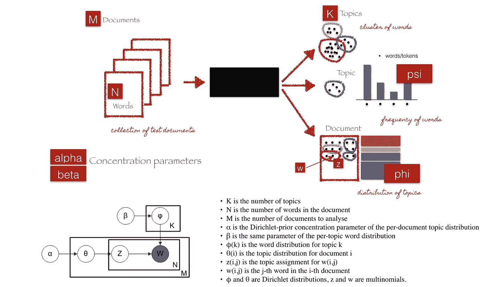
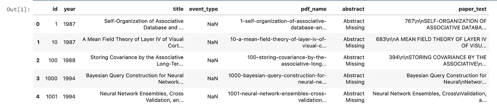
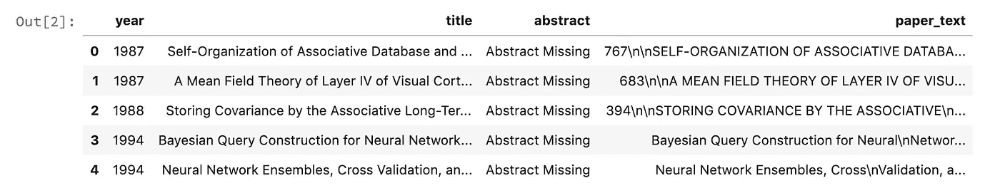
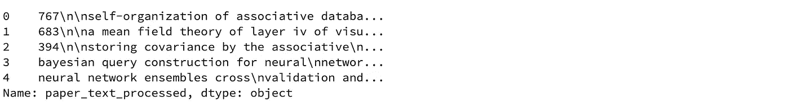
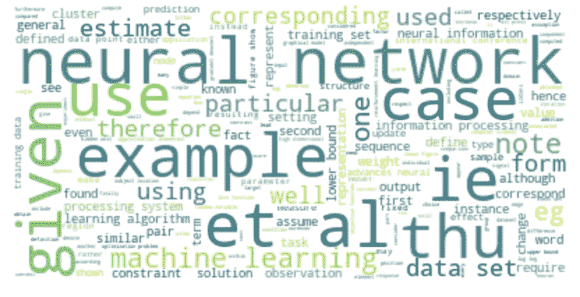
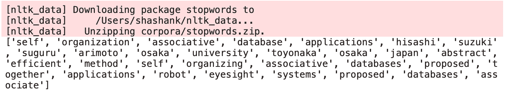
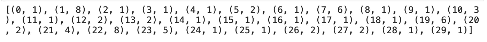
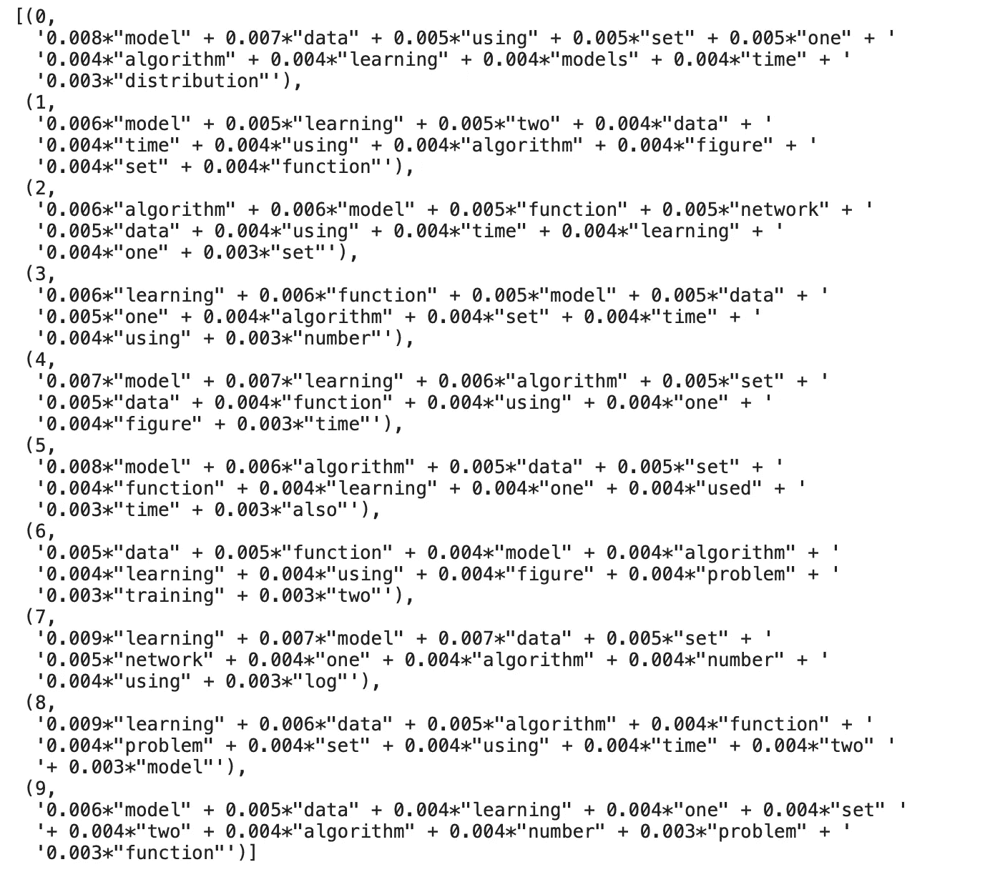
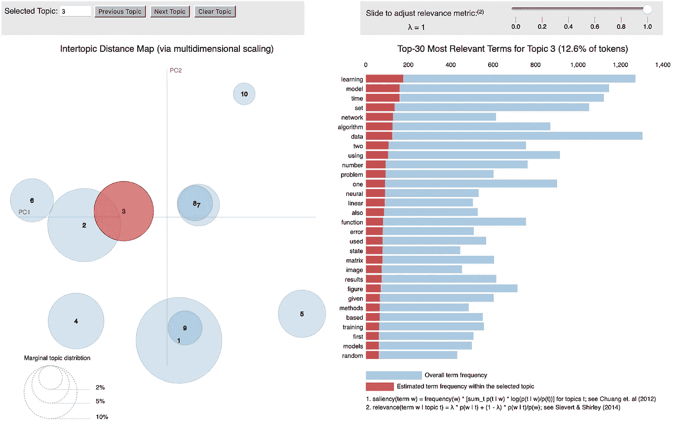

# Python 中的主题建模:潜在狄利克雷分配(LDA)

> 原文：<https://towardsdatascience.com/end-to-end-topic-modeling-in-python-latent-dirichlet-allocation-lda-35ce4ed6b3e0?source=collection_archive---------0----------------------->


[http://getwallpapers.com/image/398564](http://getwallpapers.com/image/398564)

## [深入分析](https://medium.com/towards-data-science/in-depth-analysis/home)

## 如何开始使用 Python 中的 LDA 进行主题建模

**前言:**本文旨在提供潜在主题的综合信息，不应被视为原创作品。这些信息和代码通过一些在线文章、研究论文、书籍和开源代码被重新利用

# 介绍

简而言之，主题模型是一种统计语言模型，用于揭示文本集合中隐藏的结构。在实际和更直观的情况下，你可以把它想象成一项任务:

**降维**，不要将文本 *T* 在其特征空间中表示为{Word_i: count(Word_i，T) for Word_i in Vocabulary}，而是在主题空间中表示为{Topic_i: Weight(Topic_i，T) for Topic_i in Topics}

**无监督学习**，可以比作聚类，在聚类的情况下，主题的数量和聚类的数量一样，是一个输出参数。通过进行主题建模，我们建立了单词簇，而不是文本簇。因此，文本是所有主题的混合，每个主题都有特定的权重

**标记**，抽象文档集合中出现的最能代表其中信息的“主题”。

有几种现有的算法可以用来执行主题建模。最常见的有*潜在语义分析(LSA/LSI)、概率潜在语义分析(pLSA)和潜在狄利克雷分配(LDA)*

在本文中，我们将仔细研究 LDA，并使用 *python 2.7* 中的 *sklearn* 实现来实现我们的第一个主题模型

# 理论概述

LDA 是一个生成概率模型，它假设每个主题是一组潜在单词的混合，每个文档是一组主题概率的混合。



[http://chdoig.github.io/pytexas2015-topic-modeling/#/3/4](http://chdoig.github.io/pytexas2015-topic-modeling/#/3/4)

我们可以将 LDA 的生成过程描述为，给定 *M* 个文档， *N* 个单词，以及之前 *K* 个主题，模型训练输出:

*psi* ，每个题目的字数分布 *K*

*φ*，每个文档的主题分布 *i*

# **LDA 的参数**

> **Alpha 参数**是代表文档-主题密度的狄利克雷先验集中参数——随着*更高的 Alpha，文档被假定为由更多的主题组成，并导致每个文档更具体的主题分布。*
> 
> **Beta 参数**是表示主题-词密度的相同的先验集中参数— *在高 Beta 的情况下，主题被假定为由大多数词组成，并且导致每个主题的更具体的词分布。*

# LDA 实施

完整的代码可以在 GitHub 的 [Jupyter 笔记本上找到](https://github.com/kapadias/medium-articles/blob/master/natural-language-processing/topic-modeling/Introduction%20to%20Topic%20Modeling.ipynb)

1.  加载数据
2.  数据清理
3.  探索性分析
4.  为 LDA 分析准备数据
5.  LDA 模型训练
6.  分析 LDA 模型结果

# 加载数据

对于本教程，我们将使用在 NeurIPS (NIPS)会议上发表的论文数据集，该会议是机器学习社区中最负盛名的年度活动之一。CSV 数据文件包含了从 1987 年到 2016 年(29 年！).这些论文讨论了机器学习中的各种主题，从神经网络到优化方法，等等。

让我们从查看文件的内容开始

```
# Importing modules
import pandas as pd
import osos.chdir('..')# Read data into papers
papers = pd.read_csv('./data/NIPS Papers/papers.csv')# Print head
papers.head()
```



Sample of raw data

# 数据清理

因为这个分析的目标是执行主题建模，所以让我们只关注每篇论文的文本数据，忽略其他元数据列。此外，为了演示，我们将只查看 100 篇论文

```
# Remove the columns
papers = papers.drop(columns=['id', 'event_type', 'pdf_name'], axis=1).sample(100)# Print out the first rows of papers
papers.head()
```



**去掉标点/小写**

接下来，让我们对 *paper_text* 列的内容进行简单的预处理，使它们更易于分析，并得到可靠的结果。为了做到这一点，我们将使用一个正则表达式来删除任何标点符号，然后*小写*文本

```
# Load the regular expression library
import re# Remove punctuation
papers['paper_text_processed'] = \
papers['paper_text'].map(lambda x: re.sub('[,\.!?]', '', x))# Convert the titles to lowercase
papers['paper_text_processed'] = \
papers['paper_text_processed'].map(lambda x: x.lower())# Print out the first rows of papers
papers['paper_text_processed'].head()
```



# **探索性分析**

为了验证预处理是否有效，我们将使用 [wordcloud](https://github.com/amueller/word_cloud) 包制作一个单词云，以获得最常见单词的可视化表示。这是理解数据和确保我们在正确的轨道上的关键，以及在训练模型之前是否需要更多的预处理。

```
# Import the wordcloud library
from wordcloud import WordCloud# Join the different processed titles together.
long_string = ','.join(list(papers['paper_text_processed'].values))# Create a WordCloud object
wordcloud = WordCloud(background_color="white", max_words=5000, contour_width=3, contour_color='steelblue')# Generate a word cloud
wordcloud.generate(long_string)# Visualize the word cloud
wordcloud.to_image()
```



# **为 LDA 分析准备数据**

接下来，让我们将文本数据转换成一种格式，作为训练 LDA 模型的输入。我们从标记文本和删除停用词开始。接下来，我们将标记化的对象转换成语料库和词典。

```
import gensim
from gensim.utils import simple_preprocess
import nltk
nltk.download('stopwords')
from nltk.corpus import stopwordsstop_words = stopwords.words('english')
stop_words.extend(['from', 'subject', 're', 'edu', 'use'])def sent_to_words(sentences):
    for sentence in sentences:
        # deacc=True removes punctuations
        yield(gensim.utils.simple_preprocess(str(sentence), deacc=True))def remove_stopwords(texts):
    return [[word for word in simple_preprocess(str(doc)) 
             if word not in stop_words] for doc in texts]data = papers.paper_text_processed.values.tolist()
data_words = list(sent_to_words(data))# remove stop words
data_words = remove_stopwords(data_words)print(data_words[:1][0][:30])
```



```
import gensim.corpora as corpora# Create Dictionary
id2word = corpora.Dictionary(data_words)# Create Corpus
texts = data_words# Term Document Frequency
corpus = [id2word.doc2bow(text) for text in texts]# View
print(corpus[:1][0][:30])
```



# **LDA 模型训练**

为了简单起见，除了输入主题数量之外，我们将保持所有参数的默认值。对于本教程，我们将建立一个有 10 个主题的模型，其中每个主题是关键字的组合，每个关键字对主题有一定的权重。

```
from pprint import pprint# number of topics
num_topics = 10# Build LDA model
lda_model = gensim.models.LdaMulticore(corpus=corpus,
                                       id2word=id2word,
                                       num_topics=num_topics)# Print the Keyword in the 10 topics
pprint(lda_model.print_topics())
doc_lda = lda_model[corpus]
```



# **分析 LDA 模型结果**

现在我们已经有了一个训练好的模型，让我们来想象一下主题的可解释性。为此，我们将使用一个流行的可视化软件包， [pyLDAvis](https://github.com/bmabey/pyLDAvis) ，该软件包旨在以交互方式帮助:

1.  更好地理解和解释单个主题，以及
2.  更好地理解主题之间的关系。

对于(1)，您可以使用不同的λ参数值，手动选择每个主题来查看其最常用和/或“相关”的术语。当你试图给每个主题指定一个人类可以理解的名称或“含义”时，这很有帮助。

对于(2)，探索*主题间距离图*可以帮助你了解主题如何相互关联，包括主题组之间潜在的更高层次的结构。

```
import pyLDAvis.gensim
import pickle 
import pyLDAvis# Visualize the topics
pyLDAvis.enable_notebook()LDAvis_data_filepath = os.path.join('./results/ldavis_prepared_'+str(num_topics))# # this is a bit time consuming - make the if statement True
# # if you want to execute visualization prep yourself
if 1 == 1:
    LDAvis_prepared = pyLDAvis.gensim.prepare(lda_model, corpus, id2word)
    with open(LDAvis_data_filepath, 'wb') as f:
        pickle.dump(LDAvis_prepared, f)# load the pre-prepared pyLDAvis data from disk
with open(LDAvis_data_filepath, 'rb') as f:
    LDAvis_prepared = pickle.load(f)pyLDAvis.save_html(LDAvis_prepared, './results/ldavis_prepared_'+ str(num_topics) +'.html')LDAvis_prepared
```



# 结束语

在过去十年中，机器学习变得越来越受欢迎，计算可用性的最新进展导致人们寻求如何整合新方法来推进自然语言处理领域的方法呈指数增长。

通常，我们将主题模型视为黑盒算法，但是希望这篇文章能够阐明底层的数学、其背后的直觉，以及让您开始处理任何文本数据的高级代码。

在下一篇文章中，我们将更深入地了解如何评估主题模型的性能，调整其超参数以获得更直观和可靠的结果。

**参考文献:**

[1]主题模型—维基百科。[https://en.wikipedia.org/wiki/Topic_model](https://en.wikipedia.org/wiki/Topic_model)

[2]主题建模的分布式策略。[https://www . ideas . Illinois . edu/bitstream/handle/2142/46405/paralleltopicmodels . pdf？sequence=2 & isAllowed=y](https://www.ideals.illinois.edu/bitstream/handle/2142/46405/ParallelTopicModels.pdf?sequence=2&isAllowed=y)

[3]主题地图—软件—资源— Amaral 实验室。[https://amaral . northwestern . edu/resources/software/topic-mapping](https://amaral.northwestern.edu/resources/software/topic-mapping)

[4]文本挖掘中的主题建模综述。[https://thesai . org/Downloads/volume 6 no 1/Paper _ 21-A _ Survey _ of _ Topic _ Modeling _ in _ Text _ mining . pdf](https://thesai.org/Downloads/Volume6No1/Paper_21-A_Survey_of_Topic_Modeling_in_Text_Mining.pdf)

感谢阅读。*如果你有任何反馈，欢迎评论这篇文章，在* [*LinkedIn*](https://www.linkedin.com/in/shashankkapadia/) *上给我发消息，或者给我发邮件(shmkapadia[at]gmail.com)*

*如果你喜欢这篇文章，请访问我在 NLP 上的其他文章*

[](/evaluate-topic-model-in-python-latent-dirichlet-allocation-lda-7d57484bb5d0) [## 评估主题模型:潜在狄利克雷分配(LDA)

### 构建可解释主题模型的分步指南

towardsdatascience.com](/evaluate-topic-model-in-python-latent-dirichlet-allocation-lda-7d57484bb5d0) [](https://medium.com/@shashank.kapadia/introduction-to-natural-language-processing-nlp-2a8fae09ed03) [## 自然语言处理(NLP)简介

### 自然语言处理简介

medium.com](https://medium.com/@shashank.kapadia/introduction-to-natural-language-processing-nlp-2a8fae09ed03) [](/building-blocks-text-pre-processing-641cae8ba3bf) [## 构建块:文本预处理

### 本文是关于自然语言处理的后续文章的第二篇。这一系列…的目的

towardsdatascience.com](/building-blocks-text-pre-processing-641cae8ba3bf) [](/introduction-to-language-models-n-gram-e323081503d9) [## 语言模型简介:N-Gram

### 本文是关于自然语言处理的第三篇文章。这一系列…的目的

towardsdatascience.com](/introduction-to-language-models-n-gram-e323081503d9)