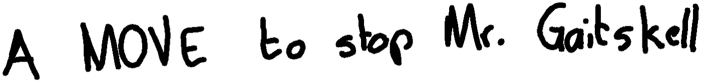
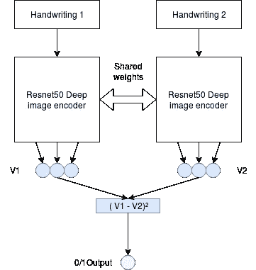
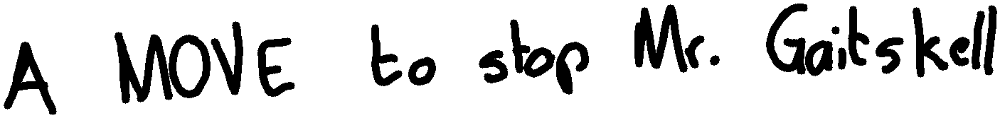
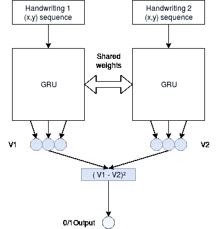

# 端到端作者识别:离线与在线方法

> 原文：<https://towardsdatascience.com/end-to-end-writer-identification-off-line-vs-on-line-approach-634b832d2b9b?source=collection_archive---------38----------------------->

## 对两个样本笔迹是否由同一人书写进行分类。

Photo by [Estée Janssens](https://unsplash.com/@esteejanssens?utm_source=unsplash&utm_medium=referral&utm_content=creditCopyText) on [Unsplash](https://unsplash.com/s/photos/handwriting?utm_source=unsplash&utm_medium=referral&utm_content=creditCopyText)

# 动机:

每个人都有自己独特的笔迹，有自己的特点和小细节，使其与众不同。如果我们随机选取两个由两个人书写的笔迹样本，我们可能会注意到笔画的构成方式、字母之间的间距和其他细节是不同的。在这篇文章中，我们将训练一个模型来尝试区分两个样本笔迹是否是同一个人写的。

# 数据集:

我们将使用 [IAM 在线手写数据库](http://www.fki.inf.unibe.ch/databases/iam-on-line-handwriting-database/download-the-iam-on-line-handwriting-database),它给出了每个书写者的多个手写样本，以及手写样本构建过程中记录的笔画顺序。

该数据集使我们有机会使用两种不同的方法来解决书写者识别问题:

## 离线设置:

Static representation of handwriting

在离线设置中，我们有手写最终结果的静态图像。这给出了笔迹外观的全局表示。这种类型的表示可能最适合用作视觉模型的输入。

在这个设置中，我们将制作两个像上面这样的图像到一个连体视觉模型(在我们的例子中是 Resnet50 ),并尝试预测这两个样本是否是同一个人写的。

Simplified illustration of the off-line model

对图像进行预处理，以去除边缘上多余的空白，并将其大小归一化为(128，1024)，同时小心地保持前后相同的纵横比，以免使笔迹变形。

对每幅图像使用相同的编码器，为每幅图像产生固定长度的表示，然后将这两种表示组合起来，并提供给完全连接的层，最终进行预测。

由于我们有每个书写者的一组笔迹，我们将使用该信息通过选择来自同一书写者的两个样本来创建正面样本，并通过选择来自两个不同书写者的样本来创建负面样本。我们还确保相同的作者不能同时出现在训练集和评估集中。

## 在线设置:

Handwriting with individual strokes details

由于我们也将手写内容表示为一系列手写笔画，每个笔画路径的坐标为(x，y ),因此我们可以将此信息用作分类器的输入。这个坐标序列给出了产生最终手写结果所需的步骤，一次一行。它更详细地描述了这位作家与众不同的特点。

输入这种格式的最自然的方式是每个子笔画的图像序列，然而，每个手写有几十个笔画，每个笔画有多个子笔画线。由于内存问题，这使得它不实用，并且可能不是非常有效。这就是为什么我们必须将原始的线坐标作为一个(x，y)数序列提供给一个像 GRU 这样的顺序模型。

Simplified illustration of the on-line model

这有一个更轻的内存使用，我们将展示它可以很好地工作在一个比图像编码器小得多的模型上。

# 结果:

*   在线 Resnet 模型验证准确率: **88%**
*   离线 GRU 模型验证准确率: **92%**

这意味着，当应用于看不见的书写者时，GRU 模型可以以 92%的准确率分辨出两组笔迹是否出自同一个人之手。鉴于数据集的规模较小，这些结果令人鼓舞。

# 未来可能的改进:

有多种方法可以改进这个项目->

*   参数调整。
*   更好的(x，y)笔画序列预处理和特征工程。
*   寻找更真实的手写数据集(墨水笔在纸上),而不是手写的电子记录。
*   使用笔迹伪造的数据集作为用于训练/评估的硬负样本。

# 结论:

这是一个非常有趣的机器学习应用，因为它证明了每个人的笔迹都可以被识别。它还表明，在找到最佳方法之前，可以考虑用多种方法来模拟同一个问题。

数据:[http://www . fki . INF . unibe . ch/databases/iam-on-line-手写-数据库/download-the-iam-on-line-手写-数据库](http://www.fki.inf.unibe.ch/databases/iam-on-line-handwriting-database/download-the-iam-on-line-handwriting-database)

代号:[https://github.com/CVxTz/handwriting_forensics](https://github.com/CVxTz/handwriting_forensics)