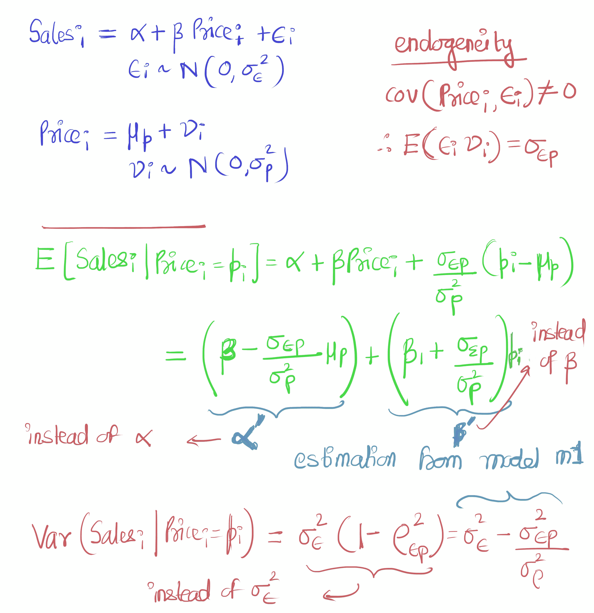

# 处理第一类内生性

> 原文：<https://towardsdatascience.com/endogeneity-the-reason-why-we-should-know-about-data-part-ii-c1487d69aeed?source=collection_archive---------16----------------------->

## 为什么我们应该了解我们的数据

## 用冰淇淋小贩的例子来解释第一类内生性

[在这里](https://medium.com/@ashutoshnayakkgp/endogeneity-the-reason-why-we-should-know-about-data-part-i-80ec33df66ae)我们通过例子讨论了内生性的含义，内生性的几种可能来源以及它为什么重要。这一部分集中在冰淇淋供应商的例子，以深入探讨为什么我们应该小心内生性。线性回归模型由下式给出:

*Sales _ I = alpha+beta Price _ I+error _ I*(**m1**) *error _ I ~ N(0，var_e)*

在第一部分之后， *Price_i* 是一个内生变量，因为它可以用 *temperature_i* 来解释。从而| *cov(Price_i，error_i)| > 0。*设 *Price_i ~N(p，var_p)* 。

考虑到 *Sales_i* 和 *Price_i* 的分布为二元正态分布，我们可以推导出 S *ales_i|Price_i.* 的条件分布，这是一个标准推导，其推导可以在[这里检查](https://stats.stackexchange.com/questions/30588/deriving-the-conditional-distributions-of-a-multivariate-normal-distribution)。

如左图所示，如果忽略内生性:
1。我们**没有**计算真实系数，导致次优，因为我们正在计算 *alpha'* 和 *beta'* 。
2。与模型的差异( *Sales_i|Price_i* )低于实际差异。
这可能会给我们*错误的信心*认为模型表现(适合)得很好。

**补救措施**

1.  使用*温度 _i* 预测*价格' _i* ，并将*价格 _i* 替换为 **m1** 中的*价格' _i* 。这里，*温度 _i* 称为**工具变量(IV)** ，这种方法称为 **IV** 方法
2.  用 *Temperature_i* 预测 *Price'_i* 求 *E_i = Price_i-Price'_i* 并使用:
    *Sales _ I = alpha+beta Price _ I+gamma E _ I+error _ I*(**m2**)
    如果有内生性，gamma 的质量会从 0 偏移。或者干脆，|gamma| > 0 有把握(统计显著)。这种方法被称为**控制功能**方法。

省略变量的内生性需要问题结构的知识，但如果知道，这是很简单的。然而，找到合适的 IVs 是非常困难的。可以采取预防措施，因为发现薄弱或错误的静脉注射会导致更坏的结果。

下面的陈述是我的意见和主张，可能是错误的:

> ****的高度非线性函数逼近【Sales_i=f(Price_i)*** *例如，随机森林/隐马尔可夫模型/深度学习可以处理内生性，因为底层非线性隐结构旨在找到 Price_i。在因子分析或 SVD 中，如果该问题被处理为 Sales_i 和 Price_i 的联合 pdf，则隐藏/潜在因子类似于 IVs。**

*更普遍和困难的内生性问题是同时性的情况。此处介绍了[关于同时性的讨论。](https://medium.com/@ashutoshnayakkgp/endogeneity-the-reason-why-we-should-know-about-data-part-iii-50380e0d996e)*

**原载于 2019 年 6 月 2 日 https://medium.com***。***