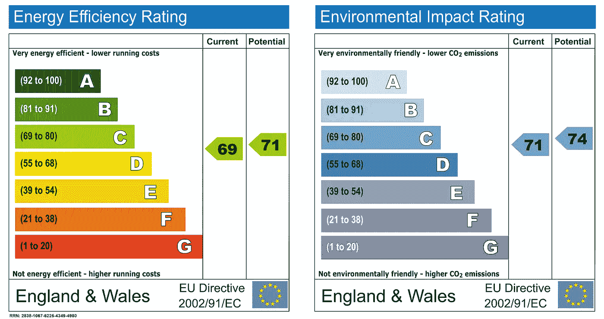
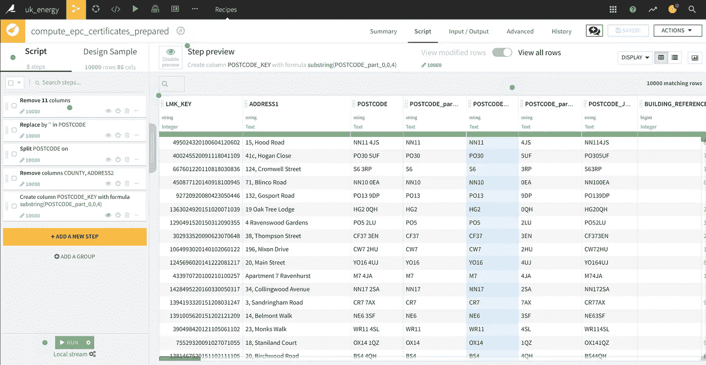

# 英国的能源——能源性能证书分析

> 原文：<https://towardsdatascience.com/energy-in-the-uk-analysis-of-the-energy-performance-certificates-585665721b9c?source=collection_archive---------30----------------------->

Photo by [Heidi Sandstrom.](https://unsplash.com/@heidi_sandstrom?utm_source=medium&utm_medium=referral) on [Unsplash](https://unsplash.com?utm_source=medium&utm_medium=referral)

自从我发表了关于伦敦智能电表和可能的数据分析的文章后，我定期收到人们的消息，他们有兴趣将智能电表数据和家用监视器的能效联系起来。我在本文中写道**没有直接的方法将智能电表数据、acorn 和家庭能效联系起来**，但是围绕家庭能源和能效的其他数据集仍然有一些有趣的事情要做。

很久以来，我一直想写一篇关于我在以前的工作中测试过的有趣工具的文章，这就是来自[数据库](https://www.dataiku.com/)的 DSS，它对于处理数据的人来说非常有趣。在这篇文章中，我将介绍这个工具和其他数据集。

# 什么是大台库 DSS

Dataiku DSS 是由法国公司 Dataiku 开发的产品，在其网站上被定义为**“数据科学家、数据分析师和工程师团队的协作数据科学软件平台，以更有效地探索、原型化、构建和交付他们自己的数据产品”**。

简而言之，它是一个简化公司中数据/模型处理和共享的工具，我真的邀请你去看看他们的[网站](https://www.dataiku.com/)，那里描述了许多商业案例和平台的功能。但是需要知道的是[平台有两种版本](https://www.dataiku.com/dss/trynow/enterprise-edition/):

*   **免费版**:我在我的机器上托管的这个项目中使用的(但是有一个版本也可以在 dataiku 服务器上免费托管)
*   企业版:提供更多的数据连接器(Hive 等)和更少的限制，网站上没有公布价格，因为我认为这是基于客户的需求，但我听说它并不便宜。但是有一个 2 周的免费试用来测试这项服务。

免费版的安装非常简单，你可以在所有可能的操作系统上安装它。在展示完数据后，我将深入研究该软件的功能。

# 描述数据

对于这个项目，我将使用以下数据源:

*   EPC:这是英国的多份业绩证书的集合(大约 1500 万)
*   [Nomis data](https://www.nomisweb.co.uk/query/select/getdatasetbytheme.asp?opt=3&theme=&subgrp=) :该网站收集了不同人口普查期间(最近一次是 2011 年)在英国收集的多种信息

让我们看一下数据集的更详细描述。

# 经济和计划委员会(Economic and Planning Council)

首先，什么是 EPC？这很简单，它是一个家庭的能源性能评级，下图中有一个例子。

例如，它就像可以在设备上找到的那个，并且它需要在每个新租户或房东处被刷新。住房、社区和地方政府部开放的数据源非常完整(超过 1500 万份证书)，并且不仅仅是对这些数据的简单评级([数据字典](https://epc.opendatacommunities.org/docs/guidance#glossary))，还有关于玻璃、能耗和建筑面积等信息。

# Nomis 数据

Nomis 网站“是国家统计局提供的一项服务，免费提供来自官方来源的最详细和最新的联合王国劳动力市场统计数据”，该网站上有在不同人口普查期间收集的关于联合王国公民的多种信息。有很多详细的信息，人口普查的数据主要用于创建我在关于智能电表的文章中定义的 ACORN 组。

从这个门户网站上，我提取了英国公民在地区层面上的信息:

*   职业
*   资格
*   国家统计-社会经济分类
*   人口

让我们现在就开始吧。

# 决策支持系统中的数据处理

为此项目提取的所有数据都是 csv 文件，下面的动画演示了在 DSS 中创建数据集的过程。

在 DSS 中可以很容易地拖放文件，你可以对数据、质量等有一个总体的了解。在免费版本中，也可以连接 SQL 数据库，非常简单。

对于这个项目，想法是连接来自 EPC 的数据和 Nomis 数据，因此有很大一部分证书处理要在地区级汇总并连接到 Nomis 数据。

有一个完整过程的概述

下图显示了准备 EPC 数据集的流程，该数据集可与 Nomis 数据连接。

有一个准备阶段(使用画笔)，其中有一个正确的列选择，处理邮政编码以获得区号。

与上一步一样，第二步是准备数据集，以找到家庭的最新 EPC(检查日期的正确格式)。

为了获得数据集中每户家庭的最后检查日期，有一个 group by(过程图像上的正方形三角形圆圈图标)函数，下面的动画中有一个过程的图示。

现在我们已经清理了 EPC，并在另一个表中列出了每个家庭的最后检查日期，这两个数据集之间用连接函数进行了连接(流程中的连接标志)，现在有一个连接菜单的显示，您可以在其中选择连接键和所选的列。

最后，根据每个地区的功能、家庭类型、供暖系统类型和 EPC 等级进行分组。

最后一步是使用 python 脚本，通过 pandas 的 pivot 函数(每个等级的 EPC 计数和家庭类型)获得地区级别的汇总信息，但我也可以使用 DSS 的 pivot 函数。

瞧，我们有了汇总到区一级的 EPC 数据，这让我们了解了这一级别的家庭评级和家庭类型。

使用 join 函数可以很容易地将这些数据与 Nomis 的数据连接起来。

我使用了 DSS 的一些内部函数来执行 join，groupby，但是我可以使用:

*   构建数据集的 python 或 R 脚本
*   如果是 SQL 表，则为 SQL 脚本
*   “大数据”配置中的 Hive 或 impala

现在数据可用了，让我们做一个分析和一个仪表板来总结一些结果。

# 决策支持系统中的数据分析

这些分析将会是超高水平的，这只是为了展示 DSS 的特性。

这是我用 DSS 制作的仪表板的动画。

这个仪表板的构建要比 Tableau 容易得多(我的观点)，但是他们共享这种拖放方法来构建每个非常有用的图表。

有一种方法可以使用实验室工具直接从数据集进行一些分析，其中可以使用内部函数(例如确定相关性)或使用一些脚本来分析数据，在这种情况下，我选择 python 来使用 seaborn 进行一些绘图。

分析部分真的很酷，我认为它可以满足很多需求，但另一个令人印象深刻的部分是基于处理的数据建立模型的 ML 部分。

# 决策支持系统中的模型服务

因此，构建模型有多种方法，但首先让我们定义这一部分的目的:

**“根据位置、总建筑面积和家庭供暖类型建立一个能量等级估算器”**

DSS 为您提供了三个“级别”来构建模型，但老实说，这是相同的界面，只是您在模型配置部分的旅程是从菜单的更高层次开始的。

在构建模型的菜单中，可以:

*   准备培训和测试集
*   选择评估指标
*   拿起功能
*   选择网格搜索的模型和参数
*   在测试部分之后比较模型

有一个简单的动画概述了模型构建器的特性。

有趣的是，您可以使用预构建的函数(我假设 scikit 学习函数)，或者编写自己的 python 代码。就过程和结果的可视化而言，测试模型的工具确实令人印象深刻。

很好的一点是可视化的结果，例如一个非常容易理解的决策树(用这个工具分解)。

在你找到合适的模型后，会有一个 API 生成器来嵌入这个模型。在这个空间中，您可以定义一些测试请求来查看运行中的模型。

为了展示这个模型，免费版没有激活这个特性(或者我错过了使用它)，但是它看起来非常直观。

现在是总结的时候了。

# 对项目的反馈

我将强烈推荐在能源领域工作/感兴趣的人去钻研 EPC 数据，因为他们是英国房产市场知识的一个很好的来源。总的来说，对我这个最法国的外国人来说，这么说很痛苦，但英国政府在收集和共享数据方面做得很好，政府平台上有非常有趣的数据集可供数据科学家使用(在法国，我们在这个问题上起步很晚，但事情正在慢慢改变)。

对于 Dataiku DSS 来说，它是一个**伟大的工具，无论数据科学家是否试验过，我都能感觉到这个工具是由数据科学家为数据科学家设计的**，有太多的功能我没有使用过，比如所有的协作部分，深度学习等等。有多个内部功能可以使数据处理更容易，这真的很酷，但如果 Dataiku 决定放弃这些功能(或使其成为高级功能)，如果数据人员不知道如何加入 groupby 等，数据管道传输可能会很困难，但我真的很喜欢 Dataiku 没有让用户使用他们的内部功能，而是让其他方法操作数据的可能性(例如 SQL)成为可能。

**在我的日常工作中，DSS 能满足我的需求吗？没有，因为我目前有多种工具可供我使用来完成我的工作，我需要在数据端和开发端的灵活性来试验和部署东西**，但这个工具绝对值得尝试，因为它可以满足没有我的需求的数据团队的需求(他们在世界各地有很多)。

*最初发表于* [*的古怪数据家伙*](http://the-odd-dataguy.com) *。*