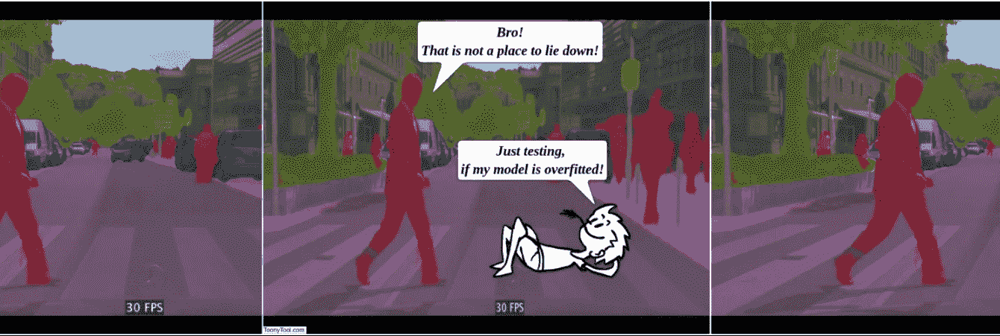
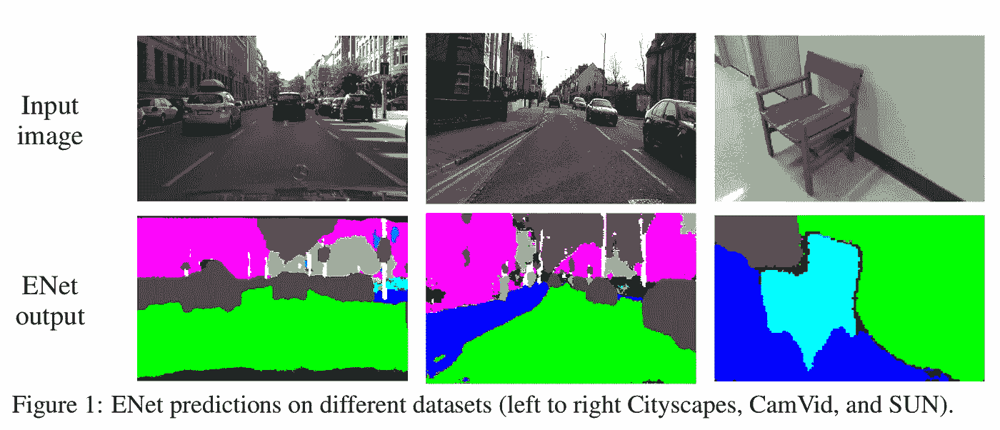
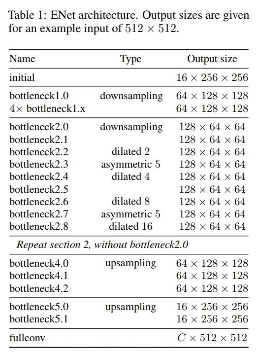
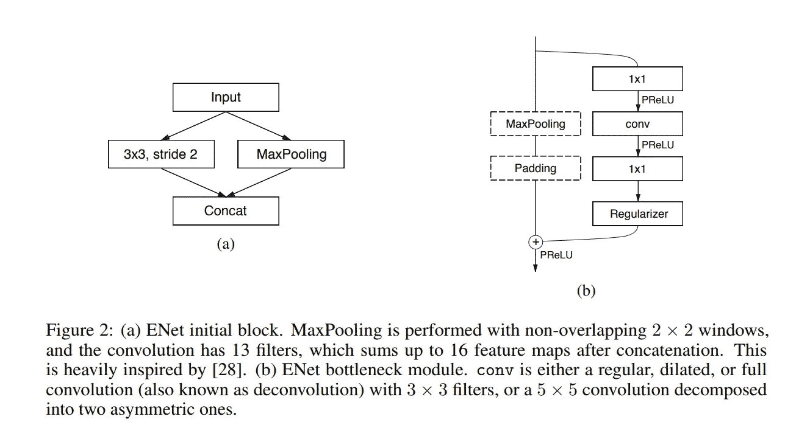
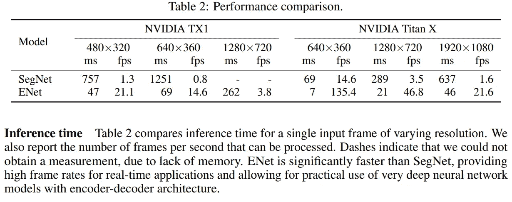
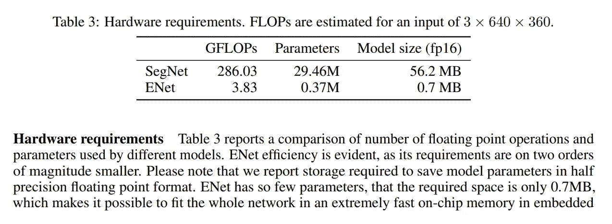
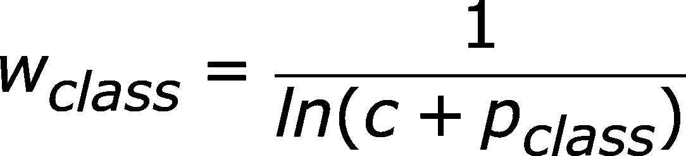
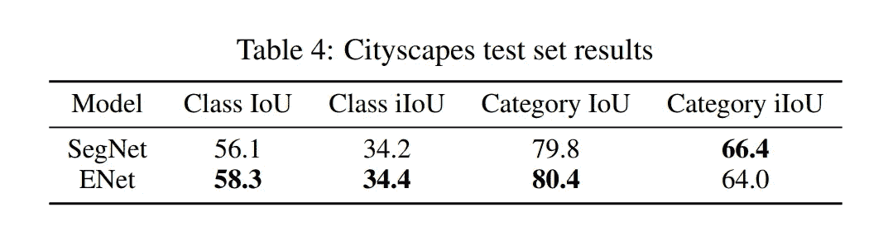
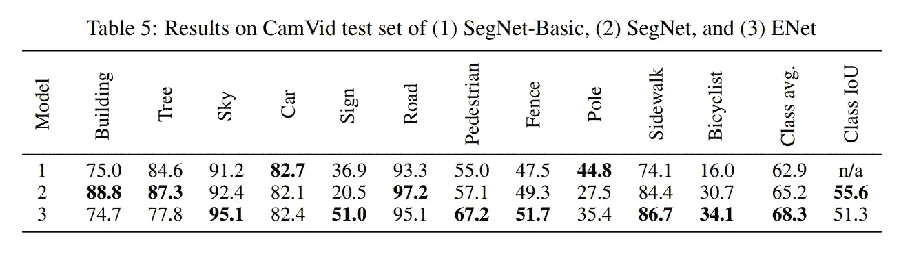
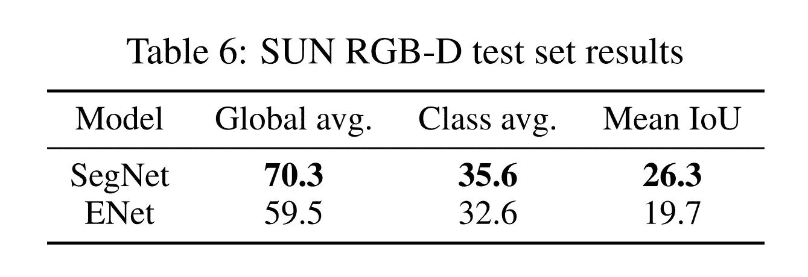

# ENet——一种用于实时语义分割的深度神经架构

> 原文：<https://towardsdatascience.com/enet-a-deep-neural-architecture-for-real-time-semantic-segmentation-2baa59cf97e9?source=collection_archive---------7----------------------->

## 论文摘要

[**Fig 1\. A conversation between a semantic segmented guy and a toon**](https://www.youtube.com/watch?v=qWl9idsCuLQ)

*这是一篇论文的论文摘要:* ***ENet:一种用于实时语义分割的深度神经网络架构*** *by*[*亚当·帕兹克*](mailto:a.paszke@students.mimuw.edu.pl) *论文:*[*https://arxiv.org/abs/1606.02147*](https://arxiv.org/abs/1606.02147)

# 概观

***ENet(高效神经网络)*** 提供实时执行逐像素语义分割的能力。ENet 的速度提高了 18 倍，所需的 FLOPs 减少了 75 倍，参数减少了 79 倍，精度与现有模型相当或更高。在 CamVid、CityScapes 和 SUN 数据集上进行了测试。

**Fig 2\. Semantic Segmentations using ENet**

# 方法

**Fig 3\. ENet Architecture**

以上是完整的网络架构。
它分为几个阶段，如表中的水平线和每个块名后的第一个数字所示。
报告输入图像分辨率为`512 * 512`时的输出尺寸

**Fig 4\. Each module of ENet in detail**

的直观表示:初始块如 *(a)
-* 所示，瓶颈块如 *(b)* 所示

每个瓶颈模块由:
- 1x1 投影降维
-一个主卷积层(`*conv*` *)(要么—* ***正则*** *，* ***扩张*** *或* ***满****)(3x 3)*
-1x1 扩展

如果瓶颈是缩减采样，则最大池图层将被添加到主分支。此外，第一个 1x1 投影被替换为跨距=2 的 2x2 卷积。

它们将激活填充为零，以匹配特征映射的数量。

`conv`有时是非对称卷积，即一系列`5 * 1`和`1 * 5`卷积。

对于`regularizer`，他们使用*空间落差* :
-瓶颈前带`p = 0.01`2.0
-瓶颈后带`p = 0.1`

所以，

1.  阶段 1，2，3— ***编码器*** —由 5 个瓶颈块组成(除了阶段 3 不下采样)。
2.  阶段 4，5— ***解码器*** —阶段 4 包含 3 个瓶颈，阶段 5 包含 2 个瓶颈
3.  后跟一个`fullconv`，它输出维度为`C * 512 * 512`的最终输出，其中`C`是滤波器的数量。

还有几个事实:
-他们没有在任何投影中使用偏差项
-在每个卷积层和激活之间，他们使用批量归一化
-在解码器中，MaxPooling 被替换为 MaxUnpooling
-在解码器中，Padding 被替换为没有偏差的空间卷积
-在*最后一个* ( *5.0* )上采样模块
中没有使用池索引-网络的最后一个模块是完全卷积，它单独
-每个分支都有一个空间落差，第一阶段为`p = 0.01`，随后阶段为`p = 0.1`。

# 结果

使用 SegNet[2]作为基准，在
- *CamVid* (道路场景)
- *城市风景*(道路场景)
- *SUN RGB-D* (室内场景)
上对 ENet 的性能进行基准测试，因为它是最快的分割模型之一。使用 cuDNN 后端使用 Torch7 库。

推理速度是使用 NVIDIA Titan X GPU 以及在 NVIDIA TX1 嵌入式系统模块上记录的。输入图像大小为 640x360 时，达到 10fps 以上。

**Fig 5\. Inference Time Comparison on the two different GPUs with SegNet as the baseline**

**Fig 6\. Hardware requirements for SegNet and ENet**

## 基准

***用于亚当*** *。* ENet 收敛速度非常快，在每个数据集上，使用 4 个 Titan X GPUs 的训练只需要大约 3-6 个小时。

分两个阶段执行:
-首先，他们训练编码器对输入图像的降采样区域进行分类。
-然后追加解码器，训练网络执行上采样和逐像素分类。

***学习速率— 5e-4
L2 重量衰减 2e-4
批量大小 10***

自定义等级称重方案定义为

**Fig 7\. The formula for the custom class weighing scheme**

其中 ***c = 1.02***
并且类权重被限制在***【1，50】***的区间内

**Fig 8\. Performance on CityScapes Dataset**

**Fig 9\. Performance on CamVid Dataset**

**Fig 10\. Performance on SUN RGB-D dataset**

## 参考

1.  A. Paszke，A. Chaurasia，S. Kim 和 E. Culurciello。Enet:用于实时语义分割的深度神经网络架构。arXiv 预印本 arXiv:1606.02147，2016。
2.  *V. Badrinarayanan，A. Kendall，R. Cipolla，“Segnet:用于图像分割的深度卷积编码器-解码器架构”，arXiv 预印本 arXiv:1511.00561，2015 年。*

我最近也转载了这篇论文，可以在这里找到:[https://github . com/iArunava/ENet-Real-Time-Semantic-Segmentation](https://github.com/iArunava/ENet-Real-Time-Semantic-Segmentation)

> 感谢阅读！一定要看报纸！
> 
> 如果我发现其他有趣的见解，我会更新的！