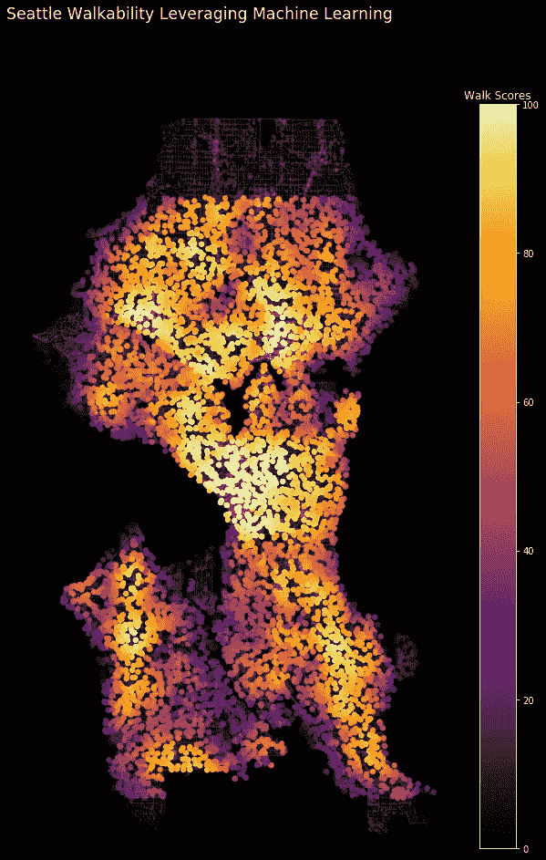
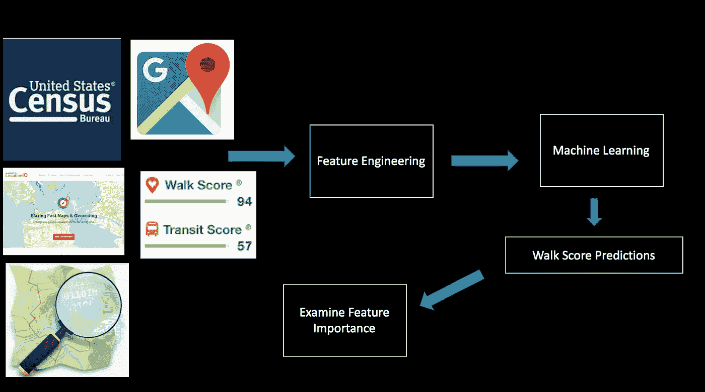
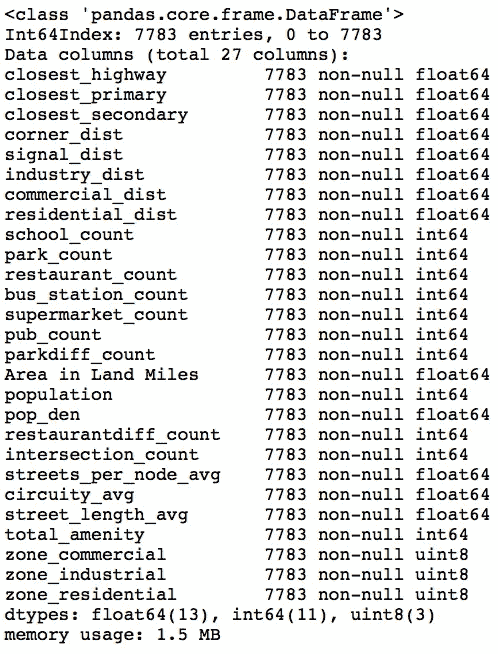
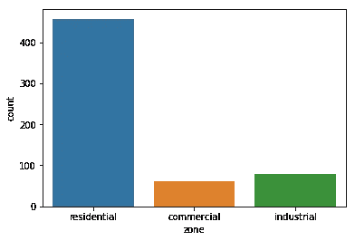
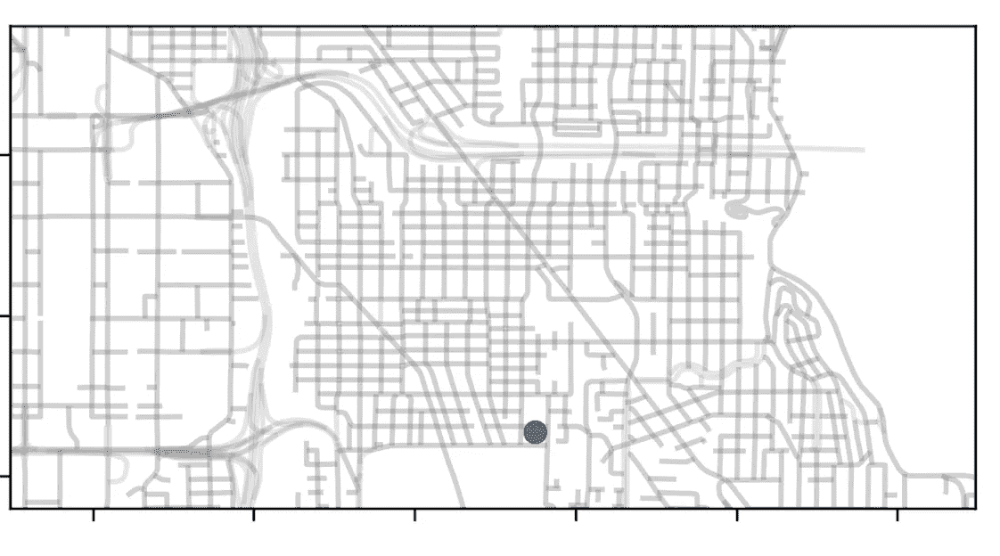
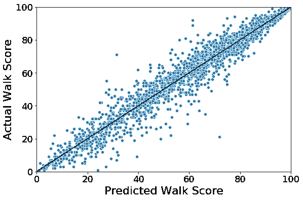
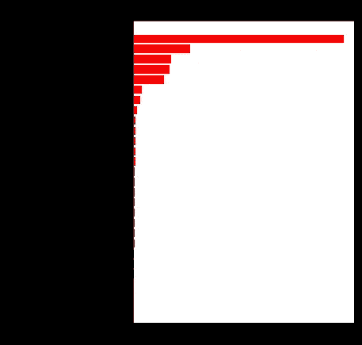

# 对行走分数算法进行逆向工程

> 原文：<https://towardsdatascience.com/engineer-walkscore-4dc1730b976c?source=collection_archive---------20----------------------->

## **使用机器学习建立可行走性评分**

Heatmap of Predicted Walk Scores throughout Seattle, WA

我住在西雅图，最近搬到了另一个社区。根据[步行评分](https://www.redfin.com/how-walk-score-works)的专有算法，我从西雅图最适合步行社区的第 9 名升至第 30 名。我仍然可以很容易地走到当地的咖啡店和理发店，但仅此而已！我可以说，我已经搬到了一个不太适合步行的社区，但不清楚如何量化这个数值，也不清楚步行性得分是多少。

我之前使用过[步行评分 API](https://www.walkscore.com/professional/api.php) 作为[预测电动滑板车位置](/a-birds-eye-view-leveraging-machine-learning-to-generate-nests-30dd2136a839)聚类的数据源。Walk Score 是一个网站，它获取一个地址，并使用专有算法和各种数据流在 0-100 的范围内计算其可步行性。

作为一个喜欢步行到达目的地的人(还有徒步旅行！)，我很好奇是什么推动了这些产生可步行性分数的专有算法。我开始提出以下问题:

1.  *专有的 Walk Score 算法可以被逆向工程吗？*

2.*在构建可行走性评分时，哪些特征是重要的？*

为了回答这些问题，我通过收集一组不同的粒度西雅图市数据和步行分数 API 数据来建立一个自定义数据集，以训练机器学习模型来预测步行分数。我能够训练一个模型，在测试集数据上达到 0.95 的 R。r 平方解释了特征集的方差在多大程度上解释了行走分数的方差。

本质上，我能够逆向工程的步行评分方法，并重新创建专有的算法，他们的步行评分。对于一个位置的步行性来说，最重要的特征是 1000 米范围内的餐馆数量、人口普查区域内的人口密度、1000 米范围内的超市数量以及与最近的商业区的距离(以米为单位)。

# 数据源和机器学习管道

The Full Data Pipeline for Reverse Engineering the Walk Score Methodology

## **数据**

我从随机生成大西雅图地区的经纬度坐标开始。有了大约 7800 个唯一地理位置的列表后，我利用 Walk Score API 返回每个唯一地理位置的可步行性分数。然后，我开始收集反映一个地点周围区域可步行性的数据。

**数据来源:**

*   [OSMnx](https://github.com/gboeing/osmnx) : Python 包，允许您从 OpenStreetMap 的 API 下载空间几何图形和模型、投影、可视化和分析街道网络。
*   [步行评分 API](https://www.walkscore.com/professional/api.php) :返回任何地点的步行性评分。
*   [LocationIQ API](https://locationiq.com) :附近兴趣点(PoI) API 返回给定坐标周围指定的 PoI 或地点。
*   [西雅图城市分区](http://data-seattlecitygis.opendata.arcgis.com/datasets/862db70aaf974523b3bcae427f1f512d_5):分区指定使用类别(例如，独栋住宅、多户住宅、商业、工业等。)
*   [西雅图人口普查数据](https://www.seattle.gov/opcd/population-and-demographics/geographic-files-and-maps#2010census):为人口普查区和地理标识符内的人口普查区提供人口和平方英里面积
*   [美国人口普查地理编码器 API](https://geocoding.geo.census.gov) :对于给定的地理位置，API 返回人口普查区域和唯一的地理标识符。这对于正确合并分区和普查数据至关重要。

## **特征工程**

由于 LocationIQ API 每日请求的限制，我将数据收集阶段延长了两周。这给我留下了大约 7800 个独特的地理位置，然后我设计了 27 个特征来训练机器学习模型，以预测整个西雅图的步行能力。

Full Feature Set

这些功能分为四类:

1.  基于便利设施:指定半径内的公交车站、公园、餐馆、学校和所有便利设施的数量(大多数便利设施使用 1000 米半径)

2)普查得出:分区类别和人口密度

Geolocation Observations Grouped by Zoning Category

3)基于距离:邻近最近的高速公路、最近的主要道路、最近的次要道路、最近的住宅道路、最近的工业分区

4)步行网络结构:交叉口数、平均迂回度、平均街道长度、每个节点平均街道数

A single geolocation plotted on top of the [OSMnx](https://github.com/gboeing/osmnx) library for Walk Network Structure feature generation

## **模型开发**

我训练了三个机器学习模型:随机森林回归、梯度推进回归和极端梯度推进回归。我用收集到的三分之二的数据来训练这些模型，剩下的三分之一用于测试。

Extreme gradient boosting model predictions (*R²* of 0.95) of Walk Score against the one-third test set.

极端梯度推进回归在预测步行分数方面做得很好，在三分之一测试集(约 2300 个样本)上实现了 0.95 的 *R* 。该模型具有最佳的测试集精度(RMSE)。

## 黑盒子里有什么？

对 Walk Score 方法进行逆向工程的目的是为了了解算法中的关键特征。我们想知道是什么让一个地方适合步行，而不仅仅是分数！通过检查极端梯度增强模型的特征重要性，1000 米内的餐馆数量占主导地位，是最重要的特征。其他重要的模型特征包括给定人口普查区域的人口密度、所有便利设施的数量、1000 米范围内超市的数量以及与最近商业区的距离(以米为单位)。

The number of restaurants, supermarkets and total amenities within 1000 meters, population density and proximity to commercial zoning are the most important features for predicting a location’s Walk Score.

## **结论**

步行分数已经是一个有用的决策工具，可以根据步行、骑自行车和交通偏好来决定在哪里居住和开发房地产。现在，了解 Walk Score 方法以及构建算法的功能是很有帮助的。我们现在知道了根据步行分数使一个位置可步行的输入。

当前的模型是在西雅图市范围内训练的，那里的城市特征是相似的。还可以收集其他特征来增强步行评分的预测能力，例如地形测量和最近舒适距离计算。模型预测可以很容易地扩展到其他领域，因为 Walk Score API 和用于生成要素的基础数据源(美国人口普查、OSMnx、城市分区、LocationIQ)可以广泛使用。

## 密码

该项目的代码可以在[我的 GitHub](https://github.com/perryrjohnson/Walk-Score) 上找到

***评论或提问？请发电子邮件至:perryrjohnson7@gmail.com 或联系***[***LinkedIn***](https://www.linkedin.com/in/perryrjohnson/)