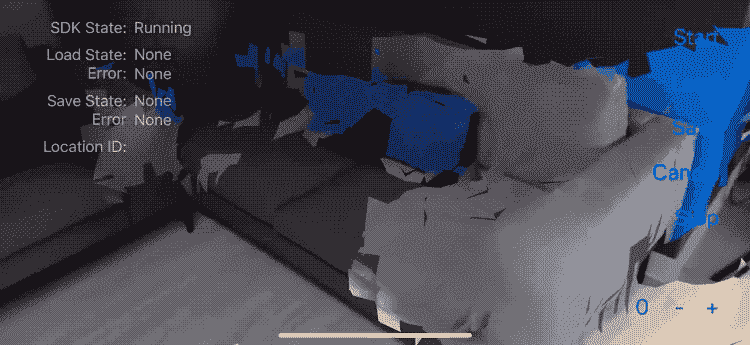
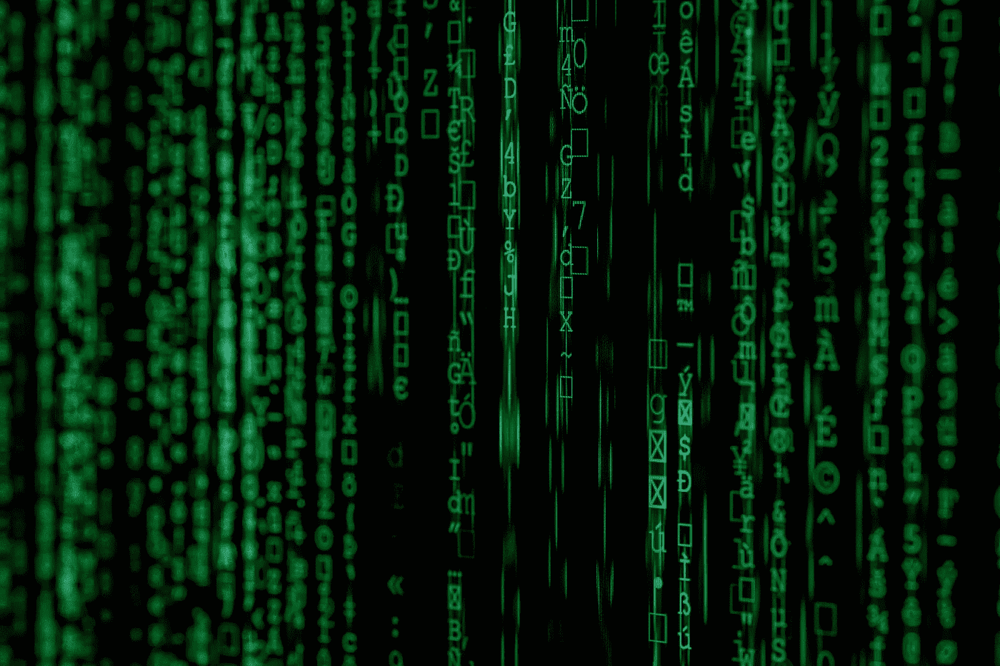

# 用机器学习增强增强现实

> 原文：<https://towardsdatascience.com/enhancing-ar-with-machine-learning-9214d2da75a6?source=collection_archive---------8----------------------->

## 在 AR 应用之上分层 ML 扩展了它们的有用性。

随着增强现实(AR)技术的改进，我们开始看到超越营销和简单可视化的用例。这些包括产品可视化、远程协助、强化学习、质量控制和维护。

苹果的 ***Measure*** 是我最喜欢的 AR 应用之一。这是一种用智能手机进行物理测量的简单可靠的方法，它证明了 AR 跟踪已经变得多么强大。

Apple’s ***Measure*** in action. The results are accurate within ±1 cm!

在其核心，AR 是由先进的计算机视觉算法驱动的。**但是我们可以做得更多。**通过在核心 AR 技术之上分层机器学习系统，可能的用例范围可以大大扩展。在接下来的部分中，我将向您展示如何操作。

# AR *就是*计算机视觉。

AR 技术经常使用 **SLAM** ( [*同时定位和映射*](https://en.wikipedia.org/wiki/Simultaneous_localization_and_mapping) ):一种计算机视觉算法，它比较相机帧之间的视觉特征，以便映射和跟踪环境。结合来自智能手机陀螺仪和加速度计的传感器数据，可以实现非常可靠的跟踪。

像[苹果](https://developer.apple.com/augmented-reality/)、[谷歌](https://developers.google.com/ar)和 [6D.ai](https://www.6d.ai/) 这样的公司都在孜孜不倦地改进这些算法。这意味着，作为开发者，我们将能够使用 AR 不断构建更好、更可靠的应用程序。

6D.ai mapping the world in real time.

你可以把 AR 应用想象成一组技术层。在**的核心**，AR 框架如 [**ARKit**](https://developer.apple.com/augmented-reality/) 和 [**ARCore**](https://developers.google.com/ar) 实现了计算机视觉算法来做跟踪和映射。如果使用 [Unity3D](https://unity.com/) ， [**AR Foundation**](https://docs.unity3d.com/Packages/com.unity.xr.arfoundation@2.2/manual/index.html) 提供了跨多个 AR 框架的统一 API。在**边缘**，有您的特定应用使用的代码和资产。

A hierarchy of AR technologies, going from the ***core*** to the **edge**.

# 边缘的计算机视觉。

AR 技术堆栈的核心框架通常提供整洁的额外功能，如图像跟踪、姿势估计，以及最近的 ARKit 3，人物遮挡。这些功能中有许多是由机器学习提供动力的。

> 但是还有更大的潜力！

事实上，用机器学习来丰富 AR 应用程序是合适的，因为:

1.  **摄像机一直开着，收集图像数据。**
2.  **在 AR 中跟踪的对象可以可靠地在相机图像中定位。**
3.  AR 可视化是向用户展示信息的一种很好的方式。

Wouldn’t it be nice if this app could learn the difference between rugs, tables, lamps and windows?

每当 AR 应用程序处理可以从环境中收集有用信息的情况时，可以添加一层由机器学习驱动的计算机视觉。

## **你可能想:**

*   📖阅读标牌上的文字。
*   👀检测用户正在查看哪种类型的对象。
*   👫判断一个人穿的是哪件衣服。
*   ❌检测物体是否有视觉缺陷或异常。

Auto-filling the inspection report for a damaged sticker in [Kanda’s ARC](https://www.kanda.dk/).

在 [Kanda](https://www.kanda.dk/) ，我们正在使用 AR ( *代号 ARC* )进行质量控制和维护的申请。在 AR 框架之上使用定制的机器学习层，**该应用可以检测相关资产的视觉缺陷**以在检查过程中提供一种“自动填充”。这是为了让一线工人的生活更轻松。

该应用程序利用了被检查的资产已经在 AR 中被跟踪的事实。这提供了从相机帧中精确裁剪对象所需的位置信息。**然后，我们使用定制的神经网络来检测裁剪图像中的视觉缺陷。**

LEGO Hidden Side using object detection to locate the kit.

今年，[乐高](https://www.lego.com)发布了他们的[隐藏面 AR](https://www.lego.com/en-us/themes/hidden-side/about) 主题。附带的 AR 应用程序利用对象检测(使用 [Vuforia](https://www.ptc.com/en/products/augmented-reality/vuforia) )来定位相机框架中的乐高套件，并在其上渲染 3D 世界。我认为这很棒！

AR demo from Wikitude and Anyline to read & submit utility meter data.

[Anyline](https://anyline.com/) 提供了一个 SDK 来做文本识别，可以用在 AR 中。在上面的演示中，AR 被用来轻松地定位和选择实用程序箱。然后，使用 OCR(光学字符识别)自动读取其能耗表。

这比手工输入数据要快得多(也更准确),这也是为什么意大利主要能源供应商[爱迪生](https://www.edison.it/)已经在使用 Anyline 的技术。

# 解决技术挑战。

用机器学习增强 AR 应用时的一个主要挑战是对低延迟的要求。最常见的情况是，定制的机器学习层需要实时提供信息，因此模型必须在设备的硬件上运行，而不是在云中运行。

有时候，你的问题可以用现有的软件产品来解决，比如 Vuforia 和 Anyline 提供的产品。**当你需要一些定制的东西时，你必须弄清楚如何在你想要的应用平台上有效地运行机器学习模型。**

[Kanda’s ARC](https://www.kanda.dk/) being developed in Unity3D.

[Kanda 的 AR 应用](https://www.kanda.dk/) go-to 开发平台是 [Unity3D](https://unity.com/) 。这是一个游戏引擎，允许高效的 3D 编程和计算机图形。虽然在这个平台上集成了几个边缘机器学习系统，但我很高兴地告诉你，Unity3D 不是为机器学习推理而制造的。

然而，【Unity 的一个新项目(*代号****Barracuda***)，正在成为 Unity3D 的一个高效(而且相当易用)的机器学习推理机！

Enter The Matrix - Compute Shaders make matrix multiplications real fast!

[**梭鱼**](https://github.com/Unity-Technologies/barracuda-release) 使用 [**计算着色器**](https://docs.unity3d.com/Manual/class-ComputeShader.html) 在设备硬件上高效运行模型。这些程序运行在显卡上，但是(不同于[常规着色器](https://docs.unity3d.com/Manual/ShadersOverview.html) ) **它们可以用于非图形任务。**

为了增加交易的甜头，计算着色器可以利用许多平台上的图形硬件:MacOS、iOS、Android、Windows、PS4、Xbox。这意味着用 Unity3D 进行机器学习推理可以**快速且跨平台**🤩

# 总之。

由于过去几年取得的技术进步，AR 应用程序在它们能做什么方面超出了预期。

由于相机图像始终可用，这些应用程序还提供了使用视觉数据丰富体验的独特机会:例如，使应用程序能够阅读文本，找到物体或检测异常。这些功能可以由构建在核心技术之上的定制机器学习层来支持。

我们已经到了这篇文章的结尾。我希望你对如何使用机器学习来增强 AR 应用程序有一些想法，以及在开始时需要注意什么🤓