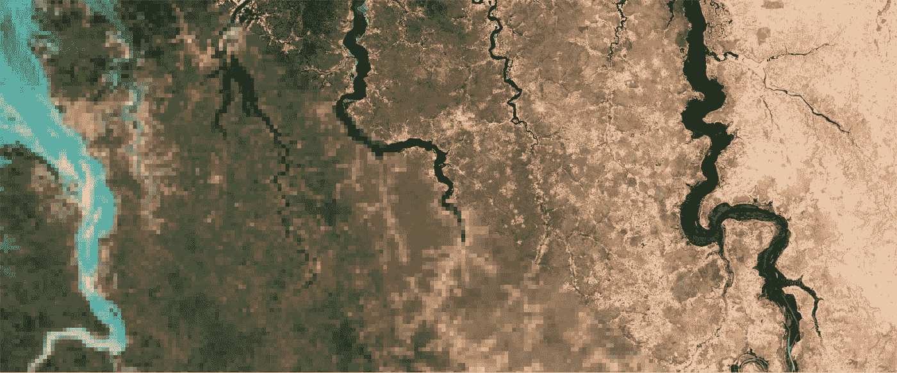
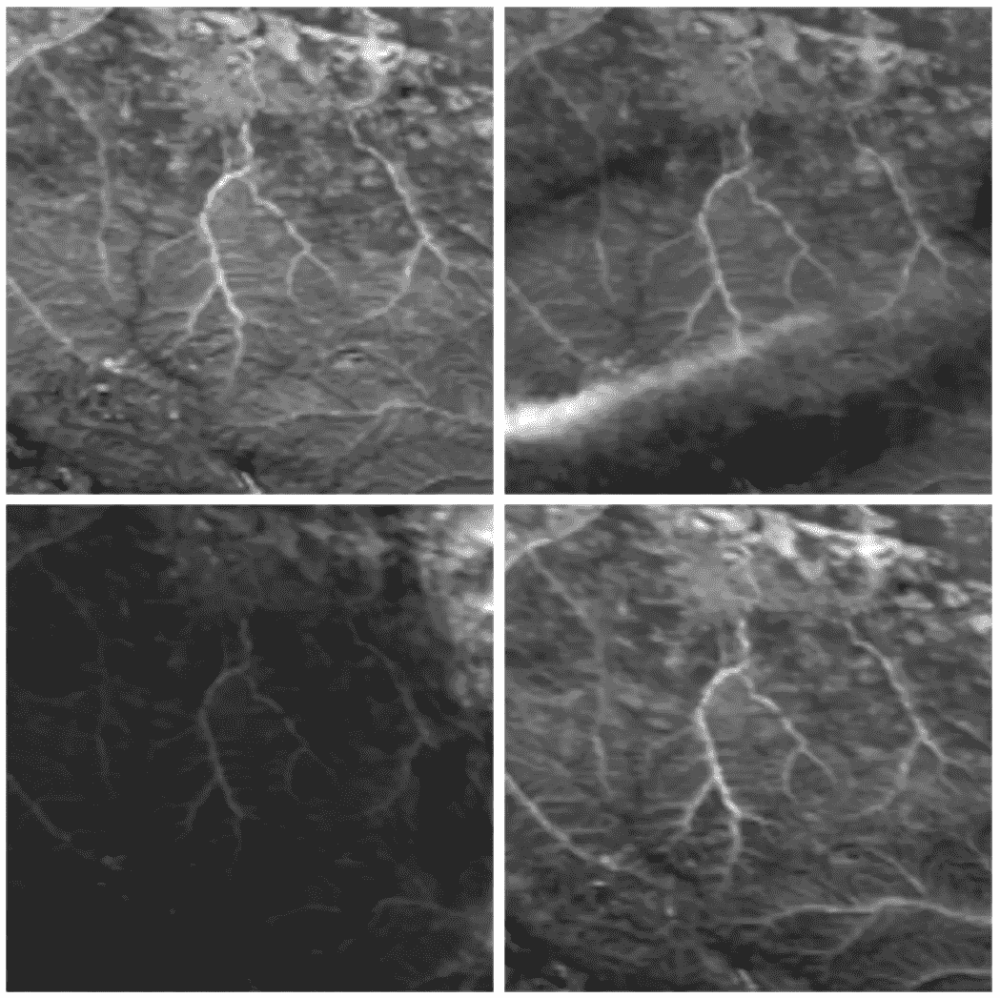
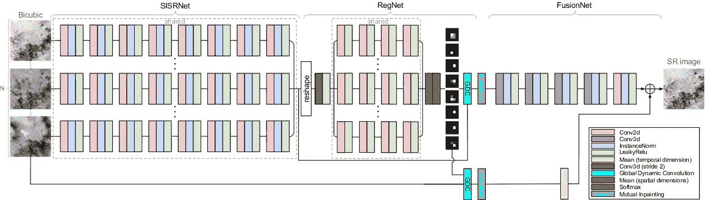
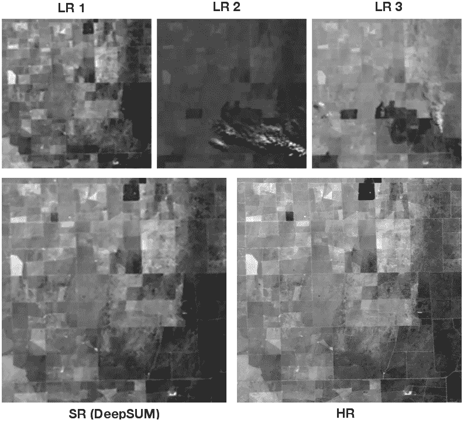

# 利用深度多时相超分辨率增强卫星图像

> 原文：<https://towardsdatascience.com/enhancing-satellite-imagery-with-deep-multi-temporal-super-resolution-24f08586ada0?source=collection_archive---------8----------------------->

## DeepSUM 赢得欧空局的 PROBA-V 超分辨率挑战

Modified ESA Copernicus Sentinel data, licenced under CC BY-SA 3.0 IGO.

“你能增强它吗？
我们多少次从电视节目中听到这种比喻，多少次嘲笑计算机怪胎能够从一幅图像中提取出如此荒谬的细节？

虽然电视节目实现的不可能的图像增强理应受到嘲笑，但实际上存在数学和物理表明有可能提高图像分辨率的场景。**多幅图像超分辨率(MISR)** 就是这种情况，强调多幅图像的使用。

MISR 拍摄了一幅图像的多个低分辨率(LR)版本，并试图将它们组合起来，以恢复场景的高分辨率(HR)版本的细节。诀窍在于 LR 图像彼此略有不同，并且由于 LR 采集而在一个图像中丢失的信息可能仍然存在于另一个图像中。

下面是一个简单的例子来说明这个原理。假设你有一个真正的高分辨率图像，像素呈棋盘状，但你只能观察到四个低分辨率图像，每个图像的高分辨率像素只有四分之一。然而，还假设第一个 LR 图像在两个方向上从 HR 图像采样奇数索引的像素，第二个 LR 图像垂直地采样偶数，水平地采样奇数，第三个采样奇数/偶数，第四个采样偶数/偶数。无需使用任何魔法，只需从 LR 图像中提取像素并以正确的顺序交错，就可以重建精确的 HR 图像！

Toy example of multi-image super-resolution.

卫星图像是 MISR 大放异彩的最好例子。地球观测卫星，如 [PROBA-V](https://www.esa.int/Our_Activities/Observing_the_Earth/Proba-V/About_Proba-V) 或 [Sentinel constellation](https://www.esa.int/Our_Activities/Observing_the_Earth/Copernicus/Overview4) ，获取同一场景的多幅图像，因为它们在轨道运行期间会定期重访该场景。这是监测环境、评估洪水等自然灾害风险或通过检测一段时间内影响一个地区的变化来了解人类活动和气候变化的影响的一项重要工作。因此，有丰富的多时相数据可用于提取更多信息，而不是查看单个图像。通过 MISR 方法提高空间分辨率有助于为科学家提供更高质量的产品。

然而，总的来说，MISR 比上面的玩具例子要困难得多。特别是，在试图合并多时卫星图像时遇到的主要问题是:

*   *未注册图像*:现有 LR 图像间的位移难以准确获知；
*   *绝对亮度变化*:虽然场景可能大致相同，但可能会因光照条件而出现不同；
*   *云*:它们可能会遮挡部分场景，它们的阴影会影响地形亮度；
*   *时间可变性*:场景内容因自然现象或人类活动而随时间变化。

Example of temporal variability. PROBA-V challenge dataset. Courtesy: ESA ACT.

# PROBA-V MISR 挑战和 DeepSUM

2018 年 11 月 1 日，欧洲航天局开始了一项[公开挑战](https://kelvins.esa.int/proba-v-super-resolution/)，以增强 PROBA-V 卫星获取的图像。PROBA-V 是一颗小型卫星，专门用于研究地球植被，其数据有助于遏制世界各地沙漠的蔓延和毁林活动。

PROBA-V 获取地面分辨率为 300 米的图像，重访时间为 1 天。然而，它也获取更高分辨率的图像(每像素 100 米)，尽管频率较低，大约每五天一幅。为这种情况开发 MISR 算法特别有趣，因为它可以通过利用更频繁的低分辨率图像来帮助提高高分辨率图像的时间可用性。

挑战赛的公共数据集正是为此而建立的。一个场景在一个月内获得的多个低分辨率图像是可用的，并且还提供了该场景的地面实况高分辨率版本。

一场激动人心的比赛开始了，许多团队贡献了他们自己的解决方案。在经历了上周的忙碌和令人难忘的通宵之后，2019 年 6 月 1 日，在 DeepSUM，都灵理工大学[图像处理和学习实验室](https://ipl.polito.it/)提出的方法成功击败了由蒙特利尔学习算法研究所(MILA)和 Element AI 成员组成的团队 *rarefin* 的激烈竞争，赢得了挑战。

[**DeepSUM**](https://arxiv.org/abs/1907.06490) 是一个端到端的可训练卷积神经网络，它处理大量低分辨率输入图像，以在其输出端提供超分辨率图像。

DeepSUM

在高层次上，网络由三个主要阶段组成:

*   SISRNet:该部分独立处理输入图像(通过双三次放大进行预处理),以提取有助于描述其内容和提高其分辨率的特征；
*   RegNet:它使用 SISRNet 学习的特征来估计将图像的特征图彼此对齐的过滤器；
*   FusionNet:它缓慢地组合所有图像的特征，以生成对双三次上采样和注册输入的平均值的残差校正。

总的来说，DeepSUM 的设计和训练是由明确解决影响我们上面讨论的遥感图像 MISR 的问题的思想来指导的。下面是解决这些问题的方法:

*   *未注册的图像* : RegNet 使用网络的特征空间而不是像素空间来解决注册问题。这些特征捕获更高层次的结构，并且对于噪声和其他复杂的扰动更加鲁棒，使得由 RegNet 产生的配准滤波器比直接从像素比较(例如，图像互相关)中导出的滤波器更好。损失函数还考虑到超分辨率图像和高分辨率地面实况可能相互偏移；
*   *绝对亮度变化*:用于训练网络的损失函数包含使其对全局亮度变化不变的项；
*   *云* : DeepSUM 支持使用质量掩码，例如由云检测器计算的二进制掩码，来指导其内部工作。特别地，遮罩用于让网络知道一些图像在哪里具有不可靠的像素，以便可以用来自其他图像的地面内容来填充它们，从而使隐藏层更加稳定。损失函数还考虑了这样一个事实，即如果所有图像在同一区域都有一个掩膜，则无法预测高分辨率地形；
*   *时间可变性* : FusionNet 使用小的 3D 卷积来学习过滤器，允许以最鲁棒的方式合并多个图像。

Example from validation set (scene: imgset0103). Top row: 3 low-resolution images. Bottom-left: DeepSUM super-resolved. Bottom-right: ground truth.

# 今后

虽然多图像超分辨率对于遥感界来说是一个非常重要的问题，正如大量科学文献所证明的那样，但很少有作品使用深度学习来解决它。欧空局的挑战提供的新数据集肯定会引起人们的兴趣，新技术将在未来几个月和几年出现。我们将期待激动人心的新发展。