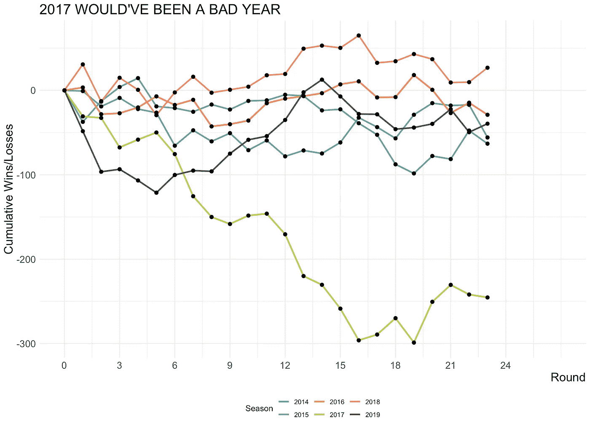
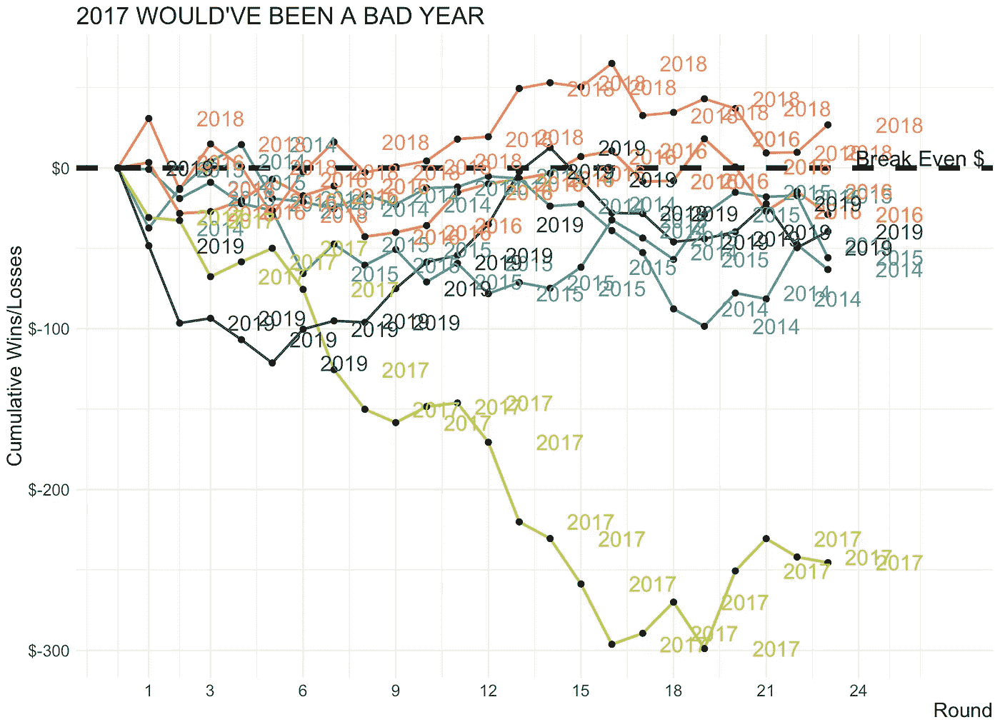
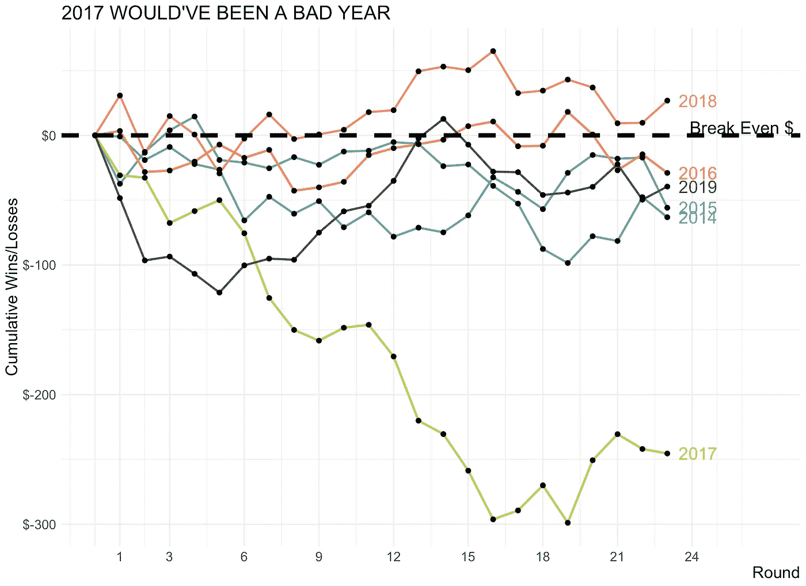
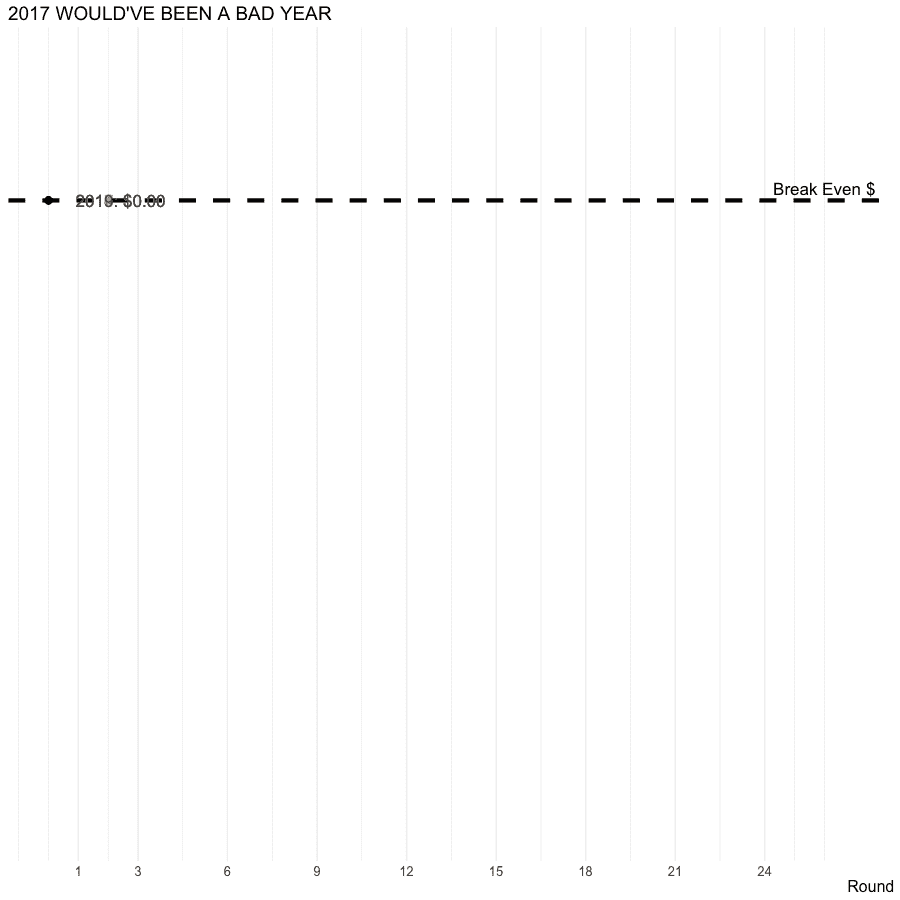

# 用动画增强静态图

> 原文：<https://towardsdatascience.com/enhancing-static-plots-with-animations-ca987801a6b0?source=collection_archive---------24----------------------->

## 使用 gganimate 增加 ggplot2 的可视化效果

这篇文章旨在向你介绍使用托马斯·林·彼得森的`gganimate`包在 r 语言中制作`ggplot2`可视化动画。

如果我按照我在这篇[帖子](https://www.dontblamethedata.com/blog/simplifying-afl-tipping/)中解释的简单模型来预测(或在澳大利亚称为 tip)AFL 的获胜者，这篇帖子将会可视化我将会获得的理论奖金。分析中使用的数据是从 AFL Tables 网站上收集的，是我写的关于 AFL 人群的一个更大系列的一部分。更广泛的项目可以在这里找到[。](https://github.com/JaseZiv/AFL-Crowd-Analytics)

```
library(tidyverse)
library(lubridate)
library(scales)
library(gganimate)# set themes
theme_set(theme_minimal() +
 theme(axis.title.x = element_text(size = 16, hjust = 1), 
 axis.title.y = element_text(size = 16), 
 axis.text = element_text(size = 13),
 plot.title = element_text(size = 19)))# create a colour pallette
colours <- c(“#5EB296”, “#4E9EBA”, “#F29239”, “#C2CE46”, “#FF7A7F”, “#4D4D4D”)# — — — Read in data — — -#
afl <- read.csv("[https://raw.githubusercontent.com/JaseZiv/AFL-Crowd-Analytics/master/data/cleaned_data/afl_model_data.csv](https://raw.githubusercontent.com/JaseZiv/AFL-Crowd-Analytics/master/data/cleaned_data/afl_model_data.csv)", stringsAsFactors = F)# Data pre-processing — — — — — — — — — — — — — — — — — — — — — — — — — — -# make all variables character type to make splitting and string manipulation easier
afl <- afl %>% 
 mutate_if(is.factor, as.character) %>% 
 mutate(team1_score = as.numeric(team1_score),
 team2_score = as.numeric(team2_score)) %>% 
 mutate(fav_team = ifelse(AwayLineClose < 0, team2, team1)) %>% 
 mutate(winning_team = ifelse(winner == “Home”, team1, ifelse(winner == “Away”, team2, “Draw”))) %>% 
 mutate(fav_win = ifelse(fav_team == winning_team, “Yes”, “No”)) %>% 
 filter(season >= 2014,
 !str_detect(round, “F”)) %>%
 mutate(tip = ifelse(abs(AwayLineClose) < 3, team1, fav_team))# function to calculate odds
calculate_odds_available <- function(tip, winning_team, team1, team2, HomeOddsClose, AwayOddsClose) {
 if(tip == winning_team) {
 odds_available <- ifelse(tip == team1, HomeOddsClose, AwayOddsClose)
 } else {
 odds_available <- 0
 }
}# apply function and calculate returns
afl <- afl %>% 
 mutate(odds_available = mapply(calculate_odds_available, tip, winning_team, team1, team2, HomeOddsClose, AwayOddsClose),
 game_return = odds_available * 10,
 game_profit = game_return — 10)# create a df that calculates total winnings per round
money_per_round <- afl %>% 
 group_by(season, round) %>% 
 summarise(total_profit = sum(game_profit)) %>% ungroup()# add a round 0, where all seasons start at $0
zeros <- data.frame(season = (2014:2019), round = 0, total_profit = 0)# join zeros df on to money_per_round
money_per_round <- money_per_round %>% rbind(zeros)# create a df that sums up winnings cumulatively
total_money <- money_per_round %>% 
 arrange(season, round) %>% 
 group_by(season) %>% 
 mutate(cumulating_winnings = cumsum(total_profit)) %>% ungroup()
```

## 我们开始吧

好的，所以当我写第一篇文章的时候，我采取的第一步是创建一个 ggplot2 可视化来绘制我使用我的简单策略会得到的收益(或损失)。

这是结果:

```
total_money %>%
 ggplot(aes(x= round, y= cumulating_winnings, 
 group = season, colour = as.character(season))) +
 geom_line(size = 1) +
 geom_point(size = 2, colour = “black”) +
 labs(x= “Round”, y= “Cumulative Wins/Losses”, colour = “Season”) +
 scale_x_continuous(limits = c(0, 27), 
 labels = c(0, 3, 6, 9, 12, 15, 18, 21, 24), 
 breaks = c(0, 3, 6, 9, 12, 15, 18, 21, 24)) +
 scale_colour_manual(values = colours) +
 ggtitle(“2017 WOULD’VE BEEN A BAD YEAR”) +
 theme(legend.position = “bottom”)
```



The legend is hard to follow here

还不错，但肯定可以改进。在我看来，随着六季的绘制，这个传说很难映射到这条线本身。还有，除了 2017 赛季特别差，其他赛季轮次之间的变化很难看到。

此外，以这种方式绘制数据，如果不花费太多精力关注我在哪里会赚钱，在哪里会赔钱，就很难实现。

## 标签和注释

呸——你不能简单地把季节加为标签——你什么都看不到！

```
total_money %>%   
ggplot(aes(x= round, y= cumulating_winnings, **group** = season, colour = **as**.character(season))) +   
geom_line(size = 1) +   
geom_point(size = 2, colour = "black") +   
geom_hline(yintercept = 0, linetype = 2, size = 2) + **# added in horizontal line at $0**   
geom_text(aes(label = season), hjust = -1, size = 6) + **# season labels added**   
scale_colour_manual(values = colours) +   
labs(x= "Round", y= "Cumulative Wins/Losses") +   scale_x_continuous(limits = c(0, 27), labels = c(1, 3, 6, 9, 12, 15, 18, 21, 24), breaks = c(1, 3, 6, 9, 12, 15, 18, 21, 24)) +   scale_y_continuous(labels = dollar) + **# y-axis formatted to dollar format using scales**   
annotate("text", x= 26, y= 6, label = "Break Even $", size = 6) + **# added text to break even line**   
ggtitle("2017 WOULD'VE BEEN A BAD YEAR") +   
theme(legend.position = "none") **# turned legend off**
```



That didn’t work!

相反，只有一个季节标签适用，并适用于每条线的运行结束。这个看起来好多了。

如我们所见，静态图表中添加了更多元素，包括:

*   添加盈亏平衡线；
*   将 y 轴格式化为美元格式；和
*   添加标签和移除图例

这大大提高了剧情的可读性。

```
total_money %>% 
ggplot(aes(x= round, y= cumulating_winnings, **group** = season, colour = **as**.character(season))) + 
geom_line(size = 1) + 
geom_point(size = 2, colour = “black”) + 
geom_hline(yintercept = 0, linetype = 2, size = 2) + **# added in horizontal line at $0** 
geom_text(data = total_money %>% filter(round == max(round)), aes(label = season), hjust = -0.3, size = 6) + **# season labels added, but only one label per season** 
scale_colour_manual(values = colours) + 
labs(x= “Round”, y= “Cumulative Wins/Losses”) + scale_x_continuous(limits = c(0, 27), labels = c(1, 3, 6, 9, 12, 15, 18, 21, 24), breaks = c(1, 3, 6, 9, 12, 15, 18, 21, 24)) + scale_y_continuous(labels = dollar) + **# y-axis formatted to dollar format using scales** 
annotate(“text”, x= 26, y= 6, label = “Break Even $”, size = 6) + **# added text to break even line** 
ggtitle(“2017 WOULD’VE BEEN A BAD YEAR”) + 
theme(legend.position = “none”) **# turned legend off**
```



Looking better…

## 你好动画！

虽然上面的图表看起来好多了，但没有夸张！

输入来自`gganimate`的动画！

使用动画情节允许我们删除更多的元素。通过标签和动画的正确组合，y 轴不再是必要的——在每一轮中，我们可以跟踪我们的输赢，而盈亏平衡线为我们提供了一个参考点。

这里做的其他事情包括使用`fps`(每秒帧数)减慢帧的速度，并将`transition_reveal()`中的`range`调整为比它转换的回合长(即调整范围为`c(0,25)`)。这允许动画在完成循环后暂停。

最后，为了增加输出的大小，根据您的喜好调整`width`和`height`参数。

```
total_money_anim <-  total_money %>%   
ggplot(aes(x= round, y= cumulating_winnings, **group** = season, colour = **as**.character(season))) +   
geom_line(size = 2) +   
geom_point(size = 3, colour = "black") +   
geom_hline(yintercept = 0, linetype = 2, size = 2) +   geom_text(aes(label = paste0(season, ": ", dollar(cumulating_winnings))), hjust = -0.3, size = 6) +   scale_colour_manual(values = colours) +   
labs(x= "Round", y= "Cumulative Wins/Losses") +   scale_x_continuous(limits = c(0, 27), labels = c(1, 3, 6, 9, 12, 15, 18, 21, 24), breaks = c(1, 3, 6, 9, 12, 15, 18, 21, 24)) +   scale_y_continuous(labels = dollar) +   
annotate("text", x= 26, y= 6, label = "Break Even $", size = 6) +   ggtitle("2017 WOULD'VE BEEN A BAD YEAR") +   
theme(legend.position = "none", axis.text.y = element_blank(),          axis.title.y = element_blank(), panel.grid.major.y = element_blank(), panel.grid.minor.y = element_blank()) +   transition_reveal(round, range = c(0, 25)) animate(total_money_anim, width = 900, height = 900, fps = 5)
```



Animations make things so much better

希望这给了你一些灵感，让你开始制作一些你自己的动画形象。

如果你有任何问题或建议，请在评论中告诉我。

***本帖原创，发布在不怪数据博客***[***【https://www.dontblamethedata.com】***](https://www.dontblamethedata.com/)