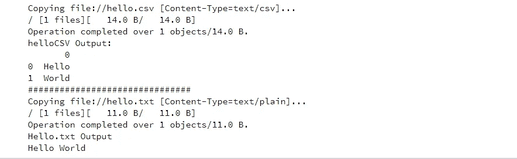

# 开明的数据实验室笔记本

> 原文：<https://towardsdatascience.com/enlightened-datalab-notebooks-35ce8ef374c0?source=collection_archive---------13----------------------->

> 具有专用存储桶、IAM 权限和安全防火墙配置


Photo by [Tim Gouw](https://unsplash.com/@punttim?utm_source=medium&utm_medium=referral) on [Unsplash](https://unsplash.com?utm_source=medium&utm_medium=referral)

通往云计算专业知识的道路充满了令人苦恼的漫长下午，以及无数未完成的博客帖子。当您想要快速启动一个虚拟机，并在浏览器中从笔记本开始使用 Python 时，您经常会遇到这些挫折。*为什么我不能写我的桶？是什么阻止笔记本在我的浏览器中工作？* *为什么 SSH 进入机器看不到任何文件？甚至可能是“Docker 是什么？”*

本文旨在帮助其他数据科学家，他们正在冒险进入谷歌计算平台(“GCP”)堆栈，或者可能在开始新的 Kaggle 竞争时重新访问它。关注我在 Twitter 上的 [#FullStackDS](https://twitter.com/search?f=tweets&vertical=default&q=%23FullStackDS&src=typd&qf=off) 帖子，获取类似的帖子。

DataLab 笔记本是 GCP 的产品，用于从私有环境连接到谷歌计算引擎(“GCE”)实例(或 VM)。它使用了 Jupyter Notebook 的基础设施和 Docker，并且可以链接到 R/Julia/Python/Bash 等中的其他内核。——如果你想变得非常奇特。设置 DataLab 笔记本的技巧在于配置防火墙、IAM 权限以及理解一些独特的 Linux 命令。我还没有找到一篇解决这些复杂问题的文章。一旦你克服了这个困难，旋转起来就非常容易了。让我们通过一个完整的可重复设置来引导您。


# **设置您的项目**

在我们开始之前，如果你还没有在 GCP 设立账户，你会想要的。对于首次用户，有 300 美元的信用和 12 个月的免费试用。要不，我们开始吧[https://console.cloud.google.com](https://console.cloud.google.com)。

从左上角的“汉堡包菜单”(*看起来像汉堡包)，我们将从主菜单中选择主页。接下来，让我们使用主页上的“创建项目”(下面突出显示)。创建项目允许用户在共享环境中创建多个虚拟机。它还允许分开计费。


接下来，从`New Project`页面，我们将我们的项目命名为“DistributedScraping ”,并单击`CREATE.`


在主屏幕上，你应该会在下拉列表中看到项目`DistributedScraping`。我们还想从页面的右上方打开免费的云外壳，下面用绿色圈起来——它还没有连接到任何 GCE 实例。请注意，黑色命令行云 Shell 本身是一个免费的 Linux 机器，我们将使用它来设置防火墙、IAM 权限，并从中创建 DataLab 笔记本。


# 为私人浏览器访问设置防火墙

在启动 DataLab GCE 实例之前，我们需要设置对 localhost 网关的访问，该网关在 GCP 项目中受到保护，并通过安全的 SSH 连接进行链接。默认情况下，DataLab 同时使用端口 8081 和 22。源范围设置为“0.0.0.0/0”，这允许在每次重新启动后链接到您的笔记本—每次启动和停止 DataLab Docker 实例时都会创建一个新的外部 IP。在更高级的设置中，我们可以分配一个固定的外部 IP，并为其分配一个源范围。我们将在下面的 on 命令中建立防火墙规则。


在 Google Cloud Shell 中，在一长行中输入 Github Gist 中的代码。上面的代码突出显示了项目名称和防火墙规则名称。

接下来，我们需要从开放云 Shell 配置我们当前的项目:

# 启动数据实验室笔记本

下表显示了机器类型名称的成本/尺寸。我们将在这里创建一个 8 核低内存机器，每小时 23 美元。我们可以通过使用另一个 linux 标志来获得更低的可抢占价格——我不会在这里深入讨论。您可以通过访问此[链接](https://cloud.google.com/compute/docs/machine-types)来选择您自己的机器类型。在我的下一篇文章中，我们将探索来自 DataLab 的高级抓取——包括来自 Python 的并行代理和 selenium 抓取，因此我们希望使用比标准双核机器更大的实例。


在云 Shell 中运行下面的代码，创建您的 DataLab GCE 实例，用一个轻量级的 [Docker](https://opensource.com/resources/what-docker) 容器包装；它包括“us-west1-a”地区的一台 8 CPU/核心计算机，名称为“iptest”:

运行上面的 linux 行之后，我们将看到下面的输出。通过在云外壳中单击，访问用绿色圈出的 enable API 链接。这将启动一个新的浏览器选项卡，并根据您的 GCP 受保护环境提供对新创建的虚拟机的访问。


选择 ENABLE 按钮后，在您的云 Shell 中再次输入相同的命令来创建机器。不知道为什么这需要两步…？

输出应该如下所示，这将传播您的 SSH 密钥并设置您的 GCE DataLab 实例。接下来，单击 Web Preview 按钮(下面用绿色圈出)，将端口从“8080”(默认)更改为“8081”，然后选择 LAUNCH AND PREVIEW 链接(步骤如下所示)。


您也可以不使用上述方法从浏览器重定向。只需将下面的链接粘贴到您的浏览器中，或者在云外壳文本的输出中找到它。我发现我必须尝试几次，才能让安全重定向生效。保持耐心！会有用的…

[http://localhost:8081/](https://ssh.cloud.google.com/devshell/proxy?authuser=0&devshellProxyPath=%2F&port=8081)

# 探索您的数据实验室笔记本

选择+NOTEBOOK 按钮(下面用绿色圈起来的)，启动一个新的“Untitled Notebook.ipynb”。我们将在下面浏览几个 Hello World 示例，在这些示例中，我将向您展示如何设置对您的 DataLab 存储(“存储桶”)的读/写访问权限，该存储桶是自动创建的，自动备份在与您的虚拟机同名的文件夹下。

运行下面的…


从新启动的选项卡中，我们需要选择右上方的下拉内核，从工作簿中选择 Python3。注意，由于某种原因，当前默认设置为 Python2(？).现在，在键盘上使用`Shift + Enter`，从`print('hello world')`函数之后的第一个单元格(代码块)开始。瞧，成功了！“你好世界！”。

让我们设置对我们新创建的 bucket‘distributed scrpping’的读/写访问，您可以访问 Hamburger > > Storage > > Browser extension。

在这里，我们需要访问我们的“GCE 电子邮件”,作为“服务帐户”进行绑定。在您的云 Shell 中运行下面的`gcloud`命令，手动在文本输出中搜索 *serviceAccounts:email* ，并在接下来的 Linux 命令中使用。

现在，我们将服务帐户绑定到自动创建的 DataLab bucket。

现在让我们升级游戏，尝试一个高级的 *helloworld，w* 将一个 *CSV* 和 *TXT* 写入我们的桶中，并用 Python 将它们读回到 DataLab 笔记本中。注意，那个“！”在行首，是穿插 Python 代码的单行 bash 脚本(非常酷！).

在浏览器中将以下代码输入到您新创建的笔记本中。

输出:



如果你想扩展这种探索，谷歌有一个很棒的 YouTube 视频[ [Datalab:云中的笔记本(AI Adventures)](https://www.youtube.com/watch?v=Eu57QKNHaiY&t=600s) ]，它涉及到使用谷歌的 *BigSQL* 分布式关系数据库产品 BigQuery 进行读/写/管理。

注意:每小时/每天/每周自动备份`iptest`存储桶。即使您删除了您的 DataLab 虚拟机，这种情况仍会存在。我不确定我们能在哪里控制这个特性；请注意，这种数据存储是有象征性成本的。


# 检查虚拟机状态并关闭

从主屏幕左上角的汉堡图标，导航至计算引擎>>虚拟机实例。这里您将看到`iptes`，我们的 DataLab GCE 实例正在运行(注意绿色的勾号)。即使您关闭了选项卡，GCE 实例也会继续计费。记住选中机器上带有蓝色箭头的框，然后在每次使用完实例后停止机器(从页面的右上角开始)!

另请注意，每次重启时，您都必须重新安装 Linux 软件包和更新，但您将保留备份在`distributedscraping/iptest`桶中的所有数据——可以通过存储> >浏览器扩展从汉堡图标访问这些数据。


确保确认您的实例已停止(灰显)。


# **停机后重新连接。**

在云 Shell 中，启动之后，只需运行下面的 linux 命令来重新启动 DataLab。同样，连接到`iptest`后，您可以通过 [http://localhost:8081/](https://ssh.cloud.google.com/devshell/proxy?authuser=0&devshellProxyPath=%2F&port=8081) 访问笔记本电脑。

```
datalab connect iptest
```

如果您出于任何原因需要 SSH 到机器，请在本地机器上使用下面的 from SDK 命令，或者在浏览器中使用 Cloud Shell。注意，您在这里找不到任何文件，因为它们都是通过 project bucket 链接的。这也适用于没有安装 DataLab 笔记本 Docker 映像的一般 GCE 实例——并允许在该上下文中进行`ls`探索。

```
gcloud compute ssh 'iptest' --zone=us-west1-a 
            --ssh-flag='-D' --ssh-flag='10000' --ssh-flag='-N'
```

# 你现在自由了！


Photo by [Jünior Rodríguez](https://unsplash.com/@juniorrodriguez?utm_source=medium&utm_medium=referral) on [Unsplash](https://unsplash.com?utm_source=medium&utm_medium=referral)

感谢您花时间完成本次探索。这应该可以让您开始使用 DataLab 笔记本电脑。我让您深入研究连接到远程实例的细节，为您的特定需求设置权限，并以可重复的方式分享您的发现。像往常一样，使用此处的所有内容需要您自担风险。在下一篇文章中，您将很快成为一名网页抓取忍者。\\\

> [**无头、分布式、虚拟(啊呀！)**:data lab 笔记本中使用 Python 进行的无畏网络抓取](/virtual-headless-distributed-6c7ebef25a96)