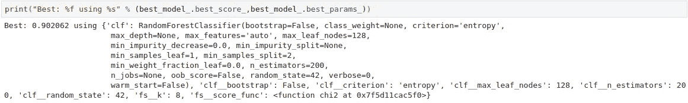
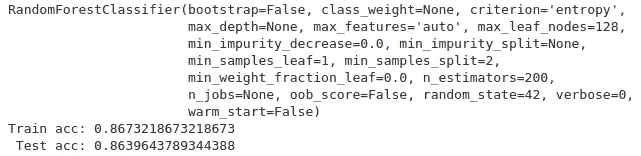

# 集成学习:来自 1994 年美国人口普查数据库的案例研究

> 原文：<https://towardsdatascience.com/ensemble-learning-a-case-study-from-the-1994-us-census-database-8180342819fe?source=collection_archive---------24----------------------->


Photo by 3dman_eu via [Needpix](https://www.needpix.com/photo/489798/map-usa-flag-borders-country-states-of-america-land-borders-free-pictures-free-photos).

在我们开始理解什么是**集成学习**以及它是如何工作的之前，我们需要知道在这个案例研究中使用的数据集。

使用的数据集是 **1994 年美国人口普查数据库**的子集，该数据库由 *Barry Becker* 提供，可在 [UCI 机器学习库](http://archive.ics.uci.edu/ml/datasets/Adult)获得。该库的预测任务是确定一个 ***人一年的收入是否超过 50K***，为此提供了以下属性和值:

*   **高收入**:目标阶层。
*   **年龄**:连续。
*   **工作类别**:私人，自我雇佣非公司，自我雇佣公司，联邦政府，地方政府，州政府，无薪，从未工作。
*   fnlwgt :连续。
*   **教育**:学士、部分大学、11 年级、HS-grad、Prof-school、Assoc-acdm、Assoc-voc、9 年级、7-8 年级、12 年级、硕士、1-4 年级、10 年级、博士、5-6 年级、学前教育。
*   **教育编号**:连续。
*   **婚姻状况**:已婚配偶、离婚、未婚、分居、丧偶、无配偶、已婚配偶。
*   职业:技术支持、工艺修理、其他服务、销售、行政管理、专业、搬运工人、清洁工、机器操作员、检查员、行政文员、农业、渔业、运输、私人服务、保安服务、武装部队。
*   **关系**:妻子、亲生子女、丈夫、非家庭成员、其他亲属、未婚。
*   种族:白人，亚洲太平洋岛民，美洲印第安爱斯基摩人，其他人，黑人。
*   **性别**:女，男。
*   **资本收益**:持续。
*   **资本损失**:持续。
*   **每周小时数**:连续。
*   **本土国家**:美国、柬埔寨、英国、波多黎各、加拿大、德国、美国外围地区(关岛-USVI 等)、印度、日本、希腊、韩国、中国、古巴、伊朗、洪都拉斯、菲律宾、意大利、波兰、牙买加、越南、墨西哥、葡萄牙、爱尔兰、法国、多米尼加共和国、老挝、厄瓜多尔、台湾、海地、哥伦比亚、匈牙利、危地马拉、尼加拉瓜、苏格兰、泰国、南斯拉夫、萨尔瓦多、特立尼达岛&多巴哥、秘鲁、香港、荷兰。

# 什么是集成学习？


Photo via [Verde Valley Nursery](http://www.verdevalleynursery.com/tree/)

> *集成学习*是一种结合其他机器学习模型来优化和创建更好模型的技术。

有一些不同类型的集合方法，如:助推，堆叠，**粘贴，装袋**和**随机森林**。在本案例研究中，重点是最后两种方法。

# 装袋粘贴:是什么？它是如何工作的？


Photo via [Giphy](https://giphy.com/gifs/season-12-the-simpsons-12x17-3orieTU2tBje4i5SzS)

***B****ootstrap****Agg****regat****ing***或 ***Bagging*** 是一种结合了自举和聚合方法的技术。第一种方法是用替换将数据集分成 n 个子集，第二种方法的思想是创建 n 个模型，每个子集一个模型，然后将它们聚集在一起以产生最终预测。

**粘贴**方法的工作原理与装袋相似，但不同之处在于引导步骤，在该步骤中，分割是在没有替换的情况下进行的。

# 那随机森林呢？


Photo via [Dribbble](https://dribbble.com/shots/2408458-Mario-Blocks)

随机森林是一种特殊类型的集成算法，它使用多个**决策树**来构建其模型。每棵树都用数据集的不同部分来训练。通常，这种分割与 bagging 技术类似，最终模型由几个决策树模型组成，这些模型组合起来产生模型的预测。

# 嗷，该编码了！


Via [Github](https://camo.githubusercontent.com/d8ad845585368b53a7e79c7bd89c401df6c8cdd1/687474703a2f2f692e67697068792e636f6d2f4d50436763613145755a6c4c692e676966)

对于这个项目，我们将使用 **python** 作为编程语言，库: **pandas** 和 **scikit-learn** 。首先，让我们了解一下我们数据的*面*:

```
# load the dataset
income = pd.read_csv("income.csv")
income.head()
```


在继续之前，我们需要对数据进行预处理，将分类变量转换为数值变量。在这个过程之后，这是一个数据样本:


现在，我们将使用两个伟大的 scikit-learn 特性，称为*管道*和 *GridSearchCV* ，它们允许我们自动测试不同模型的几个超参数。

```
# split-out train/validation and test dataset
X_train, X_test, y_train, y_test = train_test_split(income.drop(labels="high_income",axis=1),                                                    income["high_income"],test_size=0.20,random_state=seed,shuffle=True,stratify=income["high_income"])
```

```
# The full pipeline as a step in another pipeline with an estimator as the final step
pipe = Pipeline(steps = [("clf",RandomForestClassifier())])# create a dictionary with the hyperparameters
search_space = [{"clf":[DecisionTreeClassifier()],
                 "clf__criterion": ["gini","entropy"],
                 "clf__splitter": ["best","random"],
                 "clf__random_state": [seed],
                 "fs__score_func":[chi2],
                 "fs__k":[4,6,8]},
                {"clf":[RandomForestClassifier()],
                 "clf__n_estimators": [200,300],
                 "clf__criterion": ["gini","entropy"],
                 "clf__max_leaf_nodes": [32,64,128],
                 "clf__random_state": [seed],
                 "fs__score_func":[chi2],
                 "fs__k":[4,6,8]},
                {'clf' [BaggingClassifier(DecisionTreeClassifier(random_state=42))],
                 "clf__base_estimator__criterion": ['gini','entropy'],
                 "clf__base_estimator__splitter": ['best','random'],
                 "clf__oob_score": [True],
                 "clf__n_estimators": [200,300],
                 "clf__bootstrap":[True],
                 "fs__score_func":[chi2],
                 "fs__k":[4,6,8]},
                {'clf': [BaggingClassifier(DecisionTreeClassifier(random_state=42))],
                 "clf__base_estimator__criterion": ['gini','entropy'],
                 "clf__base_estimator__splitter": ['best','random'],
                 "clf__oob_score": [False],
                 "clf__n_estimators": [200,300],
                 "clf__bootstrap":[False],
                 "fs__score_func":[chi2],
                 "fs__k":[4,6,8]}]# create grid search
kfold = KFold(n_splits=num_folds,random_state=seed)grid = GridSearchCV(estimator=pipe, 
                    param_grid=search_space,
                    cv=kfold,
                    scoring=scoring,
                    return_train_score=True,
                    n_jobs=-1,
                    refit="AUC", verbose=10)
```

```
# fit grid search
best_model = grid.fit(X_train,y_train)
```

这种配置允许算法使用所有可用的核心，这将以并行方式测试 960 个不同配置的决策树、随机森林和 bagging 分类器(以决策树作为内部模型)。

在此过程之后，GridSearchCV 生成的最佳模型是一个随机森林模型，具有以下配置:



在我们定义这是否是最佳模型之前，让我们检查模型的准确性以训练和测试数据集。这种比较的目的是验证模型是**欠配**还是**过配**。



正如我们在上面看到的，两个集合的精度都很好，更重要的是，训练和测试精度的值非常接近。因此，这个结果表明 GridSearchCV 产生的最佳模型具有很好的通用性。

在随机森林分类器中，我们可以设置一个名为 **bootstrap** 的超参数，它定义天气样本是否将被替换训练。尽管选择的最佳模型的参数为*假*，这试图帮助模型最小化**过拟合**的机会，但当参数设置为**真、**时，其他几个模型也呈现出类似的结果，如下图所示。


因此，对于这个数据集，不管 bootstrap 变量的值如何，我们都取得了很好的结果。然而，由于可能的过度拟合，bootstrap 等于 true 时会出现最坏的结果。

# 了解特性的重要性


Via [Giphy](https://giphy.com/gifs/season-12-the-simpsons-12x17-xT5LMF4nsy5F8lvxGU)

现在，让我们检查数据集的每个特征对于我们的模型的重要性。对于这个任务，我们使用了两个工具:特征重要性，来自随机森林分类器和库**SHAP***(****SH****apley****A****加性 ex****P****lanations)*其中是解释任何机器输出的统一方法


左图由 scikit-learn 的 feature_importances 制作，右图由 SHAP 制作。重要的是要看到两个结果呈现相似的结果，并且 4 个最重要的特征是相同的，仅改变了位置。有了这些结果，就很容易知道对模型影响最大的信息，这极大地有助于理解和解决问题。