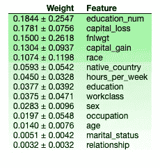

# 集成学习案例研究:模型可解释性

> 原文：<https://towardsdatascience.com/ensemble-learning-and-model-interpretability-a-case-study-95141d75a96c?source=collection_archive---------23----------------------->

这是一篇由两部分组成的文章的第一部分，在这篇文章中，我们将探索 1994 年人口普查收入数据集 ，它包含诸如**年龄**、**受教育年限**、**婚姻状况**、**种族、**以及许多其他信息。我们将使用该数据集将人们的潜在收入分为两类:年收入低于或等于 5 万美元的人(编码为 0)和年收入高于 5 万美元的人(编码为 1)。

在第一部分中，我们将使用这个数据集来比较简单决策树和集成方法的性能。稍后，我们还将探索一些工具来帮助我们解释为什么模型遵循**可解释的人工智能(XAI)** 的一些原则来做出决策。

我们需要做的第一件事是看一看选择的数据集，以便更好地了解它。所以，让我们开始吧！

# 1.准备数据

我们将使用没有空值的数据集的预处理版本。首先，我们加载基本库和数据集本身，并查看数据帧信息:

```
import   as np
import pandas as pd
import matplotlib.pyplot as plt
import seaborn as sns
plt.style.use('ggplot')# load the dataset
income = pd.read_csv("income.csv")
income.info()
```


**Figure 1:** DataFrame information

如我们所见，数据集有 32561 个观察值和 15 列，其中 14 列是特征，一列是目标变量( **high_income** )。有些特征是分类的(类型**对象**)有些是数值的(类型 **int64** )，所以我们需要为它们执行不同的预处理步骤。

为了实现这一点，我们将创建两个**管道**:一个对分类特征执行预处理步骤，另一个对数字特征执行预处理步骤。然后，我们将使用 **FeatureUnion** 将这两条管道连接在一起，形成最终的预处理管道。为此以及本文中的后续步骤，我们需要从 scikit-learn 库中导入必要的模块:

```
from sklearn.base import BaseEstimator
from sklearn.base import TransformerMixinfrom sklearn.preprocessing import StandardScaler
from sklearn.preprocessing import FunctionTransformerfrom sklearn.pipeline import Pipeline
from sklearn.pipeline import FeatureUnionfrom sklearn.model_selection import train_test_split
from sklearn.model_selection import cross_val_score
from sklearn.model_selection import KFold
from sklearn.model_selection import StratifiedKFold
from sklearn.model_selection import RandomizedSearchCVfrom sklearn.metrics import make_scorer
from sklearn.metrics import accuracy_score
from sklearn.metrics import classification_report
from sklearn.metrics import confusion_matrixfrom sklearn.tree import DecisionTreeClassifier
from sklearn.ensemble import RandomForestClassifier
from sklearn.ensemble import BaggingClassifier
```

使用 **BaseEstimator** 和**transformer mixin**类，我们可以创建两个定制的转换程序放在我们的管道上:一个将数据分成分类和数字特征，另一个预处理分类特征。这两种变压器如下所示:

```
# Custom Transformer that extracts columns passed as argument
class FeatureSelector(BaseEstimator, TransformerMixin):
    #Class Constructor 
    def __init__(self, feature_names):
        self.feature_names = feature_names #Return self nothing else to do here    
    def fit(self, X, y = None):
        return self #Method that describes what we need this transformer to do
    def transform(self, X, y = None):
        return X[self.feature_names]# converts certain features to categorical
class CategoricalTransformer( BaseEstimator, TransformerMixin ):
    #Class constructor method that takes a boolean as its argument
    def __init__(self, new_features=True):
        self.new_features = new_features #Return self nothing else to do here    
    def fit( self, X, y = None ):
        return self #Transformer method we wrote for this transformer 
    def transform(self, X , y = None ):
        df = X.copy()
        if self.new_features:
            # Treat ? workclass as unknown
            df['workclass']= df['workclass'].replace('?','Unknown') 
            # Two many category level, convert just US and Non-US
            df.loc[df['native_country']!=' United-States','native_country'] = 'non_usa'
            df.loc[df['native_country']==' United-States','native_country'] = 'usa' # convert columns to categorical
        for name in df.columns.to_list():
            col = pd.Categorical(df[name])
            df[name] = col.codes # returns numpy array
        return df
```

有了这些定制的转换器，我们就可以构建预处理管道。我们需要做的第一件事是创建 **X** 特征矩阵和 **y** 目标向量:

```
# Create the X feature matrix and the y target vector
X = income.drop(labels="high_income", axis=1)
y = income["high_income"]# the only step necessary to be done outside of pipeline
# convert the target column to categorical
col = pd.Categorical(y)
y = pd.Series(col.codes)# global variables
seed = 108
```

之后，我们提取分类和数字特征名称，并在定义了要在每个特征中使用的步骤之后创建 2 个管道。对于分类管道，我们使用 **FeatureSelector** 只选择分类列，然后使用 **CategoricalTransformer** 将数据转换成所需的格式；至于数字管道，我们也将使用 **FestureSelector，**这次只选择数字特征，随后使用 as **StandardScaler** 来标准化数据。代码如下所示:

```
# get the categorical feature names
categorical_features = X.select_dtypes("object").columns.to_list()
# get the numerical feature names
numerical_features = X.select_dtypes("int64").columns.to_list()# create the steps for the categorical pipeline
categorical_steps = [
    ('cat_selector', FeatureSelector(categorical_features)),
    ('cat_transformer', CategoricalTransformer())
]# create the steps for the numerical pipeline
numerical_steps = [
    ('num_selector', FeatureSelector(numerical_features)),
    ('std_scaler', StandardScaler()),
]# create the 2 pipelines with the respective steps
categorical_pipeline = Pipeline(categorical_steps)
numerical_pipeline = Pipeline(numerical_steps)
```

现在我们可以使用 **FeatureUnion** 类来水平连接这两个管道，这样我们最终只有一个最终预处理管道:

```
pipeline_list = [
    ('categorical_pipeline', categorical_pipeline),
    ('numerical_pipeline', numerical_pipeline)
]# Combining the 2 pieplines horizontally into one full pipeline 
preprocessing_pipeline =FeatureUnion(transformer_list=pipeline_list)
```

就这样，现在你所要做的就是对数据执行所有预处理步骤，调用**预处理 _ 管道**对象的 **fit_transform** 方法，将 **X** 矩阵作为参数传递！简洁明了。

# 2.训练第一个模型

在训练任何机器学习模型之前，我们必须将数据分成**训练**和**测试**组。为此，我们使用**训练 _ 测试 _ 分割**功能:

```
# split-out train/validation and test dataset
X_train, X_test, y_train, y_test = train_test_split(X, y, test_size=0.20, random_state=seed, shuffle=True, stratify=y)
```

我们将使用的第一个模型是一个简单的**决策树分类器**。为了充分利用**管道的全部功能，**我们可以创建一个完整的管道，第一步通过预处理管道，第二步通过所需的分类模型:

```
# we pass the preprocessing pipeline as a step to the full pipeline
full_pipeline_steps = [
    ('preprocessing_pipeline', preprocessing_pipeline),
    ('model', DecisionTreeClassifier(random_state=seed))
]# create the full pipeline object
full_pipeline = Pipeline(steps=full_pipeline_steps)
```

通过这种方式，如果我们想要尝试不同的模型(正如我们稍后将要做的)，我们所要做的就是更新这个管道的**‘model’**步骤！

下一步是使用 **RandomizedSearchCV** 执行模型超参数调整。随机搜索不如常规网格搜索彻底，因为它不会测试超参数的每个可能组合。另一方面，它的计算成本更低，使我们能够在低端硬件中实现**“足够好”**的结果，同时调整多个超参数。使用 **n_iter** 参数，我们将迭代次数限制为 **50。**

我们还将使用**stratified fold**来执行交叉验证。与常规的 **KFold** 不同，它保留了样品在褶皱间的分布，可能会产生更好的结果。

最后一步是用我们需要调优的超参数构建一个 **param_grid** 字典。完整的代码可以在下面看到。注意我们是如何将 **full_pipeline** 对象作为 **RandomizedSearchCV** 估计器传递的，然后我们在结果对象上调用 **fit** 方法，就像我们调用任何其他 sklearn 模型一样。这样，当我们想要测试其他模型时，我们所要做的就是改变管道上的模型，并创建一个新的参数网格来传递，就这么简单！

```
# Create the grid search parameter grid and scoring funcitons
param_grid = {
    "model": [DecisionTreeClassifier(random_state=seed)],
    "model__criterion": ["gini","entropy"],
    "model__splitter": ["best","random"],
    "model__max_leaf_nodes": [16, 64, 128, 256],
    "model__max_depth": np.linspace(1, 32, 32)
}scoring = {
    'AUC': 'roc_auc', 
    'Accuracy': make_scorer(accuracy_score)
}# create the Kfold object
num_folds = 10
kfold = StratifiedKFold(n_splits=num_folds, random_state=seed)# create the grid search object with the full pipeline as estimator
n_iter=50grid = RandomizedSearchCV(
    estimator=full_pipeline, 
    param_distributions=param_grid,
    cv=kfold,
    scoring=scoring,
    n_jobs=-1,
    n_iter=n_iter,
    refit="AUC"
)# fit grid search
best_model = grid.fit(X_train,y_train)
```

对于**决策树分类器**，我们正在调整以下参数:

*   **标准:**定义了度量树节点上分割质量的函数；
*   **拆分器:**定义在每个树节点选择拆分的策略；
*   **max_leaf_nodes:** 限制树中叶子节点的最大数量；
*   **max_depth:** 限制树可以生长的最大深度；

随机搜索完成且最佳模型符合我们的数据后，我们可以进行预测并衡量模型的性能:

```
# final Decision Tree model
pred_test = best_model.predict(X_test)
pred_train = best_model.predict(X_train)print('Train Accuracy: ', accuracy_score(y_train, pred_train))
print('Test Accuraccy: ', accuracy_score(y_test, pred_test))print('\nConfusion Matrix:')
print(confusion_matrix(y_test,pred_test))
print('\nClassification Report:')
print(classification_report(y_test,pred_test))
```


**Figure 2:** Decision tree performance

# 3.集成方法

集成方法是将几个基本模型结合起来以产生一个最佳预测模型的模型。RandomForestClassifier**是一个典型的例子，因为它结合了几个更简单的**决策树**来生成输出。这样，就有可能克服决策树模型的几个局限性，比如它的过度拟合倾向。**

## 3.1.装袋分级机

我们要使用的第一个集成方法是 **BaggingClassifier** 。名称 *bagging* 来自 *bootstrap aggregating* ，它的工作原理是将数据分成几个随机的*子样本* ，然后用于训练每个独立的基本估计器。该策略可以以两种方式之一执行:**替换**，这意味着样本可以多次用于同一个估计器；**无需更换**，意味着每个样品只能使用一次(这种方法称为**粘贴**)。

装袋通常比粘贴产生更好的结果，它还有一个巧妙的锦囊妙计:**袋外** **评估。**由于样本是替换抽取的，并且同一样本可以随机使用多次，因此训练集上的一些样本可能永远不会用于训练任何基础估计量！这意味着我们可以使用这些样本进行进一步的模型评估！

因此，考虑到所有这些，我们将更新我们之前的管道，以使用 **BaggingClassifier** 和**决策树**作为基本估计器。为此，我们所要做的就是更改管道定义中的**‘模型’**步骤，并重新定义 **RandomizedSearchCV** 参数搜索空间，如下面的代码片段所示:

```
# we pass the preprocessing pipeline as a step to the full pipeline
full_pipeline_steps = [
    ('preprocessing_pipeline', preprocessing_pipeline),
    ('model', BaggingClassifier(
        DecisionTreeClassifier(max_features="auto", splitter="random", max_leaf_nodes=128, random_state=seed),
        random_state=seed
    ))
]# create the full pipeline object
full_pipeline = Pipeline(steps=full_pipeline_steps)# Create the grid search parameter grid
param_grid = {
    "model": [BaggingClassifier(
        DecisionTreeClassifier(max_features="auto", splitter="random", max_leaf_nodes=128, random_state=seed),
        random_state=seed
    )],
    "model__n_estimators":  np.arange(100, 1000, 100),
    "model__max_samples":[0.8, 1.0], 
    "model__max_features": [0.8, 1.0],
    "model__bootstrap": [True],
    "model__oob_score": [True],
}scoring = {
    'AUC': 'roc_auc', 
    'Accuracy': make_scorer(accuracy_score)
}# create the Kfold object
num_folds = 10
kfold = StratifiedKFold(n_splits=num_folds, random_state=seed)# create the grid search object with the full pipeline as estimator
n_iter=25grid = RandomizedSearchCV(
    estimator=full_pipeline, 
    param_distributions=param_grid,
    cv=kfold,
    scoring=scoring,
    n_jobs=-1,
    n_iter=n_iter,
    refit="AUC"
)

# fit grid search
best_bag = grid.fit(X_train,y_train)
```

对于**打包分类器**，我们正在调整以下参数:

*   **n_estimators:** 定义要使用的估计器(在这种情况下是决策树)的总数；
*   **max_samples:** 从 X 中抽取的用于训练每个基本估计量的样本的最大百分比；
*   **max_features:** 从 X 中提取的特征的最大百分比，用于训练每个基本估计量；
*   **bootstrap:** 设置为 False 时，抽取样本而不替换(粘贴)。当设置为真时，用替换(装袋)抽取样本。因为我们要使用开箱得分，所以我们必须将该参数设置为 True
*   **oob_score:** 设置为 True 时，返回最佳模型的开箱得分；

随机搜索完成且最佳模型符合我们的数据后，我们可以检查调整后的模型超参数，进行预测并测量模型的性能:

```
print(f'Best score: {best_bag.best_score_}')
print(f'Best model: {best_bag.best_params_}')
```


**Figure 3:** Best Bagging model

```
pred_test = best_bag.predict(X_test)
pred_train = best_bag.predict(X_train)print('Train Accuracy: ', accuracy_score(y_train, pred_train))
print('Test Accuraccy: ', accuracy_score(y_test, pred_test))
print("Out-of-Bag Accuracy: ", best_bag.best_params_['model'].oob_score_)print('\nConfusion Matrix:')
print(confusion_matrix(y_test,pred_test))
print('\nClassification Report:')
print(classification_report(y_test,pred_test))
```


**Figure 4:** Bagging performance

如我们所见，该模型达到的所有 3 个精确度彼此非常接近，表明该模型对新数据具有良好的泛化能力，因此可能不会**过度拟合**。

## 3.2.随机森林分类器

我们将训练的最后一个模型是 **RandomForestClassifier** 。使用它的过程与上面给出的过程相同，可以在下面的代码片段中看到:

```
# we pass the preprocessing pipeline as a step to the full pipeline
full_pipeline_steps = [
    ('preprocessing_pipeline', preprocessing_pipeline),
    ('model', RandomForestClassifier(random_state=seed))
]# create the full pipeline object
full_pipeline = Pipeline(steps=full_pipeline_steps)# Create the grid search parameter grid and scoring funcitons
param_grid = {
    "model": [RandomForestClassifier(random_state=seed)],
    "model__max_depth": np.linspace(1, 32, 32),
    "model__n_estimators": np.arange(100, 1000, 100),
    "model__criterion": ["gini","entropy"],
    "model__max_leaf_nodes": [16, 64, 128, 256],
    "model__oob_score": [True],
}scoring = {
    'AUC': 'roc_auc', 
    'Accuracy': make_scorer(accuracy_score)
}# create the Kfold object
num_folds = 10
kfold = StratifiedKFold(n_splits=num_folds, random_state=seed)# create the grid search object with the full pipeline as estimator
n_iter=50grid = RandomizedSearchCV(
    estimator=full_pipeline, 
    param_distributions=param_grid,
    cv=kfold,
    scoring=scoring,
    n_jobs=-1,
    n_iter=n_iter,
    refit="AUC"
)# fit grid search
best_rf = grid.fit(X_train,y_train)
```

对于 **RandomForestClassifier** ，我们正在调整以下参数:

*   **标准:**定义了度量树节点上分割质量的函数；
*   **max_leaf_nodes:** 限制树中的最大叶节点数；
*   **max_depth:** 限制树木可以生长的最大深度；
*   **n_estimators:** 定义森林中使用的树木总数
*   **oob_score:** 设置为 True 时，返回最佳模型的出袋分数；

正如我们之前所做的，在随机搜索完成且最佳模型符合我们的数据后，我们可以进行预测并衡量模型的性能:

```
print(f'Best score: {best_rf.best_score_}')
print(f'Best model: {best_rf.best_params_}')
```


**Figure 5:** Best Random Forest model

```
pred_test = best_rf.predict(X_test)
pred_train = best_rf.predict(X_train)print('Train Accuracy: ', accuracy_score(y_train, pred_train))
print('Test Accuraccy: ', accuracy_score(y_test, pred_test))
print("Out-of-Bag Accuracy: ", best_rf.best_params_['model'].oob_score_)print('\nConfusion Matrix:')
print(confusion_matrix(y_test,pred_test))
print('\nClassification Report:')
print(classification_report(y_test,pred_test))
```


**Figure 6:** Random Forest performance

与 **BaggingClassifier** 相似，精确度彼此非常接近，表明对看不见的数据具有良好的泛化能力，因此没有**过拟合**。由于这是我们发现的性能最好的模型，我们将在本文的剩余部分中使用它作为例子。

# 4.模型可解释性

在某些情况下，从你的模型中获得好的预测可以说和理解*为什么*给出答案一样重要。在这些情况下，我们可以利用**可解释的人工智能(XAI)** 的概念，并试图使模型更容易被人类理解。

一种方法是分析模型结果中每个特征的重要性。幸运的是，随机森林有一个内置属性可以告诉我们这一点，它叫做 **feature_importances_** 。下面的代码显示了访问和绘制这些信息的步骤:

```
# lets get the random forest model configuration and feature names
rf_model = best_rf.best_params_['model']
features = np.array(X_train.columns)# Transforming the test data.
new_X_test = preprocessing_pipeline.fit_transform(X_test)
new_X_test = pd.DataFrame(new_X_test, columns=X_test.columns)# get the predicitons from the random forest object
y_pred = rf_model.predict(new_X_test)# get the feature importances
importances = rf_model.feature_importances_# sort the indexes
sorted_index = np.argsort(importances)
sorted_importances = importances[sorted_index]
sorted_features = features[sorted_index]# plot the explained variance using a barplot
fig, ax = plt.subplots()
ax.barh(sorted_features , sorted_importances)
ax.set_xlabel('Importances')
ax.set_ylabel('Features')
```


**Figure 7:** Feature importances

这是一个简单而有效的例子，可以让你从数据和模型推理中获得更多的洞察力。有了剧情，我们可以看到最重要的特征是 **education_num** ， **capital_loss** ， **fnlwgt** ， **capital_gain** ，以及 **race** 。

为了更进一步，我们将简要探索两个第三方库，它们使我们能够获得不同的可视化: **ELI5** 和 **SHAP。**

## 4.1.使用 ELI5 进行模型解释

[ELI5](https://github.com/TeamHG-Memex/eli5) 是一个 Python 包，帮助调试机器学习分类器，解释它们的预测。它为一些机器学习库提供支持，包括 scikit-learn 和 XGBoost。

有了它，我们能够以两种主要方式查看分类模型:第一种是检查模型参数并分析模型如何全局工作(类似于默认的特征重要性属性)；第二个是检查单个预测，以弄清楚为什么模型会做出这样的决定。

对于第一个用例，我们使用 **show_weights()** 函数，如下面的代码片段所示:

```
import eli5# lets get the random forest model configuration and feature names
rf_model = best_rf.best_params_['model']
features = np.array(X_train.columns)eli5.show_weights(rf_model, feature_names=features)
```



**Figure 8:** ELI5 feature weights

正如我们在上面的图像中看到的，结果与我们从树特征重要性中获得的结果非常相似。

至于第二个用例，我们可以使用 **explain_prediction()** 函数来检查和分析模型的各个预测。为了测试这一点，我们检查了一个真正的负面预测(实际值为 0，预测值也为 0)和一个真正的正面预测(实际值为 1，预测值也为 1):

```
# predicting a person earns less than 50k/year (true negative)
index = 4
print('Actual Label:', y_test.iloc[index])
print('Predicted Label:', y_pred[index])
eli5.explain_prediction(rf_model, new_X_test.iloc[index], feature_names=features)# predicting a person earns more than 50k/year (true positive)
index = 7
print('Actual Label:', y_test.iloc[index])
print('Predicted Label:', y_pred[index])
eli5.explain_prediction(rf_model, new_X_test.iloc[index], feature_names=features)
```


**Figure 9:** ELI5 true negative prediction example


**Figure 10:** ELI5 true positive prediction example

因此，有助于模型预测这些特定观察结果的最有影响力的特征分别是**种族**和**教育 _ 数量**。

## 4.2.SHAP 的模型解释

**SHAP(SHapley Additive exPlanations)**库是解释任何机器学习模型输出的统一方法。与 ELI5 类似，它也支持几个机器学习库，包括 scikit-learn 和 XGBoost。

为了将它的功能用于我们的随机森林模型，我们首先需要创建一个 **TreeExplainer** 对象，并为模型获取所谓的 **shap_values** 。这个过程如下面的代码所示:

```
import shap
shap.initjs()# Create the explainer object
explainer = shap.TreeExplainer(rf_model)
print('Expected Value:', explainer.expected_value)# get the shap values from the explainer
shap_values = explainer.shap_values(new_X_test)
```

正如我们对 ELI5 所做的那样，我们也可以使用 SHAP 库来解释单个模型预测，如下所示，这些数据点与我们之前处理的数据点相同:

```
# predicting a person earns less than 50k/year (true negative)
shap.force_plot(explainer.expected_value[0],
                shap_values[0][4], X_test.iloc[4])# predicting a person earns more than 50k/year (true positive)
shap.force_plot(explainer.expected_value[1],
                shap_values[1][7], X_test.iloc[7])
```


**Figure 11:** SHAP true negative prediction example


**Figure 12:** SHAP true positive prediction example

此外，还可以一次显示多个预测，如下图所示为数据集的前 1000 个样本:

```
shap.force_plot(explainer.expected_value[0],
                shap_values[0][:1000,:], X_test.iloc[:1000,:])
```


**Figure 12:** SHAP prediction explanation for the first 1000 samples

在同一个图中，还可以分析不同特征在最终模型预测中的影响。为了测试这一点，我们对图进行了配置，以显示 **education_num** 特性对相同样本的重要性:


**Figure 13:** SHAP education_num effect for the first 1000 samples

最后，我们可以使用 **summary_plot** 函数来绘制按类划分的特性重要性:

```
shap.summary_plot(shap_values, X_test)
```


**Figure 14:** SHAP feature importances by class

我们可以看到，得到的结果与树内置特性重要性和 ELI5 库得到的结果非常相似。

# 5.结论

我们几乎没有触及机器学习领域中几个重要主题的表面，如管道、超参数调整、集成方法和模型可解释性。还有更多的内容要介绍！

在这个系列的下一部分，我们将看看新的集成方法的“酷小子”:**梯度增强**。我们将看看由 **XGBoost** 库提供的实现，敬请关注！