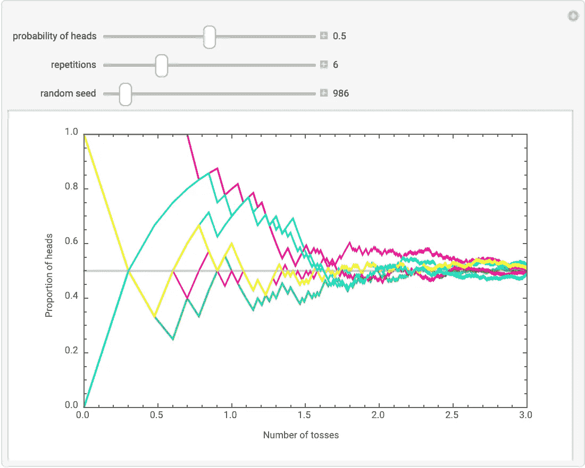
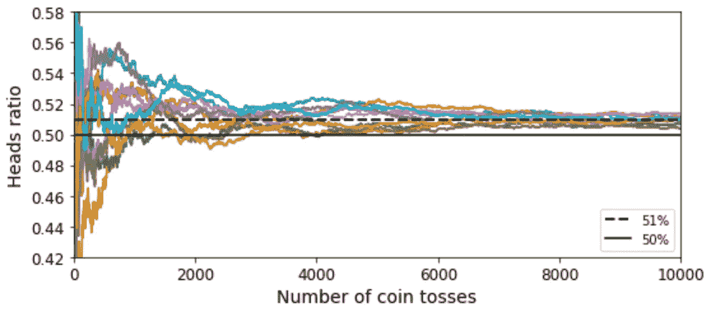
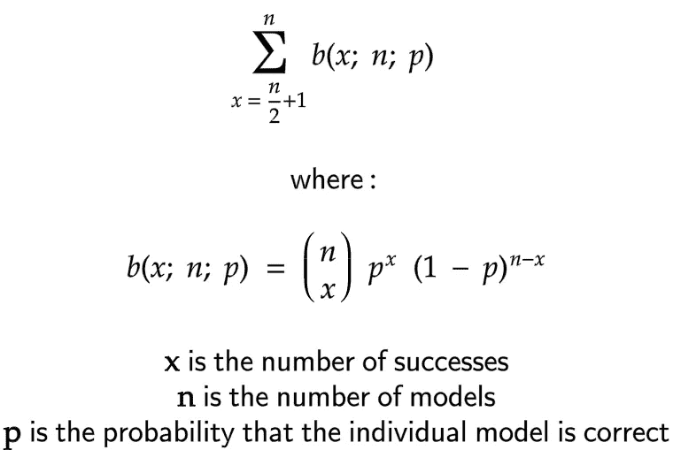
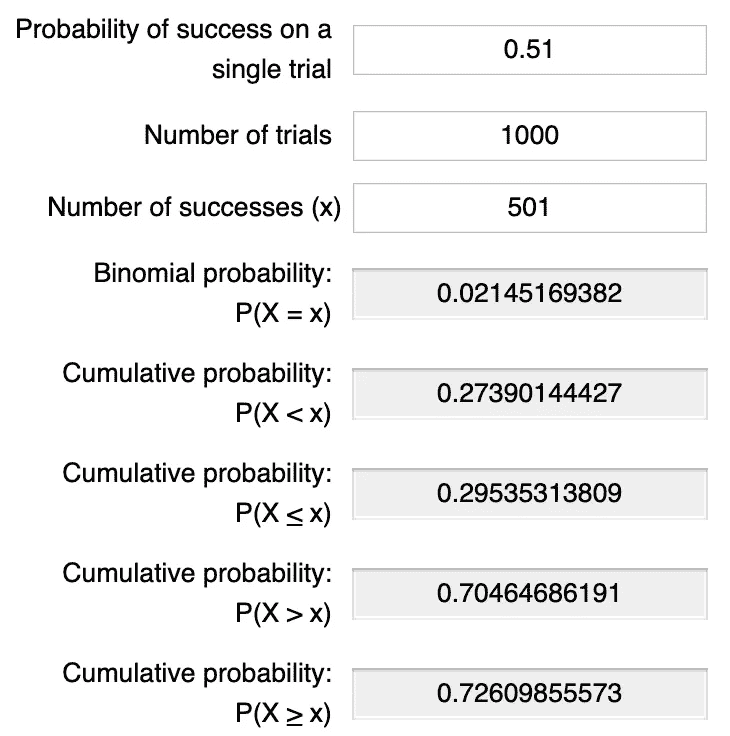
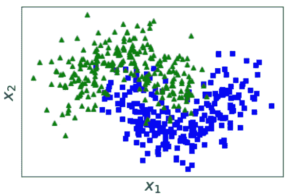

# 集合方法，从直觉到实施

> 原文：<https://towardsdatascience.com/ensemble-methods-or-democracy-for-ai-bac2fa129f61?source=collection_archive---------27----------------------->

## 民主、投票和多样性如何让人工智能受益

Taken by me: somewhere I learned a great deal. Somewhere I miss.

# 简介:一个正确的民主故事

我的目的是帮助你对什么是系综方法以及它们如何工作建立一种直觉。本文首先假设没有关于这个主题的知识。具体来说，这个介绍是关于获得一个心智模型。心智模型是为了帮助你在你熟悉的概念和你将要学习的新概念之间找到相似之处。

在一篇关于机器学习的文章中谈论民主、投票和多样性似乎无关。尽管如此，这些相同的概念也适用于人工智能世界，就像它们在我们的世界中一样。我冒昧地在我的标题和整篇文章中采用了相当轻松的语气。我的希望是你在娱乐的同时继续学习。

在许多情况下，几个稍有根据的猜测比一个非常有根据的猜测要好。这是群众的智慧战胜了个人的专长。这样的群体包括各种视角，一旦聚集起来，就会产生比最准确的个人视角更准确的元视角。但是，尽管这带来了很多好处，但必须满足几个假设:

*   这些猜测至少要稍加训练。换句话说，它们应该比随机更好。从一群无知的文盲的投票中不会有太多的好处。
*   观点应该是不同的，要么是他们思考和猜测的方式不同，要么是他们获得的经验不同。一个人人都学到完全相同的东西的群体是思想封闭的；全对的时候达成共识，全错的时候达成共识。视角越多样，你能看到的角度就越多。

# 第 1 部分:像创造者一样的机器

也许我们按照自己的形象创造了机器学习模型，并让它们用 democ 来统治自己..整体方法。

## 大数定律

我要你抓起一枚硬币，扔几次，然后记录下你得到的东西。在 10 次投掷中，不可能有 5 次是正面，5 次是反面。更不可能的是，在 100 次投掷中，50 次是正面，50 次是反面...即使你的硬币完全平衡，你也不太可能得到相同数量的正面和反面。如果你扔一枚硬币，而这枚硬币是经过制作和测量的，80%的情况下都是反面，那也差不多。你不可能在 10 次投掷中得到 8 条尾巴，或者在 20 次投掷中得到 16 条尾巴，或者在 100 次投掷中得到 80 条尾巴…

抛一枚公平的硬币很多次，得到大多数正面或反面，这种情况并不少见。例如，你可以将一枚硬币抛 10 次，得到 8 个正面和 2 个反面。头或尾落地的概率是相等的；正面是 0.5，反面是 0.5。那么为什么有可能得到一个结果的绝大多数。为什么不总是在每 10 次投掷中得到 5 次正面和 5 次反面，因为它们都是同样可能的结果？

在试图解释为什么会发生这种情况时，人们有时会陷入赌徒的偏见:因为到目前为止，由一枚公平硬币进行的大多数投掷都是正面朝上，所以下一次投掷更有可能是正面朝下。好像硬币在记录以前的结果，当它出错时会觉得有责任回来。但事实并非如此，因为每次折腾都是独立事件。这给我们带来了一个基本问题:*结果的概率意味着什么？*

看看这个 [Wolfram 模拟](https://demonstrations.wolfram.com/SimulatedCoinTossingExperimentsAndTheLawOfLargeNumbers/#more)吧，也许还能修补一下。继续无限制，你可以随时从右上角的“+”回到初始设置。你回来的时候我会在这里，从你离开的地方继续。

6 coins tossed 1000 times. The proportion of heads is plotted against the number of tosses.

你看到的是 6 枚公平币(0.5 概率正面)，每枚抛 1000 次(根据演示描述)。随机种子是一个用来产生随机性的值，如果需要的话，可以重现相同的随机性。灰色水平线始终设置为人头概率值，这里为 0.5。

在每个实验中，随着投掷次数的增加，正面的比例接近正面的概率线。如果我们继续增加投掷的次数，最终正面的比例将等于正面的概率。不管你重复多少次实验，也不管你为硬币分配的概率值是多少，这都是正确的。这就是大数定律。

总结一下，我们看到使用 6 个相似的硬币，每一个都投掷 1000 次，使得正面的比率更接近正面的概率。我们也可以投掷 6000 枚类似的硬币，我们会注意到类似的结果；人头比例总会收敛到人头概率。

## 将大数定律应用于机器学习

有时候，你尽最大努力训练一台机器，而一个 51%准确率的模型就是你所能展示的全部。如果你发现自己处于如此可怕的时期，不要绝望，用大数法则来代替。

一台 51%正确的机器只比随机机器好一点点。但是如果你可以把它复制成 1000 个模型，然后把他们的个人答案汇总成一个投票，大多数投票的答案在 73%的情况下都是正确的。有了 10000 个这样的模型，投票的答案在 97%的时候都是正确的。这是因为获得大多数好答案的概率随着模型数量的增加而增加。

A. Géron, Hands-On Machine Learning with Scikit-Learn, Keras, and TensorFlow (2019)

这可以通过掷硬币再次形象化。随着投掷次数的增加，有 51%正面概率的硬币将有越来越多的正面概率。

如果你想自己验证更多的模型可以增加他们选出正确答案的概率，你可以计算**累积二项式概率:**

Formula for computing **the cumulative binomial probability**

要将此公式应用于 1000 个模型，每个模型的精确度为 0.51，您必须将 501 个模型集体投票得出正确答案的二项式概率、502 个模型集体投票得出正确答案的二项式概率……以及 1000 个模型集体投票得出正确答案的二项式概率相加。但是生活就是为了活着，你可以用这个[二项式概率计算器](https://stattrek.com/online-calculator/binomial.aspx)来代替。

The first value is p, the second is n, and the third is x. The last cumulative probability is what you’re looking for.

当然，为同一项任务构建数千个模型在计算上似乎并不高效。但是我们从一个相当糟糕的情况开始，将精确度设置为比随机猜测略好。通常情况下，在训练了几个模型并选择了最好的模型后，您会求助于使用这种方法。通过组合一组合适的模型，你可以用更少的模型获得实质性的改进。但是，尽管这带来了很多好处，还是要满足一些假设。

**快速术语:**在机器学习中，一组模型被称为*集合。*

## 满足所需的假设

机器和它们的创造者一样，受益于群体的智慧，前提是它们满足相同的主要假设:

*   模型的准确性应该高于随机猜测。这可以通过在数据集上训练模型并在选择表现最佳的模型之前评估它们的准确性来满足。
*   模型应该相互独立。这可以通过多种方式来满足:

1.  对每个模型使用不同的算法。
2.  使用相同的算法并在来自训练数据集的*实例*的不同子集上训练每个模型。
3.  使用相同的算法并在来自训练数据集的*特征*的不同子集上训练每个模型。
4.  结合了前面的两个选项:相同的算法、不同的实例和用于训练每个模型的不同特征。

**快速术语:**上面的第二个选项被称为*打包*(简称*引导聚集*)当随机抽样子集允许实例被选择不止一次时(我们称之为替换抽样)。但是，在不替换的情况下进行采样时，称为*粘贴*。第三种选择叫做*随机子空间方法*。第四个选项叫做*随机补丁方法*。

下一部分将通过提供实际例子来阐述。

# 第二部分:召唤他们的词语

*巨蟒嘶嘶地向他们将要学习的树招手*

## 让他们学习的东西

我们将要使用的数据集叫做 [make_moons](https://scikit-learn.org/stable/modules/generated/sklearn.datasets.make_moons.html) 。我们将使用它来生成 500 个具有 2 个特征的实例。每个实例将属于“0”类或“1”类。

Plot of the generated dataset.

下一步是分割数据集，用于训练和测试目的。

## 不同的算法，相同的数据

我们将使用三种不同的算法创建三个模型:决策树分类器、逻辑回归分类器和支持向量分类器。我们将训练他们将实例分为两类。然后我们会问他们，根据他们学到的知识来猜测 X_test 中的每个实例是属于 0 类还是 1 类。最后，我们将通过比较他们的猜测(预测)与实际标签 y_test 来评估他们的准确性。

SVC 模型是最精确的，具有 0.896 的精确度。让我们把这三个模型结合成一个整体模型。

The ensemble’s accuracy is 0.904, outperforming the SVC model.

上面的代码创建了一个称为 VotingClassifier 的集合。每次要求集成预测一个实例是 0 类还是 1 类时，三个模型各自进行预测，集成输出多数投票的类。这叫做*硬投票*。

*软投票*另一方面稍微领先一步，可以带来更好的准确性。除了简单地要求单个分类器进行预测，我们还可以要求它们输出一个对其预测的置信度的度量。因此，将有可能根据置信度度量来为预测赋予或多或少的可信度。

With soft voting the accuracy increased to 0.912

## 相同的算法，不同的数据

我们可以依靠复制相同的模型来制作合奏，并为每个单独的模型教授不同的东西。下面的代码实现了第 2 部分末尾讨论的*打包*技术。

The single SVC model has 0.896 accuracy. An ensemble of 100 SVC models has 0.904 accuracy.

*随机子空间*是另一种使用不同数据来教导集合的单个模型的方式。它不是从训练集中随机抽取实例，而是随机抽取特征。对于我们的数据集不实用，因为我们只有两个特征 x1 和 x2，但对于更复杂的数据集绝对值得尝试。要使用它，只需将上面代码中的“max_samples”替换为“max_features”。

最后，*随机补丁*结合了装袋和随机子空间。要使用它，请设置“最大样本数”和“最大特征数”的值。

# 更进一步

 [## 模拟抛硬币实验和大数定律- Wolfram 演示项目

### 也许解释大数定律的最简单的方法就是抛硬币实验。如果一个公平的硬币(一…

demonstrations.wolfram.com](https://demonstrations.wolfram.com/SimulatedCoinTossingExperimentsAndTheLawOfLargeNumbers/#more)  [## 二项式概率计算器

### 常见问题二项式实验有以下特点:实验涉及重复…

stattrek.com](https://stattrek.com/online-calculator/binomial.aspx)  [## 使用 Scikit-Learn、Keras 和 TensorFlow 进行机器实践学习，第二版

### 通过最近的一系列突破，深度学习推动了整个机器学习领域。现在，甚至…

www.oreilly.com](https://www.oreilly.com/library/view/hands-on-machine-learning/9781492032632/)  [## 迈赫迪-胺/型号-统一

### 带有代码示例的 Jupyter 笔记本 github.com](https://github.com/Mehdi-Amine/models-unified/blob/master/Ensemble_Methods.ipynb)