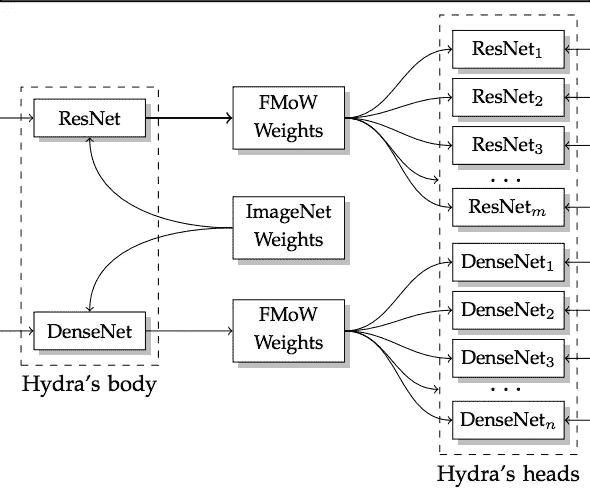
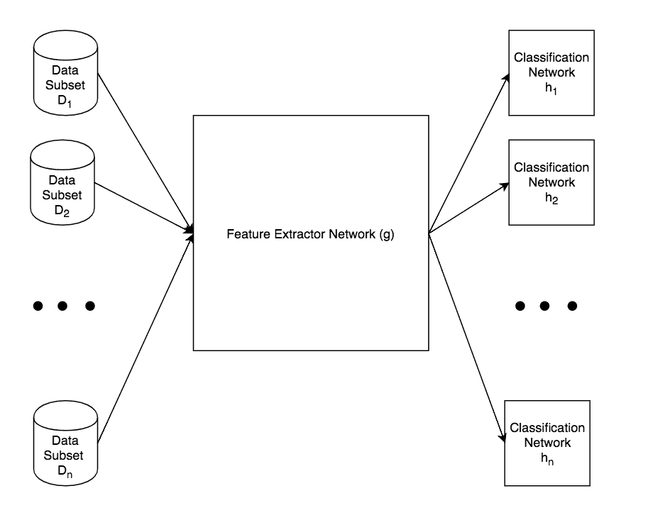

# 深度网络的集合

> 原文：<https://towardsdatascience.com/ensembles-of-convolutional-networks-3f81f59978a3?source=collection_archive---------10----------------------->

模型集成指的是将来自多个统计模型的预测进行组合以形成一个最终预测的实践。这为模型表现能力的多样性提供了机会。这个概念类似于诸如寻求多个医生的意见之类的轶事。模型集合是对传统机器学习模型的一种非常常见的增强，例如将决策树升级到随机森林。与机器学习模型相比，深度模型需要很长时间来训练，因此形成每个都从零开始训练的深度模型的集合是不实际的。这篇文章介绍了 Minetto 等人设计的名为“Hydra”的 CNN 系综的新奇之处。这种设计通过对集合中的模型使用共享的特征提取器网络来节省计算时间。以下是这篇论文的链接:

 [## Hydra:用于地理空间土地分类的卷积神经网络集成

### 我们在本文中描述了 Hydra，一个用于地理空间土地分类的卷积神经网络(CNN)的集成…

arxiv.org](https://arxiv.org/abs/1802.03518) 

很快，下图总结了九头蛇的主要思想:



FMoW is the dataset used for their specific task, the Hydra’s body consists of many neural network layers assembled according to the ResNet and DenseNet design. Each of the Hydra’s heads consists of a fully-connected layer trained on different partitions of the FMoW dataset. The ImageNet weights are used to initialize the network.

深度网络可以被模块化并被认为由两个组件组成，一个特征提取器和一个分类网络。在上图中，两个强大的深度 CNN 架构， **ResNet 和 DenseNet** 用于从图像中提取特征，这些特征被传递到多个分类' heads '中。提取特征会降低输入的维数，从 224 x 224 x 3 的图像降低到 4096 x 1 的向量。从九头蛇身体中提取的向量被用作九头蛇头部的输入，因此 4096×1 向量变成了与类的数量一样大的类预测向量。

训练是为了微调九头蛇头部的重量，使它们能够适应手头的任务。上图中另一个有趣的细节是 ImageNet 权重。这被用作九头蛇身体重量的转移学习初始化方法。然后使用 FMoW(世界功能地图)土地分类数据集对这些权重进行微调，Minetto 等人正在为此训练他们的网络。在微调这些权重后，完全连接的层被切掉，并被九头蛇的头取代。希望在这个解释之后你能明白为什么他们选择把它命名为**九头蛇**。九头蛇是某种多头龙，类似于多头龙，集合卷积神经网络的每个头共享相同的身体。



The idea is further simplified in the image above, subsets of the data are used to fine-tune each classification network / ‘Head’ of the Hydra

这样做的一些有趣的特征是，它促进了模型中功能和数据的多样性。功能多样性可以通过在每个水螅头的全连接层中添加新奇的东西来实现，甚至可以重塑特征提取向量并再次对其进行卷积。然而，实现数据多样性是一个更有趣的范例，本文也对此进行了研究。

集成模型通常通过将初始数据集(比如说有 **m** 个实例)划分为 **k** 个桶(每个桶有 **m / k** 个实例)来实现数据多样性。来自每个桶的数据被用来微调九头蛇头上的重量。这种方法也可以扩展到合并扩充数据，并有许多建设的可能性。几何变换或色彩空间操作等数据增强技术可用于创建额外的多样化数据桶，以微调九头蛇的头部。论文作者讨论了使用**在线数据扩充**节省内存的重要性，与离线扩充相反。离线扩充是指扩充数据，然后将每个修改的数据实例写入内存。

当以这种方式组合模型时，最后要考虑的是如何组合模型的预测。简单的解决方案可以是多数表决，其中输出来自每个头的最大类概率，或者是多数表决，其中来自每个头的 softmax 输出被求和，并且来自结果向量的最大值是最终预测。这被称为集合模型的**解算法**。他们有很多方法来发挥创意，测试不同的假设，例如为自己具有最佳分类性能的九头蛇头部分配更高的权重，或者搜索具有最少相关预测的头部子集。

感谢您的阅读，我认为这篇论文非常有趣，建议查看一下！模型的集合遭受较慢的推理时间，但对于较高的预测精度是一个有希望的解决方案。Hydra 架构是一种有趣的、名副其实的集成深度神经网络的方法。

我目前正致力于在喀拉斯实现九头蛇网络，并想分享我遇到的一个帮助我开始的细节。首先，您需要训练特征提取器的权重，并使用如下简单的方法保存它们:

```
model.save('HydraBody.h5')
```

然后，您需要将这些重量加载到每个头部，这可以通过命名 HydraBody 的每一层来实现，例如:

```
model.add(Conv2D(32, (3,3), name = 'Conv1')
```

命名每个层就是将基础权重加载到与保存的权重的架构不完全匹配的模型中的方式。

感谢阅读！