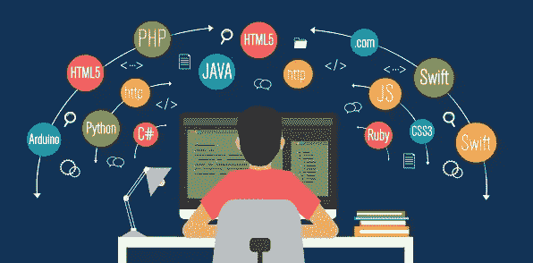

# 进入分析领域:从训练营到从事数据科学工作

> 原文：<https://towardsdatascience.com/enter-analytics-from-boot-camp-to-working-in-data-science-8a5a6f563d7d?source=collection_archive---------15----------------------->

当在网上搜索新兵训练营时，似乎总是有很多不同的观点。他们有很多，有些比其他人更贵，他们都有稍微不同的侧重点，同时声称他们可以在短短 12 周内培养出分析师、全栈开发人员和/或数据科学家。以我的经验来看，教育往往可以归结为你得到你投入的东西，我参加数据可视化和分析训练营的经历也不例外。

# 为什么要给我一个新兵训练营？

我一直对计算机感兴趣，但从未想过计算机科学适合我。在成长的过程中，我从来没有觉得自己擅长数学，所以在学习数学的时候我并没有那么努力。高中的时候，我修了一门 Java 的课程和一门计算机网络基础的课程。他们都没有吸引我，所以我决定保持计算机的爱好，并最终在大学学习科学和技术通信。

当我找到大学毕业后的第一份工作，在一家软件公司做实习技术撰稿人时，我第一次尝到了计算机科学的真正含义。我爱上了一种我从未见过的语言:SQL。当我的实习结束时，因为我喜欢这家公司，我决定在他们的支持团队中工作。它给了我一个每天写作的机会，学习像 SQL 这样的技术技能，并了解软件开发生命周期。

在后勤部门爬了大约六年的梯子后，我觉得自己撞上了一堵墙。我已经变成了一个整天阅读和编写 SQL 的产品专家。虽然我有一些技能，但我觉得要进入下一个级别就要拿到我没有的证书。此外，我对分析数据的兴趣也开始高涨。例如，我痴迷于股票市场。

一天晚上在研究一些股票时，我看到一则广告，上面写着“在大学短短 24 周内学会数据分析……”因为它是通过我的母校大学宣传的，所以我决定点击链接并下载一本小册子。在做了更多的研究后，我了解到这是一个由一家名为 Trilogy 的公司组织的编码训练营，它专注于使用 VBA、Python 和 JavaScript 等编码语言教授数据可视化和分析技能。新兵训练营很贵，尽管我不喜欢高中时的编程，但我认为作为一个人我已经足够成熟了，可以再试一次。我报名参加了新兵训练营，希望它能带我走上数据分析之路！

# **启动新兵训练营**

在研究我所从事的工作时，我读了很多关于人们不喜欢他们的老师的评论。在这方面，我非常幸运，有一个很棒的老师。他谦逊、耐心、知识渊博，并且善于保持课堂的趣味性。参加提供课堂教学的新兵训练营的好处之一是面对面地结识志同道合、积极上进的人。这让我结交了一些新朋友，因为我们都在努力重返学校，努力应对快节奏的内容。

我带着很少的 Python 经验参加了这个课程。我编写了几个脚本，从金融网站上收集一些股票数据，并使用 scikit——学习制作一些预测模型，但我的大部分技术技能是 SQL。在新兵训练营的前三分之一，我们已经学习了 Excel 和 VBA 的基础知识，并开始使用 python、API 和 JSON 数据。这是一个压倒性的内容，但它真的让我把自己的注意力和学习。我的空闲时间蒸发了，因为我把它用于家庭作业。

# 创建项目组合

新兵训练营的重点是创建一个能引起雇主兴趣的项目组合。它们大多是团队项目，这很好，因为它迫使我们制定合并代码的策略，并给了我们团队开发的经验。我们可以组建自己的小组，选择我们想要的任何主题(大部分)，然后去参加比赛。只要我们满足最低要求，我们几乎没有任何限制。

如果你是一个优秀的人，或者有任何语言的经验，那么这个项目就是一个展示自己的好机会。我的同学中有些人拥有高等学位，而这个班级的集体背景也很广泛。有相当多的人拥有博士或 MBA 学位，也有一些人一生中从未写过一行代码。因为很多人来自不同的领域，所以不乏有趣的项目主题。这些项目也给了我们一个练习表达技巧的机会，因为一旦完成，我们就必须向全班展示。

## 你可以在这里看到我的一些项目:

[生成葡萄酒推荐](http://robotsdodream.com)
[可视化世界杯数据](https://world-cup-fifa-soccer.herokuapp.com/)
[提取转换加载漫画数据和 MySQL](https://bendgame.github.io/Etl_project/index_etl.html)
[分析中西部谋杀数据](https://github.com/bendgame/Project-one)
[可视化期权交易](https://bendgame.github.io/hw11/lp)

[Generating Wine Recommendations](http://robotsdodream.com)

# 对新兵训练营的批评

我们在很短的时间内讨论了很多…事实上，几乎涉及了太多的话题。就在你开始适应并准备做更高级的事情时，他们改变了话题。在课堂之外，你想把事情带向什么方向，这真的取决于你自己。例如，我最关注 python，因为我想进入数据科学领域。

我真希望在课堂上更多地关注分析。尽管我们学习了一些基本的统计学和基本的分析技术，但还是有一大部分课程是关于 web 技术的，比如 HTML、CSS 和 JavaScript。我理解把它放在那里，这样我们可以学习编写交互式仪表板和网页来展示我们的项目，但它最终占了全班的三分之一。我并不介意，因为我在一家基于网络的软件开发公司工作，所以理解 JavaScript 适用于我的工作，但班上的其他人发现学习 HTML 和 CSS 没有什么价值。他们讨论基本网页设计的另一个原因是为了更容易进入网页抓取。

课程更侧重于可视化数据，而不是分析数据，如果这是你想学的，那可能会很好。我希望在我的作业上得到更多的反馈，这样我就可以衡量我的分析做得如何。我们涉及的唯一统计数据是高斯分布、标准差、方差分析、卡方检验、student-t、假设检验和其他一些统计函数，我不记得它们来自 SciPy Python 库。

如果你没有编码或 comp-sci 经验，我建议你先查阅一些在线资源来获取一些知识，因为这门课程的节奏真的很快。除了 Excel、VBA、Python 和 JavaScript，课程还涉及 SQL、R、tableau、机器学习和大数据。我离开新兵训练营时接触了各种各样的语言，但要记住所有的语言是不可能的，因为我们只是简单地介绍了一下。我不得不通过额外的在线课程来补充课堂学习，以加深对语言的理解。

# 新兵训练营后的生活

在新兵训练营之后，我觉得我完成了很多，并且能够发展编码技能的基础。它为我的职业发展打开了大门。完成认证几个月后，我在我的雇主的数据科学团队中找到了一份软件产品分析师的工作。现在我有机会与经验丰富的数据科学家、软件工程师、数据工程师和数据分析师一起工作。我对编码和数据科学产生了热情。除了编码和职业发展，我还在新兵训练营结交了一些新朋友，我仍然希望能不时见到他们。新兵训练营让我的生活变得更好，因为我拼命工作并保持积极的态度，即使我不得不牺牲很多时间并致力于学习新的东西。

My last day before starting my new career post boot camp

# 最后的想法

新兵训练营并不适合所有人，如果你正在考虑参加一个，一定要研究一下这个课程提供了什么。如果你认为你已经准备好做这份工作，他们绝对可以改变你的生活，让你走上一条新的道路。新兵训练营为我工作，但是我已经知道 SQL 并且已经对数据有热情。如果你还在观望，看看所有免费的 MOOCs 或在线内容，它们可以帮助你决定这些主题是否适合你。

如果你有兴趣看我在新兵训练营完成的一些任务和项目，可以看看我的 github。

 [## bendgame -仓库

### 对游戏、金融、数据分析、技术写作和牛肉干感兴趣。阻止或报告 Python GNU 通用…

github.com](https://github.com/bendgame?tab=repositories) 

# 谢谢大家！

*   *如果你喜欢这个，* [*在 Medium 上关注我*](https://medium.com/@erickleppen) *获取更多*
*   [*通过订阅*](https://erickleppen.medium.com/membership) 获得对我的内容的完全访问和帮助支持
*   *我们来连线一下*[*LinkedIn*](https://www.linkedin.com/in/erickleppen01/)
*   *用 Python 分析数据？查看我的* [*网站*](https://pythondashboards.com/)

[**—埃里克·克莱本**](http://pythondashboards.com/)