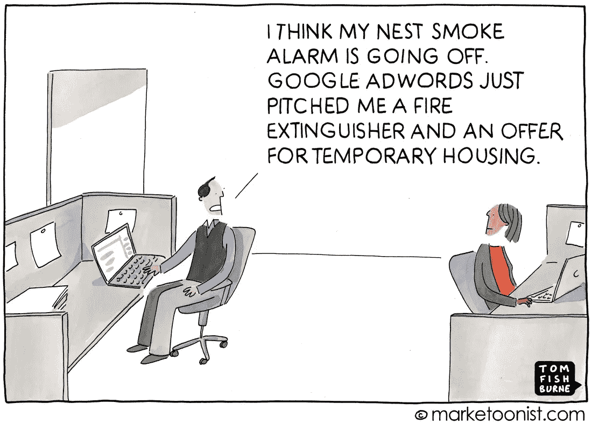
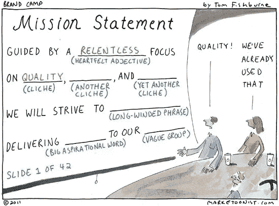
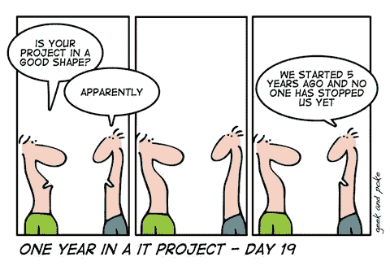

# 企业技术 101:五种实践如何让你的组织成为领导者或失败者

> 原文：<https://towardsdatascience.com/enterprise-technology-101-how-five-practices-can-make-your-organization-a-leader-or-a-loser-4ef2d693fd32?source=collection_archive---------12----------------------->

为什么是我？

作为一名技术专家——领导定制软件解决方案的设计、开发和部署近 20 年——有许多有趣的事情，其中之一就是有机会通过观察试验和错误来进行经验性学习。这些机会的多样性增强了这种学习。

项目涉及许多类型的技术:客户端-服务器、应用程序开发、数据仓库、电子商务、在线分析处理、预测分析、人工智能、软件即服务(SaaS)、平台即服务(PaaS)和机器学习。类似地，项目跨越了许多行业和应用领域:电信、政府、电子商务、教育、金融、医疗保健、制药、生物医学和零售。

在很大程度上，它使我能够欣赏“灰胡子”的价值，这些人已经存在了很长时间，经历了很多，这是我自己的胡子变白的时机。在任何行业中，所有这些经验学习的一个关键应用价值是洞察什么有效、何时有效、为什么有效以及效果如何。我们的优势在于利用了大量职业经历的心理数据库。

当遇到某个人或某个组织谈论他们的信息技术需求时，这一点通常会发挥作用—他们有什么不能用的，他们希望他们有什么，等等。这是一个重要的话题，因为如果所做的决定没有提高他们的能力，或者但愿不会降低他们的能力，将会花费大量的成本和时间。还有机会成本。如果某一类型的系统被错误地开发或实现，在被替换之前，他们的竞争优势损失了多少时间和精力？

使这些分析更加难以正确的是软件制造商和实施者用数十亿美元营销决策者。随波逐流，选择架构、软件、企业系统、应用程序等，通常感觉更安全。每个人似乎都在选择。然后，如果出了差错，至少在“每个人”都推荐的防御中，数字是安全的。当然，真正的诀窍是第一次就做对。

**五大修行**

在看到如此多的技术选择和组合以及观察它们的实际价值和寿命的过程中，我们学到了一些重要的经验教训:

1.  **专注于任务**——每种工具都有其用途，尽管这一点往往考虑不周。如果你了解任务概况，你可以将选择限制在那些用于这些目的的工具上，至少可以接近最佳选择。例如，高净值个人喜欢购买喷气式飞机——为了舒适、安全、自我(和主要的税收减免)。[湾流喷气式飞机](http://www.gulfstream.com/) (III，IV，V，V-SP)已经流行了几十年——通过它们的水平椭圆形窗户来揭示。这些飞机可搭载 9-14 名乘客从美国出发进行跨国旅行或海外旅行；然而，我的预测是，他们通常只是让一些人飞到更近的目的地。任务的错误工具。他们本来可以买一架更小(更快)的喷气式飞机，平均载 X 个人 Y 英里(如果他们在乎的话，还可以省钱)。

在软件中，这通常在应用程序和企业系统中发挥作用——最初是关系数据库(例如 MS Access、 [Oracle](https://www.oracle.com/index.html) 、MySQL 等)。)，然后是企业资源规划(ERP) ( [SAP](https://www.sap.com/cmp/ppc/crm-xh17-ppc-ppcbrfc/index.html?campaigncode=CRM-XH19-PPC-BRABRFCGOO&source=PPC-USCA-Brand-GOO&gclid=CjwKCAjw96fkBRA2EiwAKZjFTXf-2MMz2px0H7-Jjzh4WOyoltnT0cMS00JIxRQ3bKbxrFjqNWInHRoCOzUQAvD_BwE&gclsrc=aw.ds) ， [PeopleSoft](https://www.oracle.com/applications/peoplesoft/products.html) ， [J.D. Edwards](https://www.jdedwardserp.com/) 等。)，然后是客户关系管理(CRM) (Salesforce，Redtail 等)。).在这里，大多数套餐都有特色。在 ERP 中，它是行业——SAP 是制造业，PeopleSoft(被甲骨文收购前)是人力资源部，JD Edwards(也被甲骨文收购前)是会计部，等等。 [Salesforce](https://www.salesforce.com/) 顾名思义，是为那些试图跟踪他们的潜在客户和客户的销售人员准备的。

显而易见，为特定目的而设计的工具几乎总是会超越为另一个目的而改造的工具的性能。然而，由于这里解释的原因，这通常是企业或应用程序在信息技术中采用和使用的失误。

2.最大限度地减少定制 —一个常见的错误是，软件制造商的增长方法通常是采用特定于任务的应用程序，并试图将其应用于整个市场的每个人，这可能并确实会花费数百万美元和数年时间。抽象地说，大多数人都会同意这样的观点，即任何一种工具表面上可以满足每个人的需求，这违背了常识，属于“好得难以置信”的范畴。这在任何行业都是一种虚幻的希望。

然而，每年都有成千上万的组织犯这样的错误，这主要是由于无知和软件制造商经常使用的一种阴险的方法来构建和营销他们的产品——可定制化。他们的销售人员(根据我的经验，Salesforce 在这方面臭名昭著)会告诉你，“是的，这是一个通用平台；但是您或我们可以将它定制成您曾经梦想的一切。”他们非常希望您同意这样做，原因有三:(1)定制服务非常昂贵，并且通常比计划的时间长得多，这为他们提供了一个全新的、主要的、长期的“服务”收入来源(2)客户在软件上投资越多，他们就越有可能保留它更长时间，以试图证明其花费是合理的，并从他们的投资中获得回报，从而通过最小化替换它的动机来阻碍竞争；(3)定制会产生“供应商锁定”，因为组织变得依赖于构建的流程，除非他们能够替换该流程(定制越多，替换就越难)，否则无法改变，并且他们无法更换组件，因为它们都是绑定在一起的。

那么，为什么公司不识破这种以牺牲买方利益为代价来维护卖方利益的营销策略呢？

3.**雇用或替换** **缺失/错误的人才** —当您遇到组织投资了不符合其使命的工具，或过度定制通用工具，以至于供应商将他们锁定在昂贵的环境中时，对话可以从询问他们的首席技术官(CTO)在这些决策背后的理论开始。最常见的回答是，“我们没有/以前没有 CTO。”没错。第二个常见的问题是:“那么，当您的 IT 人员每三年对软件更新换代时的需求和选项进行独立客观的分析时，他们是如何看待这个决定的？”最常见的第二个答案是:“我们的 IT 人员从来没有做过 36 个月的需求/工具评估，以了解我们的新需求或市场如何变化”，与“他们是 XYZ 开发商，所以他们总是建议我们使用 XYZ，否则他们就失业了。”第三个常见问题是“嗯，一定有人做过总拥有成本(TCO)评估，了解每年许可 XYZ、派每个人参加所有活动以及保留所有定制人员的成本，对吗？”你开始明白了。最常见的回答是:“不会；据我所知，从来没有人做过 TCO，我们可能甚至不知道今天决策的总成本。”

4.**使 IT 能力民主化&数据**—IT 用户倾向于以三种方式使用它:(A)报告；分析；以及(C)功能。除了这三种消费信息的方式之外，很难找到太多最终用户的需求——阅读信息、分析信息或操纵信息来执行任务。过去，人们需要满屋子的程序员来完成这项工作；然而，今天，市场上充斥着专门的拖放工具，几乎任何人都可以通过在线课程或经验学习来做这些事情。最终用户知道他们的需求，他们经常改变或发展。因此，今天，允许最终用户社区、部门、分部等通常是最有意义的。，只需雇用一名数据演示人员专门负责这项任务，并为他们提供数据。如果一个部门不能证明一个全职人员的合理性，那么有更多临时需求的部门可以简单地分担某人的工作。这消除了总是令人沮丧、耗时且昂贵的记录需求的过程，以及每次用户需要新的报告或分析时长达六个月的构建或开发周期。

满足信息和分析需求的一个非常有效和有价值的方法是使用像 [Tableau](https://www.tableau.com/) 这样的产品来构建动态(而不是静态)的仪表板。一旦构建完成(同样是拖放式的，这样即使有几十个部分也可以在几周内完成)，系统会自我更新最终用户想要知道的所有关键数字，跟踪目标进展、地理信息、质量、增长速度等。此外，他们可以移动，以便终端用户想要的所有信息和分析在他们的智能手机或平板电脑上随时可用。快速、信息丰富、易于构建和维护且成本低廉。

最终用户消费数据的第三种方式——功能——需要更多的投资，但如果做得好，比许可、定制和维护大型企业系统要容易得多，也便宜得多。几乎每个领域都有一个专业应用程序，可以执行这些专业人员需要的所有功能——“开箱即用”(好吧，我通过回忆软件还装在盒子里的时候来与自己约会)。挑一个领域:电信、网络安全、投资管理、财务规划、零售管理、资金筹集、录取等。他们都有几家公司提供专用解决方案，他们通常只需要一个数据源。因为定制专业应用程序的需要或理由较少，所以维护费用较低(例如，不需要给昂贵的开发人员发工资，不需要参加开发人员会议，等等。).因为他们为更小的团队服务，所以也需要更少的席位或副本来获得许可——这是第二个成本节约。但最大的节约是机会成本。这些专业公司每个季度都在创新新的特性和功能集，以成为其狭窄领域中最具竞争力的产品——与拥有大型定制企业应用程序的组织相反，这些组织试图永远(通常无法)跟上创新专家的步伐，然后用新的东西更新旧的通用系统。

信息技术能力的民主化也是该行业可能的发展方向。20 世纪 90 年代是客户端-服务器、多对一的私有结构。2000 年代是互联网商务和内部网的开端，是安全的组织范围的互联网私有区域，而不是局域网(LAN)。2010 年是软件即服务(SaaS)时代，应用程序从安全的互联网或内部网网站和大数据中流出。21 世纪 20 年代将开始是平台即服务(PaaS)，其中组织通过从集中商店下载应用程序来创建自己的生态系统，这很可能演变为功能即服务(FaaS)，其中最终用户可以下载一个迷你应用程序，该应用程序做一件事来制作自己的特性和功能集。大型软件应用终结的开始就在这里。这是技术能力的终极民主化，我们很可能在 2030 年看到它无处不在。

5.**一切都是关于数据**——2017 年，一份不亚于*的权威出版物《经济学家*认为“世界上最有价值的资源不再是石油，而是数据”(The Economist，2017)。最明智地使用数据的组织将拥有巨大的竞争优势，而要最明智地使用数据，就意味着您必须拥有数据。一个简单的陈述经常不被遵守。

如今，获取数据流、存储在中央存储库中(如数据仓库)和开源数据库中(如 [MySQL](https://www.mysql.com/) )相对容易，并且可以分析大量信息并从中得出推论和结论。在过去的几十年里，数据存储和处理能力是稀缺的，因此也是昂贵的。今天，它们不再稀缺，因此成本极低。一个技术支持人员的成本比一个技术支持人员的成本低，这是技术行业中报酬相对较低的技能组合，一个组织可以存储一个世纪以来与他们的组织联系过的每个人的每条可获取的信息。此外，基础设施即服务(IaaS)提供商，如[亚马逊网络服务](https://aws.amazon.com/free/?sc_channel=PS&sc_campaign=acquisition_US&sc_publisher=google&sc_medium=ACQ-P%7CPS-GO%7CBrand%7CDesktop%7CSU%7CCore-Main%7CCore%7CUS%7CEN%7CText&sc_content=Brand_Core_amazon_web_services_e&sc_detail=amazon%20web%20services&sc_category=Core&sc_segment=315739797245&sc_matchtype=e&sc_country=US&s_kwcid=AL!4422!3!315739797245!e!!g!!amazon%20web%20services&ef_id=CjwKCAjw96fkBRA2EiwAKZjFTaakq30L9Xg4NjBSCx2MYz3TPHc3DrUjXRofb1MFOykz7YcfKzK-EhoC4f0QAvD_BwE:G:s)、[谷歌云](https://cloud.google.com/)或[微软 Azure](https://azure.microsoft.com/en-us/) 可以实时扩展容量和数据库，并提供只有情报机构才能超越的冗余和安全水平(事实上，中情局也向 AWS 支付了 6 亿美元来存储他们的数据)。对于绝大多数组织来说，现场服务器存储和维护的时代早已过去。

成千上万的表可以存储这些“平面文件”(原始数据)，仪表板和专业部门应用程序接收和使用这些文件。这样做的软件成本很低，维护只需要一两个数据库管理员，这在技术层次中也是低成本的。

这种摄取数据流的能力以低廉的价格存储并提供给用户进行跟踪、分析和处理，以满足他们的需求，这也是基础设施和数据科学的先决条件，数据科学是技术、人工智能和统计的交叉，支持预测分析和机器学习。技术细节很复杂，但自罗马以来，组织的领导者很可能已经理解并渴望数据科学能够预测性地回答关键问题，如:(1)您是否想知道客户为什么购买您的产品/服务，以及这些因素在多大程度上影响了他们的决策？(2)您是否希望将您的所有客户或潜在客户根据他们的购买行为划分为不同的群体，以了解如何精心策划沟通，以及如何最大限度地提高他们做出回应的可能性？(3)您是否希望能够通过了解未来几年您可能会有多少客户、他们会购买什么以及您可能会有多少收入和利润来进行规划？如果你收集了原始数据，并使之可用，那么数据科学很容易得出所有这些答案。

**结论**

所以，谁在乎？在我职业生涯的大部分时间里，我也从事过一般管理工作，尽管是在技术领域，但在我有限的时间和注意力中，无处不在的问题总是:我需要处理这个问题吗？不管是好是坏，答案都是肯定的。为什么？因为不知道或不遵循这样的实践可能会使组织每年不必要地花费数百万美元或更多，导致他们软化并失去他们的竞争优势或优势，并由于期望结果而没有必要的工具来实现它们而使他们的员工士气低落。相反，通过遵循这些实践，组织每年可能会节省数百万美元甚至更多——即使是在相对较小的组织中——并将这些资源重新投资于新的人才和竞争优势，引领他们的市场，并使他们努力吸引和留住的人才对每天来工作感到兴奋。你更喜欢哪种情况？

# 参考

经济学人。(2017 年 5 月 6 日)。*世界上最有价值的资源不再是石油，而是数据*。摘自经济学人:[https://www . Economist . com/leaders/2017/05/06/The-worlds-most-valued-resource-is-not-alone-but-data](https://www.economist.com/leaders/2017/05/06/the-worlds-most-valuable-resource-is-no-longer-oil-but-data)