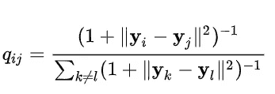
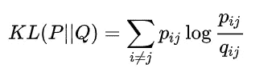
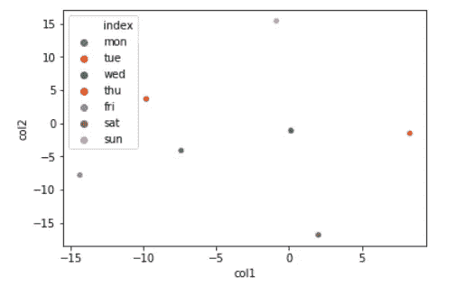
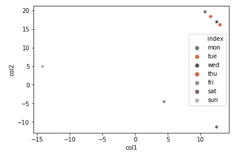

# 使用 t-SNE 的实体嵌入

> 原文：<https://towardsdatascience.com/entity-embedding-using-t-sne-973cb5c730d7?source=collection_archive---------17----------------------->

## 众所周知的降维工具可以用于分类特征嵌入。


Photo by [Leon Koye](https://unsplash.com/@leonkoye?utm_source=unsplash&utm_medium=referral&utm_content=creditCopyText) on [Unsplash](https://unsplash.com/search/photos/dimension?utm_source=unsplash&utm_medium=referral&utm_content=creditCopyText)

我们已经讨论了一些嵌入分类特征的可能方法:[核 PCA](/entity-embedding-using-pca-and-kernel-pca-798b8b2e8c2f) 和[光谱编码](/spectral-encoding-of-categorical-features-b4faebdf4a)。这种嵌入的目标是将分类特征映射到低维空间中的向量。与 1-hot 编码相比，这种映射的优点是大大减少了过拟合。然而，如果嵌入选择不正确，我们可能会丢失信息并使学习更加困难。为了增加嵌入的质量，我们使用类别相似度信息(我们可以设定*先验*或通过计算条件概率分布的相似度)。核 PCA 方法也使用分类变量的概率分布，而谱编码不使用。为了完整性，我们也将使用 t-SNE 方法，我们可以讨论它的优点和缺点。

t-SNE 代表[t-分布式随机邻居嵌入](https://en.wikipedia.org/wiki/T-distributed_stochastic_neighbor_embedding)，最初是为了高维数据的可视化而提出的。与 PCA 相反，它是一种非线性方法，其目标是保持数据点之间的相似性。它引入了从原始数据 **x** 到低维向量 **y** 的非线性转换，并使用学生 t 分布对数据点之间的相似性进行建模:



Credit: Wikipedia

点集 **y** 通过最小化分布 Q 与原始分布 P 的 KL 散度来找到:



Credit: Wikipedia

最小化可以使用梯度下降来完成。

为了演示该方法如何工作，我们将使用只有一个分类变量星期几的合成数据集，0 表示星期一，6 表示星期日:

```
array([ 23,  19,  15,  19,  22, 429, 473])
```

在这里，我们特意添加了更多周六和周日的数据，以了解 t-SNE 将如何考虑原始数据的概率分布。提醒你一下，拉普拉斯方法不受源数据概率分布的影响，而主成分分析和核主成分分析则受影响。

内核函数与前面示例中的相同

```
array([[1\. , 0.9, 0.8, 0.7, 0.5, 0.1, 0.3],
       [0.9, 1\. , 0.9, 0.8, 0.5, 0.1, 0.2],
       [0.8, 0.9, 1\. , 0.9, 0.5, 0.1, 0.2],
       [0.7, 0.8, 0.9, 1\. , 0.6, 0.1, 0.2],
       [0.5, 0.5, 0.5, 0.6, 1\. , 0.7, 0.5],
       [0.1, 0.1, 0.1, 0.1, 0.7, 1\. , 0.8],
       [0.3, 0.2, 0.2, 0.2, 0.5, 0.8, 1\. ]])
```

t-SNE 的 Scikit-learn 实现实际上希望我提供度量函数，所以我们将内核矩阵转换回距离矩阵

```
array([[-0\.        ,  0.21072103,  0.4462871 ,  0.71334989,  1.38629436,  4.60517019,  2.40794561],
       [ 0.21072103, -0\.        ,  0.21072103,  0.4462871 ,  1.38629436,  4.60517019,  3.21887582],
       [ 0.4462871 ,  0.21072103, -0\.        ,  0.21072103,  1.38629436,  4.60517019,  3.21887582],
       [ 0.71334989,  0.4462871 ,  0.21072103, -0\.        ,  1.02165125,  4.60517019,  3.21887582],
       [ 1.38629436,  1.38629436,  1.38629436,  1.02165125, -0\.        ,  0.71334989,  1.38629436],
       [ 4.60517019,  4.60517019,  4.60517019,  4.60517019,  0.71334989, -0\.        ,  0.4462871 ],
       [ 2.40794561,  3.21887582,  3.21887582,  3.21887582,  1.38629436,  0.4462871 , -0\.        ]])
```

这里的适马是一个需要调整的重要超参数。t-SNE 方法的另一个重要的超参数是困惑分数，但在我们的情况下，它可以保留为默认值或设置为 sigma。



在第一个例子中，我们使用了没有核的 t-SNE，这意味着一周中所有日子之间的距离是 1。这就是你仅仅使用 1-hot 编码所得到的结果。请注意，嵌入似乎是随机分布的，这与 PCA 不同，PCA 即使在没有核的情况下也使用初始数据概率分布来嵌入数据，这样可以最大化它们的线性可分性。让我们看看如果使用核函数会得到什么结果:



这里的结果更有意义。星期一到星期四被分组在一起以保持它们的相似性。星期五、星期六和星期天彼此相距甚远，与其他日子也相距甚远。有趣的是，星期五比星期六更接近星期天。

# 结论和讨论

t-SNE 是类别嵌入的选项之一。通常，t-SNE 不会进行概化(因为它将无法绘制未知数据)，但对于分类特征来说，这并不重要，因为新数据将具有现有类别之一。一个更大的问题是，如果没有内核，它将无法工作，这与 PCA 相反，即使没有给定内核，PCA 也会给出合理的结果。就像核 PCA 一样，它使用概率分布来映射数据，即使是以不同的方式。如果核 PCA 试图在结果向量空间中实现平滑，t-SNE 更关心保持相似性。这可能会指导您决定哪种方法更适合您的模型。

你可以在我的 github 库中找到这个故事的代码。