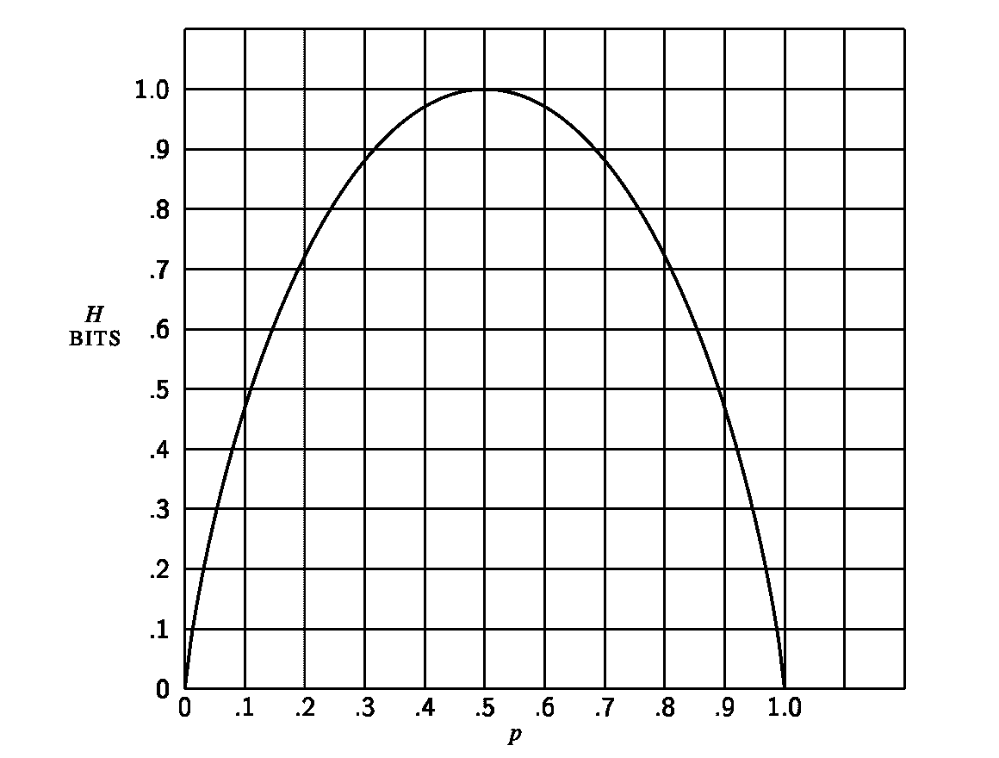
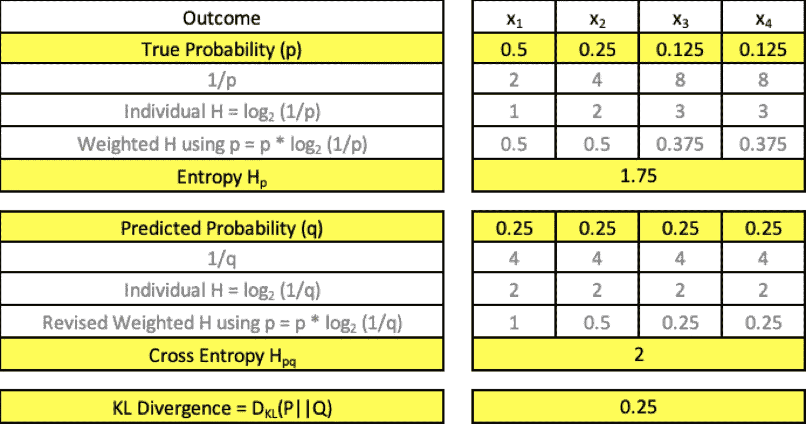
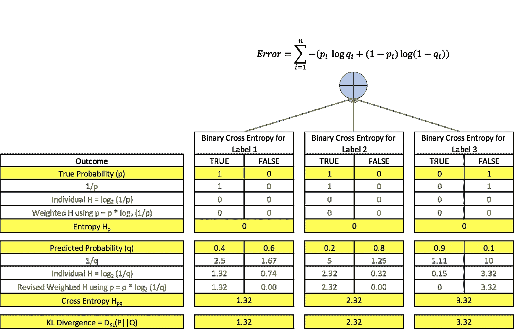

# 熵、交叉熵、KL 散度和二元交叉熵

> 原文：<https://towardsdatascience.com/entropy-cross-entropy-kl-divergence-binary-cross-entropy-cb8f72e72e65?source=collection_archive---------5----------------------->

## 基于熵的损失函数的基础

# 熵

对我来说,(香农)熵的定义乍一看并不是直觉。必须抽象一点才能理解它的意思。这里有一个解释流程，可能对你们中的一些人有用。

想象一个抛硬币机，它抛出一枚硬币，并发出一个信号，指示抛硬币的结果。对于一个公平的硬币，有两个概率相等的 0.5 的可能结果。机器需要多少比特的信息来传达结果？现在是 1 点。正面说 0，反面说 1。换句话说，我们需要多少个二元答案(是/否)问题来决定结果？是 1，对“是正面吗？”会告诉我们结果是什么。

**Figure 1**: Fair Coin Toss Example

想象扔两枚硬币。四种可能的结果(hh，ht，th，tt ),等概率 0.25。在这种情况下，我们需要两位或二进制答案问题(00，01，10，11)来了解发生了什么。对于三个硬币，它将是 3，以此类推。

**Figure 2**: Two Coin Toss Example

那么这个“位数”是多少呢？这是传递掷硬币结果所需的最少位数。有一枚硬币的投币机需要向接收器发送一位(0 或 1)来传达给定的投币输出是什么。类似地，两台和三台投币机必须分别发送 2 位和 3 位来传递输出。使用“对数”的定义，这个数也是可能结果的二进制对数。即，例如:2 的 3 次方= 8 => 8 个可能的结果需要 3 个二进制位来表示结果。这也是事件的“熵”。

**Figure 3**: Is Entropy the binary log of count of possible outcomes?

那么熵是我们交流结果所需的最小位数吗？不完全是，但这是个不错的开始。想象一下这个场景:如果掷硬币的结果不一样，会怎么样？如果我们使用硬币，它总是落在头上呢？即正面的概率是 1，反面的概率是 0。嗯，那机器总会发一个“1”。从那个信号中我们什么也学不到。

如果在两次抛硬币的例子中，概率不相等呢？如下图所示，我们可以想出一个编码方案来表示输出，这样对于不同的结果它是不同的。我们不能真正应用“可能结果的二进制对数”，因为仍然有四种可能的结果，但它的概率并不相等，所以“2 位”并不是普遍需要的。

**Figure 4**: Four not-equally-likely Possibilities Example

这里我们需要调整一下我们定义熵的方式。我们真正感兴趣的，不是我们需要多少比特的数据来交流结果，而是“我们真正从交流的内容中学到了多少信息”，而不考虑实际用于交流的物理比特。

换句话说，我们希望用熵来表示结果中有多少“信息内容”——不管它是如何传达给我们的。我们希望它是对信息内容的定量测量，也就是与事件相关的不确定性。它将是“0”，意味着“我什么也没学到”或“我对结果完全确定”，对于一个有偏见的硬币来说，它总是正面朝上。“1”代表掷硬币的公平结果，意味着“我学到了很多”或“我最不确定”掷硬币的公平结果，因为它可能是正面或反面。这种不确定性或信息内容是由熵来衡量的。

虽然在某种程度上，这可能会给我们传达结果所需的比特数带来理论上的限制，但我们不要以此作为定义的基础。比特是完整的——没有“半个比特”。但是我们对熵的最新定义是对传播中“新闻”的一种度量。与面积、长度、重量等其他测量方法非常相似。，它是连续的，可以是任何数或分数。这就是熵的**性质#1** 。

我们将回到图 1 和图 2 的例子来介绍这个度量的另一个属性。当我们处理包含同样可能结果的事件时，度量应该随着可能结果的数量而增加。图 1 具有“1”位熵，图 2 具有“2”位熵，依此类推。这是熵的**性质#2** 。

旁注:这种可能结果的数量为 2 的幂的同等概率实例实际上是我们可以应用“我学到了什么，即信息熵”=“交流结果所需的位数”的理论极限的地方。在许多其他情况下，这种“最短代码”只是一种理论上的限制，实际上，可能需要比消息中的信息更多的比特来传达事件的结果。

我在边注中说了“许多其他情况”，因为除了这样的场景之外，在可能结果的数量不是 2 的幂且概率不等的场景中，也有可能实现理论上的“最短代码”。在有可能对结果进行分组的场景中，分组是均匀分布的，我们可以实现这一点。看看下面这个有三种结果的例子。

**Figure 5**: Three not-equally-likely Possibilities Example

回到确定我们需要多少个二元问题来导出结果，首先，我们可以问“结果是 x1 吗？”—这类似于将 x1 归入一个组，将 x2、x3 归入另一个组。这两个组成为结果的概率相等(x1 的概率= 50% = x2 和 x3 的概率之和= 33.33% + 16.66%)。如果答案是“不是”，那么我们可以问“是 x2 吗？就这样，我们需要问的决定结果的最大问题是 2。

这个“如果结果是 x1，我只需要一个问题，否则我需要问最多两个问题”的等价位表示在表格图示中提供。下面的图 6 提供了同样的二叉树视图。与前面的例子相反，在这个非等概率例子中，您可能会注意到，表示结果所需的位数因结果而异。如果我们希望提出更少的问题或更少的问题来表示这种来源的结果，那么使用第一位或第一个问题来确定最可能的结果是否已经发生是有意义的。

这将我们引向熵的第三个属性。如果一个选择可以分解为两个连续的选择，即在上面的例子中，在 x1，x2，x3 之间的选择被分解为在(x1)和(x2，x3)之间的选择，那么原始熵应该是各组的各个熵的加权和。换句话说，二叉树表示的节点处的总期望熵=来自两个子节点的熵的加权和，其中权重是特定子节点为真的概率。

**Figure 6**: From “[A Mathematical Theory of Communication](http://A Mathematical Theory of Communication)” by C. E. Shannon

那么，我们如何定义这个衡量标准呢？让我们回到“可能结果的二元对数”的定义——我们看到它不适用于非等概率结果。如果你想一想，在一个事件中，具有同等可能性结果的可能结果的数量与概率的倒数相同。即在掷硬币的游戏中，可能结果的数量= 2 = 1/0.5。其中 0.5 是结果的概率。对于两次抛硬币的例子，可能结果的数量= 4 = 1/0.25。因此，也许定义它的正确方式不是“可能结果的二进制对数”，而是“1/p 的二进制对数”，其中“p”是给定结果的概率。虽然这是一个结果，事件的香农熵可以描述为事件的预期信息内容。

**Figure 7**: From “[A Mathematical Theory of Communication](http://A Mathematical Theory of Communication)” by C. E. Shannon

使用这个定义，我们到目前为止看到的不同例子的信息内容和预期熵在下面的图 8 和图 9 的表格中给出。在每一个例子中，我们可以注意到这三个特性都得到了满足。该度量是连续的，单调增加(比较单次和两次公平抛硬币的例子),根据期望值的定义，它是单个熵的加权和。

**Figure 8**: Single Coin Examples with Shannon Entropy defined

**Figure 9**: Four Possibilities Examples with Shannon Entropy defined

让我们更仔细地看看这个不公平抛硬币的例子。您可能会注意到，与磁头相关的信息内容将是(1/0.9) = 0.15 位的二进制对数。与之相比，普通硬币有 50%的正面概率，二进制对数为(1/0.5) = 1 位。有偏向的硬币具有较少的与正面相关的信息，因为它 90%的时候是正面，即几乎总是正面。有了这样一枚硬币，得到一条尾巴要比得到一个头有新闻价值得多。这就是为什么与尾部相关的信息是(1/0.1) = 3.32 位的二进制对数，比与头部相关的信息多得多。

换句话说，结果越罕见，我们需要问的问题就越多，以确定它是否发生过。“小行星在我们的太阳系吗？”也许是我们在探索更深、更难的问题来规划它的进程之前需要回答的第一个问题。在我们确认极不可能发生的与地球相撞的情况发生之前，我们可能会问更多的问题。这就是说，更不寻常的结果或具有很多不确定性的场景需要学习更多与该结果相关的信息。使用“最少比特数来表示”只是“信息发送者”表达同一事物的一种非常具体的方式。熵是与事件相关的信息价值的量度。

下面是概率为 p 和(1-p)的两种可能性的熵图，这将有助于注意到一些有趣的观察结果，重申我们在上面看到的。我们可以注意到，在概率为 1 和 0 的两种极端情况下，H 都是 0。在这两种情况下，我们都没有真正学到任何东西。当可能性相等时，它是最高的。这也是有意义的，因为在这种情况下，不涉及偏见，事情完全是随机的，任何事情都可能发生。

**Figure 10:** From “[A Mathematical Theory of Communication](http://A Mathematical Theory of Communication)” by C. E. Shannon

# 交叉熵和 KL 散度

让我们回头看看图 9 中的例子。想象一下，我们正计划对“掷两枚硬币”事件的结果的交流进行建模。假设我们开始时假设这些硬币是公平的，因此我们预测所有结果的概率相等，因此开始使用两位来表示结果，如图 9 的左侧表格所示(都是 0.25)。一段时间后，我们观察到这些不是真正公平的硬币，真实的概率分布如图 9 的右侧表格所示(0.5，0.25，0.125，0.125)。

**Figure 9**: Four Possibilities Examples with Shannon Entropy defined

现在，很明显我们在这里效率不高。这两种分布的期望熵是不同的，1.75 对 2，不同结果的个体信息内容是不同的，并且显然我们的编码方案可以更好。例如，我们不需要两个比特来表示概率为 0.5 的第一个结果，一个比特就可以了。

我们如何知道这里的低效率有多高？这正是交叉熵和 KL 散度帮助我们做的。交叉熵是使用针对预测分布 q 优化的编码方案时，真实分布 P 下的预期熵。图 10 中的表格演示了交叉熵的计算方法。结果的信息内容(aka，用于该结果的编码方案)基于 Q，但是真实分布 P 被用作计算期望熵的权重。这是分布 P，q 的交叉熵，kull back–lei bler 散度是 PQ 的交叉熵 H 和 P 的真实熵 H 之差。

**Figure 11:** Cross Entropy and KL Divergence

(P||Q)的 KL 给出了当使用针对 Q 优化的编码方案来表示真实分布 P 时所需的平均额外比特。换句话说，如果我们开始使用真实分布 P 而不是之前的分布 Q 来表示相同事件，这将是我们将实现的信息增益。如果 P 是预测的分布，并且如果为 P 优化的编码方案被用来表示真实的分布 q，那么这当然是不同的

仔细观察公式和直觉，KL 散度，尽管它是两个分布之间差异的度量，但它不是真正的度量，即 KL (P||Q) <> KL for (Q||P)。然而，很容易看出，随着 Q 越来越接近 P，这种差异会减小，当 P=Q 时，这种差异将为 0，如图 12 所示。

**Figure 12**: Moving Q towards P

这就是我们在训练神经网络时使用的损失函数。当我们遇到图像分类问题时，训练数据和相应的正确标签代表 P，即真实分布。NN 预测是我们的估计 q。这种单标签分类中涉及的数学相对更简单，因为对于给定的标签，P 将是 1，而对于其他标签，P 将是 0。

**Figure 13**: Loss Function in Image Classification

将事情写成一个等式(并应用幂法则得到-1):

**Figure 14**: Cross Entropy

# 二元交叉熵

在多类分类问题中，“n”代表类的数量。在图 13 的例子中，这是 4。在二进制分类问题中，也就是说，就像掷硬币一样，类别/输出的数量是 2，并且任何一个都应该是正确的，并且一个的概率是(1-另一个的概率)，我们可以将它写如下:

**Figure 15**: Binary Classification

我们也可以将这种二进制交叉熵表示用于多标签分类问题。在图 13 所示的示例中，这是一个多类分类问题，其中只有输出可能为真，即只有一个标签可以标记到图像。在我们可以有多个标签与图像相关联的情况下，即每个标签或其自身输出的概率可以是 0 到 1 之间的任何值，并且它们彼此独立，我们仍然可以利用交叉熵来弥补我们的损失。每个标签分类本身是一个独立的二进制交叉熵问题，全局误差可以是所有标签的预测概率上的二进制交叉熵之和。

从这一点开始，sigmoid vs softmax 在多分类 vs 多标签问题中的适当用法应该变得更加明显。虽然有点啰嗦，但希望这篇文章能对这些函数的工作原理有所澄清。