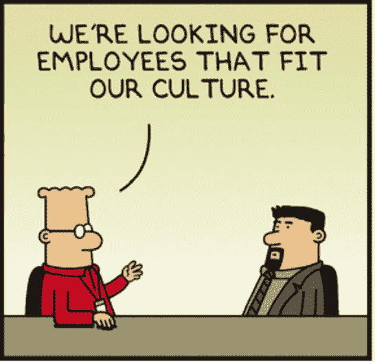
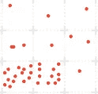
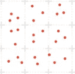
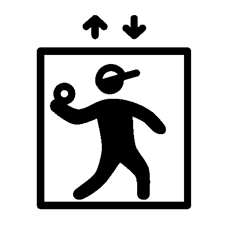

# 熵、电梯推销和让团队工作！

> 原文：<https://towardsdatascience.com/entropy-elevator-pitch-and-getting-teams-to-work-e3099679b74f?source=collection_archive---------17----------------------->

Image credits

在我们公司进行的一轮有趣的面试中，有一轮是文化面试——通常我们有一组精选的“文化”面试官来做。我知道大多数公司都会进行某种形式的人力资源调查，但这一调查之所以突出，不仅是因为我们对我们公司列出的每一种文化价值观都进行了大量的实际调查，以了解候选人与这些价值观的一致程度，还因为有不可忽视的拒绝率？！因此，在一轮文化面试中，文化面试官对一位在前几轮面试中表现出色的候选人并不热心，面试官给出的理由是，这位候选人到处都是*，特别是在他为什么要加入我们公司的问题上。*

*一开始，这似乎是最模糊、最不客观的说法，尤其是在被委以评估候选人的客观任务时。所以，作为一个文化轮采访者，有这样的评价(！)或者有比看上去更多的东西——在整个陈述中几乎有一些潜在的客观性！不过现在我想把你们的注意力转移到科学中最有趣的概念之一——熵，尽管在这个时间点上我可能会像“*一样到处跑。**

**

*All over the place?! ([Photo Credits](https://www.flickr.com/photos/garryknight/8338089963))*

*简单地说，熵是衡量一个系统随机程度的指标。或者系统中的不确定性。在你决定这篇文章是为统计学家还是物理学家写的之前，让我用简单的术语快速解释一下熵的含义，以及为什么它与评估一轮文化面试这样模糊的事情有联系！*

**

*Figure 1*

*想象一个容器中有气体分子，用网格线标出，如图 1 所示。想象一下如果气体分子被画出来，这个图形会是什么样子。*

**

*Figure 2*

**

*Figure 3*

> *这张图更接近图 2 还是图 3？*

*我觉得你脑海中的画面更有可能是图 3 而不是图 2。现在，答案不是因为你知道气体分子的热力学，而是因为在没有先验信息的情况下，你的大脑可能无法确定特定的模式，只会想象最不确定的状态，如图 3 所示。*

*熵抓住了这一点，克劳德·香农提出了以下有趣的公式，他是杂耍家、独轮车手和数学家。*

> *H = -𝛴pᵢ * log(pᵢ)*

*注意，在本文中，pᵢ是气体分子出现在特定网格单元 I 中的概率*

*如果你费心去做数学计算，图 3 的≅3.14，因为任何气体分子成为任何网格单元的概率是相等的(⅑).而对于图 2，h . ≅0.57(因为两个过度拥挤的网格单元构成了它们之间几乎 70%的气体分子)。*

*显而易见的是，熵越大，随机性就越大。或者更大的不确定性。在没有先验信息情况下，人们会假设任何系统都具有极大的随机性。这里面没有什么有趣的东西。所以熵也可以被解释为一个系统有多无趣的度量——熵越大，事情看起来就越无聊！*

*在信息论世界中，熵还有另一个定义，正如你很快就会意识到的，这个公式正是互联网[的核心。](https://www.theguardian.com/science/2014/jun/22/shannon-information-theory) *H* 表示表示系统所需的最小位数(二进制数)。因此，如果一个系统是完全随机的，就要花很长的描述来解释这个系统。因此，图 2 的描述比图 3 简洁了近 5 倍。正如你在图 3 中看到的，没有太多的目的，看起来是“随机”的。另一方面，图 2 似乎有某种目的——如果我们试图解释，分子似乎越来越接近底部网格中的原点。*

*因此，熵似乎是一个系统中目的(或实际上缺乏目的)的**度量**。暂停一会儿，试着解释你现在追求的东西的目的——它可能是你正在做的一份工作，一项活动，甚至是你正在经营的一家公司。*

**

*‘Elevator Pitch’ ([Image credits](https://www.flickr.com/photos/garryknight/8338089963))*

*你是用一篇长文，还是一段，还是一行来回答的？你有没有发现自己“到处跑”？如果你能用一句话解释清楚，那可能就是人们所说的“*电梯营销*”。祝贺你——你已经能够实现你所做的相当低的熵。而且熵越低，目的性越大，越有意思。也许这就是为什么创业界的投资者不断向你索要电梯推介的原因！或许，当这些点连接起来时，候选人不幸地得到了关于文化问题的*最大熵*答案？！现在看起来，评估熵实际上是一种非常客观的方法来处理这些主观的任务。*

*最大熵原理指出，一个系统最有可能处于最不确定的状态——即最大熵状态，除非有给定的约束。假设这个系统是你试图建立的组织或者你领导或工作的团队。你认为团队/组织中的个人表现如何？在这个节骨眼上，你想到的是图 3 还是图 2 或者别的什么？*

*这就是你的线索——描绘理想状态，努力减少熵。如果你的团队是一致的，那么熵就会减少，不确定性就会减少。现在的诀窍是在团队动态、个人的冲突动机、市场因素等等中做到这一点。但是最小化熵确实减少了不确定性，并且完成了更多的工作。所以如果你是团队的一员，你的工作不仅仅是做好你的工作，还要参与降低你团队的整体熵。事实上，我会更进一步说，在一个组织中减少熵的人实际上是领导者——他们的角色和责任是调整、澄清混乱和简化系统状态。*

**

*People all over the place => ‘High’ Entropy? ([Image credits](https://www.flickr.com/photos/infomastern/28745290236))*

*令人惊讶的是，我们意识到[关键似乎又在于简化](https://medium.com/p/3a69f01b4d50)。顺便说一下，在[热力学](https://en.wikipedia.org/wiki/Entropy_(classical_thermodynamics))领域，熵被定义为系统中不能用来做功的能量的**度量——所以作为领导者和团队成员，你在这方面的工作被砍掉了**。顺便说一句，在团队和业务的背景下，有一些统计技术可以估计熵，我就不赘述了(为了最小化本文本身的熵，但是如果你有兴趣，可以 ping 我！).*

*最后，简洁和简单中不仅有一点(装饰性的)优雅，有时还有更大的目的性、确定性和产出。熵也是这么说的！*

*PS:出于对数学的好奇，对 Shannon 是如何偶然发现这个概念的好奇，这里有一个伟大的[线程](https://math.stackexchange.com/questions/331103/intuitive-explanation-of-entropy)在同一个线程中结束，我花了一些时间来理解这个公式的推导。*