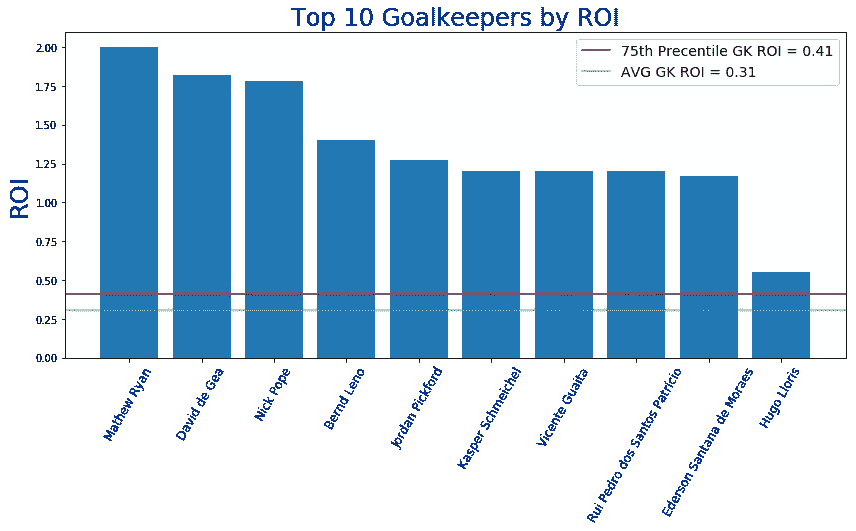
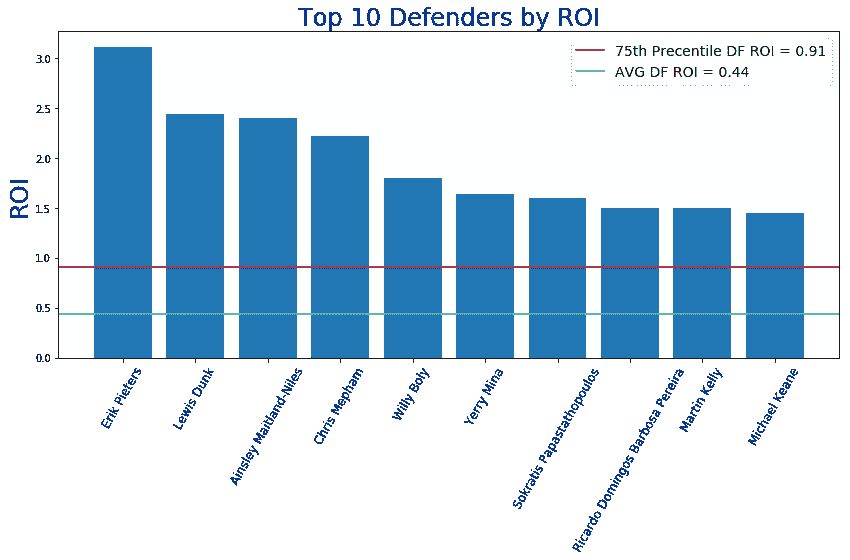
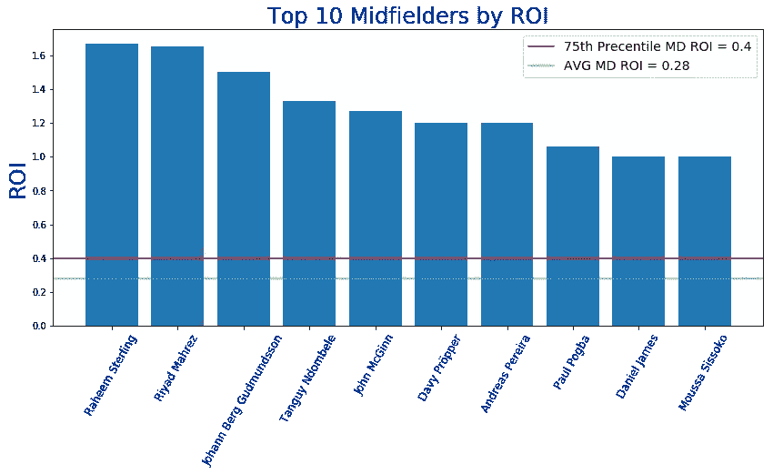
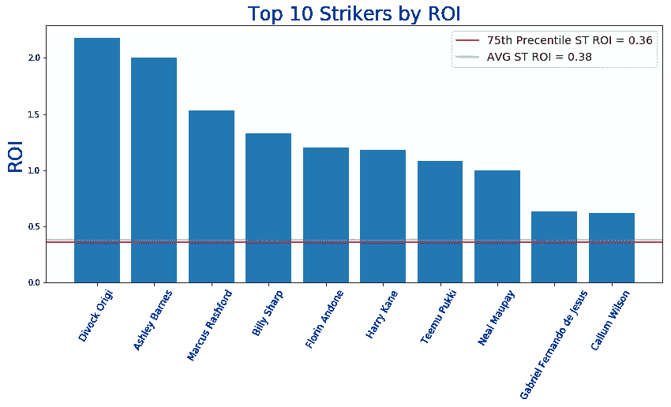
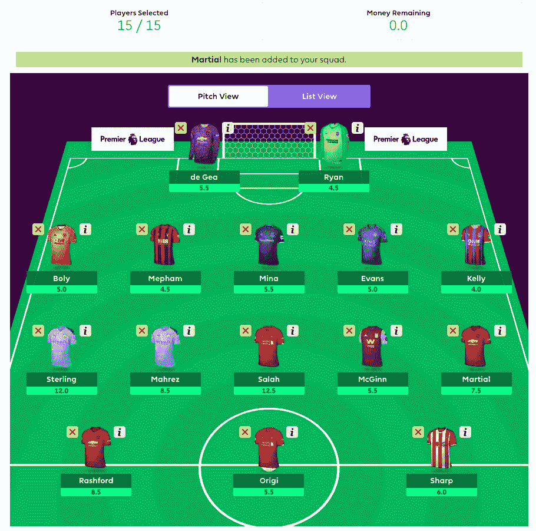

# EPL 幻想游戏周-1 统计和智能玩家选择的算法建议

> 原文：<https://towardsdatascience.com/epl-fantasy-gameweek-1-stats-and-algorithm-recommendations-for-smart-picks-23b4c49cae8?source=collection_archive---------22----------------------->

## GW 1 统计更新，算法逻辑更新和更多…


# **链接到以前的文章:**

如果你刚刚第一次登陆这个博客，请务必阅读原始博客，它更详细地描述了我们如何使用 Python 编写一个球员推荐算法，该算法使用 Moneyball 方法每周选择最佳的 EPL 幻想队。以下链接:

[](/epl-fantasy-is-one-week-away-and-our-algorithm-is-ready-to-play-78afda309e28) [## EPL 幻想是一个星期了，我们的算法已经准备好了！

### 我们击败 EPL 幻想游戏的摇钱树方法

towardsdatascience.com](/epl-fantasy-is-one-week-away-and-our-algorithm-is-ready-to-play-78afda309e28) [](/beating-the-fantasy-premier-league-game-with-python-and-data-science-cf62961281be) [## 用 Python 和数据科学击败梦幻英超

### 我们对 EPL 梦幻联盟的摇钱树方法

towardsdatascience.com](/beating-the-fantasy-premier-league-game-with-python-and-data-science-cf62961281be) 

## **本周有什么新鲜事？**

我们在算法中加入了额外的逻辑，允许您每周动态更新以下指标，以优化长期投资回报预期:

1.  **宣布本周**你想用什么阵型——算法聪明地挑选出最大化预算的选择阵型。因此，如果您声明一个 4–4–2 编队，代码将得到您最好的 4-DF，4-MD 和 2-ST 的 ROI，然后用您能负担的剩余预算填充剩余的点，仍然最大化 ROI。
2.  **宣布预算分配** —我们现在可以动态设置我们希望每个职位花费总预算的多少%。所以，你可以说 GK = 10%，DF = 25%，MD = 40%，ST = 25%，算法只会在 GKs 上花 1000 万美元，DFs 上花 2500 万美元，MDs 上花 4000 万美元，STs 上花 2500 万美元。这样，如果你决定从 5-3-2 阵型转换为 3-5-2 阵型，你可以相应地改变预算，在进攻和防守球员上花更多的钱。
3.  **宣布对手实力** —幻想已经有了一个 FDR 属性，可以查看下一个对手的团队实力。我们得到了这个数据，目前正在查看未来 3 场比赛的 AVG _ 对手 _ 实力，并告诉我们的算法跳过选择一名球员，如果他们球队的 **AVG_FDR ≥ 3.5。**我们可以动态地改变截止数，也可以控制我们是否希望预测 1、2、3 或更多场比赛。现在，我们使用接下来的三场比赛，因为我们试图避免每周进行太多的转会，所以我们想确保当我们为我们的球队挑选球员时，他们至少在接下来的 2-3 场比赛中有很高的投资回报率预期，然后我们才会考虑将他们转移或放在替补席上。

**当前幻想对手实力排名:**

请注意，我们也可以随着赛季的进展和相对团队实力的变化而动态更新。但首先，我们发现这个排名已经足够了。

```
 ('LIV', 5),
 ('MCI', 5),
 ('ARS', 4),
 ('CHE', 4),
 ('MUN', 4),
 ('TOT', 4),
 ('BOU', 3),
 ('BUR', 3),
 ('CRY', 3),
 ('EVE', 3),
 ('LEI', 3),
 ('NEW', 3),
 ('SOU', 3),
 ('WAT', 3),
 ('WHU', 3),
 ('WOL', 3),
 ('AVL', 2),
 ('BHA', 2),
 ('NOR', 2),
 ('SHU', 2)
```

**游戏周 1 统计:**

下面你可以看到每个职位的**前 10 名 ROI 玩家。请记住，投资回报率是按总积分/玩家成本计算的，因此，如果一些玩家目前的价格过高，你可能看不到他们有很多积分。这一切都将在几周内汇聚起来，更稳定、表现最佳的玩家最终将出现在投资回报率排行榜的前列。**

**投资回报率排名前十的门将**



**投资回报率排名前十的防守球员**



**投资回报率排名前 10 的中场球员**



**投资回报率排名前 10 的前锋**



一旦我们积累了几个星期的数据，我计划还包括其他有趣的统计数据，如前 10 名球员的**、【总奖励点数】、【每分钟点数】**和团队统计数据，如**、【总团队投资回报率】、**、**、【AVG 玩家投资回报率】等。因此，我们可以开始识别“表现不佳”和“表现出色”的团队，以及“定价过低”和“定价过高”的球员。**

**Gamesweek 2 最佳团队推荐:**

首先，我们需要定义我们的阵型，预算分配，以及哪些球队我们不会因为高 FDR(对手实力)分数而选择球员。

1.  **团队形成:**第 2 周的 3–4–3 形成
2.  预算分配:GK = 1000 万美元，DF = 2400 万美元，MD = 43 美元，ST = 2300 万美元
3.  **从玩家选择中排除的队伍:**

下面你可以看到在接下来的 3 周内，AVG 最难对付的球队:

```
 ('Arsenal', 4.0),
 ('Burnley', 4.0),
 ('Spurs', 4.0),
 ('Brighton', 3.67),
 ('Southampton', 3.67),
 ('Bournemouth', 3.33),
 ('Liverpool', 3.33),
 ('Norwich', 3.33),
 ('Sheffield Utd', 3.33),
 ('Wolves', 3.33),
 ('Aston Villa', 3.0),
 ('Leicester', 3.0),
 ('Man City', 3.0),
 ('Man Utd', 3.0),
 ('Newcastle', 3.0),
 ('Watford', 3.0),
 ('Crystal Palace', 2.67),
 ('Everton', 2.67),
 ('Chelsea', 2.33),
 ('West Ham', 2.33)
```

根据这些 AVG FDR 分数，我们的算法将在接下来的 2-3 个比赛周内避免选择来自**阿森纳、伯恩利、马刺、布莱顿和南安普顿**的球员，直到 AVG FDR 分数下降**到 3.5** 以下。

**gw2 的最终团队建议:**

请注意，下面的这些选择仅基于一周的数据，这意味着许多这些选择可能基于暂时的投资回报率分数而言有点过早，从长远来看可能不成立。也就是说，我们预计在至少 4-5 周的数据之后，这些数字将开始向更准确的长期投资回报预期靠拢。在那之前，你可能会看到一些随机的玩家名字，而看不到一些你通常期望看到的可靠玩家。尽管如此，这些初始统计数据可以让我们了解哪些球员/球队目前“炙手可热”，并可能帮助我们找到一些价格低廉、投资回报率高的初始隐藏“宝石”，这些宝石目前可能定价过低，但如果他们持续表现，从长远来看将获得大量价值。



由于我们不能每周完全更换我们的团队，我们将使用上述建议和当前的 ROI 统计来为我们的团队选择 1-2 个替代者——“算法”，并尝试在游戏周 2 期间优化最大 ROI。请注意，我们最初的球队选择是基于上个赛季的 ROI 统计数据，因此需要几周时间和统计数据更新才能开始删除上个赛季的一些“表现不佳”和“定价过高”的球员，并开始添加当前赛季的一些更热门的“表现过度”和“定价过低”的球员。

请随时与我们联系，就我们如何进一步改进该算法提出想法和建议，或者就您可能希望我们在未来的博客帖子中计算和可视化的其他有趣的统计数据提出建议。

祝大家在 GW2 期间好运！