# EPL 幻想 GW10 回顾和 GW11 算法精选

> 原文：<https://towardsdatascience.com/epl-fantasy-gw10-recap-and-gw11-algorithm-picks-8f30b5e680b3?source=collection_archive---------20----------------------->

我们的钱球方法的幻想 EPL(队 _id: 2057677)

如果这是你第一次登陆我的幻想 EPL 博客，你可能想先看看[第一部分](/beating-the-fantasy-premier-league-game-with-python-and-data-science-cf62961281be)、[第二部分](/epl-fantasy-is-one-week-away-and-our-algorithm-is-ready-to-play-78afda309e28)、[第三部分](/epl-fantasy-gameweek-1-stats-and-algorithm-recommendations-for-smart-picks-23b4c49cae8)、[第五部分](/epl-fantasy-gw3-recap-and-gw4-algorithm-picks-bc384ce1374b)和[第九部分](/epl-fantasy-gw8-recap-and-gw9-algorithm-picks-b618c5291762)，以熟悉我们的整体方法和我们随着时间的推移所做的改进。我在这个项目中的犯罪搭档是 Andrew Sproul，他和我一样对数据科学、人工智能和幻想 EPL 充满热情。

本周我们将保持简短，因为我们已经在前面的博客中描述了我们的方法和主要更新。

# GW9 世界排名前十的选手

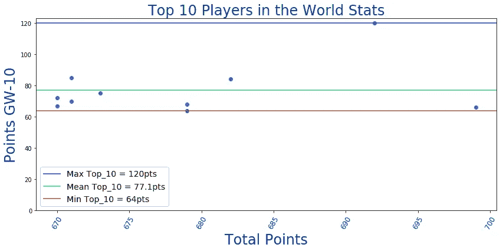

上周末世界排名前 10 位的选手表现非常好！我们认为我们在剧透警报上做得很好……60 分，我想这还不算太差——仍然接近 64 分的前 10 名玩家的最低分。因此，如果你的得分在 65-75 分之间，你会感觉非常好。

# EPL 100 强球员最佳混合团队

当我们谈论世界前 100 名球员的话题时，让我们看看谁是他们球队中按位置选择的前 10 名球员，以及 GW9 最喜欢的球队阵型。

## 前 100 名最佳守门员

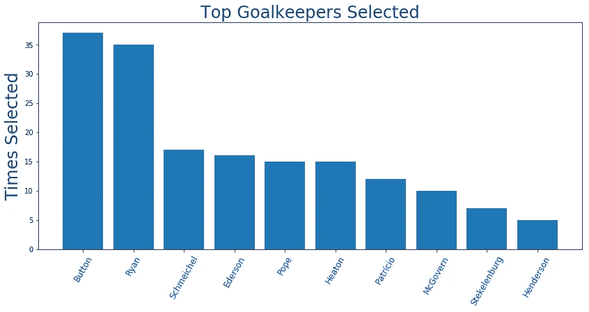

## 前 100 名中最受欢迎的捍卫者

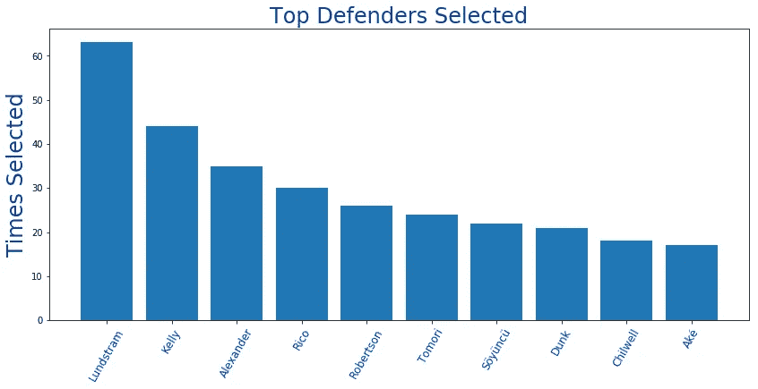

## 前 100 名最佳中场球员

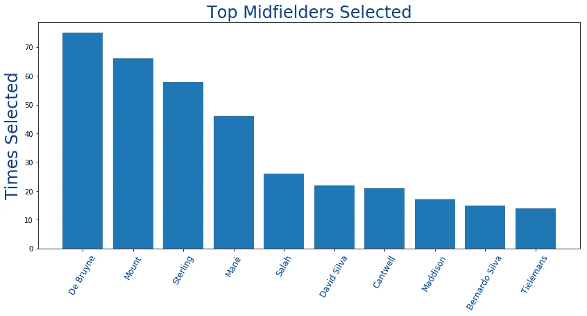

## 前 100 名中入选最多的前锋

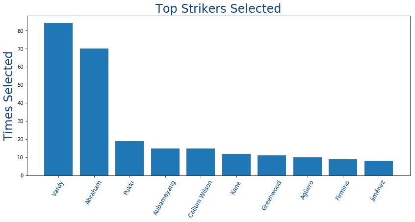

这里最有趣的变化是，与前几周相比，**很多顶级玩家放弃了 Pukki。对于大多数顶级球员来说，似乎瓦迪和亚伯拉罕是可靠的两个选择，但正如你在上面看到的，在第三前锋的选择上有很多差异。**

我们使用这些数据和当前的球员价格来创建下面的球队，这是由前 100 名中最受欢迎的球员组成的:

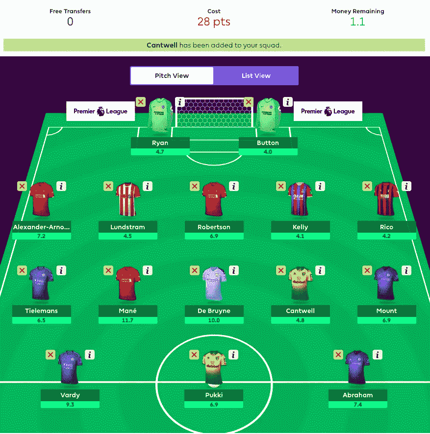

这是一个看起来不错的团队，银行里还有 110 万英镑可以用来玩和测试不同的配置。

## 前 100 名 Fantasy 用户选择最多的团队

似乎大多数球员现在都在使用**3–4–3 阵型**，试图优化他们的进攻球员所获得的总积分，这些球员通常有更高的机会获得助攻、进球和总积分。

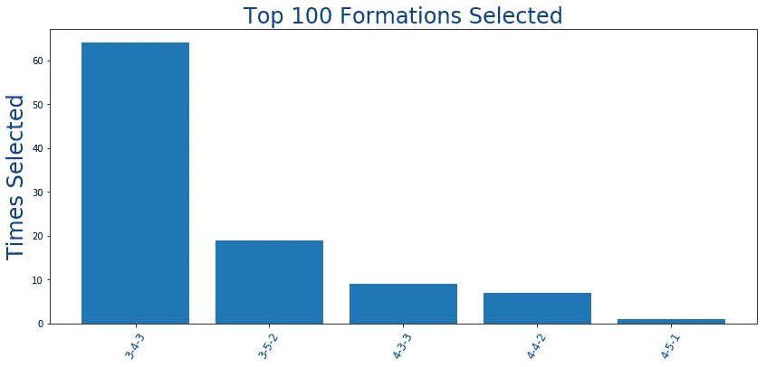

# GW9 团队绩效总结和总体统计

听起来我们在上周博客结尾的祈祷起作用了！经过几个星期的干旱，我们最终得分高于平均水平。我们再次失败的一个地方是挑选我们的队长 Auba T1，他连续第二周只给了我们 2 分:(我们也因为没有在西汉姆和曼联不失球而丢了很多分，这两场比赛直到比赛的后期都接近不失球。如果我们至少有一场不失球，而且我们是瓦迪的队长，我们会有接近 100 分。

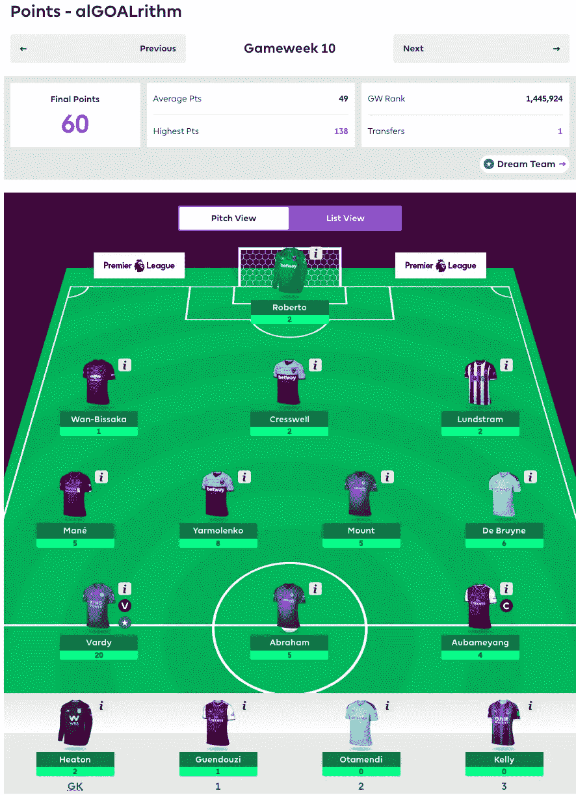

# GW10 整体统计数据为我们的 GW11 精选提供信息

下面让我们从调整后的未来三个比赛周的对手难度等级(FDR)开始:

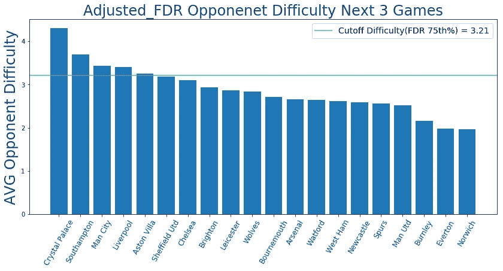

看起来这周我们有很多球队的赛程都很艰难——曼城、南安普顿、利物浦、水晶宫和维拉。我们的算法是这样写的，它不会在本周推荐从这些球队购买球员。赛程相对轻松的球队(如果 EPL 有这种东西的话:P)有**热刺、曼联、诺维奇、埃弗顿和伯恩利，**所以从这些球队得到球员可以在接下来的三场 2-3 场比赛中得到回报。

# 美国东部时间 11 月 1 日上午 9 点最新伤情更新

以下数据来自一个独立网站，该网站更新最新受伤情况的频率比 Fantasy 网站高得多:

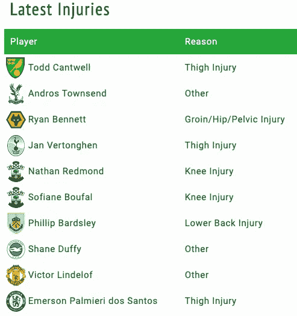

接下来，让我们通过 ROI 和 pts_per_90min 统计数据来看看顶级球员:

**投资回报率排名前十的守门员**

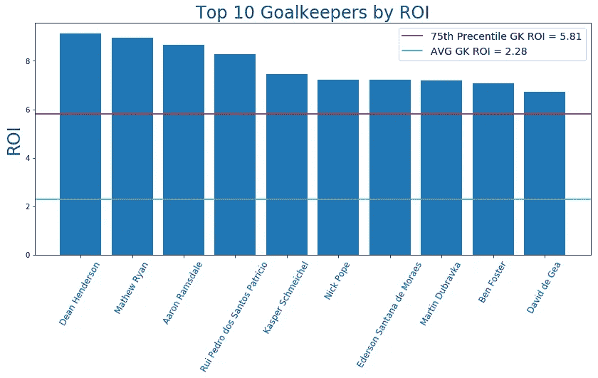

**90 分钟内排名前 10 的守门员**

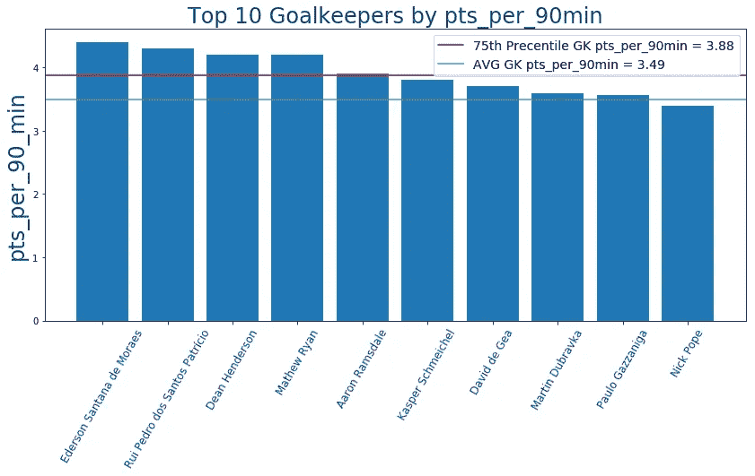

**按投资回报率排名的前 10 名防守队员**

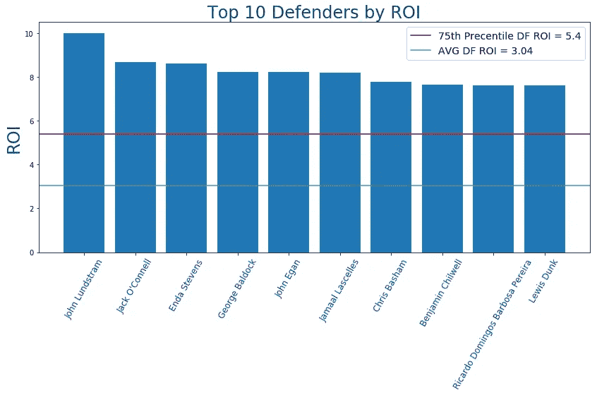

**按 pts _ per _ 90 分钟排名前 10 的防守队员**

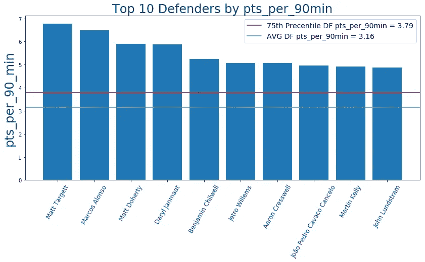

**投资回报率排名前十的中场球员**

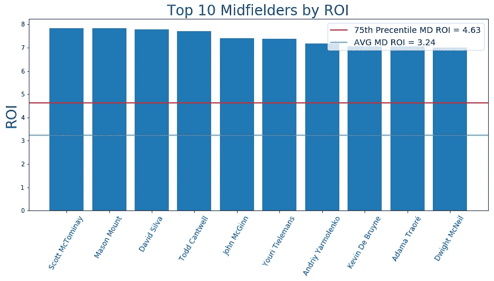

**90 分钟 pts _ per _ 强中场**

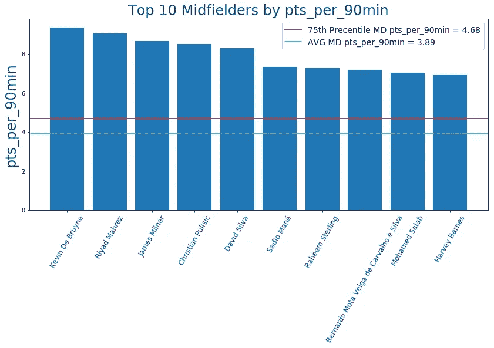

**投资回报率排名前十的前锋**

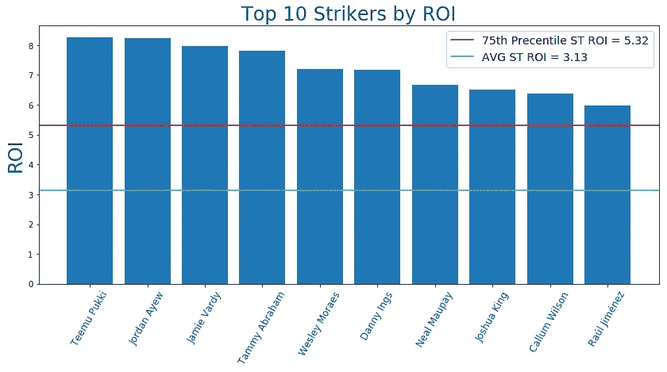

**射手前 10 名由 pts_per_90min**

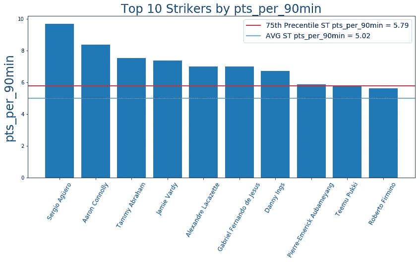

# GW9 算法选择

提醒一下，我们的算法会考虑**调整后的每队阵型预算**，并尝试**最大化主要 11 名球员的每个位置的支出**，然后让你的替补获得良好的 ROI 值。大多数星期我们都在玩 3–4–3 的阵型，现在我们知道世界排名前 100 的球员都选择同样的阵型，我们会更倾向于继续使用它。根据当前的投资回报率得分，在接下来的三场比赛中过滤掉任何具有 AVG 对手难度(FDR≥75%)的球队，并从可用选择列表中删除受伤的球员，我们的算法选择了以下球队作为当前花费全部 1 亿美元预算的最佳球队:

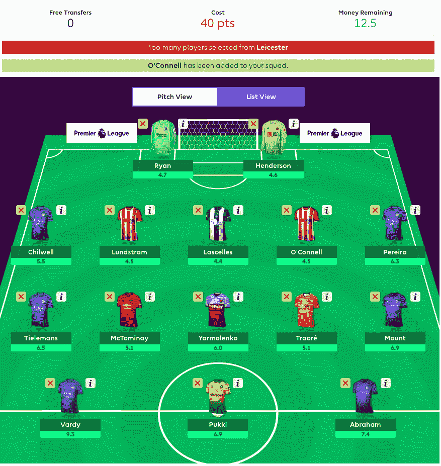

> 注意:由于高 FDR，我们无法从利物浦或曼城挑选球员，这使得这支球队看起来比通常银行里有很多钱的球队更弱，但至少我们得到了**一个有趣的实验，有很多更便宜、高 ROI 的**球员，意识到来自大球队的球员实际上是多么高价。

就我们自己的球队而言，我们决定不做任何重大改变，只是将加扎尼加作为一项长期投资，因为他在对阵利物浦的比赛中表现出色，我们觉得对于像热刺这样更强大的球队来说，他是一个非常便宜的门将。拥有两个相对便宜的门将有望让我们在未来最大限度地在球员身上花钱。

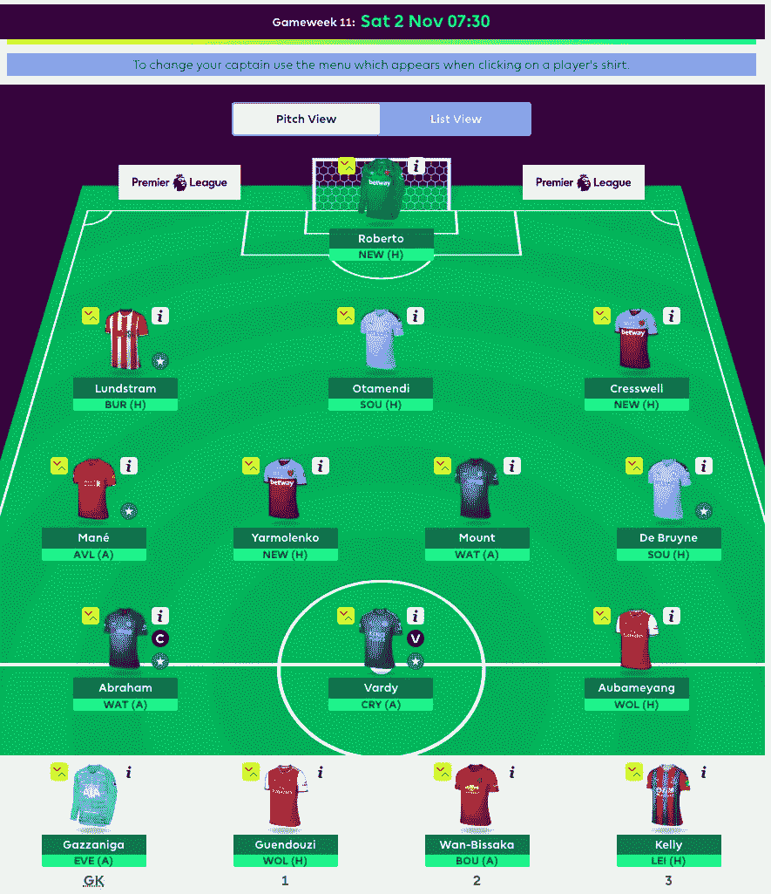

鉴于沃特福德的防守非常薄弱，我们希望最终能在我们的队长身上赢得一些分数，但我们将拭目以待。

# 团队统计

看看**最佳/最差防守和进攻**可以有几种不同的用法——例如，如果一个最佳进攻队与一个最差防守队比赛，你可能想让你的进攻中场或前锋担任队长。此外，当你查看这些位置的算法建议时，你可能想优先考虑防守最好的球队的 DF 和 GK。

# 最佳 7 项防御

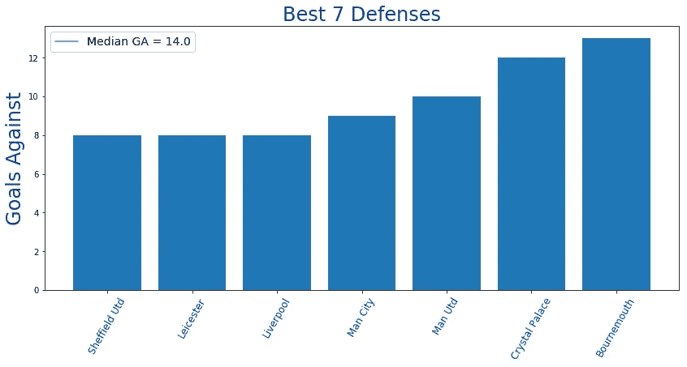

# 最差的 7 种防御

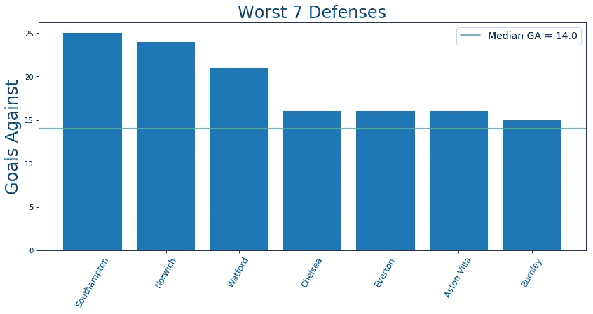

# 最佳 7 项犯罪

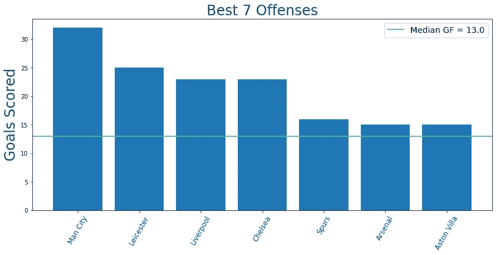

# 最糟糕的 7 项罪行

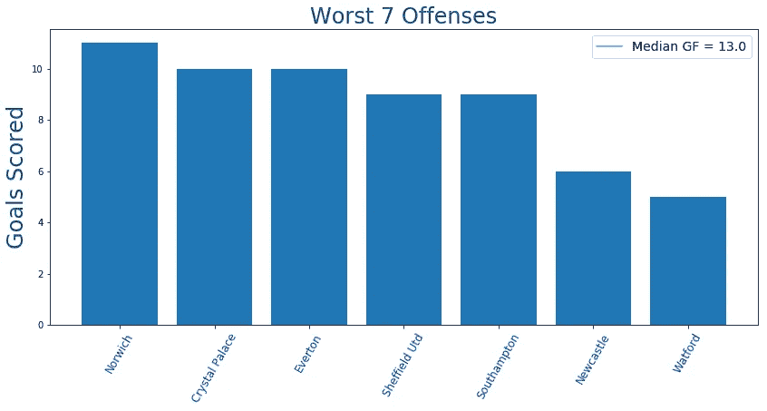

# 累积团队投资回报统计

下面你可以看到球队，按累积玩家投资回报率排序。请注意，**活跃玩家是指已经玩了总可能游戏时间的至少 25%** 的任何玩家。例如，总可能分钟数=周数* 90 分钟= 10* 90 = 900。所以，我们把所有至少打了 900/4 = **225 分钟**的球员都算作是该队的现役球员。

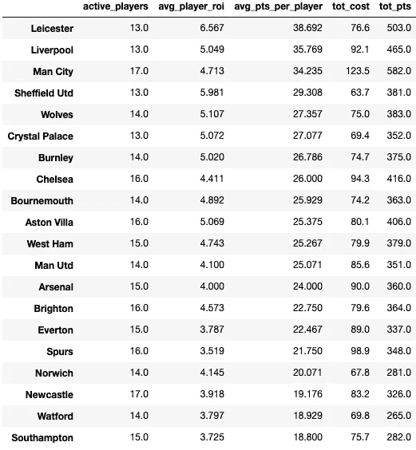

非常有趣，但并不令人惊讶的变化:**我们有了一个新的领导者——莱斯特！！！**他们的平均每名球员得分和平均每名球员投资回报率在上周 9-0 获胜后飙升。顶部的其余部分变化不大。

**阿森纳和曼联**慢慢开始走出下半区，但是**热刺和埃弗顿**仍然有很多价格过高和表现不佳的球员，15-16 名球员轮换。

# 最终想法:

因为我们上次的祈祷似乎起了作用，我们将再次以“最后的祈祷”结束。然而，上周我们搞砸了我们的一个祈祷，我们说“保佑我们的队长本周有额外的速度、力量和射门准确性”，这听起来很好，但我们实际上没有祈祷进球和助攻，所以…我们没有得到任何东西:P 现在是时候验证一句古老的谚语了——“有求必应”。本周，我们向幻想之神祈祷，祈求他们给我们一点怜悯，保佑我们西汉姆不失球，队长得分至少 6 分，但希望更多！

一如既往——感谢您的阅读，祝您周末好运！