# EPL 幻想 GW12 回顾和 GW13 算法精选

> 原文：<https://towardsdatascience.com/epl-fantasy-gw12-recap-and-gw13-algorithm-picks-38a045497a73?source=collection_archive---------38----------------------->

## 我们的钱球方法的幻想 EPL(队 _id: 2057677)

如果这是你第一次登陆我的幻想 EPL 博客，你可能想先看看[第一部分](/beating-the-fantasy-premier-league-game-with-python-and-data-science-cf62961281be)、[第二部分](/epl-fantasy-is-one-week-away-and-our-algorithm-is-ready-to-play-78afda309e28)、[第三部分](/epl-fantasy-gameweek-1-stats-and-algorithm-recommendations-for-smart-picks-23b4c49cae8)、[第五部分](/epl-fantasy-gw3-recap-and-gw4-algorithm-picks-bc384ce1374b)和[第九部分](/epl-fantasy-gw8-recap-and-gw9-algorithm-picks-b618c5291762)，以熟悉我们的整体方法和我们随着时间的推移所做的改进。我在这个项目中的犯罪搭档是 Andrew Sproul，他和我一样对数据科学、人工智能和幻想 EPL 充满热情。

本周我们将保持简短，因为我们已经在前面的博客中描述了我们的方法和主要更新。

# GW11 世界排名前 100 的选手

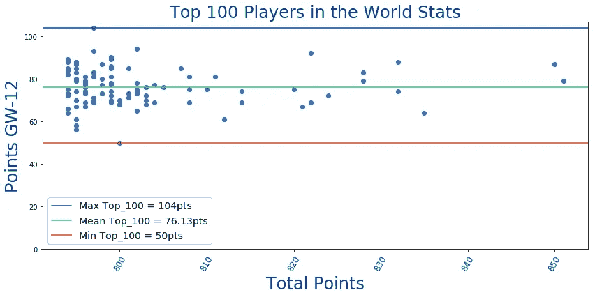

与总平均得分 48 相比，上周末世界排名前 100 位的选手表现非常好！仍然有一些前 100 名选手的分数在 50-60 之间，所以如果你的分数接近或超过这个范围，你仍然可以对自己感觉很好。

此外，有趣的是，到目前为止，本赛季前 100 名球员中的大多数都在 800-820 分之间。只有前 10 名玩家的总分超过 820 分，前 2 名玩家的总分超过 850 分。

# EPL 100 强球员最佳混合团队

当我们谈论世界前 100 名球员的话题时，让我们看看谁在他们的球队中最受欢迎，以及 GW11 最受欢迎的球队阵容。

## 前 100 名最佳守门员

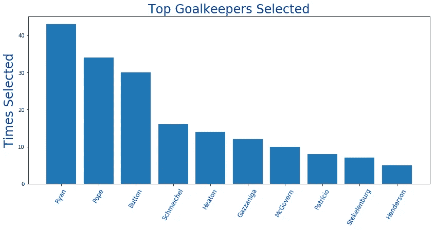

## 前 100 名中最受欢迎的捍卫者

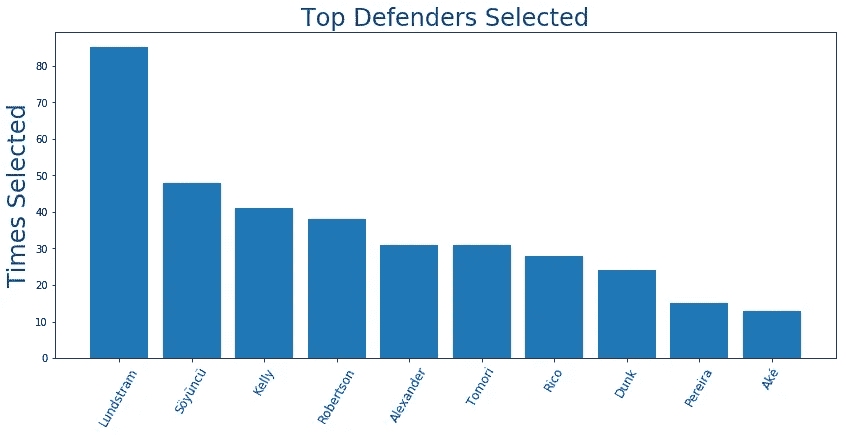

## 前 100 名最佳中场球员

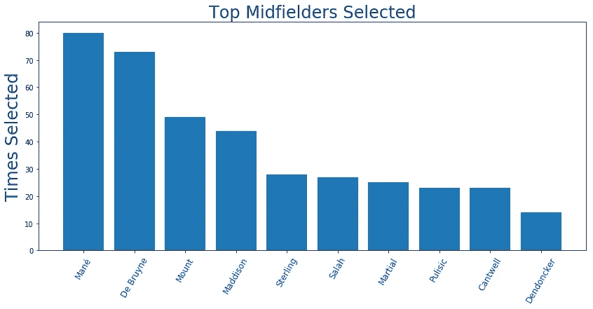

两个有趣的新名字是马夏尔和普利西克，马迪森也被更多的前 100 名玩家选中，并成为第四大首选。

## 前 100 名中入选最多的前锋

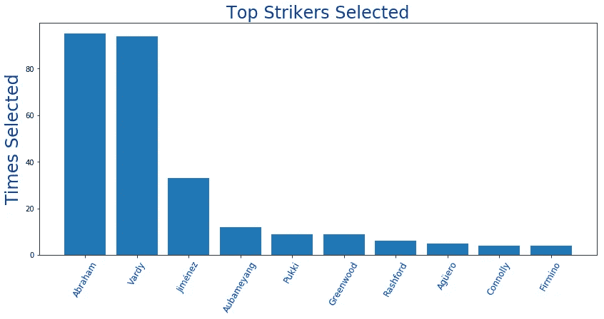

现在很明显，人们终于克服了对 Pukki 的炒作，他已经下降到第五位，他的价格现在也下降到 670 万英镑(Pukki 是幻想中的 EPL 的比特币吗——所有的短期炒作都没有长期价值？—只有时间会证明…)。与上周**相比，另一个有趣的变化是吉梅内斯相当积极地跃居第三，这很可能是由他的状态和狼队被认为容易的计划决定的。**

我们使用这些数据和当前的球员价格来创建下面的球队，这是由前 100 名中最受欢迎的球员组成的:

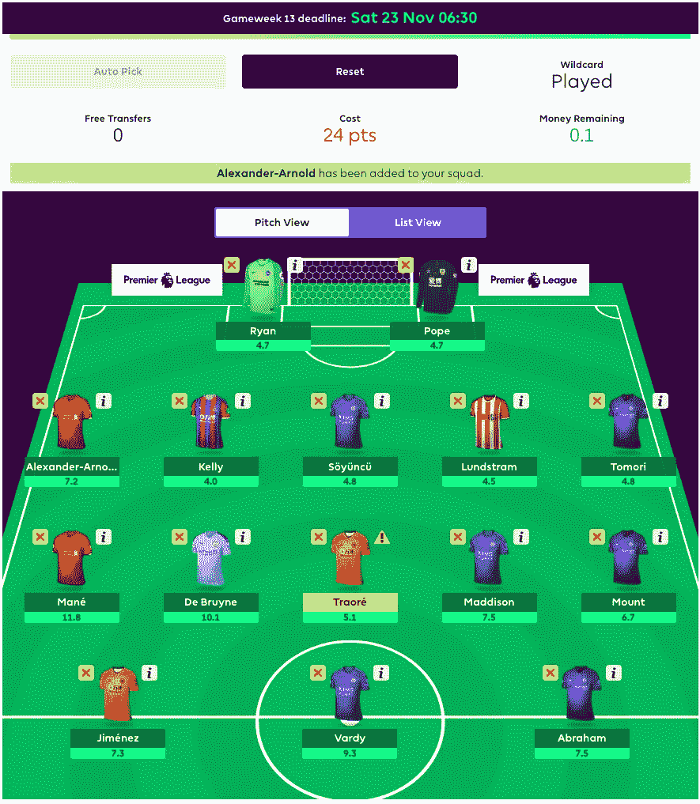

看起来不错的团队，在关键位置上有很多尝试不同选择的余地，同时仍然保持一个坚实的球员核心。

## 前 100 名 Fantasy 用户选择最多的团队

尽管如此，**3–4–3 仍然是首选阵型**，旨在优化他们的进攻球员获得的总积分，这些球员通常有更高的机会获得助攻、进球和总积分。

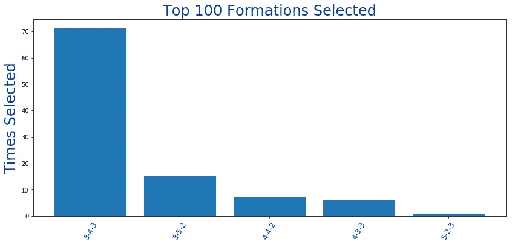

# GW12 团队绩效总结和总体统计

遗憾的是，我们从亚莫连科和克雷斯韦尔身上榨取最后一分钟价值的祈祷没有奏效，我们必须摆脱这些“失去的资产”。不幸的是，我们在 3-4 周前对西汉姆球员的大胆投资没有得到回报，所以**已经严重损害了我们的整体投资回报率**。尽管如此，我们还是以 54 分(高于 AVG 的 48 分)度过了不错的一周，如果维拉没有在对狼队的比赛中取得第 95 分钟的进球，我们会从特拉奥雷和赛斯那里得到更多……:(好消息是，我们连续第三周选择了一位不错的队长——**塔米·亚伯拉罕，8 x2 = 16 分。**我们也没有在替补席上留下太多分数，所以总体来说，我们本周最大化了我们的预期投资回报率，这感觉不错:)

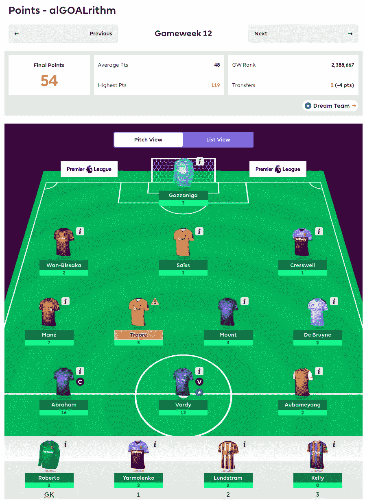

# 为我们的 GW12 选秀权提供信息的 GW12 整体统计数据

下面让我们从调整后的未来三周的对手难度等级(FDR)开始:

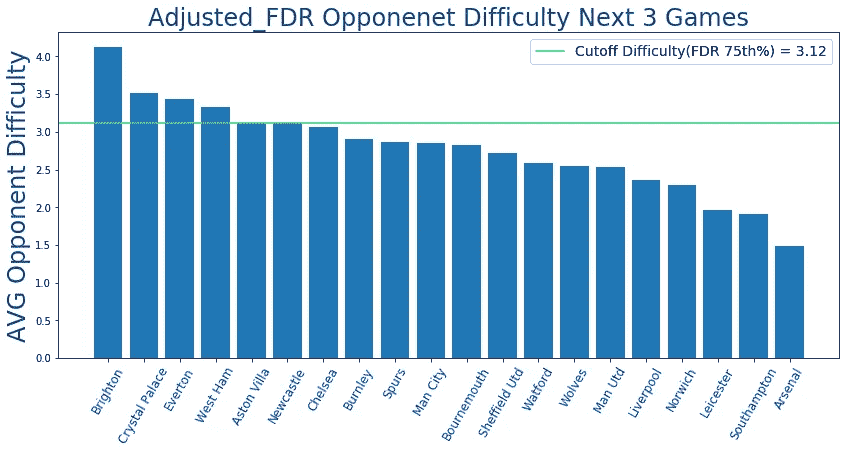

**布莱顿、皇宫、埃弗顿和西汉姆**是仅有的 FDR 得分超过 75%的球队，维拉和纽卡斯尔正好在分界点**。我们的算法是这样写的，它不会在本周推荐从这些球队购买球员。赛程相对轻松的球队有**阿森纳、南安普顿、莱斯特、诺维奇和利物浦，**所以从引进新球员，这些球队可以在接下来的三场 2-3 场比赛中获得回报。**

# 美国东部时间 11 月 20 日上午 9 点最新伤情更新

以下数据来自一个独立网站，该网站更新最新受伤情况的频率比 Fantasy 网站高得多:

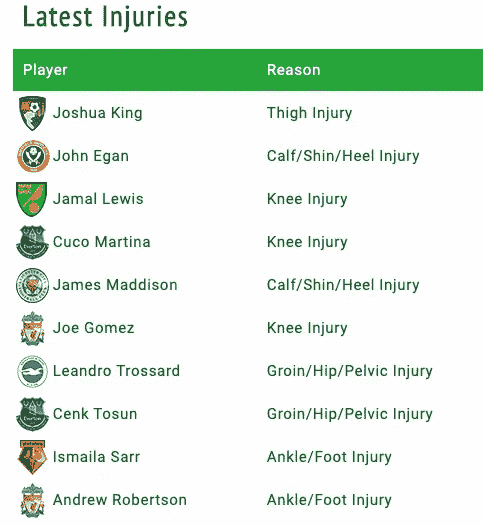

接下来，让我们通过 ROI 和 pts_per_90min 统计数据来看看顶级球员:

**投资回报率排名前十的门将**

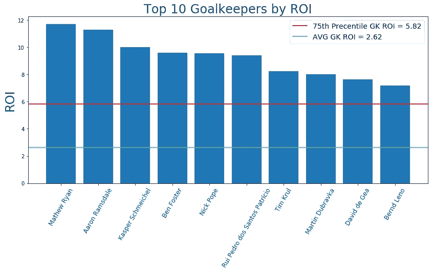

有趣的是，看到拉姆斯代尔、舒梅切尔和福斯特(T21)越来越接近巅峰。

**90 分钟内排名前 10 的守门员**

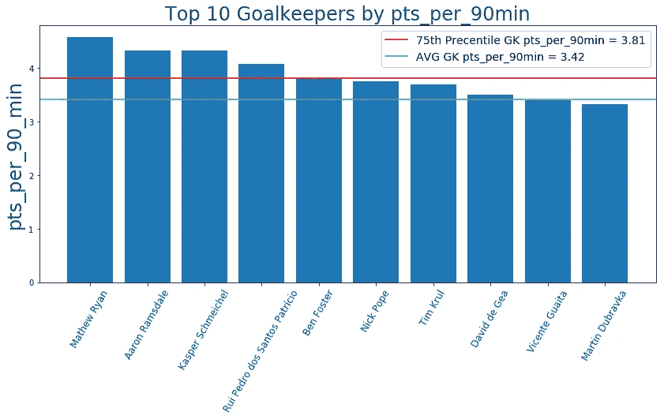

**投资回报率排名前十的防守队员**

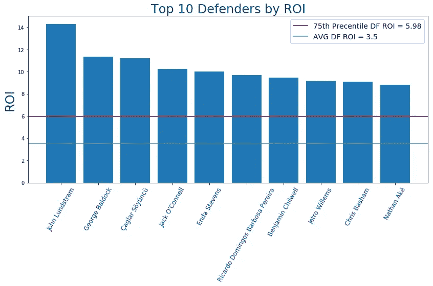

**后卫前 10 名 pts_per_90min**

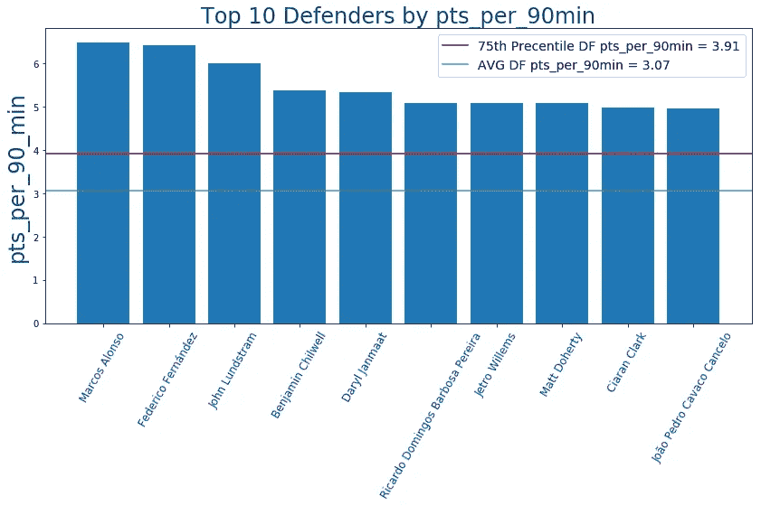

**投资回报率排名前十的中场球员**

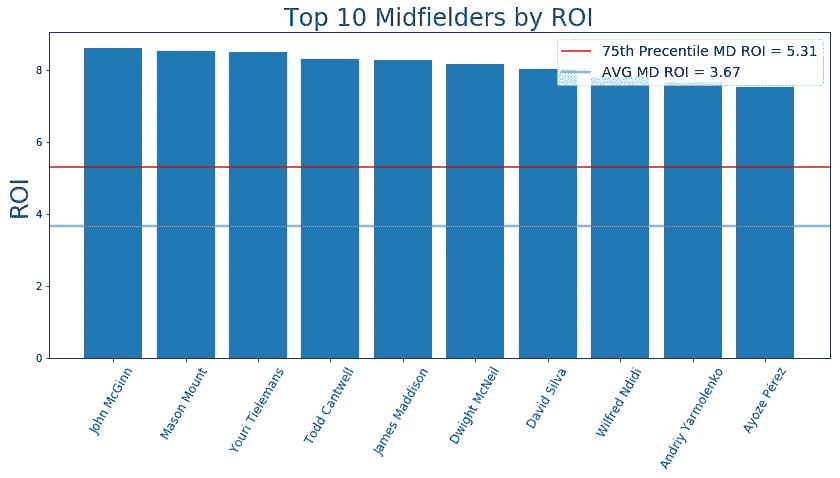

**有趣的是，我们在这里没有看到任何大牌中场球员**，因为他们的价格**是上面列出的中场球员平均价格的两倍**，考虑到他们的低价格，他们的表现相当好，使他们的总投资回报率比萨拉赫和斯特林等人好得多。

**90 分钟 pts _ per _ 强中场**

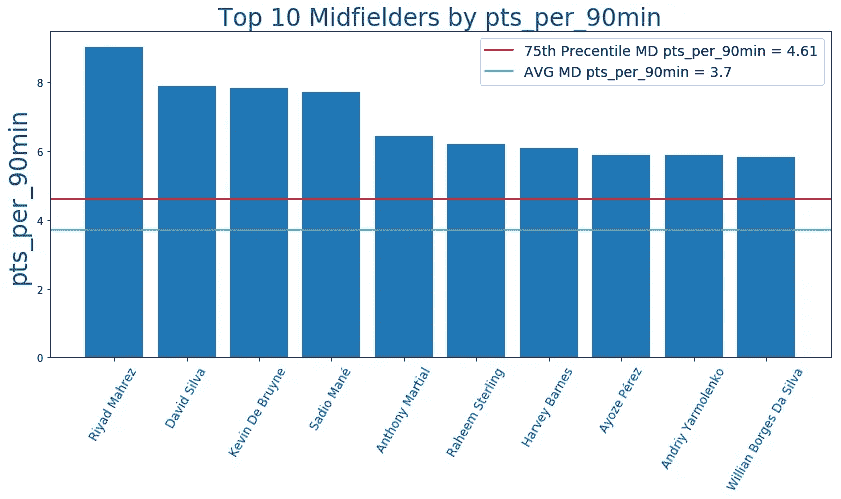

当只看每 90 分钟比赛时间的得分，不考虑价格时，我们可以看到名单上一些得分最高的中场球员，表明**他们仍然是伟大的资产，其价值已经被市场定价，因此产生的投资回报率比投资回报率图表中一些被低估和表现过度的中场球员低得多。**

**投资回报率排名前十的前锋**

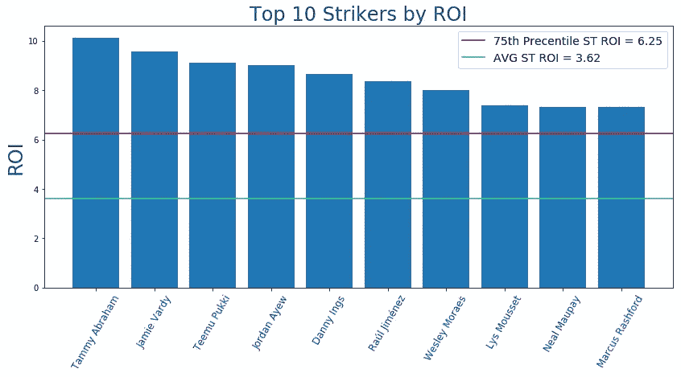

**射手榜前 10 名由 pts_per_90min**

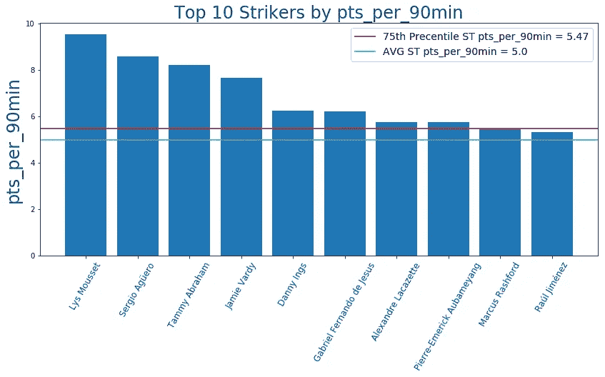

# GW13 算法选择

提醒一下，我们的算法会考虑**调整后的每队阵型**的预算，并尝试**最大化 11 名主力球员的每个位置**的支出，然后让你的替补获得良好的 ROI 值。根据当前的投资回报率得分，在接下来的三场比赛中过滤掉任何具有 AVG 对手难度(FDR≥75%)的球队，并从可用选择列表中删除受伤的球员，我们的算法选择了以下球队作为当前花费全部 1 亿美元预算的最佳球队:

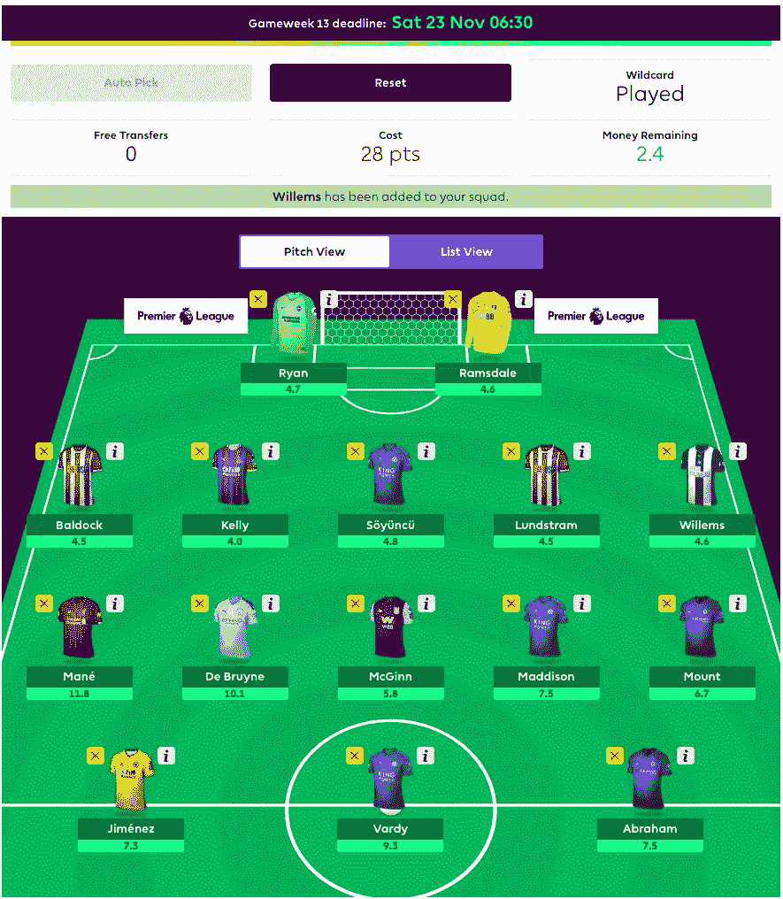

在我们看来，这是一支相当平衡的球队，银行里有整整 240 万英镑，可以尝试不同的球员配置。

就我们自己的团队而言，我们最终摆脱了克雷斯韦尔和亚莫连科，取而代之的是索因库和蒂勒曼斯。我们希望我们有钱买 TAA，但是我们不想在替补上花太多的钱，所以我们会在接下来的几周内设法得到他或者罗伯特。

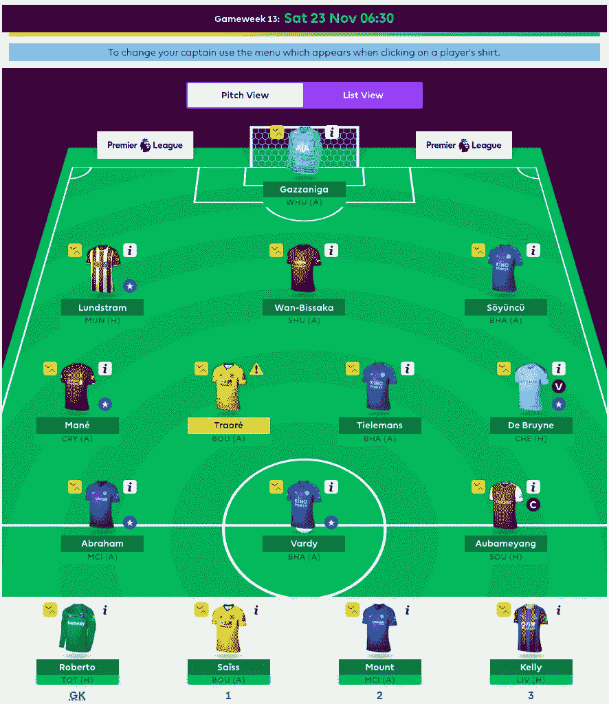

# 团队统计

看看**最佳/最差防守和进攻**可以有几种不同的用法——例如，如果一个最佳进攻队与一个最差防守队比赛，你可能想让你的进攻中场或前锋担任队长。此外，当你查看这些位置的算法建议时，你可能想优先考虑防守最好的球队的 DF 和 GK。

# 最佳 7 项防御

# 最差的 7 种防御

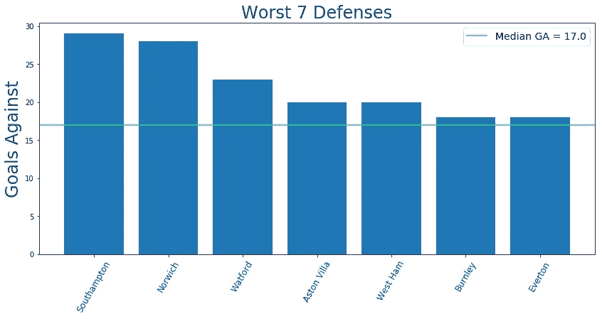

# 最佳 7 项犯罪

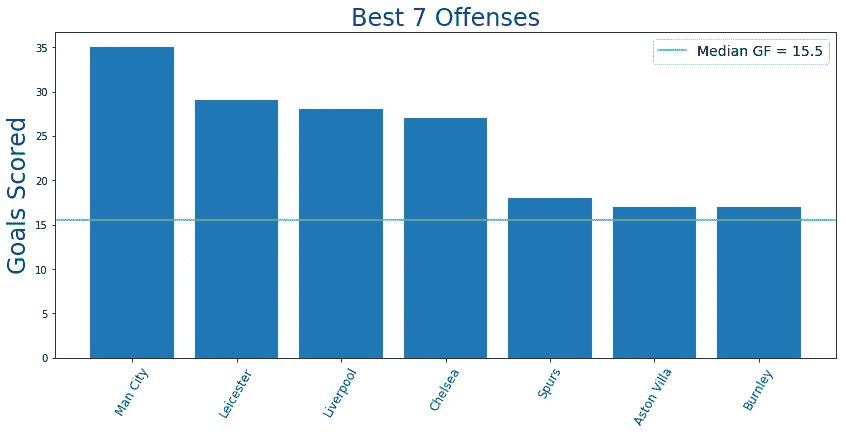

# 最糟糕的 7 项罪行

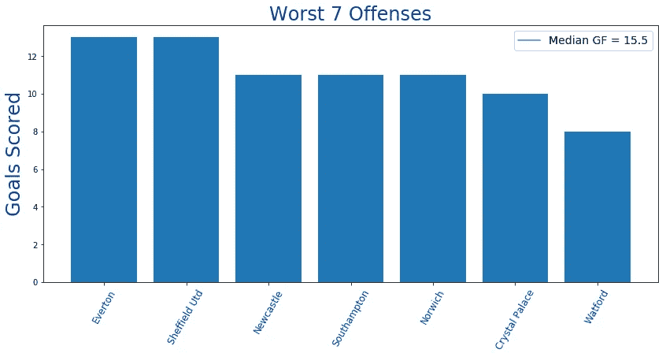

# 累积团队投资回报统计

下面你可以看到球队，按累积玩家投资回报率排序。请注意，**活跃玩家是指已经玩了总可能游戏时间的至少 25%** 的任何玩家。例如，总可能分钟数=周数* 90 分钟= 12* 90 = 1080。所以，我们把所有至少打了 1080/4 = **270 分钟**的球员都算作该队现役球员。

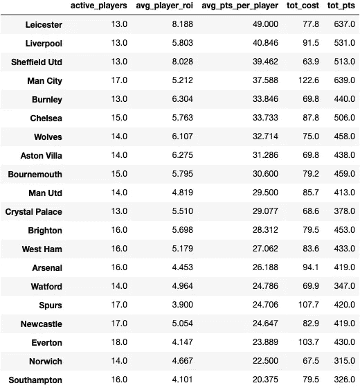

在利物浦战胜曼城后，情况发生了变化，曼城由于伤病轮换使用了一些新球员，使曼城的整体球队投资回报率下降到第四位，并将利物浦挤到第二位。我们也可以看到**切尔西、狼队和曼联在过去 2-3 场比赛中的一些稳定表现后越来越接近前 5 名。**

底部看起来与过去几周相似，阿森纳和马刺仍在努力增加他们的整体团队投资回报率和平均每名球员得分。

# 最终想法:

本周，我们将保持谦虚，只想向幻想之神请求至少一个帽子戏法和我们队长 Auba 的一次助攻:)到目前为止，他的投资回报还不错，但由于 1100 万英镑的高价，我们需要看到他很快有更多的进球，以提高他的总投资回报率，并证明他长期留在我们的球队是合理的。

一如既往——感谢您的阅读，祝您周末好运！