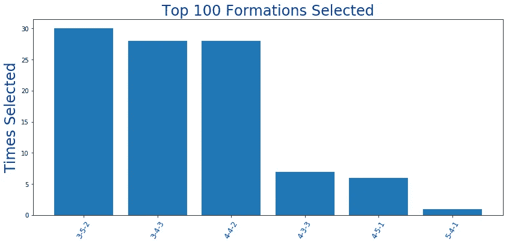
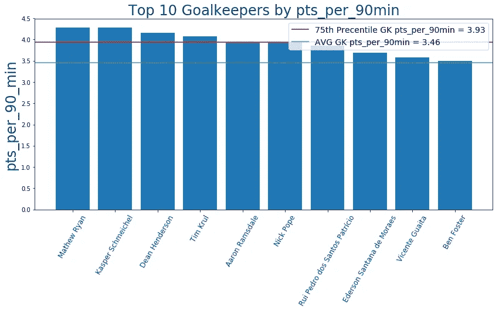

# EPL 幻想 GW14 回顾和 GW15 算法精选

> 原文：<https://towardsdatascience.com/epl-fantasy-gw14-recap-and-gw15-algorithm-picks-713fc6858d4d?source=collection_archive---------42----------------------->

我们的钱球方法的幻想 EPL(队 _id: 2057677)

如果这是你第一次登陆我的幻想 EPL 博客，你可能想先看看[第一部分](/beating-the-fantasy-premier-league-game-with-python-and-data-science-cf62961281be)、[第二部分](/epl-fantasy-is-one-week-away-and-our-algorithm-is-ready-to-play-78afda309e28)、[第三部分](/epl-fantasy-gameweek-1-stats-and-algorithm-recommendations-for-smart-picks-23b4c49cae8)、[第五部分](/epl-fantasy-gw3-recap-and-gw4-algorithm-picks-bc384ce1374b)和[第九部分](/epl-fantasy-gw8-recap-and-gw9-algorithm-picks-b618c5291762)，以熟悉我们的整体方法和我们随着时间的推移所做的改进。我在这个项目中的犯罪搭档是 Andrew Sproul，他和我一样对数据科学、人工智能和幻想 EPL 充满热情。

本周我们将保持简短和甜蜜，因为我们在 GW14 和 GW15 之间只有**一天**，所以让我们在时间结束前完成这些替换！

# GW14 世界排名前 100 的选手

对于世界排名前 100 位的球员来说，这一周相对艰难，他们中的许多人的得分接近或低于 51 的平均 GW 得分！甚至有一名球员**只得到 30 分，其他几名球员的得分在 30-45 分之间**，所以如果你的得分接近平均水平 51 分或以上，请知道你比世界上大多数顶级球员都做得好！

# EPL 100 强球员最佳混合团队

当我们谈论世界前 100 名球员的话题时，让我们看看谁在他们的球队中最受欢迎，以及 GW14 最受欢迎的球队阵容。

## 前 100 名最佳守门员

## 前 100 名中最受欢迎的捍卫者

## 前 100 名最佳中场球员

有趣的是，在这里可以看到儿子现在已经上升到了第四位，而英镑现在下降到了第九位。

## 前 100 名中入选最多的前锋

最受欢迎的前锋的有趣变化是，许多人因为受伤而放弃了塔米·亚伯拉罕，因为他的良好状态和南安普顿轻松的赛程而得到了丹尼·英斯。

我们使用这些数据和当前的球员价格来创建下面的球队，这是由前 100 名中最受欢迎的球员组成的:

## 前 100 名 Fantasy 用户选择最多的团队

本周我们在阵型上有了一个有趣的变化，因为**很多人决定只用 2 个前锋**来比赛，并且使用**3–5–2 或者 4–4–2**作为 3–4–3 的阵型，仍然有相当多的人喜欢。

# GW14 团队绩效总结和总体统计

对我们来说，体面的一周 **57 分，高于平均 51 分**，正好处于世界前 100 名球员的平均水平，所以我们对自己的表现相当满意！我们的队长选择结果相当不错(谢谢 VAR！！！当他错过了第一个点球时，奥巴让我心脏病发，我们从他那里得到了 13x2 = 26pts。不幸的是，我们的后卫和门将都没有得到回报，我们在凯利的替补席上留下了 6 分，所以如果运气再好一点或者至少不失球，事情可能会更好。

# 为我们的 GW15 选秀权提供信息的 GW14 整体统计数据

下面让我们从调整后的未来三个比赛周的对手难度等级(FDR)开始:

**沃特福德、埃弗顿、伯恩茅斯和阿斯顿维拉**是仅有的 FDR 得分超过 75%的球队**。我们的算法是这样写的，它不会在本周推荐从这些球队购买球员。赛程相对轻松的球队有**利物浦、水晶宫、南安普顿、莱斯特和谢菲尔德联队，**所以从招募新球员，这些球队可以在接下来的三场 2-3 场比赛中获得回报。**

# 最新伤情更新美国东部时间 12 月 1 日晚 9 点

以下数据来自一个独立网站，该网站更新最新受伤情况的频率比 Fantasy 网站高得多:

接下来，让我们通过 ROI 和 pts_per_90min 统计数据来看看顶级球员:

**投资回报率排名前十的门将**

**90 分钟内排名前 10 的门将**

**投资回报率排名前十的防御者**

**pts _ per _ 90min 排名前 10 的防守队员**

**投资回报率排名前十的中场球员**

**90 分钟 pts _ per _ 强中场**

**投资回报率排名前 10 的前锋**

**射手榜前 10 名由 pts_per_90min**

# GW15 算法选择

提醒一下，我们的算法会考虑**调整后的每支队伍的预算**，并尝试**最大化 11 名主力队员在**每个位置上的花费，然后让你的替补获得良好的投资回报。根据当前的投资回报率得分，在接下来的三场比赛中过滤掉任何具有 AVG 对手难度(FDR≥75%)的球队，并从可用选择列表中删除受伤的球员，我们的算法选择了以下球队作为当前花费全部 1 亿美元预算的最佳球队:

在我们看来，这是一支相当平衡的球队，银行里有整整 120 万英镑，可以用来试验和尝试不同的球员配置。

就我们自己的团队而言，我们最终摆脱了万-比萨卡，他被证明是一个非常糟糕的投资:(而且由于塔米·亚伯拉罕的受伤，我们还卖掉了他，**让 TAA 和丹尼·英斯**取代了他们的位置。由于沃特福德的防守薄弱，**选择瓦迪当队长。**

# 团队统计

看看**最佳/最差防守和进攻**可以有几种不同的用法——例如，如果一个最佳进攻队与一个最差防守队比赛，你可能想让你的进攻中场或前锋担任队长。此外，当你查看这些位置的算法建议时，你可能想优先考虑防守最好的球队的 DF 和 GK。

# 最佳 7 项防御

# 最差的 7 种防御

# 最佳 7 项犯罪

# 最糟糕的 7 项罪行

# 累积团队投资回报统计

下面你可以看到球队，按累积玩家投资回报率排序。请注意，**活跃玩家是指已经玩了总可能游戏时间的至少 33.33%** 的任何玩家。例如，总可能分钟数=周数* 90 分钟= 14* 90 = 1260。所以，我们把所有至少打了 1260/3.3 = **378 分钟**的球员都算作该队现役球员。

**莱斯特队本周又赢了一场比赛，扩大了他们的领先优势，但在大多数比赛中，他们仍然只使用 11 名主力球员作为核心。伯恩利、狼队、切尔西和维拉在平均每名球员得分和整体球队投资回报率方面也越来越接近前四名。**

# 最终想法:

首先也是最重要的——**不要忘记在美国东部时间周二中午之前准备好你的替补**，因为**新 GW 将于 12 月 3 日周二**开始。就本周我们的球队而言，如果我们能从我们的队长瓦迪那里得到至少 12 分，从我们的新交易——英格斯和 TAA 那里得到每个球员至少 6 分，我们会非常高兴:)我们在最近的过去做了几笔糟糕的投资，所以我们希望我们的运气能够好转，我们的两个新球员能在下周和接下来的 2-3 周开始有所回报。