# EPL 幻想 GW17 回顾和 GW18 算法精选

> 原文：<https://towardsdatascience.com/epl-fantasy-gw17-recap-and-gw18-algorithm-picks-169856317716?source=collection_archive---------27----------------------->

## EPL 幻想博客

## 我们的钱球方法的幻想 EPL(队 _id: 2057677)

如果这是你第一次登陆我的幻想 EPL 博客，你可能会想看看我的媒体简介中我最初的 EPL 博客，以熟悉我们的整体方法和我们随着时间的推移所做的改进。我在这个项目中的犯罪搭档是 Andrew Sproul，他和我一样对数据科学、人工智能和幻想 EPL 充满热情。

# GW17 世界排名前 100 的选手

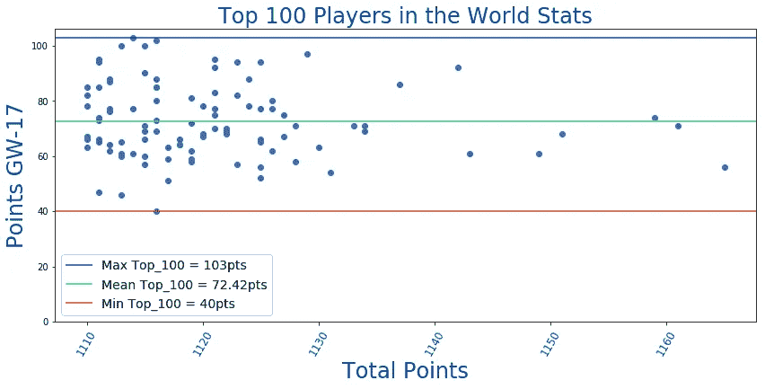

对于世界排名前 100 的球员来说，这又是一个非常强大的一周，**平均 72 分**，相比之下，普通人的 GW 平均得分为 56 分！尽管如此，还是有一些得分在 50-60 分之间的前 100 名玩家(包括世界上得分只有 56 分的 t **op 玩家)，所以如果你的得分接近或超过那个分数，你仍然可以对自己感觉很好。**

# EPL 100 强球员最佳混合团队

当我们谈论世界前 100 名球员的话题时，让我们看看谁在他们的球队中最受欢迎，以及 GW17 最受欢迎的球队阵容。

## 前 100 名最佳守门员

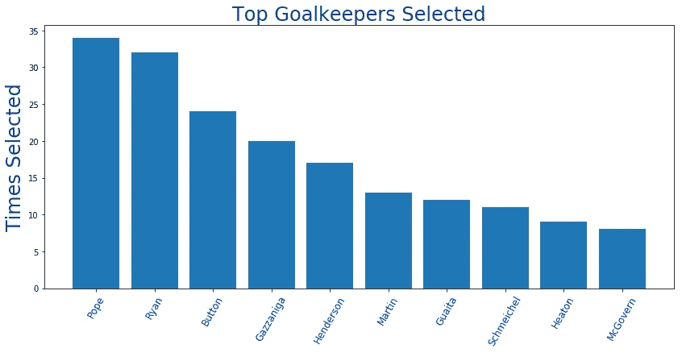

## 前 100 名中最受欢迎的捍卫者

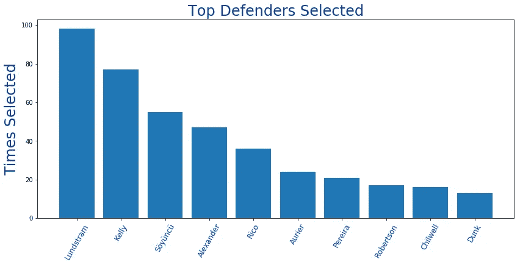

## 前 100 名最佳中场球员

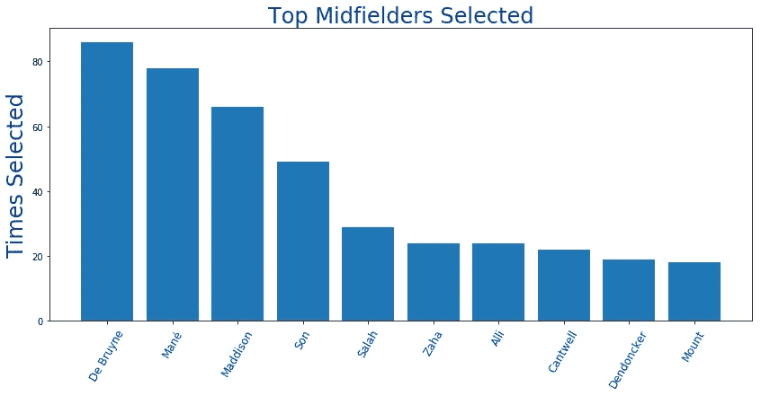

## 前 100 名中入选最多的前锋

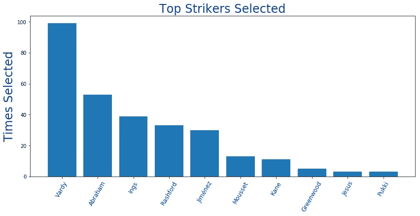

我们使用这些数据和当前的球员价格来创建下面的球队，这是由前 100 名中最受欢迎的球员组成的:

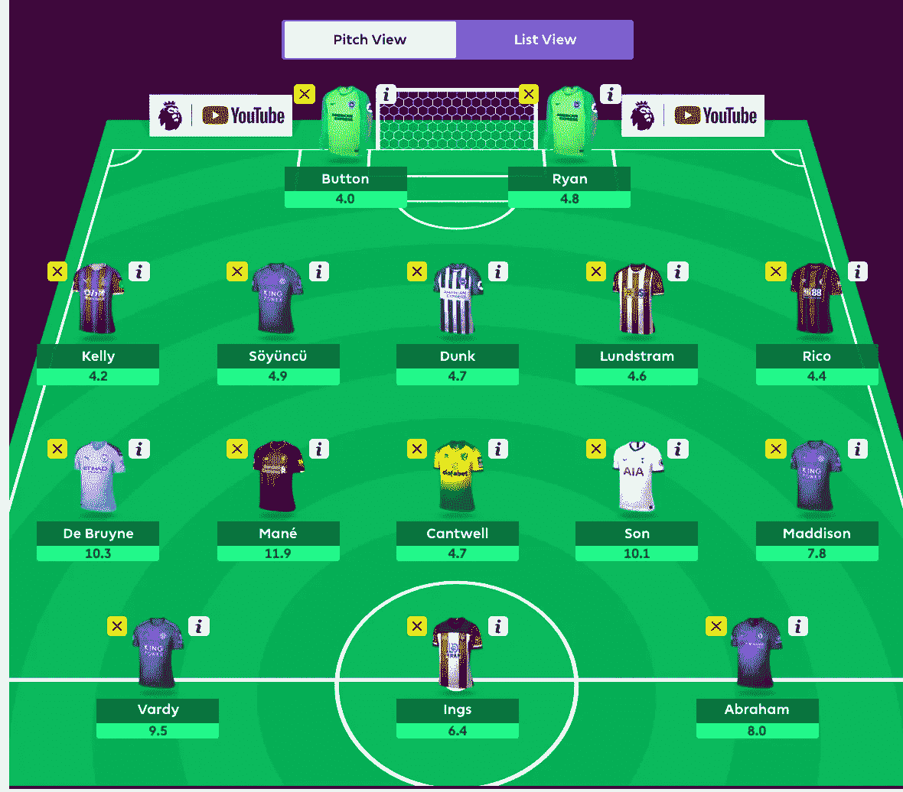

看起来不错的团队，在关键位置上有很多尝试不同选择的余地，同时仍然保持一个坚实的球员核心。

## 前 100 名 Fantasy 用户选择最多的团队

看起来我们回到了一个更具攻击性的**3–4–3 阵型，成为首选**，所以人们回到了试图优化从进攻球员身上获得的分数——MD 和 ST。

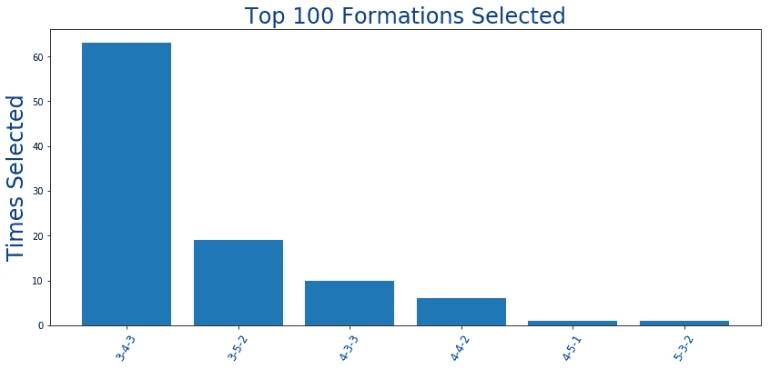

# GW17 团队绩效总结和总体统计

对我们来说不是很强的一周，只有 48 分，仅低于平均 56 分。卖掉 KDB 来得到拉什福德和凯恩，到目前为止被证明是错误的举动，所以我们把自己挖进了一个更深的洞，只有拉什福德和凯恩的出色表现才能在接下来的几场比赛中把我们挖出来。不幸的是，我们还和特拉奥雷一起在板凳上留下了 10 分，所以对我们来说这是非常不幸的一周

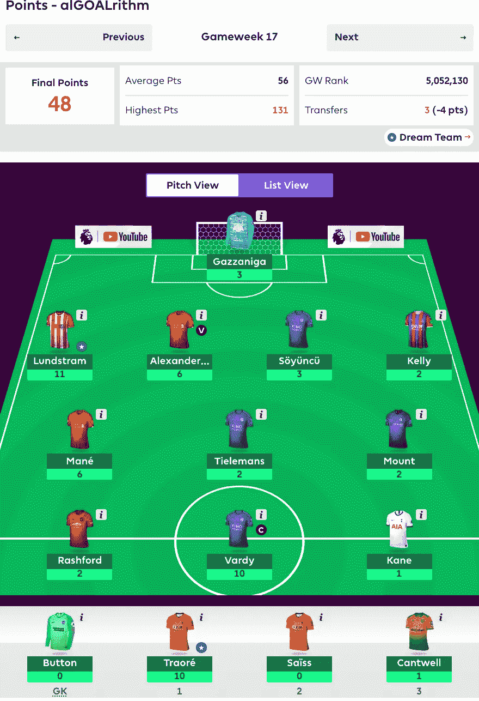

# GW17 整体统计数据为我们的 GW18 选秀权提供信息

下面让我们从调整后的未来三周的对手难度等级(FDR)开始:

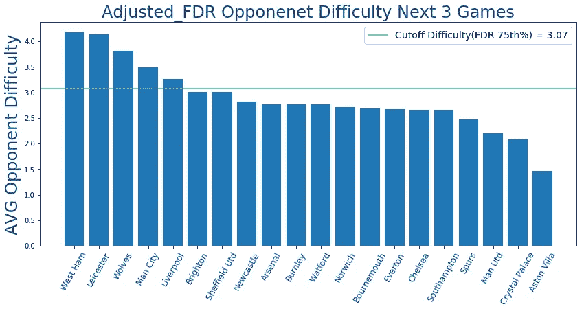

对于我们的算法来说，这将是非常非常艰难的一周，曼城、莱斯特和利物浦都有相对困难的计划，所以我们的算法不会从这些球队中做出任何选择。赛程相对轻松的球队有**维拉、水晶宫、谢菲尔德、曼联、热刺、切尔西。**

# 最新伤情更新美国东部时间 12 月 19 日下午 5 点

以下数据来自一个独立网站，该网站更新最新受伤情况的频率比 Fantasy 网站高得多:

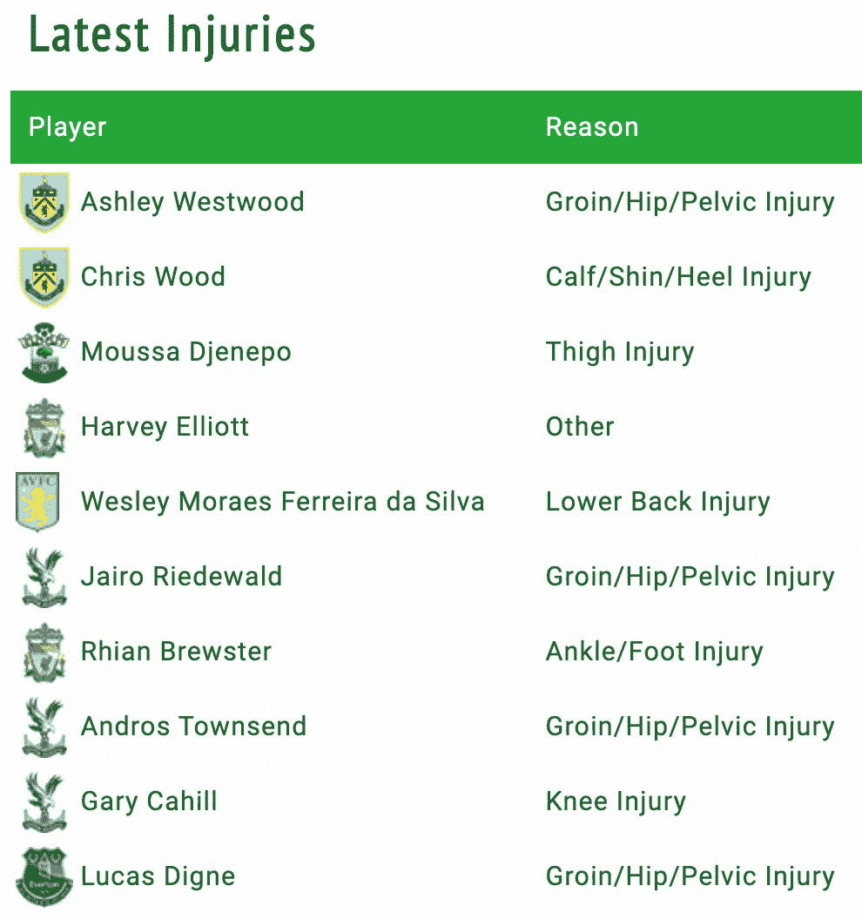

# 按投资回报率和 90 分钟出场次数统计的顶级球员

根据上周一位读者的要求，我现在将公布投资回报率最高和最低的 50 名玩家，这样我们的读者就可以看到更多高投资回报率的玩家，并远离价格过高和表现不佳的玩家。

## 投资回报率排名前 50 的玩家

注意**在这个列表中看到大量的 DFs 和 GK 是正常的**,因为它们比攻击玩家便宜得多，允许它们产生更高的整体投资回报率。尽管如此，你可以在那里找到相当数量的攻击球员，到目前为止，他们是一个很好的长期投资。

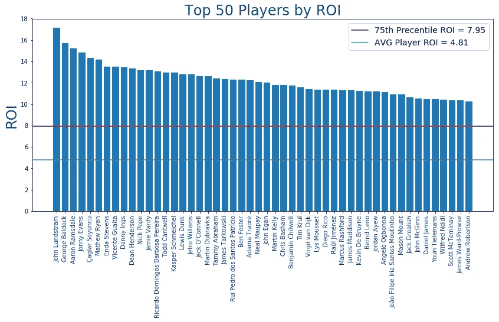

## 按投资回报率排名的后 50 名玩家

在这份名单中，我们看到了更多的进攻球员，他们的价格过高，本赛季到目前为止表现不佳。注意像杰西·林加德、本杰明·门迪、谢默斯·科尔曼、克里斯提安·埃里克森这样的名字，他们上赛季表现出色，身价不菲，但本赛季却受伤或表现不佳。

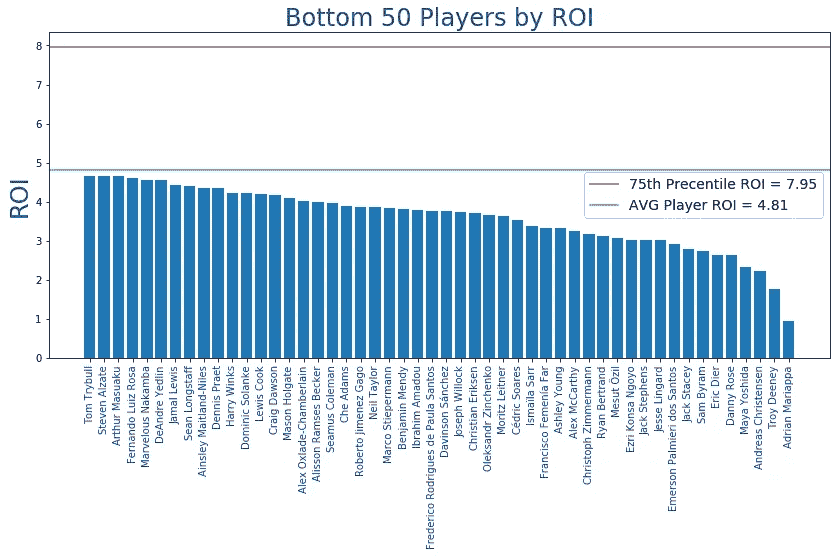

**投资回报率排名前十的门将**

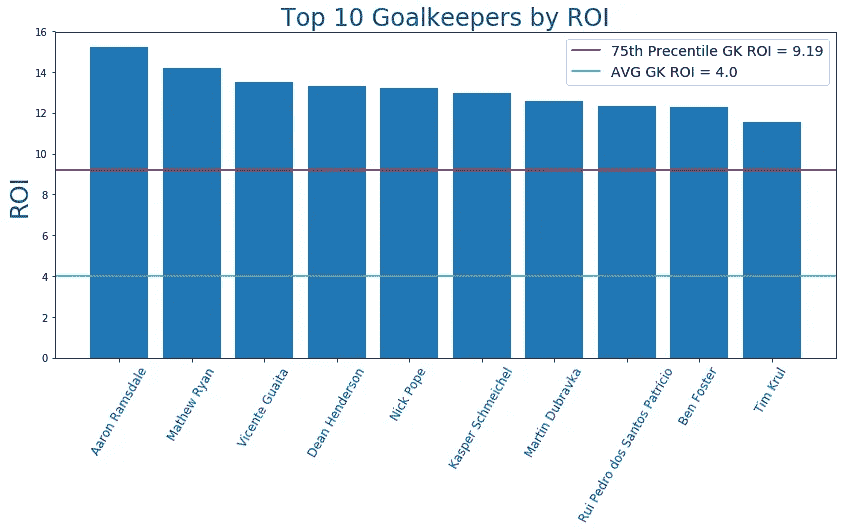

**90 分钟 pts _ per _ 强门将**

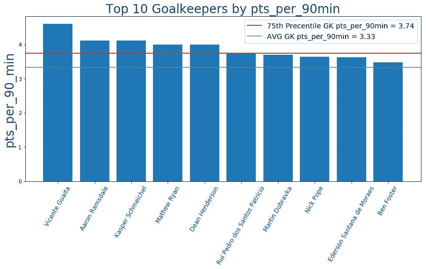

**投资回报率排名前十的防守球员**

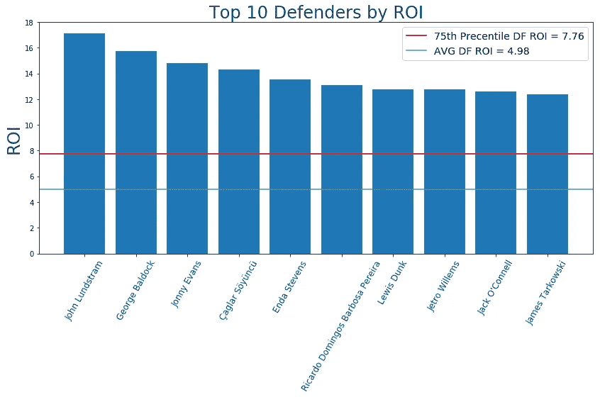

**pts _ per _ 90min 排名前 10 的防守队员**

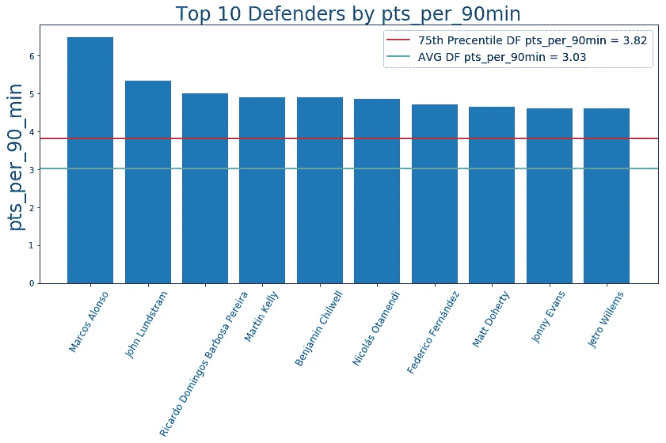

**投资回报率排名前十的中场球员**

**90 分钟 pts _ per _ 强中场**

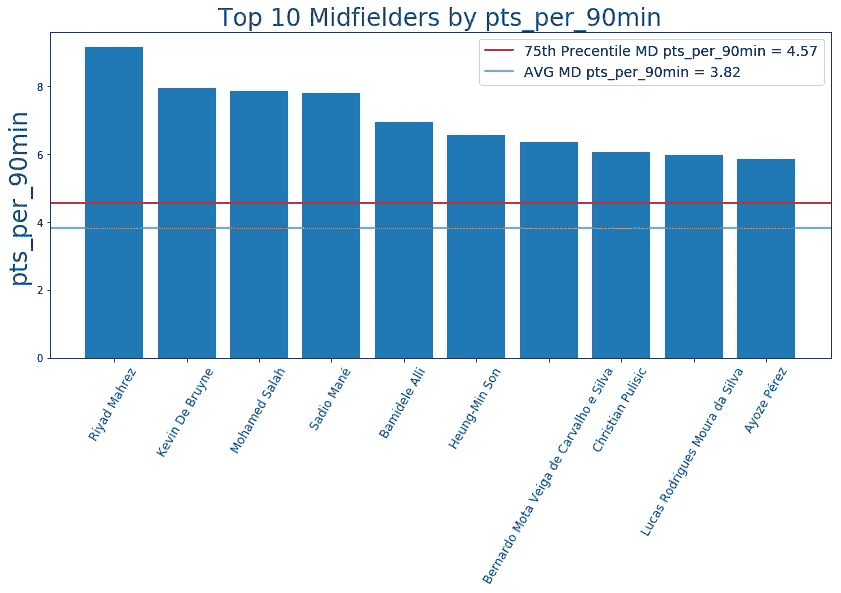

**投资回报率排名前十的前锋**

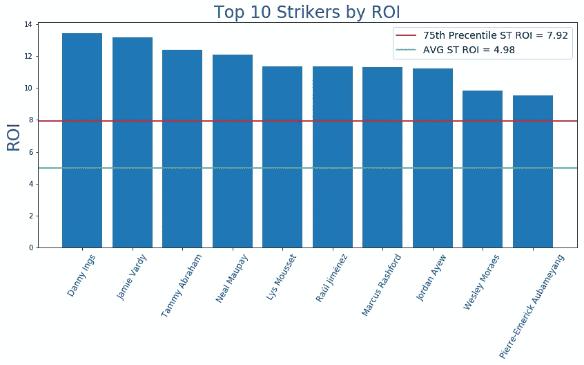

**90 分钟前 10 名射手**

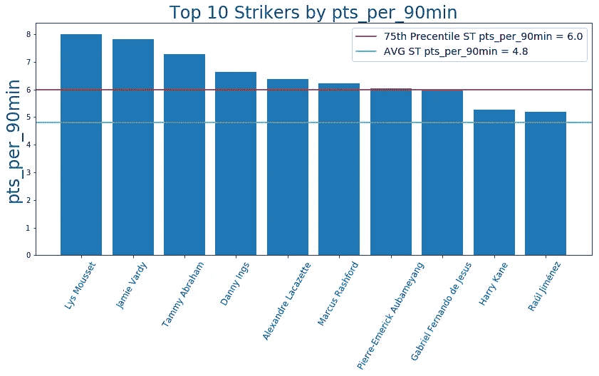

# GW17 算法选择

提醒一下，我们的算法会考虑**调整后的每队阵容预算**，并尝试**最大化 11 名主力球员的每个位置**的支出，然后让你的替补获得良好的 ROI 值。根据当前的投资回报率得分，在接下来的三场比赛中过滤掉任何具有 AVG 对手难度(FDR≥75%)的球队，并从可用选择列表中删除受伤的球员，我们的算法选择了以下球队作为当前花费全部 1 亿美元预算的最佳球队:

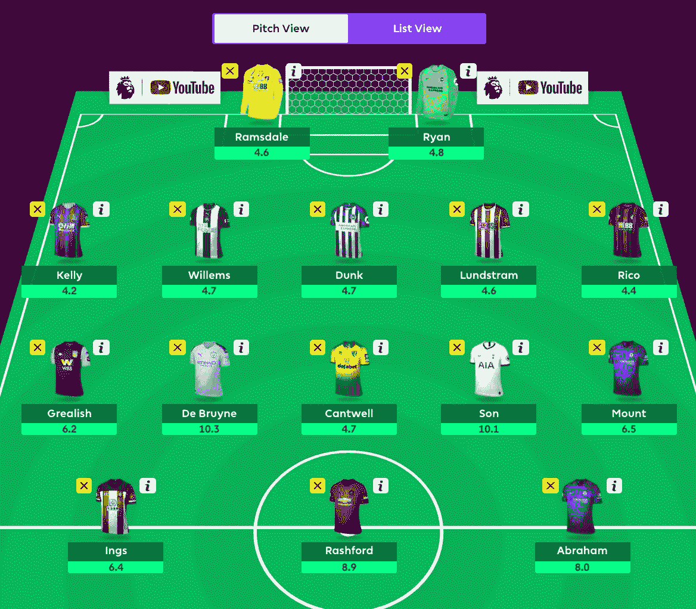

由于我们的算法**没有选择来自曼城、利物浦和莱斯特的球员，**除了德·布鲁因被选为总积分最高的总经理，这支球队的银行里还有很多钱。

就我们自己的球队而言，在上周出售 KDB 的糟糕举动后，我们没有太多可以做的，所以现在我们必须坚持那个决定，因为计划是在莱切斯特比赛后将他买回来。本周我们进行了一次转会——格里利什进:蒂尔曼斯出——因为维拉的赛程比较轻松，而莱斯特的赛程比较艰难。我们也在考虑卖掉 TAA，这样我们下周就可以为 KDB 腾出一些资金，但我们还没有下定决心。

# 团队统计

查看**最佳/最差防守和进攻**可以有几种不同的用法——例如，如果一个最佳进攻队与一个最差防守队比赛，你可能想让你的进攻中场或前锋担任队长。此外，当你查看这些位置的算法建议时，你可能想优先考虑防守最好的球队的 DF 和 GK。

# 最佳 7 项防御

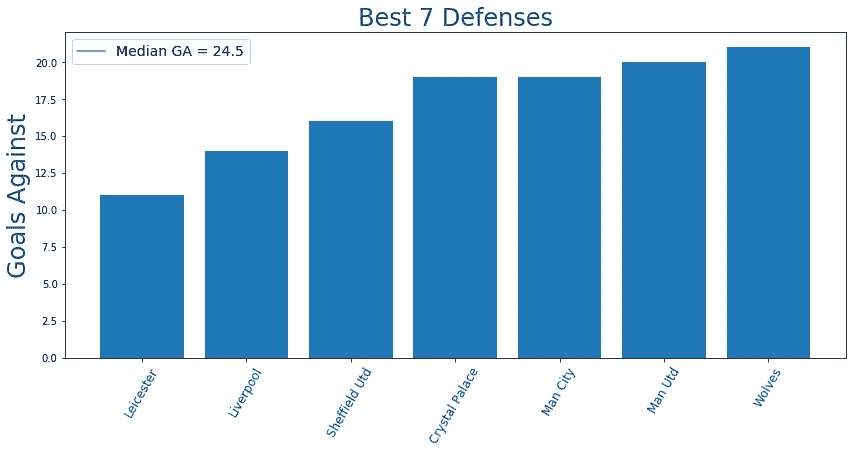

# 最差的 7 种防御

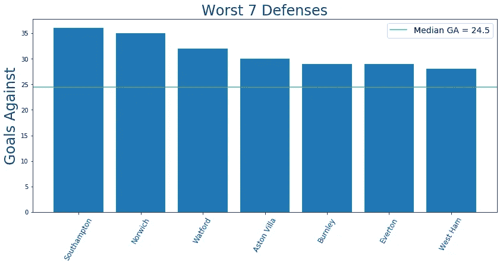

# 最佳 7 项犯罪

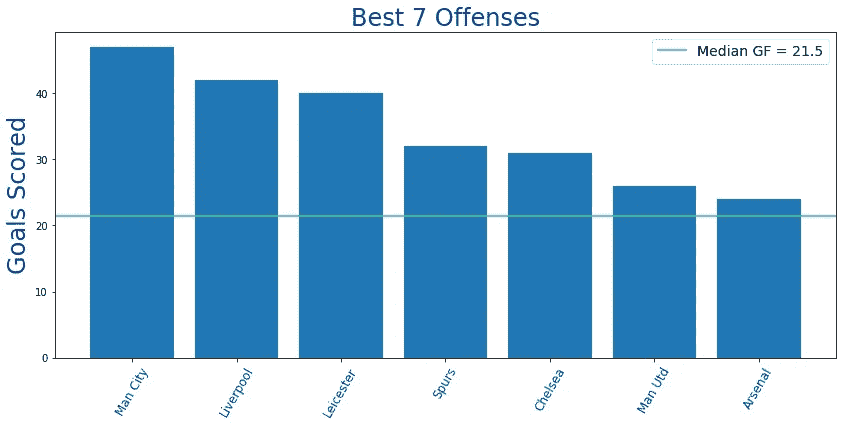

# 最糟糕的 7 项罪行

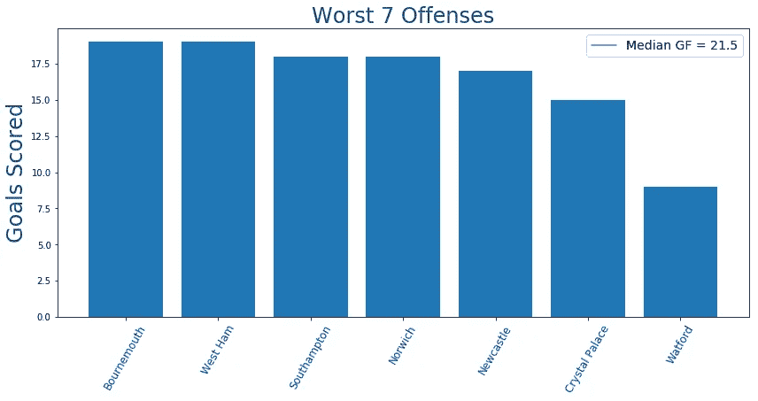

# 累积团队投资回报统计

下面你可以看到球队，按累积玩家投资回报率排序。请注意，**活跃玩家是任何已经玩了总可能游戏时间的至少 33.33%** 的玩家。所以，我们把所有至少打了 **460 分钟**的球员算作该队现役球员。

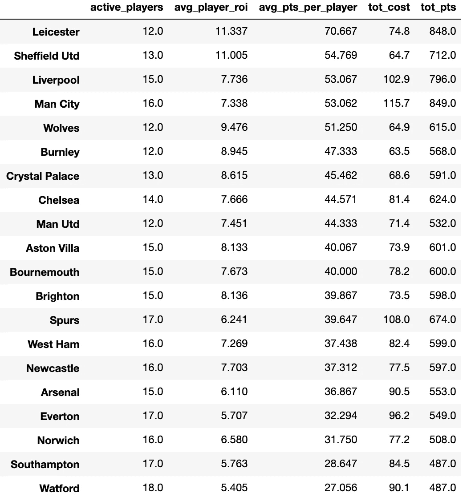

在几场更强劲的表现之后，谢菲尔德联队现在已经攀升到 team_ROI 排行榜的第二位。

# 最终想法:

我们只是对接下来几周不停的 EPL 行动感到兴奋，我们希望我们的博客能帮助你做出一些好的转会选择，为你的假期带来一些额外的快乐。如果有一个 EPL 圣诞老人(我不是指每年圣诞老人大会期间充斥纽约街头的那种:P)并且他们正在阅读我的博客，我们会要求他们从拉什福德和凯恩那里获得大量积分，作为我的早期节日礼物。

一如既往，感谢您的阅读，我们希望您享受假期和令人兴奋的 EPL 行动！