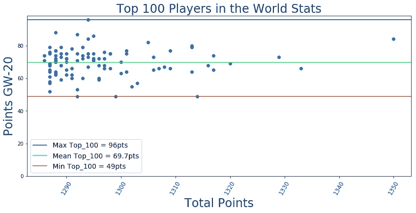

# EPL 幻想 GW20 重述和 GW21 算法精选

> 原文：<https://towardsdatascience.com/epl-fantasy-gw20-recap-and-gw21-algorithm-picks-24b0ab22bcee?source=collection_archive---------32----------------------->

## EPL 幻想博客

## 我们的钱球方法的幻想 EPL(队 _id: 2057677)

如果这是你第一次登陆我的幻想 EPL 博客，你可能会想看看我在本赛季开始时写的一些原始 EPL 博客(GW1-GW9)，以熟悉我们的整体方法和我们随着时间的推移所做的改进。我在这个项目中的犯罪搭档是 Andrew Sproul，他和我一样对数据科学、人工智能和幻想 EPL 充满热情。

# GW20 世界排名前 100 的选手

尽管有很多替补和轮换，世界顶级球员在去年的 GW 上确实表现不错，**平均 70 分**，相比之下**普通人的 GW 平均得分为 54 分**！

# EPL 100 强球员最佳混合团队

当我们谈论世界前 100 名球员的话题时，让我们看看谁在他们的球队中最受欢迎，以及 GW20 最受欢迎的球队阵容。

## 前 100 名最佳守门员

## 前 100 名中最受欢迎的捍卫者

## 前 100 名最佳中场球员

## 前 100 名中入选最多的前锋

我们使用这些数据和当前的球员价格来创建下面的球队，这是由前 100 名中最受欢迎的球员组成的:

看起来不错的团队，在关键位置上有很多尝试不同选择的余地，同时仍然保持一个坚实的球员核心。

## 前 100 名 Fantasy 用户选择最多的团队

看起来由于某种原因 **86 名顶级球员选择了 3–5–2**阵型，很可能是因为**每个人在他们的首发阵容**中都有 Vardy，但他最终没有上场，所以他被 MD 或 DF 自动取代。

# GW20 团队绩效总结和总体统计

总的来说，这是我们坚实的一周，65 个百分点，高于平均水平 54 个百分点。我们最高兴的是，我们早期的投资——**拉什福德和凯恩终于得到了回报**，我们终于找到了一位 8 x2 = 16 分的体面队长。

# 为我们的 GW21 选秀权提供信息的 GW20 整体统计数据

下面让我们从调整后的未来三周的对手难度等级(FDR)开始:

看起来**纽卡斯尔、南安普顿、谢菲尔德联队、利物浦和维拉**有一个相对困难的计划，所以我们的算法不会从这些球队中做出任何选择。赛程相对轻松的球队有**伯恩茅斯、狼队、莱斯特、切尔西、曼城和布莱顿。**

# 最新伤情更新美国东部时间 12 月 30 日晚 9 点

以下数据来自一个独立网站，该网站更新最新受伤情况的频率比 Fantasy 网站高得多:

# 按投资回报率和 90 分钟出场次数统计的顶级球员

根据上周一位读者的要求，我现在将公布投资回报率最高和最低的 50 名玩家，这样我们的读者就可以看到更多高投资回报率的玩家，并远离价格过高和表现不佳的玩家。

## 投资回报率排名前 50 的玩家

## 按投资回报率排名的后 50 名玩家

**投资回报率排名前十的守门员**

**90 分钟得分前 10 的守门员**

**投资回报率排名前十的防御者**

**后卫前 10 名由 pts_per_90min**

**投资回报率排名前十的中场球员**

**90 分钟 pts _ per _ 强中场**

**投资回报率排名前十的前锋**

**90 分钟前 10 名射手**

# GW21 算法选择

提醒一下，我们的算法会考虑**调整后的每支队伍的预算**，并尝试**最大化 11 名主力队员的每个位置的花费**，然后让你的替补获得良好的 ROI 值。根据当前的投资回报率得分，在接下来的三场比赛中过滤掉任何具有 AVG 对手难度(FDR≥75%)的球队，并从可用选择列表中删除受伤的球员，我们的算法选择了以下球队作为当前花费全部 1 亿美元预算的最佳球队:

看起来这是一个相当平衡的团队，银行里还留有一些钱来试验不同的配置。

就我们自己的球队而言，我们决定只做一个改变，吉梅内斯>拉什福德，因为狼队的赛程更轻松，而且吉梅内斯在最后一场比赛中休息，而不是拉什福德。这也让我们在银行里有了一些额外的钱，下周可以进行更多的转账。

# 团队统计

看看**最佳/最差的防守和进攻**可以有几种不同的用法——例如，如果一个最佳进攻队与一个最差防守队比赛，你可能想让你的进攻中场或前锋担任队长。此外，当你查看这些位置的算法建议时，你可能想优先考虑防守最好的球队的 DF 和 GK。

# 最佳 7 项防御

# 最差的 7 种防御

# 最佳 7 项犯罪

# 最糟糕的 7 项罪行

# 累积团队投资回报统计

下面你可以看到球队，按累积玩家投资回报率排序。请注意，**活跃玩家是任何已经玩了总可能游戏时间的至少 33.33%** 的玩家。所以，我们会把所有至少打了 540 分钟比赛的球员都算作该队的现役球员。

统计数据开始在这里很好地趋同，因为更稳定的表现和合理的价格球员现在占据了前 5-8 名。一些拥有昂贵球员的球队正在努力追赶并提高他们的整体投资回报率，这些球队是马刺、阿森纳、埃弗顿和西汉姆。

# 最终想法:

首先，我们要感谢 EPL 圣诞老人上周满足了我们的愿望，从拉什福德和凯恩那里获得了一些不错的投资回报。本周，我们希望瓦迪在上一场比赛取得不错的突破后能够强势回归，并取得几个进球，我们也希望我们的一名转会球员——希门尼斯——上一场比赛也休息了，也将带着新鲜的双腿回来，并取得一些进球/助攻。

一如既往，感谢您的阅读，我们希望 2020 年带给您健康、快乐和激动人心的 EPL 行动！新年快乐！！