# EPL 幻想 GW3 重述和 GW4 算法精选

> 原文：<https://towardsdatascience.com/epl-fantasy-gw3-recap-and-gw4-algorithm-picks-bc384ce1374b?source=collection_archive---------26----------------------->

## 我们的钱球方法的幻想 EPL(队 _id: 2057677)

如果这是你第一次登陆我的幻想 EPL 博客，你可能想先看看[第一部分](/beating-the-fantasy-premier-league-game-with-python-and-data-science-cf62961281be)、[第二部分](/epl-fantasy-is-one-week-away-and-our-algorithm-is-ready-to-play-78afda309e28)、[第三部分](/epl-fantasy-gameweek-1-stats-and-algorithm-recommendations-for-smart-picks-23b4c49cae8)和[第四部分](https://medium.com/@pruchka/epl-fantasy-gw2-recap-and-gw3-algorithm-picks-23dae3ef70a8)，以熟悉我们的整体方法和我们随着时间的推移所做的改进。

# GW3 团队绩效总结和总体统计

我们上周的表现好于平均水平，总共得了 51 分，由于恩多姆贝勒和坎特的受伤，只有 10 名球员参加了比赛。如果拉什福德没有错过那个点球，我们会做得更好。见下文:

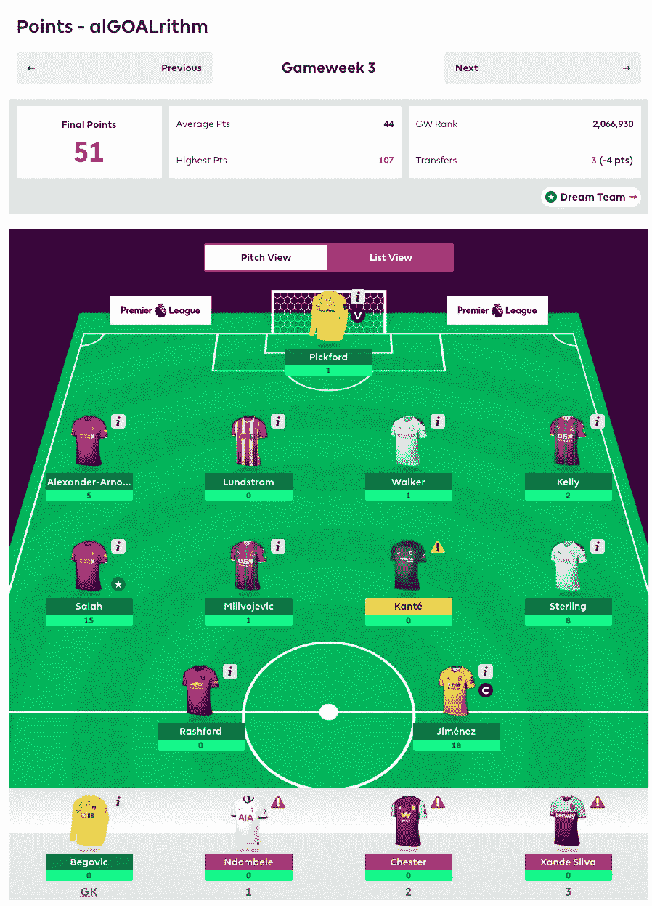

GW3 Total Points

# 本周有什么新消息？

现在已经有至少 4 场比赛了，我们将开始发布**团队统计**以及**顶级防守/进攻，累积团队投资回报率，每支团队的总活跃球员数，**开始识别整体上**表现不佳/表现超过**或使用大量团队轮换的团队，从长远来看，这将使从这些团队中选择球员**的价值降低。**

# GW3 整体统计数据为我们的 GW4 选择提供信息

首先，我们将查看 FDR_score(接下来 3 个对手的难度),以决定我们可能要从哪些球队中排除挑选球员:

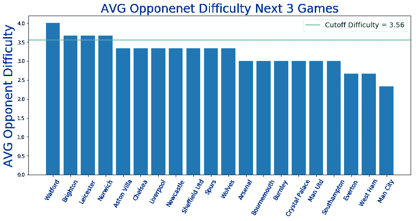

**Watford, Brighton, Leicester, and Norwich FDR ≥ 3.56**

由于接下来三场比赛的平均对手实力较高，我们的算法将不会从以下球队中选择球员— **沃特福德，布莱顿，莱斯特和诺维奇(抱歉普基球迷:P)。接下来三场比赛赛程相对轻松的好球队是:曼城、切尔西、埃弗顿、曼联和西汉姆。**

接下来，我们将按职位看一下**前 10 名 ROI 玩家是谁:**

**投资回报率排名前十的守门员**

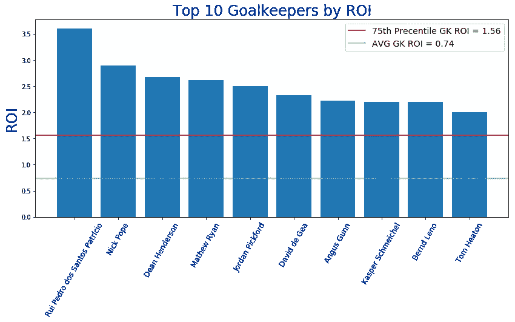

**按投资回报率排名的前 10 名防御者**

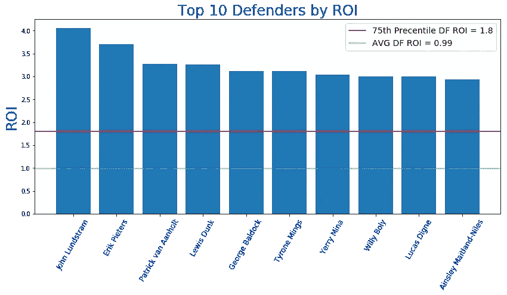

**投资回报率排名前十的中场球员**

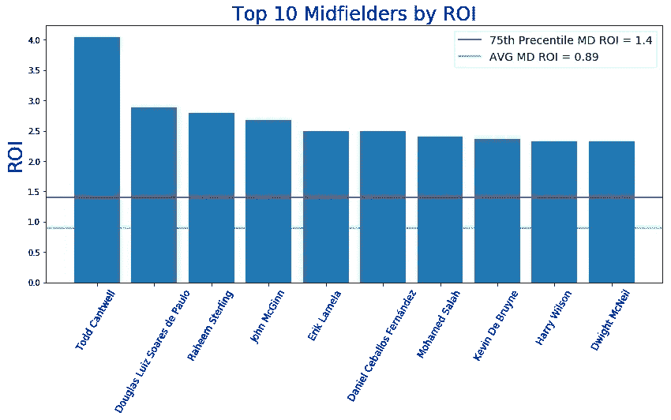

**投资回报率排名前 10 的前锋**

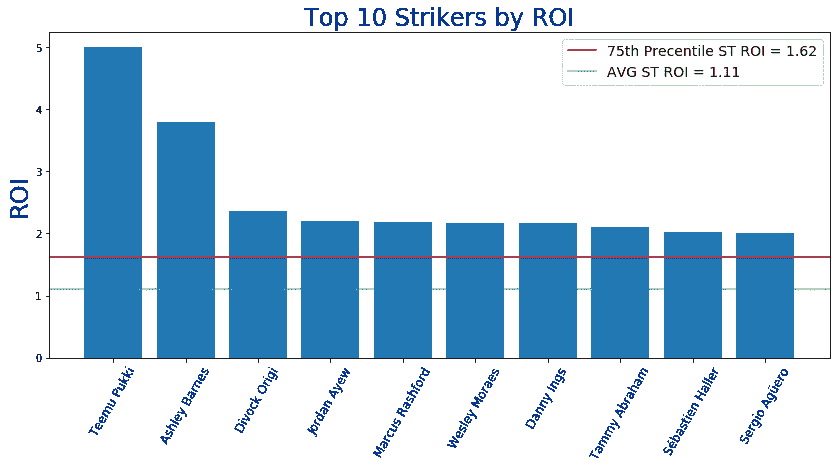

**GW3 算法选择**

提醒一下，我们的算法会考虑**调整后的每队阵型**的预算，并尝试**最大化 11 名主力球员的每个位置**的支出，然后让你的替补获得良好的 ROI 值。本周我们将打**4–3–4**阵型。根据当前的投资回报率得分，过滤掉任何在接下来的三场比赛中与 AVG 对手有困难(FDR ≥ 3.56)的球队，并从可用选择列表中删除受伤的球员，我们的算法选择了以下球队作为当前花费全部 1 亿美元预算的最佳球队:

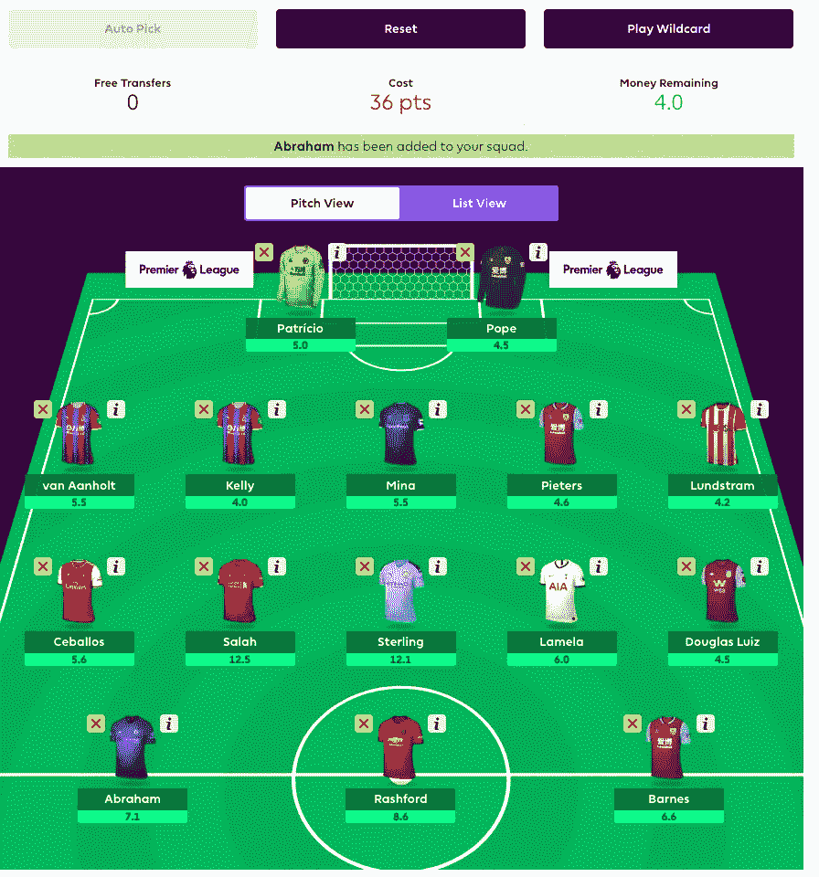

看起来不错的球队，银行里还有整整 400 万美元，这主要是因为我们在我们的算法开始获得最高投资回报率之前，限制了我们的算法选择的高价球员的数量。也就是说**我们使用这个建议作为指导方针，并且通常会做一些我们自己的自定义更改**，因为我们不能做全部 9 个替换:)

**下面是我们这个周末比赛的队伍:**

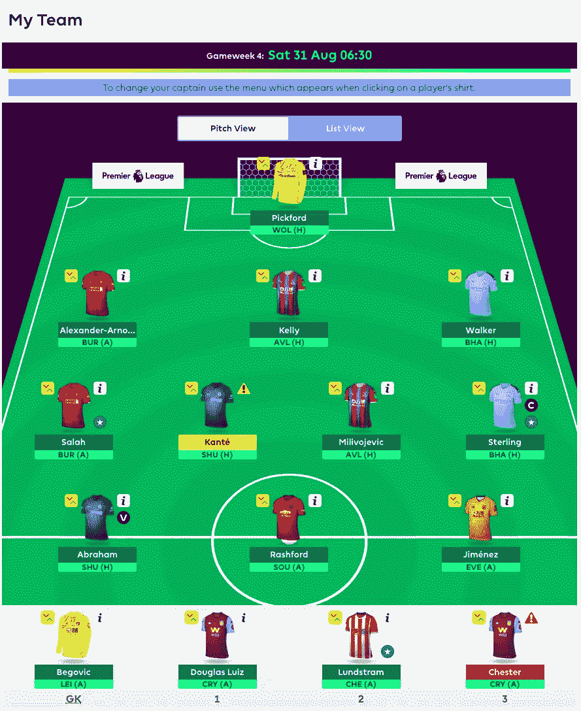

我们选择**本周不要巴恩斯和皮特**，尽管算法推荐了他们，因为**伯尼将对阵利物浦，预计他们可能表现不佳**。如果算法仍然推荐它们作为值，下周将很可能得到其中一个。我们选择亚伯拉罕而不是巴恩斯，因为他上场时间更长，而且他的每 90 分钟得分非常好。我们因为恩多姆贝尔的受伤而换下了他，为了节省下周的开支，我们买下了道格拉斯·路易斯。

# 团队统计

查看最佳/最差防守和进攻可以有几种不同的用法——例如，如果一个最佳进攻队与一个最差防守队比赛，你可能想让你的进攻中场或前锋担任队长。此外，当你查看这些位置的算法建议时，你可能想优先考虑防守最好的球队的 DF 和 GK。

## 最佳五种防御

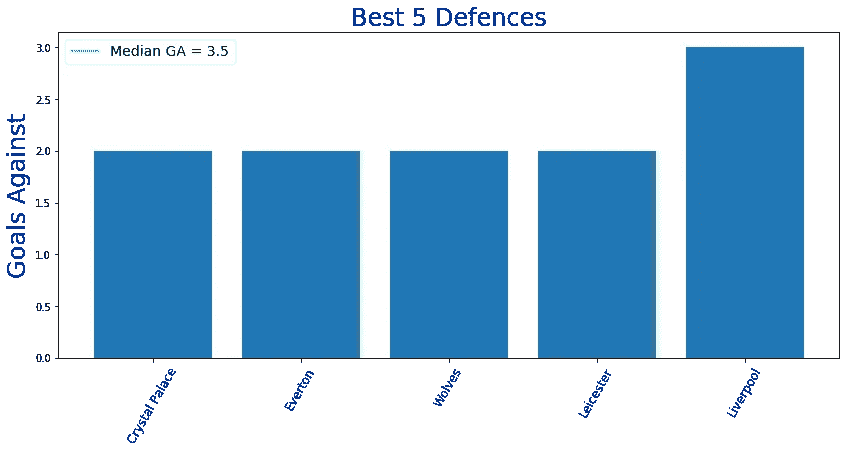

## 最差 5 项防御

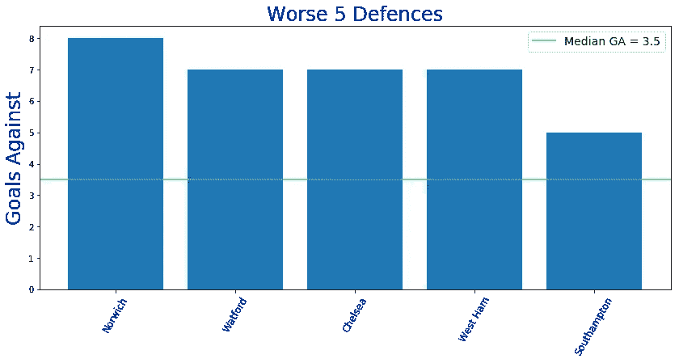

**最佳 5 次进攻**

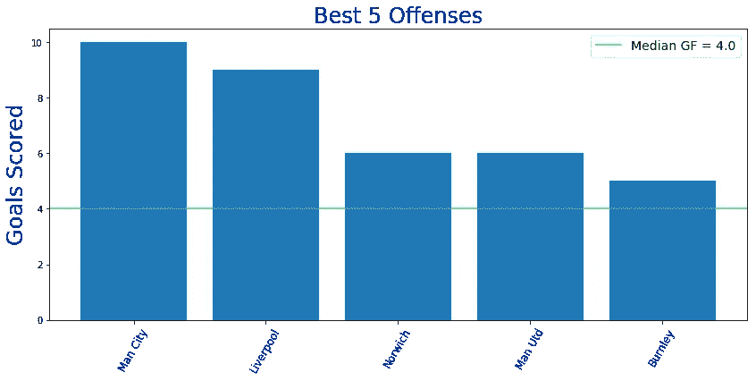

## 最严重的 5 种犯罪

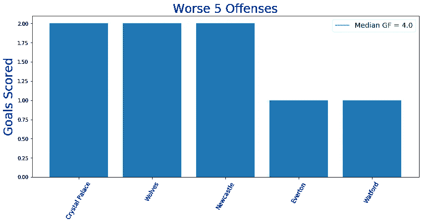

观察这些的一个副作用是，如果狼队的进攻没有改善，我们将不得不从一个更成功的进攻团队中换来一个更有效的前锋吉梅内斯**(可能是普基或巴恩斯**)

# 累积团队投资回报统计

下面你可以看到球队，按累积玩家投资回报率排序。请注意，**活跃玩家是指至少玩了总可能游戏时间的 25%** 的任何玩家。例如，总可能分钟数=周数* 90 分钟= 4 * 90 = 360。所以，我们把所有在队中至少打满 90 分钟的球员都计算在内。

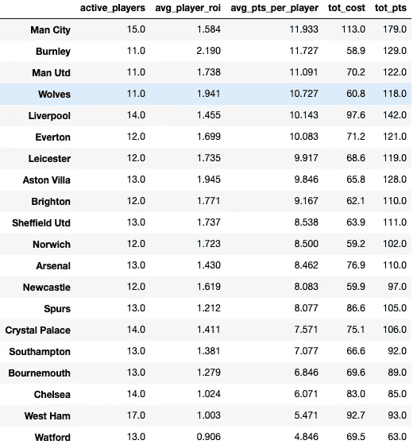

上表中值得注意的有趣事实——曼城、利物浦、水晶宫、切尔西和西汉姆(17！！！使用更多的替补，轮换不同的球员。这意味着我们必须小心，从长远来看，我们投资这些球队的哪些球员。尽管曼城有 15 名现役球员，他们的总成本为 1.13 亿美元，但他们仍然是 avg_pts_per_player 最高的球队，这意味着许多现役球员迄今为止表现良好，价格也不算过高。**切尔西、阿森纳和马刺在 avg_player_roi 排名中意外地处于下半部分**，所以看起来这些球队目前为止表现不佳**与他们球员的成本相比**(价格过高)。**伯恩利、阿斯顿维拉和狼队是综合团队投资回报率排名前三的球队**，因此看起来他们的许多球员价格偏低，目前很有价值，但当然，如果他们的核心球员不能保持良好的表现，这种情况在未来 3-4 周内可能会很快改变。

**最终想法:**

到目前为止，这不是我们最好的开始，但是我们都知道，在一场有如此多变数和未知的比赛中，运气是一个很大的因素，但是总的来说，我们对自己的选择很满意。在前三周，我们已经遭受了一些伤病、点球失误和门将失误，这让我们损失了很多分数，除此之外，没有了 Pukki，我们做得还不错。至少在接下来的 2-3 周比赛中，我们仍然有一张王牌和一支相当平衡的球队，所以让我们给统计数据一些时间来收敛，并在几周内重新评估我们的选择逻辑，并决定我们是否需要做出一些调整。

一如既往——感谢您的阅读，祝您周末好运！