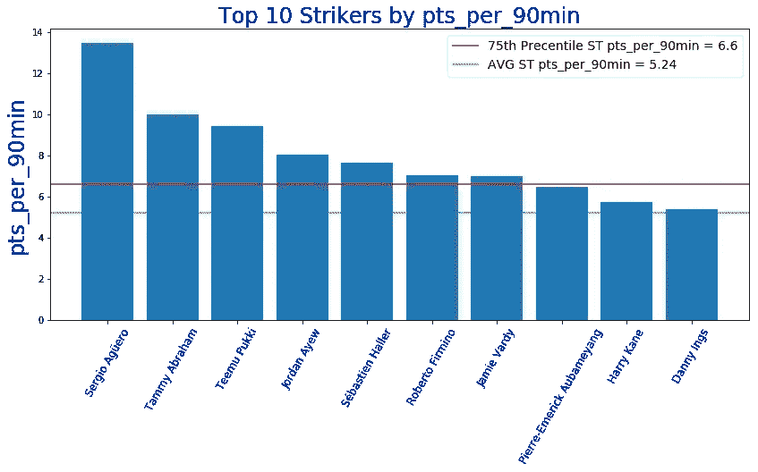

# EPL 幻想 GW4 重述和 GW5 算法精选

> 原文：<https://towardsdatascience.com/epl-fantasy-gw4-recap-and-gw5-algorithm-picks-867d3993b386?source=collection_archive---------33----------------------->

## 我们的钱球方法的幻想 EPL(队 _id: 2057677)

如果这是你第一次登陆我的幻想 EPL 博客，你可能想先看看[第一部分](/beating-the-fantasy-premier-league-game-with-python-and-data-science-cf62961281be)、[第二部分](/epl-fantasy-is-one-week-away-and-our-algorithm-is-ready-to-play-78afda309e28)、[第三部分](/epl-fantasy-gameweek-1-stats-and-algorithm-recommendations-for-smart-picks-23b4c49cae8)、[第四部分](https://medium.com/@pruchka/epl-fantasy-gw2-recap-and-gw3-algorithm-picks-23dae3ef70a8)和[第五部分](/epl-fantasy-gw3-recap-and-gw4-algorithm-picks-bc384ce1374b)，以熟悉我们的整体方法和我们随着时间的推移所做的改进。

本周有什么新消息？

现在我们已经有 4 场比赛了，我们开始加入一个新的统计数据——“pts _ per _ 90min”，这可以帮助我们发现高价值的球员，他们没有开始前几场比赛，但最近获得了更多的上场时间，并迅速攀升，例如**凯文·德布鲁因，塔米·亚伯拉罕和塞尔吉奥·阿奎罗**。

我们编写了一个算法，使用这个 **pts_per_90min** stat 而不是 **ROI** 来选择最佳团队。我们需要重新校准算法来获得更多的防守者，但为了时间的缘故，我将只发布当前的球队选择，让你们知道哪些球员可能是一个长期的好投资，如果他们保持接近 90 分钟的上场时间。

以下是 pts_per_90min 统计中每个位置排名前 10 的球员。一些有趣的名字开始在这里出现，以发现那些在 GW1-GW2 期间没有得到很多时间，但在过去几周内开始获得上场时间的球员——来自 **GKs** 的**阿德里安**、**科伦钱伯斯、 **DFs** 的乔尔·马蒂普、亚瑟·马苏阿库**、**凯文·德布鲁因、亚历克斯·艾奥比和来自 **MDs** 的哈里·威尔逊**我们可能会决定在这个 GW 投资其中一些玩家，即使他们的投资回报率还没有达到，因为没有足够的游戏时间，**假设这些玩家在未来的大多数游戏中游戏时间将接近 90 分钟。**

**GK 前 10 名 pts_per_90min**

**前 10 名 DF pts_per_90min**

**前 10 名 MD pts _ per _ 90 分钟**

**每 90 分钟前 10 名**

# GW4 团队绩效总结和总体统计

上周我们又一次表现得比平均水平好，但也比 61 分好不了多少。我在考虑让亚伯拉罕代替斯特林做队长，这本来是一个好的选择，但是，唉…我们都知道在 EPL 的幻想中“本可以，本应该”的痛苦

# GW4 整体统计数据为我们的 GW5 选择提供信息

首先，我们将查看 FDR_score(接下来 3 个对手的难度),以决定我们可能要从哪些球队中排除挑选球员:

因为在接下来的三场比赛中对手的平均实力很高，我们的算法将不会从以下球队中选择球员——**沃特福德，莱斯特，谢菲尔德联队和诺维奇(抱歉普基球迷:P)。**接下来三场比赛赛程相对轻松的好球队是**——曼城和伯恩利。**

接下来，我们将按职位来看一下**投资回报率前 10 的玩家是谁:**

**投资回报率排名前十的守门员**

**投资回报率排名前 10 的防御者**

**投资回报率排名前十的中场球员**

**投资回报率排名前十的前锋**

**GW3 算法选择**

提醒一下，我们的算法会考虑**调整后的每队阵容预算**，并尝试**最大化 11 名主力球员的每个位置**的支出，然后让你的替补获得良好的 ROI 值。本周我们将打 4-3-4 阵型。根据当前的投资回报率得分，过滤掉任何在接下来的三场比赛中与 AVG 对手有困难(FDR ≥ 3.56)的球队，并从可用选择列表中删除受伤的球员，我们的算法选择了以下球队作为当前花费全部 1 亿美元预算的最佳球队:

考虑到曼城接下来的赛程相当轻松，这个配置看起来一点也不差。我们考虑过使用我们的外卡，但是我们通常不喜欢在赛季早期使用，尤其是在国际比赛结束后，因为**有时教练会让主要球员休息**，他们回来时可能很累或者受了轻伤。

下面是我们下周的团队:

最终花了 8 分得到阿德里安、德布鲁因和阿尤，但我们认为考虑到阿德里安的便宜价格和曼城的轻松赛程，从长远来看这是值得的。我们真的很想得到阿圭罗，但只有一个完整的团队改造，包括通配符的使用将允许这一点。

# 团队统计

查看**最佳/最差防守和进攻**可以有几种不同的用法——例如，如果最佳进攻队与最差防守队比赛，你可能想让你的进攻中场或前锋担任队长。此外，当你查看这些位置的算法建议时，你可能想优先考虑防守最好的球队的 DF 和 GK。

# 最佳五种防御

# 最差的 5 种防御

# 最佳五大犯罪

# 最严重的 5 种犯罪

# 累积团队投资回报统计

下面你可以看到球队，按累积玩家投资回报率排序。请注意，**活跃玩家是指任何至少玩了总可能游戏时间的 25%** 的玩家。例如，总可能分钟数=周数* 90 分钟= 4 * 90 = 360。所以，我们把所有在队中至少打满 90 分钟的球员都计算在内。

作为一个整体球队**，切尔西、热刺和伯恩茅斯**的表现低于上赛季的预期，平均而言，他们的球员价格似乎过高。曼城、利物浦、莱斯特、埃弗顿、曼联按照目前的表现，到目前为止价格似乎还不错。伯恩利和狼队的平均投资回报率也很高，因为他们的球员成本更低。

# **最终想法:**

第一次我们花了 8 分进行了 3 次转会，所以很好奇他们是否会在接下来的 2-3 周内得到回报。让我们的手指交叉为阿德里安更多的不失球和凯文·德布鲁因的许多行动。希望有一个进球或者助攻。

一如既往——感谢您的阅读，祝您周末好运！