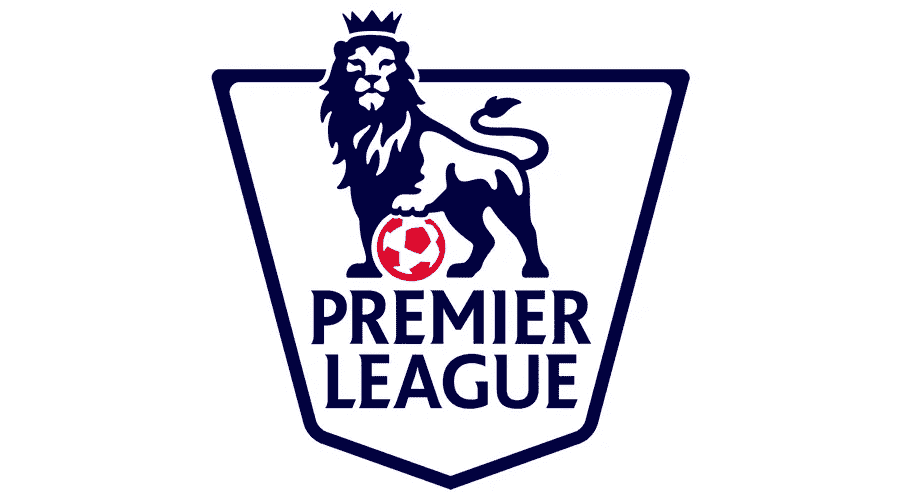
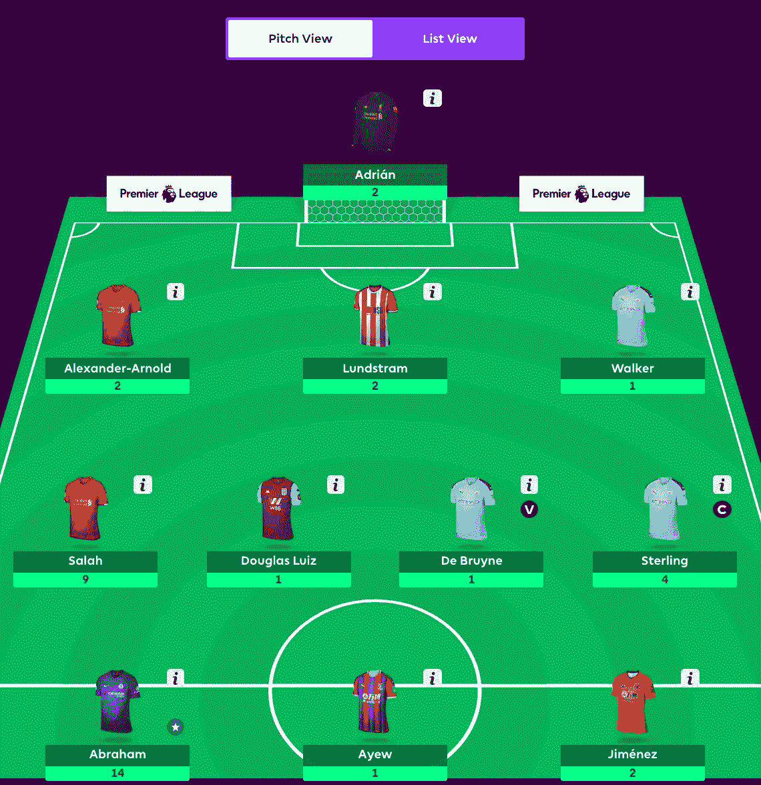

# EPL 幻想 GW5 重述和 GW6 算法精选

> 原文：<https://towardsdatascience.com/epl-fantasy-gw5-recap-and-gw6-algorithm-picks-6e529e0a9227?source=collection_archive---------29----------------------->

我们的钱球方法的幻想 EPL(队 _id: 2057677)

如果这是你第一次登陆我的幻想 EPL 博客，你可能想先看看[第一部分](/beating-the-fantasy-premier-league-game-with-python-and-data-science-cf62961281be)、[第二部分](/epl-fantasy-is-one-week-away-and-our-algorithm-is-ready-to-play-78afda309e28)、[第三部分](/epl-fantasy-gameweek-1-stats-and-algorithm-recommendations-for-smart-picks-23b4c49cae8)、[第四部分](https://medium.com/@pruchka/epl-fantasy-gw2-recap-and-gw3-algorithm-picks-23dae3ef70a8)和[第五部分](/epl-fantasy-gw3-recap-and-gw4-algorithm-picks-bc384ce1374b)，以熟悉我们的整体方法和我们随着时间的推移所做的改进。

> 因为我已经在以前的博客中详细解释了我们的整体方法和算法背后的逻辑，所以我现在将保持这篇博客更加简洁，只提供统计数据和快速评论。

# GW5 团队绩效总结和总体统计

我们经历了有史以来最糟糕的一周，这让我们很受伤，因为我们决定在转会上花 8 分来得到更多失望的曼城球员。我们也摆脱了得分的拉什福德，得到了阿德里安，后者没有像我们预期的那样零失球。由于所有这些不幸的决定，我们得到了 39 分。

# 每 90 分钟点数统计

我们将利用这一统计数据在我们的最终团队中补充一些目前投资回报率较低的球员，但他们正在开始恢复状态，并在过去几周内接近 90 分钟的比赛。

## **GK 前 10 名 pts_per_90min**

**前 10 名 DF pts_per_90min**

**前 10 名 MD pts _ per _ 90 分钟**

**每 90 分钟前 10 名**

# GW4 整体统计数据为我们的 GW5 选择提供信息

首先，我们将查看 FDR_score(接下来 3 个对手的难度),以决定我们可能要从哪些球队中排除挑选球员:

由于在接下来的三场比赛中对手的平均实力很高，我们的算法将不会从以下球队中选择球员— **莱斯特，布莱顿和南安普顿。接下来三场比赛赛程相对轻松的好球队是:曼城马刺、诺维奇和伯恩利。**

接下来，我们将按照职位来看一下**投资回报率前 10 的玩家是谁:**

**投资回报率排名前十的守门员**

**按投资回报率排名的前 10 名防御者**

**投资回报率排名前十的中场球员**

**投资回报率排名前 10 的前锋**

**GW6 算法选择**

提醒一下，我们的算法会考虑**调整后的每队阵型**的预算，并尝试**最大化 11 名主力球员的每个位置**的支出，然后让你的替补获得良好的 ROI 值。本周我们将打**3–4–3**阵型。根据当前的投资回报率得分，过滤掉任何在接下来的三场比赛中与 AVG 对手有困难(FDR ≥ 3.56)的球队，并从可用选择列表中删除受伤的球员，我们的算法选择了以下球队作为当前花费全部 1 亿美元预算的最佳球队:

> 本周，我们试图修改选择逻辑，将 pts_per_90min 统计中的一些顶级玩家纳入顶级 ROI 玩家组合中

如果你仍然有你的外卡，并且你有一群受伤的球员，这可能是一个很好的投资组合，鉴于**城市，诺维奇和马刺**预计在接下来的 3 场比赛中会有一个相对容易的赛程。我们**可能会在下周**结束使用我们的通配符，这取决于下周的伤病和整体表现，所以请继续关注下一篇博客。

鉴于我们上周花费了太多积分，无法承受太多新的转会，以下是我们下周的团队:

我们做的唯一一次转会是用坎特威尔换来坎特，因为坎特没有保险，坎特威尔的价格开始攀升，我们想在价格超过 500 万英镑之前投资。

# 团队统计

查看**最佳/最差防守和进攻**可以有几种不同的用法——例如，如果最佳进攻队与最差防守队比赛，你可能想让你的进攻中场或前锋担任队长。此外，当你查看这些位置的算法建议时，你可能想优先考虑防守最好的球队的 DF 和 GK。

# 最佳五种防御

# 最差的 5 种防御

# 最佳五大犯罪

# 最严重的 5 种犯罪

# 累积团队投资回报统计

下面你可以看到球队，按累积玩家投资回报率排序。请注意，**活跃玩家是指已经玩了总可能游戏时间的至少 25%** 的任何玩家。例如，总可能分钟数=周数* 90 分钟= 5* 90 = 450。所以，我们把所有在该队上场时间至少达到 450/4 = 112.5 分钟的球员都算在内。

一些有趣的名字开始出现在拥有不错 avg_player_ROI 的球队中——**曼联、莱斯特、阿斯顿维拉、西汉姆、热刺和伯恩利**与领头羊——**利物浦和曼城**一起进入前 8。在表现不佳的一方，我们有很多价格过高的球员——沃特福德，切尔西，水晶宫，伯恩茅斯和纽卡斯尔。

# 最终想法:

我们很想使用我们的通配符，选择文章开头分享的最佳球队，但我们决定等待，因为欧洲比赛和没有足够的时间来澄清哪些球员有更严重的伤病。此外，教练倾向于让关键球员在欧洲比赛中休息，所以我们不认为这是一个外卡的好时机。

一如既往——感谢您的阅读，祝您周末好运！