# EPL 幻想 GW7 重述和 GW8 算法精选

> 原文：<https://towardsdatascience.com/epl-fantasy-gw6-recap-and-gw7-algorithm-picks-ace06104fe72?source=collection_archive---------15----------------------->

我们的钱球方法的幻想 EPL(队 _id: 2057677)

如果这是你第一次登陆我的幻想 EPL 博客，你可能想先看看[第一部分](/beating-the-fantasy-premier-league-game-with-python-and-data-science-cf62961281be)、[第二部分](/epl-fantasy-is-one-week-away-and-our-algorithm-is-ready-to-play-78afda309e28)、[第三部分](/epl-fantasy-gameweek-1-stats-and-algorithm-recommendations-for-smart-picks-23b4c49cae8)、[第四部分](https://medium.com/@pruchka/epl-fantasy-gw2-recap-and-gw3-algorithm-picks-23dae3ef70a8)和[第五部分](/epl-fantasy-gw3-recap-and-gw4-algorithm-picks-bc384ce1374b)，以熟悉我们的整体方法和我们随着时间的推移所做的改进。

# GW7 团队绩效总结和总体统计

你可能还记得，前一周我们的队长 KDB 真的收获了金牌，但本周我们的塔米·亚伯拉罕却收获了臭鸡蛋:(更令人沮丧的是，亚伯拉罕击中了门柱，并有三次一对一的机会，但却没有转化其中的一次，所以从技术上来说，我们的选择是好的，但球员就是没有兑现。这再次证明了选择一个合适的队长是多么重要。你可以在下面看到我们的分数— **只有 41 分，低于平均水平**所以对我们来说这不是一个好的一周。

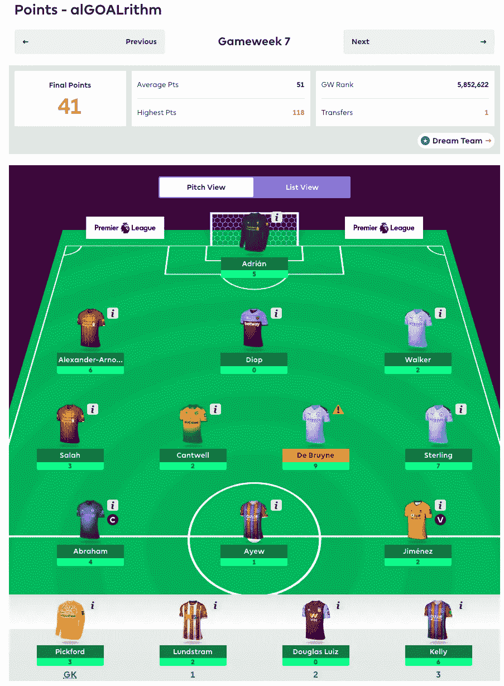

# 每 90 分钟点数统计

我们将利用这一统计数据在我们的最终团队中补充一些目前投资回报率较低的球员，但他们正在开始恢复状态，并在过去几周内接近 90 分钟的比赛。

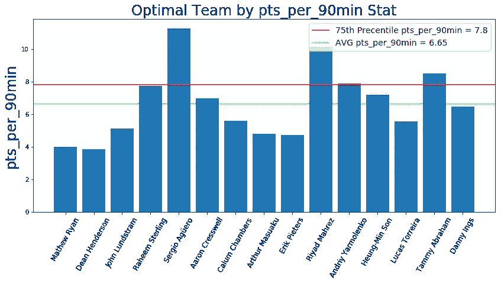

Creswell，Yarmolenko，Chambers，Son 和丹尼·英斯是一些有趣的名字，如果我们假设他们将继续每场至少打 60 分钟，他们可能值得投资。

**以下是 pts_per_90min 统计中每个位置排名前 10 的球员:**

# 每 90 分钟 GK 前 10 名

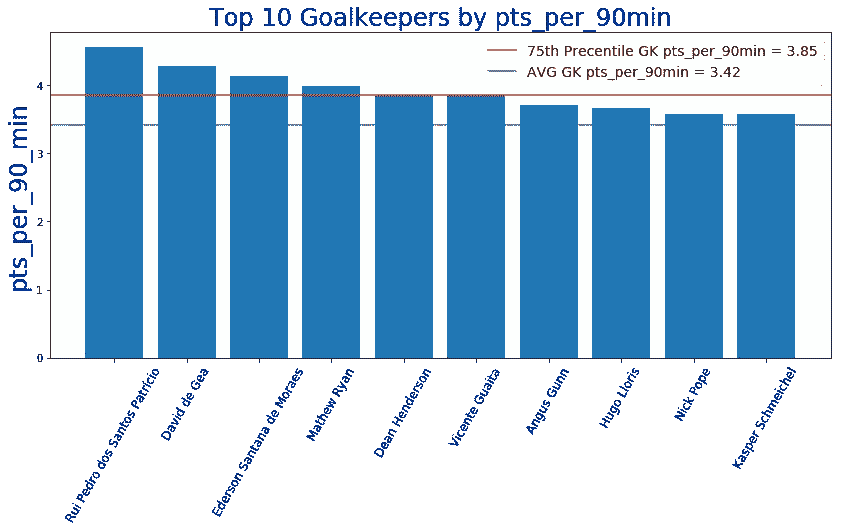

# 90 分钟内前 10 名 DF 点数

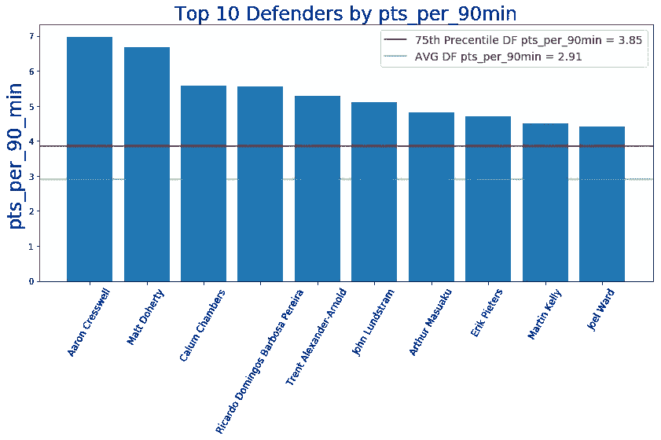

# 90 分钟内前 10 名医学博士

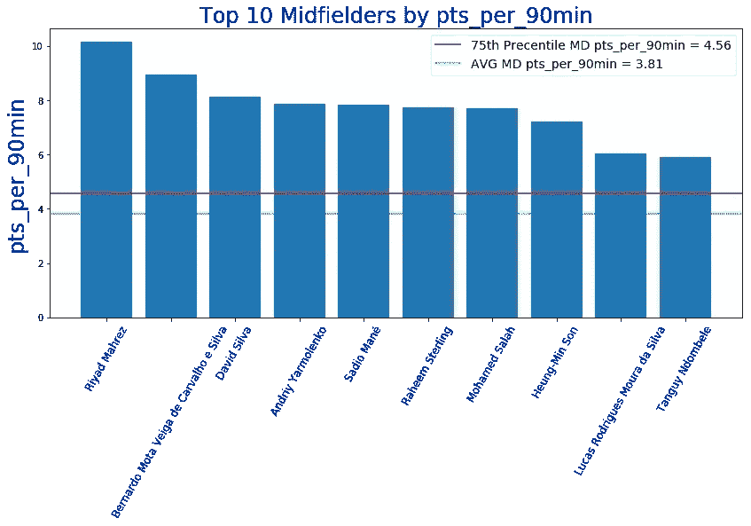

# 每 90 分钟前 10 名

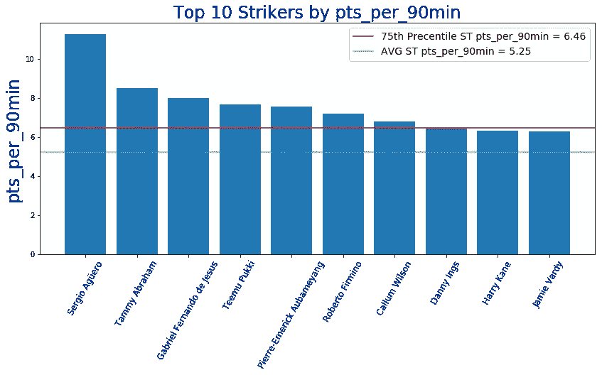

# GW7 整体统计数据为我们的 GW8 选择提供信息

首先，我们将查看 FDR_score(接下来 3 个对手的难度),以决定我们可能要从哪些球队中排除挑选球员:

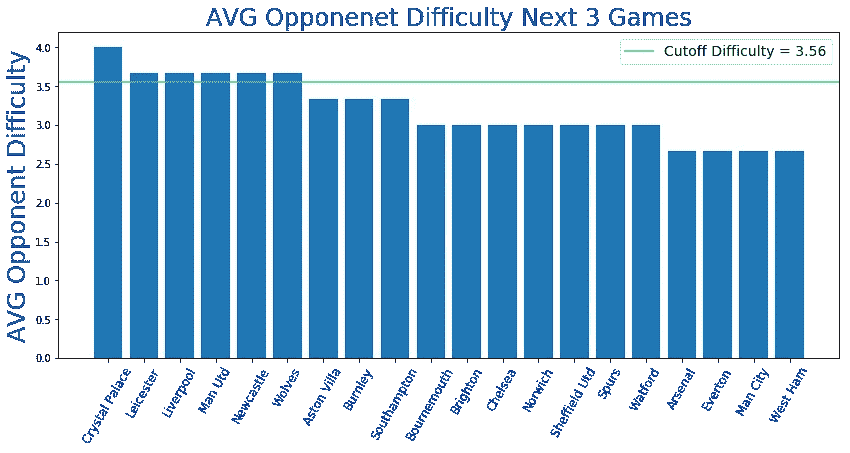

看起来很多球队都面临着艰难的赛程——曼联、水晶宫、利物浦、莱斯特、纽卡斯尔和狼队，所以我的算法在本周的选择非常有限。赛程比较轻松的球队有热刺、阿森纳、埃弗顿、曼城和西汉姆联(T21)。

接下来，我们将按职位看一下**前 10 名 ROI 玩家是谁:**

**投资回报率排名前十的守门员**

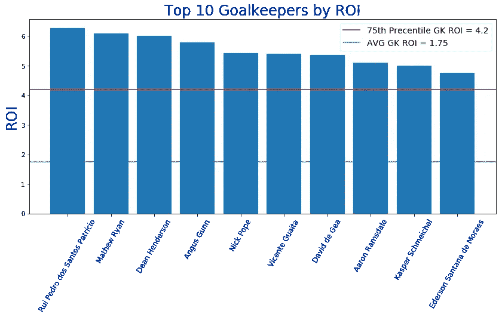

**按投资回报率排名的前 10 名防御者**

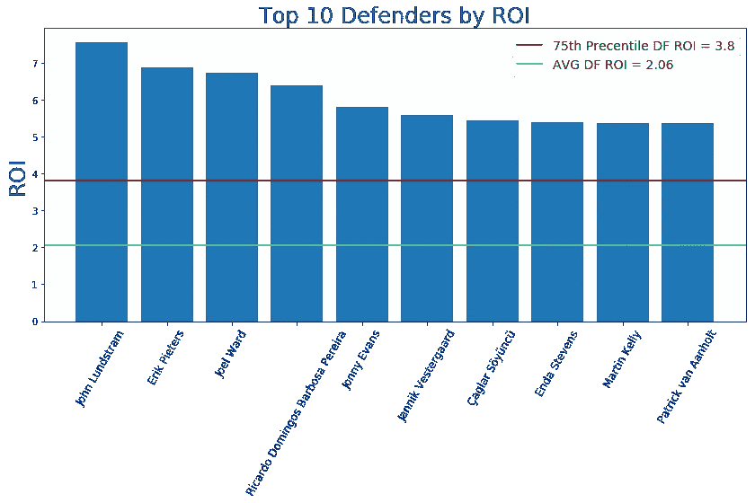

**投资回报率排名前十的中场球员**

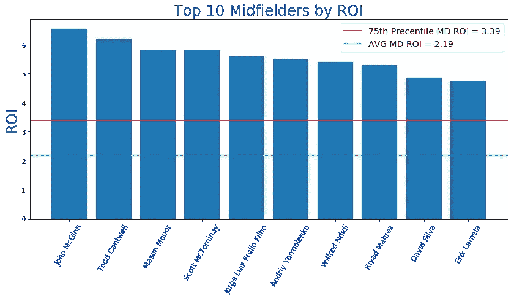

**投资回报率排名前十的前锋**

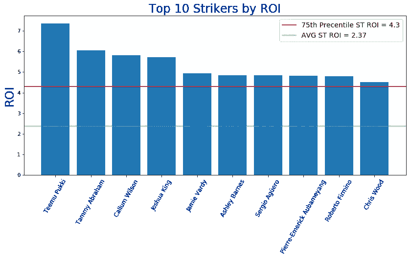

**GW8 算法精选**

提醒一下，我们的算法会考虑到**调整后的每支队伍的预算**，并试图**最大化 11 名主力队员在每个位置**的花费，然后让你的替补获得良好的 ROI 值。本周我们将打 3–4–3 阵型。根据当前的投资回报率得分，过滤掉任何在接下来的三场比赛中与 AVG 对手有困难(FDR ≥ 3.56)的球队，并从可用选择列表中删除受伤的球员，我们的算法选择了以下球队作为当前花费全部 1 亿美元预算的最佳球队:

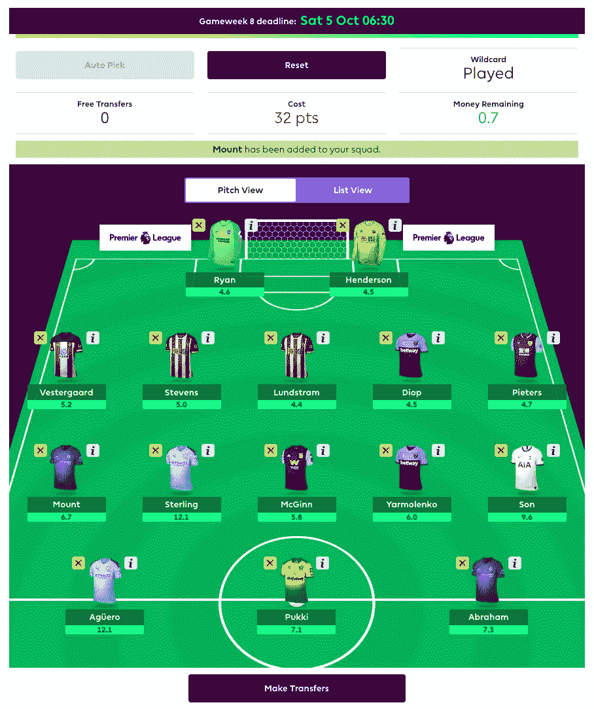

我们最终**决定使用我们的通配符！**考虑到最近的伤病，我们没有合适的球员配置来应对阿森纳、曼城和西汉姆联应该有的轻松赛程，以及利物浦接下来三场比赛有些困难的赛程，我们选择了它。

下面是我们的团队基于 ROI 统计和 pts_per_90min 统计得出的未来一周的数据:

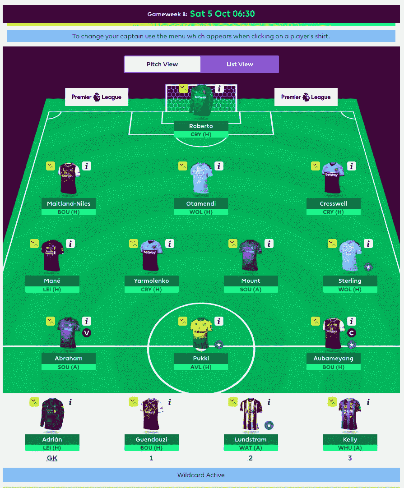

你可以看到我们的一些选择与 Algo 的建议不同——在法比安斯基受伤后，我们得到了罗伯特，因为西汉姆有一个更轻松的赛程，并且在 7 大防守名单中。我们也选择了梅特兰-奈尔斯和奥巴姆扬-T21，因为阿森纳的赛程应该很轻松，但是我们对这个选择有点紧张，因为我们都知道阿森纳是多么不可预测。由于通配符整个星期都是活跃的，我们可能会在最后一刻改变主意，但现在这是我们的团队。

# 团队统计

看看**最佳/最差防守和进攻**可以有几种不同的用法——例如，如果一个最佳进攻队与一个最差防守队比赛，你可能想让你的进攻中场或前锋担任队长。此外，当你查看这些位置的算法建议时，你可能想优先考虑防守最好的球队的 DF 和 GK。

# 最佳 7 项防御

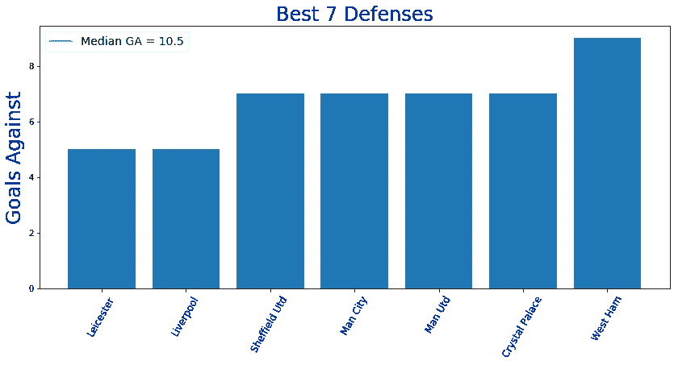

# 最差的 7 种防御

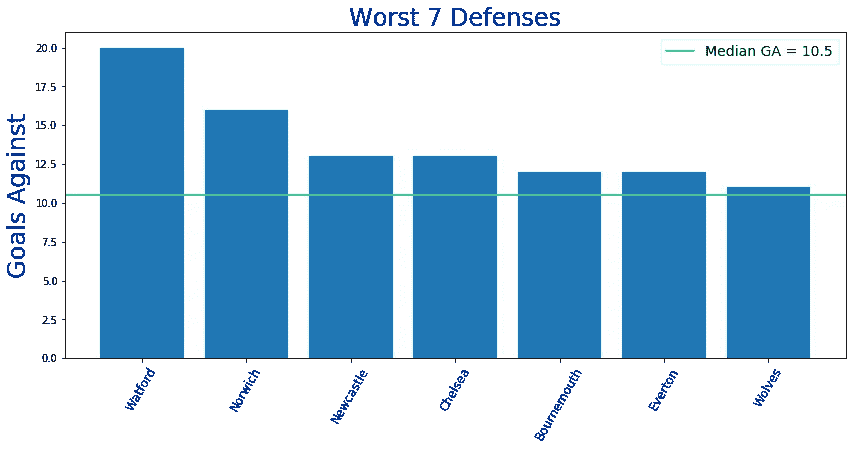

# 最佳 7 项犯罪

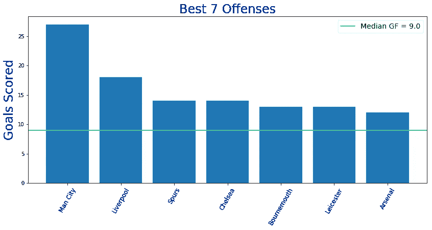

# 最糟糕的 7 项罪行

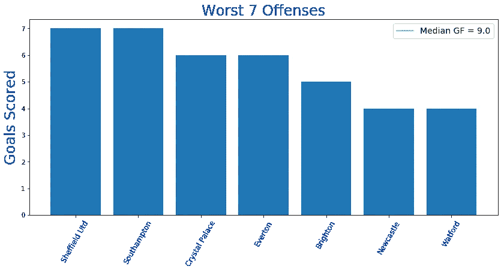

# 累积团队投资回报统计

下面你可以看到球队，按累积玩家投资回报率排序。请注意，**活跃玩家是任何已经玩了总可能游戏时间的至少 25%** 的玩家。例如，总可能分钟数=周数* 90 分钟= 7* 90 = 630。所以，我们把所有在该队至少打了 630/4 = 157.5 分钟的球员都算在内。

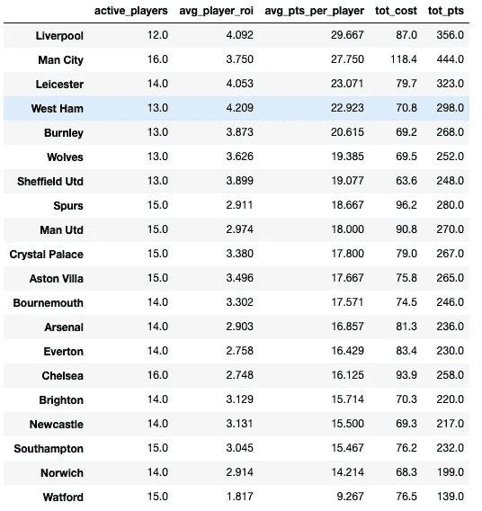

就**的 avg_pts_per_player** 而言，利物浦终于取代曼城成为第一球队，这是因为克洛普使用的轮换比瓜迪奥拉少得多——正如你所见，克洛普使用大约 12 名球员的核心，而瓜迪奥拉给了 16 名球员很多上场时间。其他球队似乎使用更少的轮换，从而给你更多的长期投资回报，是**莱斯特，西汉姆，伯恩利，狼队，谢菲联曼联和马刺**。在表现不佳的一方，我们有许多高价球员和球队轮换——沃特福德，切尔西，纽卡斯尔，布莱顿，水晶宫，诺维奇，埃弗顿，南安普顿和阿森纳。

# 最终想法:

我们正在开发一个**令人兴奋的新功能**，它将扫描世界上前 100 名玩家的球队，并将我们的算法预测与前 100 名 EPL 幻想用户最常挑选的球员进行比较。我们将尝试将这一点纳入决策过程，让我们的算法优先考虑在前 100 名球队中出现频率最高的球员。所以，请继续关注几周后即将发布的功能。

一如既往——感谢您的阅读，祝您周末好运！