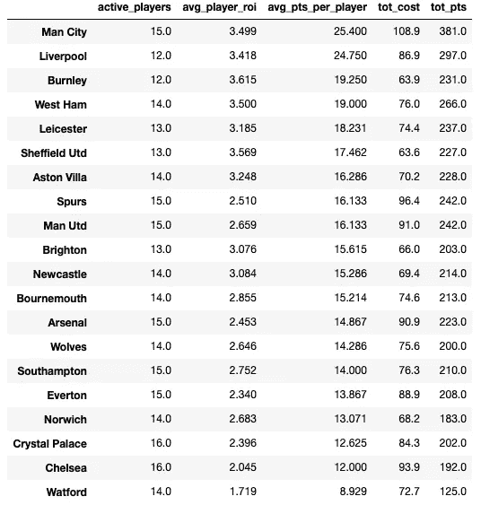

# EPL 幻想 GW6 重述和 GW7 算法精选

> 原文：<https://towardsdatascience.com/epl-fantasy-gw6-recap-and-gw7-algorithm-picks-d502259faa75?source=collection_archive---------26----------------------->

我们的钱球方法的幻想 EPL(队 _id: 2057677)

如果这是你第一次登陆我的幻想 EPL 博客，你可能想先看看[第一部分](/beating-the-fantasy-premier-league-game-with-python-and-data-science-cf62961281be)、[第二部分](/epl-fantasy-is-one-week-away-and-our-algorithm-is-ready-to-play-78afda309e28)、[第三部分](/epl-fantasy-gameweek-1-stats-and-algorithm-recommendations-for-smart-picks-23b4c49cae8)、[第四部分](https://medium.com/@pruchka/epl-fantasy-gw2-recap-and-gw3-algorithm-picks-23dae3ef70a8)和[第五部分](/epl-fantasy-gw3-recap-and-gw4-algorithm-picks-bc384ce1374b)，以熟悉我们的整体方法和我们随着时间的推移所做的改进。

> 因为我已经在以前的博客中详细解释了我们的整体方法和算法背后的逻辑，所以我现在将保持这篇博客更加简洁，只提供统计数据和快速评论。

# GW6 团队绩效总结和总体统计

我们上周在只有 10 名球员的情况下做得相对较好，主要是因为我们真的在我们的队长 KDB 身上获得了金牌，这只是证明了从长远来看运气是这场比赛中的一个巨大因素，因为选择正确的队长真的可以决定你一周的成败。我们在用坎特换坎特威尔的问题上损失了很多分数，但是 EPL 的数据显示坎特受伤了，这误导了我们的算法:(所以**受伤数据的准确性问题是另一个问题，从长远来看，这是一个很大的因素。**

# 每 90 分钟点数统计

我们将利用这一统计数据在我们的最终团队中补充一些目前投资回报率较低的球员，但他们正在开始恢复状态，并在过去几周内接近 90 分钟的比赛。

我们可以看到一些有趣的名字出现在这里，例如:**卡勒姆·钱伯斯、塞尔日·阿吉耶、阿隆·克雷斯维尔、尼古拉斯·奥塔门迪、安德烈·亚莫伦科、卢卡斯·托雷拉、神奇的纳坎巴**等等。这些球员在过去的几场比赛中获得了更多的比赛时间和相当多的分数，可能值得投资。

**以下是 pts_per_90min 统计中每个位置排名前 10 的球员:**

# 每 90 分钟 GK 10 大得分

# 90 分钟内前 10 名 DF 点数

# 90 分钟内前 10 名医学博士

# 每 90 分钟前 10 名

# GW6 整体统计数据为我们的 GW7 选择提供信息

首先，我们将查看 FDR_score(接下来 3 个对手的难度),以决定我们可能要从哪些球队中排除挑选球员:

看起来很多球队都有一个艰难的赛程——T2、曼联、水晶宫、埃弗顿、莱切斯特、纽卡、谢菲尔德和南安普顿——所以我的算法在本周的选择非常有限。赛程比较轻松的球队有**马刺、诺维奇、切尔西、伯恩利和维拉**。

接下来，我们将按职位来看一下**投资回报率前 10 的玩家是谁:**

**投资回报率排名前十的守门员**

**投资回报率排名前 10 的防御者**

**投资回报率排名前十的中场球员**

**投资回报率排名前十的前锋**

**GW6 算法选择**

提醒一下，我们的算法会考虑**调整后的每队阵容预算**，并尝试**最大化 11 名主力球员的每个位置**的支出，然后让你的替补获得良好的 ROI 值。本周我们将打 3–4–3 阵型。根据当前的投资回报率得分，过滤掉任何在接下来的三场比赛中与 AVG 对手有困难(FDR ≥ 3.56)的球队，并从可用选择列表中删除受伤的球员，我们的算法选择了以下球队作为当前花费全部 1 亿美元预算的最佳球队:

> *本周，我们试图修改选择逻辑，将 pts_per_90min 统计中的一些顶级玩家纳入顶级 ROI 玩家组合中，以增加期望值*

我们决定不使用我们的通配符，因为我们觉得我们特别为这个星期有一个体面的配置，加上幻想数据团队总是在更新伤病方面很慢，所以我们期待一些最后一分钟的伤病消息可能会从周中的杯赛中出来，我们不想冒这个险。不过，我们正在考虑下周使用我们的通配符，所以请继续关注。

下面是我们下周的阵容，只有一名球员转会——迪奥普换切斯特防守。队长有几个不错的选择——亚伯拉罕、希门尼斯、萨拉赫、TAA，所以这是一个艰难的选择，但我们选择了塔米·亚伯拉罕，因为切尔西正在主场迎战布莱顿。

# 团队统计

查看**最佳/最差防守和进攻**可以有几种不同的用法——例如，如果一个最佳进攻队与一个最差防守队比赛，你可能想让你的进攻中场或前锋担任队长。此外，当你查看这些位置的算法建议时，你可能想优先考虑防守最好的球队的 DF 和 GK。

# 最佳 7 项防御

# 最差的 7 种防御

# 最佳 7 项犯罪

# 最糟糕的 7 项罪行

# 累积团队投资回报统计

下面你可以看到球队，按累积玩家投资回报率排序。请注意，**活跃玩家是指已经玩了总可能游戏时间的至少 25%** 的任何玩家。例如，总可能分钟数=周数* 90 分钟= 6* 90 = 540。因此，我们把所有在该队上场时间至少达到 450/4 = 135 分钟的球员都算作现役球员。

一些有趣的名字开始出现在拥有不错 avg_player_ROI 的球队中——**伯恩利、莱斯特、西汉姆、马刺、谢菲尔德联队和维拉**与领头羊——**利物浦和曼城**一起进入前 8。在表现不佳的一方，我们有很多价格过高的球员——沃特福德，切尔西，水晶宫，诺维奇，埃弗顿，南安普顿，狼队和阿森纳。

# 最终想法:

我现在对世界上的顶级球员做了一些挖掘，从长远来看，选择一个合适的队长是多么重要，这一点变得非常明显。不可思议的是，他们几乎总是选择得分最高的球员作为队长。这给了我一个想法，我应该开始考虑写一个队长推荐系统，看看我是否能提出一些可行的东西。如果你对我训练我的模型应该看的统计有任何想法/建议，请给我发消息。

一如既往——感谢您的阅读，祝您周末好运！