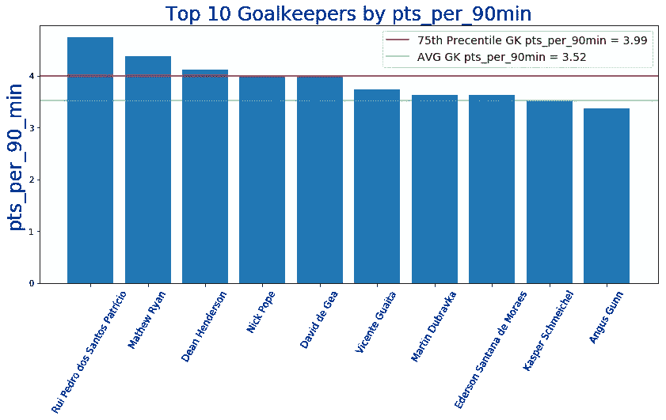
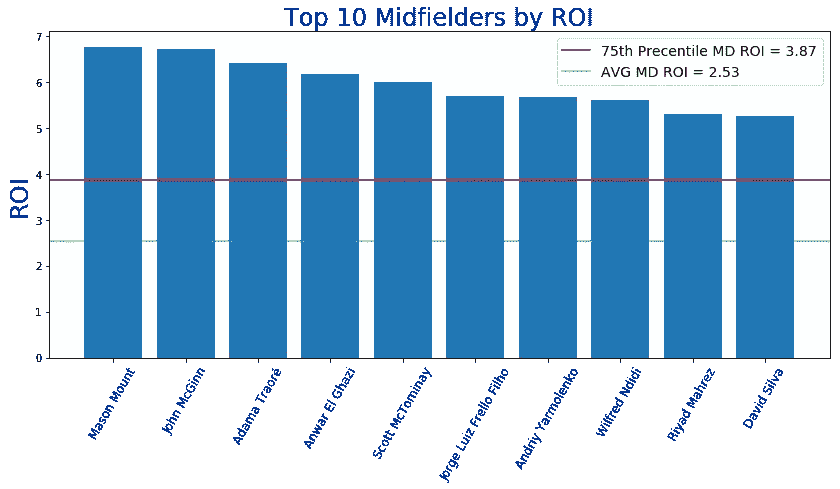

# EPL 幻想 GW8 重述和 GW9 算法精选

> 原文：<https://towardsdatascience.com/epl-fantasy-gw8-recap-and-gw9-algorithm-picks-b618c5291762?source=collection_archive---------39----------------------->

我们的钱球方法的幻想 EPL(队 _id: 2057677)

如果这是你第一次登陆我的幻想 EPL 博客，你可能想先看看[第一部分](/beating-the-fantasy-premier-league-game-with-python-and-data-science-cf62961281be)、[第二部分](/epl-fantasy-is-one-week-away-and-our-algorithm-is-ready-to-play-78afda309e28)、[第三部分](/epl-fantasy-gameweek-1-stats-and-algorithm-recommendations-for-smart-picks-23b4c49cae8)、[第四部分](https://medium.com/@pruchka/epl-fantasy-gw2-recap-and-gw3-algorithm-picks-23dae3ef70a8)和[第五部分](/epl-fantasy-gw3-recap-and-gw4-algorithm-picks-bc384ce1374b)，以熟悉我们的整体方法和我们随着时间的推移所做的改进。我在这个项目中的犯罪搭档是 Andrew Sproul，他和我一样对数据科学、人工智能和幻想 EPL 充满热情。

# 这个星期有什么新闻？

我们很高兴地宣布，本周我们整合了三项新功能:

1.  **EPL 100 强选手最佳混编团队**
2.  **调整后的 FDR(夹具难度等级)**
3.  **更准确的伤情更新**

下面是每个新功能的简要介绍，以及我们的新算法产生的一些见解和发现的可视化。

## **100 强 EPL 选手最佳混编团队**

我们使用 Selenium 编写了一个 web scraper，它扫描世界上排名前 100 位的球员的球队，并返回他们每周挑选的球队阵容以及他们选择的完整球队。长期的想法是每周跟踪他们的选择，并找出第 8 周前 100 名球员中的哪些人也将在赛季结束时进入前 100 名。这将帮助我们区分真正一致的幻想用户，并允许我们对他们的每周选择进行更完整的分析，帮助他们在整个赛季保持强劲的表现。

下面你可以看到目前前 100 名 Fantasy 用户对每个位置选择最多的玩家:

## 最佳守门员

## 大多数选定的捍卫者

## 最佳中场球员

## 入选最多的前锋

我们使用这些数据和当前的球员价格来创建下面的球队，这是由前 100 名中最受欢迎的球员组成的:

## 前 100 名 Fantasy 用户选择最多的团队

下面你可以看到上周顶尖选手挑选的阵型。似乎大多数顶级球员选择了**3–4–3 阵型**，很可能试图优化他们的进攻球员所获得的总积分，这些球员通常有更高的机会获得助攻、进球和总积分。

## **调整后的 FDR(夹具难度等级)**

我们的第二个新功能的灵感来自于这样一个事实，即我们现在有足够的来自过去八个游戏周的数据，可以开始调整 EPL 幻想数据团队在赛季初根据他们自己对历史团队表现的计算提供的原始团队实力评级。下面是原始团队实力指数的样子:

正如你所看到的，这看起来有点太死板，而且在大部分中间分数中没有足够的细微差别。我们的目标是根据当前赛季的团队表现构建我们自己的团队实力指数，然后将其与上面的原始 FDR 指数相结合，这将为我们提供最终的动态调整团队实力分数，该分数将根据团队在整个赛季中每周的表现随时间而变化。

> **Team_Strength_Index =(总积分+进球数+进球数)**

**为了使数据正常化，我们使用了每个指标的百分位数**，因此数据分布保持在 0-100 之间的标准化范围内。例如，利物浦现在有**24 分，在这个指标的第 100 百分位**，他们也有最好的防守，GA = 6，第二好的进攻，GF = 14，分别在第 100 和第 95 百分位。所以，他们当前赛季的总表现/实力得分= 100+ 100 + 95 = 295。您可以在下面看到所有其他团队的分数:

这个动态的分数允许我们在两端发现更多的异常值，并区分真正好的团队和真正差的团队。如你所见，沃特福德、诺维奇、埃弗顿、南安普顿和纽卡斯尔与其他球队相比都表现不佳。**曼联、狼队和伯恩茅斯的平均得分为 152 分，只有五支球队超过了第 75 百分位——利物浦、曼城、阿森纳、莱斯特和伯恩利，切尔西和水晶宫紧随其后。**

接下来我们要做的是应用一个最小最大值定标器，取上面这个分布的 z 分数，对它们求平方，得到一个类似的数据分布，但是在一定的范围内，我们可以将它与原始 FDR 分数混合:

最终的混合分数是我们的动态团队力量 z 分数和原始刚性 FDR 分数的 AVG(参见下面的新团队排名):

正如你所看到的，这看起来比最初的 FDR 表公平得多，最初的 FDR 表将团队放在严格的整数分数桶中，分数范围从 2-5，不允许任何细微差别。今后，我们将使用这种调整后的 _FDR 分布来通知我们的算法选择。话虽如此，让我们看看罗斯福本周的数据:

如你所见**维拉、水晶宫、南安普顿、曼联和沃特福德**在接下来的三场比赛中似乎有更难的特点，所以我们的算法会避免从这些球队中挑选球员。**切尔西、伯恩茅斯、西汉姆、曼城、阿森纳和莱斯特**似乎赛程相对轻松，所以从这些球队中挑选球员可能是一项不错的投资。

## **更准确的伤势更新**

我们本周增加的最后一个新功能是抓取一个比幻想网站更新 EPL 受伤新闻更频繁和更准确的网站，所以我们可以将它纳入我们的算法，避免挑选没有在幻想网站上更新的受伤球员。我们从以下网站获取受伤数据:

 [## 英超受伤和停赛-英超受伤

### 西汉姆联队:铁锤帮确认罗伯特·斯诺德格拉斯退出了苏格兰 2020 年欧洲杯阵容…

www.premierinjuries.com](https://www.premierinjuries.com/) 

至此，我们结束了我们的功能更新部分，并继续我们每周发布的幻想 EPL 博客的核心格式。

# GW8 团队绩效总结和总体统计

嗯…GW8 是艰难的，我相信这也适用于我们的大多数读者:)大多数大球队和昂贵的球员失望，这导致了所有幻想用户的 AVG 总得分为每个幻想队 38 分，这是非常低的。我们实际上比 AVG 做得更好，有**44 分**，所以我们并不太沮丧，但是我们觉得我们的外卡的**时机没有发挥作用**并且再次**我们没有选择一个好的队长，**尽管如果奥巴在第 95 分钟进球的话事情会好一点。

# GW8 整体统计数据为我们的 GW9 选秀权提供信息

让我们通过 ROI 和 pts_per_90min 统计数据来看看顶级球员:

**投资回报率排名前十的守门员**

**90 分钟内排名前 10 的守门员**

**按投资回报率排名的前 10 名防御者**

**pts _ per _ 90min 排名前 10 的防守队员**

投资回报率排名前十的中场球员

**90 分钟 pts _ per _ 强中场**

**投资回报率排名前 10 的前锋**

**射手前 10 名由 pts_per_90min**

# **GW9 算法选择**

提醒一下，我们的算法会考虑**调整后的每队阵型**的预算，并尝试**最大化 11 名主力球员的每个位置**的支出，然后让你的替补获得良好的 ROI 值。大多数星期我们一直在玩**3–4–3**阵型，现在我们知道世界排名前 100 的球员大多选择相同的阵型，我们会更倾向于继续使用它。根据当前的投资回报率得分，在接下来的三场比赛中过滤掉任何具有 AVG 对手难度(FDR ≥ 3.21)的球队，并从可用选择列表中删除受伤的球员，我们的算法选择了以下球队作为当前花费全部 1 亿美元预算的最佳球队:

正如你所看到的，甚至还有 0.7%的预算可以使用，并为一些关键职位尝试不同的选择。由于我们上次使用了通配符，我们无法选择上面的完整配置。相反，我们进行了两次转移:

> Pukki — OUT — **Vardy — IN**
> 
> 英镑—出局— **KDB —入局**

鉴于莱切斯特相对轻松的赛程，我们的替补是由我们想要得到 Vardy 的愿望决定的，为了做到这一点，我们必须卖掉 Sterling，这很好，因为我们认为他的价格有点过高，如果他从伤病中恢复并持续比赛，KDB 比他更有价值，这是最新的伤病更新所说的。此外，斯特林本周只为英格兰踢了两场比赛，所以他很可能不会在本周末为曼城踢满 90 分钟。

对于队长，我们在塔米·亚伯拉罕和瓦迪之间犹豫了一下，但选择了塔米，因为到目前为止纽卡在最差的 5 个防守名单中，而伯恩利在最好的 5 个防守名单中，所以我们期待切尔西比莱斯特进更多的球。我们对希顿和克雷斯韦尔的受伤感到紧张，梅特兰-奈尔斯不会上场，但我们会看到…

# 团队统计

查看**最佳/最差防守和进攻**可以有几种不同的用法——例如，如果最佳进攻队与最差防守队比赛，你可能想让你的进攻中场或前锋担任队长。此外，当你查看这些位置的算法建议时，你可能想优先考虑防守最好的球队的 DF 和 GK。

# 最佳 7 项防御

# 最差的 7 种防御

# 最佳 7 项犯罪

# 最糟糕的 7 项罪行

# 累积团队投资回报统计

下面你可以看到球队，按累积玩家投资回报率排序。请注意，**活跃玩家是指已经玩了总可能游戏时间的至少 25%** 的任何玩家。例如，总可能分钟数=周数* 90 分钟= 8* 90 = 720。所以，我们把所有至少打了 720/4 =【T20 =】180 分钟的球员都算作该队现役球员。

统计数据现在开始很好地融合，我们可以开始注意到一些有用的见解。例如**由于曼城的球员轮换率更高，他们的 avg_player_roi stat 显著下降**,因为到目前为止，他们在比赛期间至少轮换了 16 名活跃球员，而其他大多数球队的活跃球员为 13-14 名。**切尔西、热刺、曼联、埃弗顿和伯恩茅斯**由于更高的球员轮换和许多高价球员，整体表现仍然不佳。

在 avg_pts_per_player 和 avg_player_ROI 统计数据的上半部分，我们可以发现**伯恩利、莱斯特、西汉姆、狼队、谢菲尔德联队和阿斯顿维拉**是使用**更紧密的 13-14 岁现役球员核心**的球队，这些球员也表现出色，价格偏低，这使得从这些球队购买球员成为一项良好的长期投资。当然，利物浦和曼城位居前两名，但是他们的大部分球员都相当昂贵，所以人们必须明智地从这两支球队购买球员，并寻求长期价值。

# 最终想法:

我们计划的下一个令人兴奋的功能是**在即将到来的比赛中纳入来自体育博彩者**的系数，因为大多数主要博彩公司都有数据科学家和分析师团队，他们使用大量数据来估计最佳系数，所以我们认为我们可以借鉴他们的工作，并使用这些系数以某种方式通知我们的算法选择，或者至少进一步调整我们的 FDR 分数。

一如既往——感谢您的阅读，祝您周末好运！