# EPL 幻想 GW9 重述和 GW10 算法精选

> 原文：<https://towardsdatascience.com/epl-fantasy-gw9-recap-and-gw10-algorithm-picks-d595f02b6d6e?source=collection_archive---------27----------------------->

我们的钱球方法的幻想 EPL(队 _id: 2057677)

如果这是你第一次登陆我的幻想 EPL 博客，你可能想先看看[第一部分](/beating-the-fantasy-premier-league-game-with-python-and-data-science-cf62961281be)、[第二部分](/epl-fantasy-is-one-week-away-and-our-algorithm-is-ready-to-play-78afda309e28)、[第三部分](/epl-fantasy-gameweek-1-stats-and-algorithm-recommendations-for-smart-picks-23b4c49cae8)、[第五部分](/epl-fantasy-gw3-recap-and-gw4-algorithm-picks-bc384ce1374b)和[第九部分](/epl-fantasy-gw8-recap-and-gw9-algorithm-picks-b618c5291762)，以熟悉我们的整体方法和我们随着时间的推移所做的改进。我在这个项目中的犯罪搭档是 Andrew Sproul，他和我一样对数据科学、人工智能和幻想 EPL 充满热情。

# 这个星期有什么新闻？

在受到幻想之神又一周的惩罚后，我们决定引入一个新的安慰功能，主要是为了让像我和安德鲁这样的人对他们糟糕的 GW 统计数据感觉良好:)

**十大奇幻用户统计**——每周我们都会绘制出世界前 10 名玩家在那一周的表现，包括前 10 名玩家的 AVG、最小和最大得分。这可以用来衡量我们自己的表现，所以如果我们度过了糟糕的一周，但我们的分数仍然接近前 10 名，那么我们至少可以自我感觉更好:)请享受下面的第一份“安慰食物”……(你可以感谢我们的这一善举:P 通过给文章一些掌声和分享，它可以帮助将博客推向趋势部分，这有助于它获得更多的观众。提前感谢！)

# GW9 世界排名前十的选手

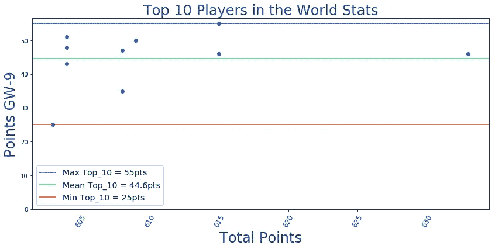

因此，如果你本周得分接近 44 分，你实际上可以自我感觉良好，因为这是世界前 10 名球员的 AVG 得分。而如果你和我们一样得了 32 分:(，要知道 **Top10 里还有一个球员得分比你少——25 分**！

现在我们让你感觉温暖和模糊，是时候面对另一个艰难的 GW9 的音乐，看看所有其他有趣的数据。

# EPL 100 强球员最佳混合团队

当我们谈论世界前 100 名球员的话题时，让我们看看谁是他们球队中按位置选择的前 10 名球员，以及 GW9 最喜欢的球队阵型。

## 前 100 名最佳守门员

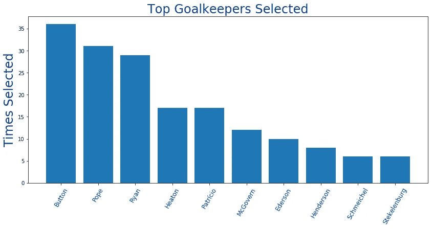

## 前 100 名中最受欢迎的捍卫者

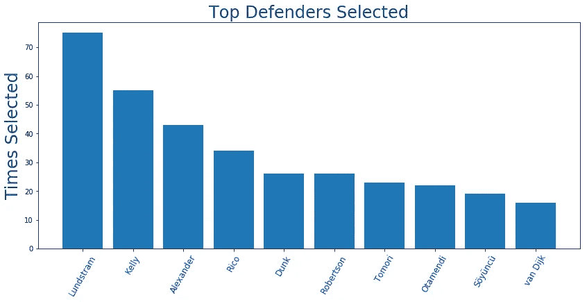

## 前 100 名最佳中场球员

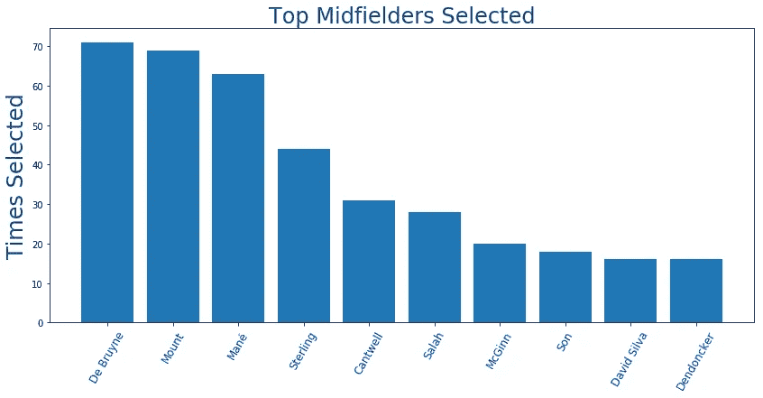

## 前 100 名中入选最多的前锋

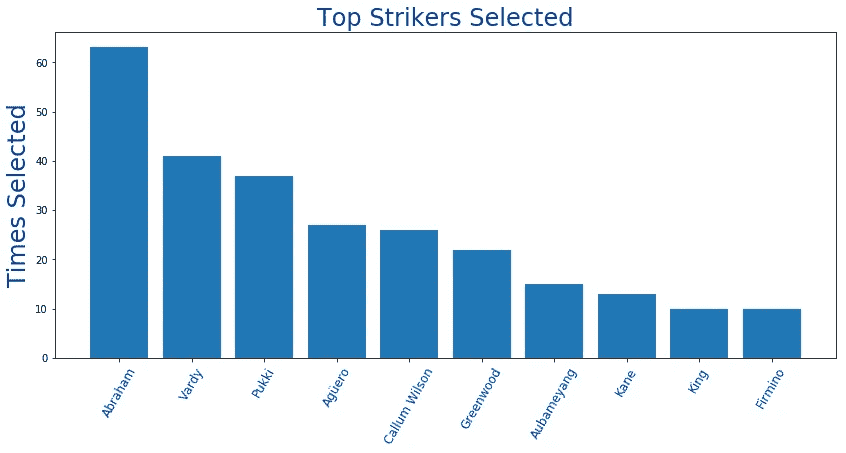

我们使用这些数据和当前的球员价格来创建下面的球队，这是由前 100 名中最受欢迎的球员组成的:

这是一个看起来不错的团队，银行里还有 210 万英镑可以用来玩和测试不同的配置。

## 前 100 名 Fantasy 用户选择最多的团队

下面你可以看到上周顶尖选手挑选的阵型。似乎大多数顶级球员选择了**3–4–3 阵型**，很可能试图优化他们的进攻球员所获得的总积分，这些球员通常有更高的机会获得助攻、进球和总积分。

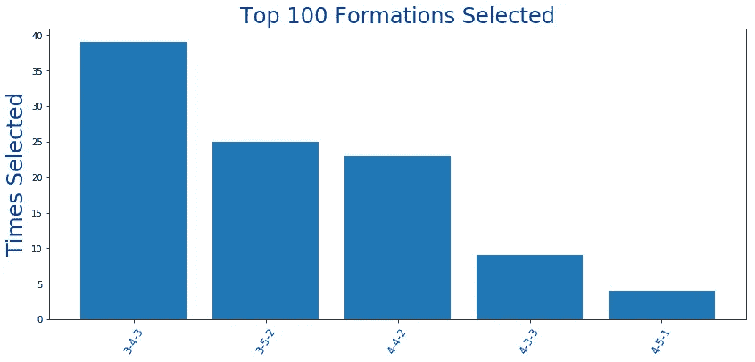

# GW9 团队绩效总结和总体统计

我们认为这不会比去年的 GW 更糟糕，但显然——它会……正如你在下面看到的，我们最终只得到 32 分——低于 AVG 本周的 37 分。我们实际上可以做得更好，但是**5 名防守队员中有 4 名神秘受伤**，所以我们最终只和 **1 名防守队员，以及总共 9 名队员**一起比赛。鉴于这一点，以及我们选择了一个糟糕的队长(再次！？)，我们觉得自己做得还行。至少我们对 Vardy 的投资现在有了回报:)

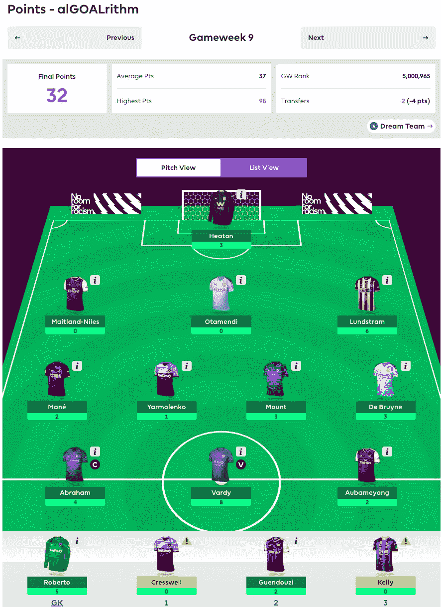

# GW8 整体统计数据为我们的 GW9 选秀权提供信息

下面让我们从调整后的未来三周的对手难度等级(FDR)开始:

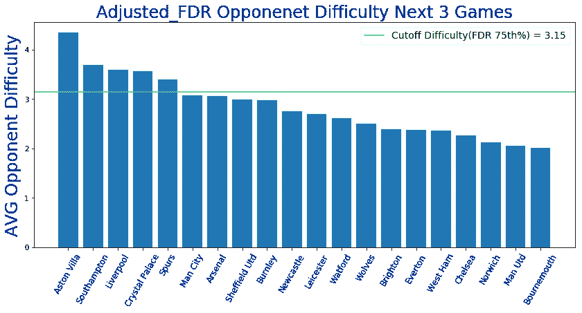

看起来本周我们有很多球队的赛程都很艰难——维拉、南安普顿、利物浦、水晶宫和热刺。我们的算法是这样写的，它不会在本周推荐从这些球队购买球员。赛程相对轻松的球队(如果 EPL 有这种东西的话:P)有**伯恩茅斯、曼联、诺维奇、切尔西和西汉姆、**所以从这些球队得到球员可以在接下来的三场 2-3 比赛中得到回报。

# 最新伤情更新美国东部时间 10 月 24 日上午 11 点

以下数据来自一个独立网站，该网站更新最新受伤情况的频率比 Fantasy 网站高得多:

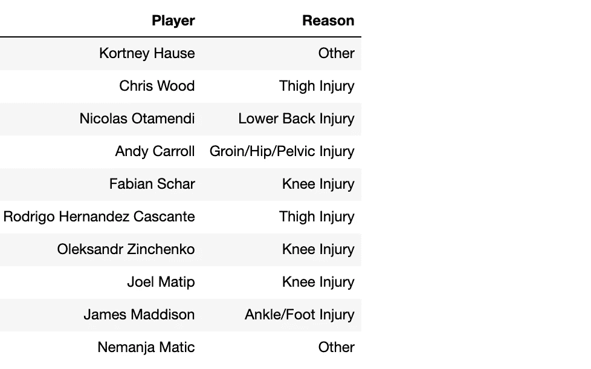

接下来，让我们通过 ROI 和 pts_per_90min 统计数据来看看顶级球员:

**投资回报率排名前十的门将**

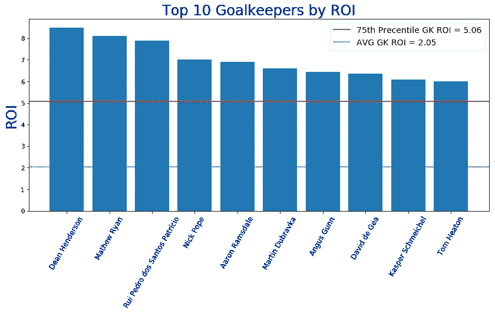

**90 分钟内排名前 10 的守门员**

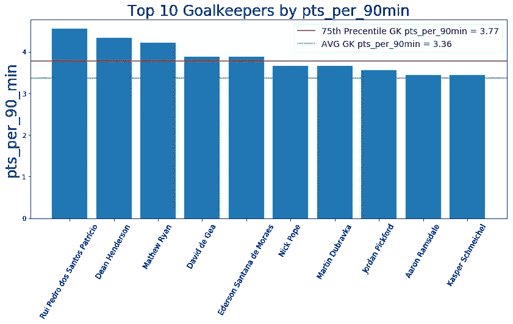

**按投资回报率排名的前 10 名防守队员**

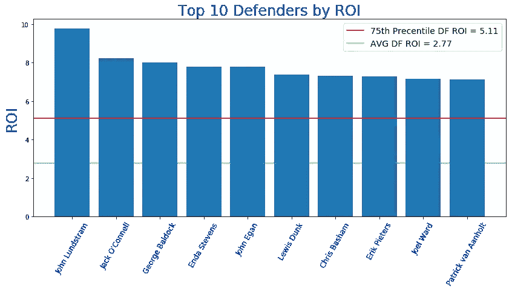

**由 pts_per_90min 统计的前 10 名防守队员**

**投资回报率排名前十的中场球员**

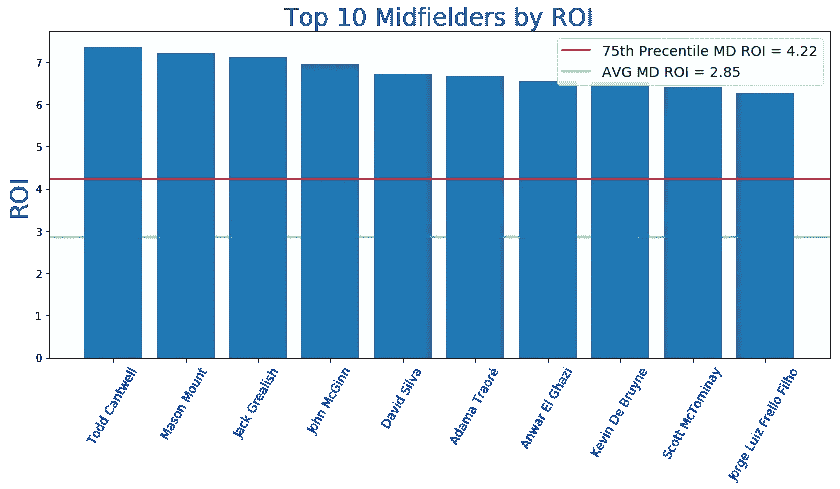

**90 分钟 pts _ per _ 强中场**

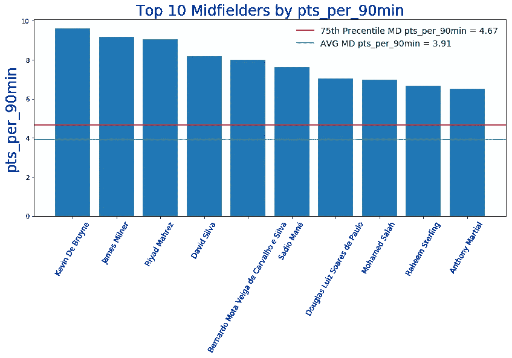

**投资回报率排名前 10 的前锋**

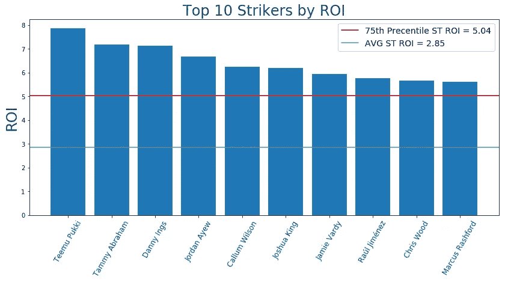

**投资回报率排名前 10 的前锋 pts_per_90min**

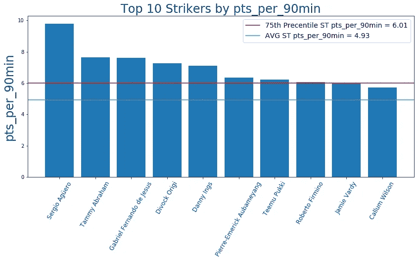

# GW9 算法选择

提醒一下，我们的算法会考虑**调整后的每队阵型**的预算，并尝试**最大化 11 名主力球员的每个位置**的支出，然后让你的替补获得良好的 ROI 值。大多数星期我们一直在玩**3–4–3**阵型，现在我们知道世界排名前 100 的球员大多选择相同的阵型，我们会更倾向于继续使用它。根据当前的投资回报率得分，在接下来的三场比赛中过滤掉任何具有 AVG 对手难度(FDR ≥ 3.15)的球队，并从可用选择列表中删除受伤的球员，我们的算法选择了以下球队作为当前花费全部 1 亿美元预算的最佳球队:

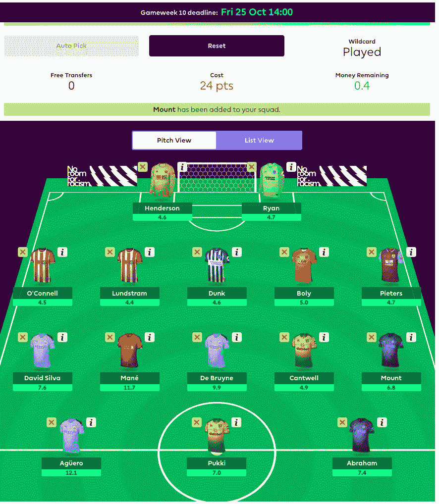

**我们在那里插上了马内**，尽管利物浦的 FDR 本周很高，因为我们有太多的剩余预算，不想留下太多的额外资金。如果你好奇的话，该算法最初的选择是阿达马·特劳雷的马内，剩余约 600 万美元。

就我们团队而言，考虑到本周晚些时候的欧洲比赛，我们决定等到周五再决定制造什么样的替补。上周我们已经因为 3-4 个意外的伤病焦头烂额，所以我们希望本周至少有 11 名健康的球员，而不是像上周那样只有 9 名。

# 团队统计

看看**最佳/最差防守和进攻**可以有几种不同的用法——例如，如果一个最佳进攻队与一个最差防守队比赛，你可能想让你的进攻中场或前锋担任队长。此外，当你查看这些位置的算法建议时，你可能想优先考虑防守最好的球队的 DF 和 GK。

# 最佳 7 项防御

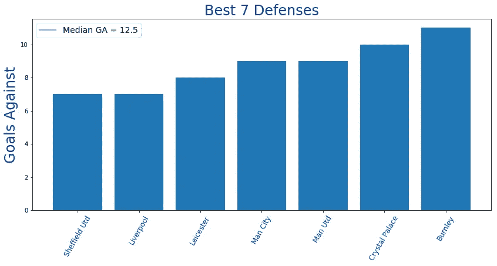

# 最差的 7 种防御

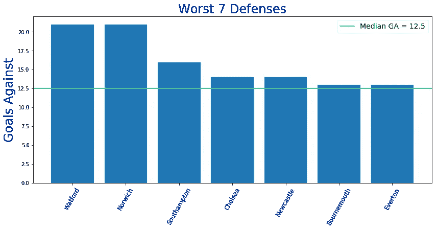

# 最佳 7 项犯罪

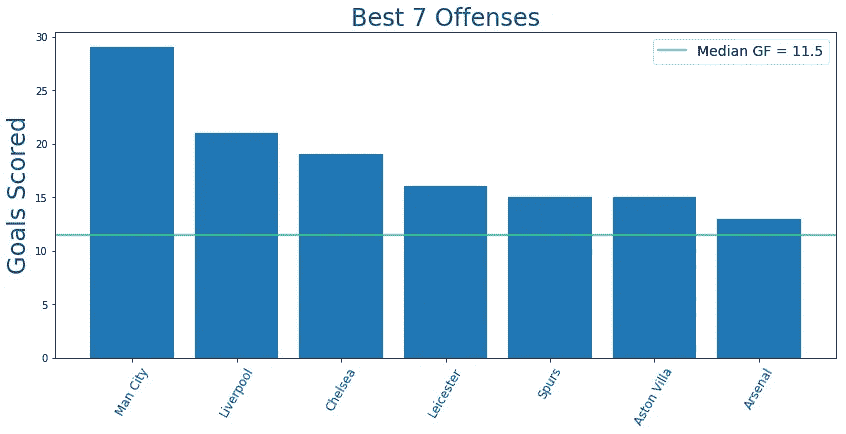

# 最糟糕的 7 项罪行

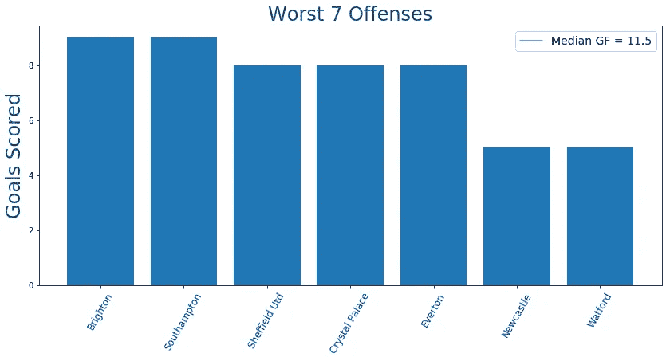

# 累积团队投资回报统计

下面你可以看到球队，按累积玩家投资回报率排序。请注意，**活跃玩家是指已经玩了总可能游戏时间的至少 25%** 的任何玩家。例如，总可能分钟数=周数* 90 分钟= 9* 90 = 810。所以，我们把所有至少打了 810/4 = **202.5 分钟**的球员都算作是该队的现役球员。

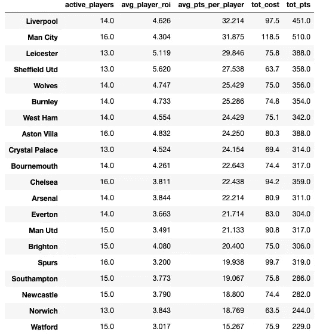

列斯特、谢菲尔德联队、狼队、伯恩利队、西汉姆联和维拉队的排名开始变得有趣起来。正如你所看到的，所有这些球队都只使用**13-14 名核心球员**，并且到目前为止表现超出预期，这使得从这些球队获得球员在长期预期 ROI 方面是一项很好的投资。

下半区有一些常见的嫌疑人，但也有一些球队，如**热刺、埃弗顿、曼联、阿森纳和切尔西**，主要是因为球员轮换率较高**对 AVG** 为 15-16，以及球队表现不佳，有许多价格过高的球员，这似乎不是一个好的投资。

# 最终想法:

今天我们将以“最后的祈祷”来结束，而不是“最后的想法”。我们向幻想之神祈祷，希望他们本周能给我们一些怜悯，保佑我们有一个由 11 名健康球员组成的完整阵容，这样我们至少可以最大化我们的期望，结束我们的糟糕表现。另外，如果他们本周祝福我们的队长有额外的速度、力量和投篮准确性，我们也不会不高兴:)

一如既往——感谢您的阅读，祝您周末好运！