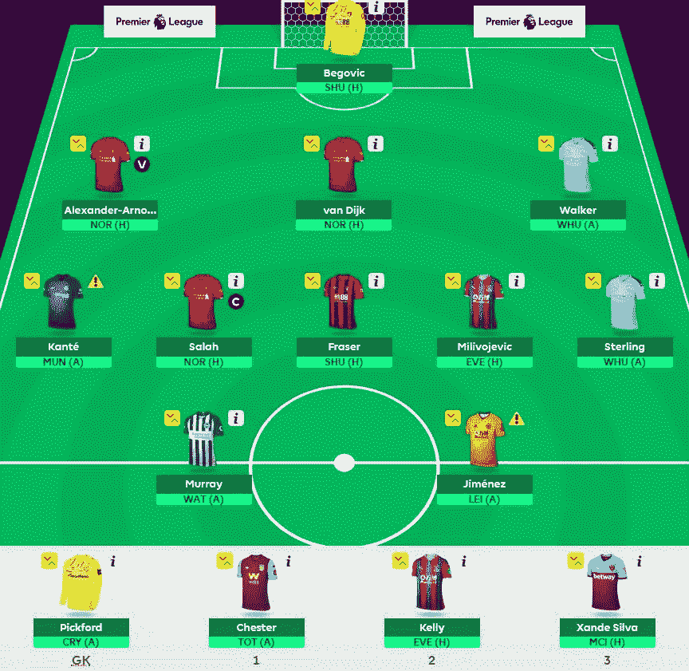
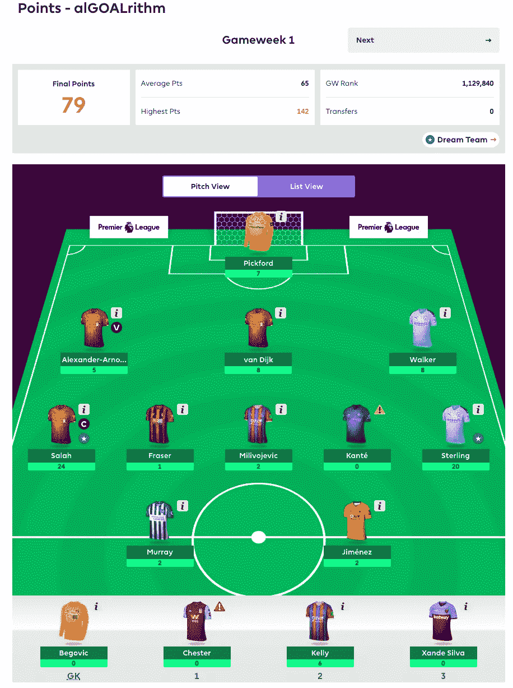

# EPL 幻想是一个星期了，我们的算法已经准备好了！

> 原文：<https://towardsdatascience.com/epl-fantasy-is-one-week-away-and-our-algorithm-is-ready-to-play-78afda309e28?source=collection_archive---------14----------------------->

## (团队编号:2057677)

## 我们击败 EPL 幻想游戏的摇钱树方法

这是我们去年文章的延续，我和我的朋友 Andrew Sproul 写了一些 Python 代码来创建一个球员推荐系统，用于每周根据球员成本、上场时间和每花一美元的总点数(ROI)来选择最佳的 EPL 梦幻队。

您可以在这里阅读完整的文章，其中详细解释了我们的分析和代码逻辑:

[https://towards data science . com/beating-the-fantasy-premier-league-game-with-python-data-science-cf 62961281 be](/beating-the-fantasy-premier-league-game-with-python-and-data-science-cf62961281be)

这个新博客将尝试每周跟踪我们球队的进展，并在每周转会窗口关闭前发布球队的建议。下面你可以看到我们的算法根据上赛季每个球员的赛季末总 ROI 统计数据为 EPL 2019-2020 赛季的开始推荐的球队。

## 游戏周 1 最佳投资回报率团队:

GK:
[('乔丹·皮克福德'，5.5)，('卢卡什·法比安斯基'，5.0)]
DF:
[('维吉尔范迪克'，6.5)，('安德鲁·罗伯特森'，7.0)，('路易斯·切廷莫雷拉马里尼奥'，6.0)，('埃梅里克·拉波尔特'，6.5)，('塞萨尔·阿兹皮利奎塔'，6.0)
MD:【T8][('穆罕默德萨拉赫'，12.5)，('拉希姆斯特林'，12.0)，('瑞安弗雷泽'，7.5)，('卢卡

> 注意:我们需要修复代码，因为正如你在上面看到的，算法只选择了 14 个球员，而不是 15 个，但我们将在未来几天内尝试修复这个问题。

## 我在 EPL 幻想中调整后的团队名称——“算法”

因为我们的推荐系统目前没有考虑每支球队面对的对手，所以我对算法推荐的实际球队做了一些定制调整。我仍然选择上个赛季投资回报率超过 20%的球员，而且只比最初推荐的球员低几个百分点。以下是我为游戏周 1 选择的配置:

## 最终注释:

正如你们大多数以前玩过 EPL 幻想游戏的人所知道的那样，运气仍然是游戏中的一个主要因素，因为伤病和选择哪些球员留在替补席上以及谁是你选择的队长，所以仍然有很多人工决策和随机噪音涉及到赛季结束时最终赢家的最终结果。也就是说，我们仍然很兴奋地测试我们能比普通玩家做得更好，只要遵循简单的钱球方法，并试图在赛季结束前优化总预算以获得最大投资回报。

我们还将在整个赛季中努力改进代码，使其更加动态，我将尽我所能在这里发布更新。

同时，祝所有玩家好运，如果有任何问题，请随时联系我们！

## 更新:

下面你可以看到我们团队在游戏周 1 中的表现:

链接到新博客，其中包含更新的算法规则和游戏周 2 的最佳 ROI 团队建议，如下所示:

[https://medium . com/@ pruchka/EPL-fantasy-game week-1-stats-and-algorithm-recommendations-for-smart-picks-23 B4 c 49 CAE 8](https://medium.com/@pruchka/epl-fantasy-gameweek-1-stats-and-algorithm-recommendations-for-smart-picks-23b4c49cae8)