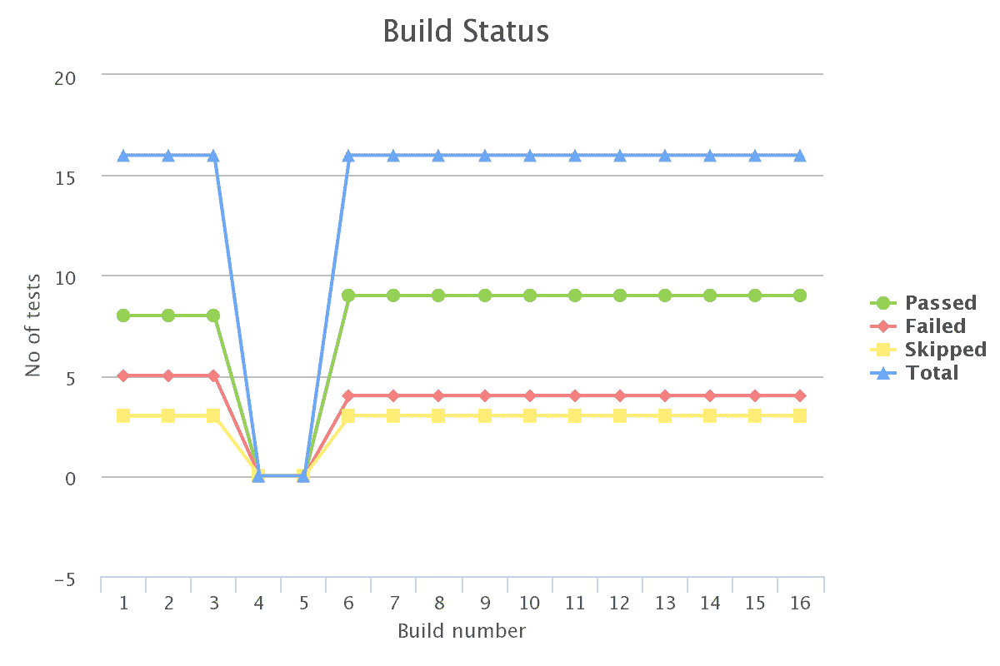
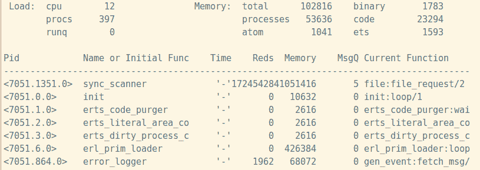

# Erlang/Elixir 解决方案:为质量而奋斗

> 原文：<https://towardsdatascience.com/erlang-elixir-solutions-struggle-for-quality-2bd0a63de057?source=collection_archive---------25----------------------->

@[jcutrer](https://unsplash.com/@jcutrer)

今天，我们将讨论日志、量化指标以及如何观察它们，以提高团队反应速度，并在发生事故时减少系统等待时间。

Erlang/OTP 作为开发分布式系统的框架和思想，为我们提供了规范的开发方法、合适的工具和标准组件的实现。让我们假设我们已经开发了 OTP 的潜力，并且已经从原型一直到生产。我们的 Erlang 项目在生产服务器上感觉非常好。代码库在不断发展，新的需求和功能一起出现，新的人加入团队。一切都很好吗？然而，有时可能会出错，任何技术问题加上人为因素都会导致崩溃。

由于您无法涵盖所有基础并预见所有潜在的故障和问题危险，因此您必须通过适当的管理和软件解决方案来减少系统等待时间。

任何信息系统都存在不同性质的故障风险，例如:

*   硬件和电源故障
*   网络故障:配置错误以及固件损坏或过期
*   逻辑错误:从算法编码问题到出现在子系统和系统边界的架构相关问题
*   安全问题以及网络攻击和黑客攻击，包括内部伪造

首先，我们来划分一下责任。基础设施监测将涉及网络软件和数据传输网络。这种监测可以在 zabbix 的帮助下进行。关于它的设置已经写了很多，我们不打算重复。

从开发人员的角度来看，访问和质量问题与错误和性能问题的早期检测以及对它们的快速响应密切相关。为此，您需要特定的方法和评估工具。好吧，让我们试着找出量化指标。通过在项目开发和运行的不同阶段对它们进行分析，我们可以显著地提高其质量。

# 构建系统

让我们再次回顾一下，工程方法在测试和开发软件中是多么重要。Erlang/OTP 提供了两种测试框架:eunit 和 common test。

我们可以使用成功的或有问题的测试的数量、它们的运行时间和测试覆盖率作为对代码库及其动态的主要评估的度量。这两个框架都使我们能够在 Junit 中保存测试结果。例如，对于 rebar3 和 ct，您需要将以下内容添加到 rebar.config 中:

> {cover_enabled，true}。
> {cover_export_enabled，true}。
> {ct_opts，[
> {ct_hooks，[{cth_surefire，[{path，" report . XML " }]} }
> ]}。

成功和失败测试的数量使得建立趋势图成为可能。

通过查看它，您可以评估团队的表现并测试回归。例如，你可以在 Jenkins 中使用测试结果分析器插件得到这样的图形。度量的使用允许您注意到并防止中断或减慢项目测试，并在发布之前修复问题

# 应用指标

除了操作系统指标，应用程序指标也应包括在监控中。它可能是每秒页面浏览量、支付次数和其他重要指标。

在我自己的项目中，我使用代码模板 *${application}。${metrics_type}。${name}* 用于命名指标。这种命名有助于获得如下度量列表

> *messaging . systime _ subs . messages . delivered = 1654*
> 
> *messaging . systime _ subs . messages . proxied = 0*
> 
> *messaging . systime _ subs . messages . published = 1655*
> 
> *messaging . systime _ subs . messages . skipped = 3*

我们拥有的指标越多，就越容易了解一个复杂系统中正在发生的事情。

# Erlang 虚拟机指标

应该特别注意 Erlang 虚拟机监控。“让它崩溃”的思想真是太棒了，正确使用 OTP 肯定会帮助您恢复应用程序和进程。但是别忘了 Erlang VM 本身:虽然很难让它崩溃，但还是有可能的。所有潜在的情况都是基于资源耗尽。让我们列出最受欢迎的几个:

**原子表溢出。**

原子作为标识符，其主要目的是提高代码的可读性。一旦创建，它们将永远留在 Erlang VM 内存中，因为它们不会被垃圾收集器清除掉。这是为什么呢？垃圾收集器在每个进程中处理这些进程数据。反过来，原子可能分布在多个进程的数据结构中。默认情况下可以创建 1，048，576 个原子。在关于杀死 Erlang VM 的文章中，您可能会遇到类似的情况:

> 用[list _ to _ atom(integer _ to _ list(I))| | I

as an illustration of the above-mentioned effect. This problem looks quite artificial and unlikely to happen in real systems. There have been cases, though… For instance, in an an external API handler in queries analysis *binary _ to _ atom/2*代替*binary _ to _ existing _ atom/2*，或者用 *list_to_atom/1* 代替*list _ to _ existing _ atom/1*。

要监控原子状态，可以使用以下参数:

1.  *Erlang:memory(atom _ used)*—原子使用的内存
2.  *Erlang:system _ info(atom _ count)*—系统中创建的原子数量。

与 Erlang:system _ info(atom _ limit)一起，可以计算原子的利用率。

**流程泄露。**

值得一提的是，当达到 process_limit (+P 参数 erl)时，erlang vm 并没有崩溃，而是陷入了失修状态——在这种情况下，甚至连接到它似乎都是不可能的。最终，由于内存分配给泄漏进程而耗尽内存将导致 erlang vm 崩溃。

为了监控流程状态，让我们使用以下参数:

1.  *Erlang:system _ info(process _ count)*—本地节点上当前存在的进程数。与*Erlang:system _ info(process _ limit)*一起，您可以计算进程的使用情况。
2.  *erlang:memory(processes)*—当前为 Erlang 进程分配的内存总量。
3.  *Erlang:memory(processes _ used)*—Erlang 进程当前使用的内存总量。

**邮箱溢出**。

生产者流程在没有确认挂起的情况下向消费者流程发送消息就是一个很好的例子。与此同时，消费者流程中的 **receive** 由于丢失或错误的模式而忽略消息。因此，所有邮件都存储在邮箱中。如果处理器无法处理，Erlang 有一种机制可以减慢发送方的速度。然而，在可用内存耗尽后，虚拟机还是会崩溃。

在 etop 的帮助下，您可以了解您是否有任何邮箱溢出问题。

> $ erl-name etop @ host-hidden-s etop-s Erlang halt-output text-node dest @ host-set cookie some _ cookie-tracing off-sort msg _ q-interval 1-lines 25

有问题流程的数量可以作为持续监控的衡量标准。为了识别这些过程，可以使用以下函数:

> top_msq_q()->
> 
> [{P，RN，L，IC，ST} || P = 1000，[{_，RN}，{_，IC}，{_，ST}]

This list can also be logged. In this case, the analysis of the problem is simplified after getting a notification from monitoring.

**二进制溢出。**

大型(超过 64 字节)二进制文件的内存是在堆上分配的。分配的内存单元有一个引用计数器，显示可以访问它的进程的数量。重置计数器后，将执行清理。就这么简单，没错。然而，有一些小问题。例如，有可能出现一个进程会产生太多的垃圾，以至于系统没有足够的内存来进行清理。

*erlang:内存(二进制)*作为监控的指标。它显示了为二进制文件分配的内存。

总之，我们已经提到了所有导致虚拟机崩溃的案例。然而，继续监控其他同样重要的参数似乎是合理的，这些参数可能会直接或间接影响应用程序的正常运行:

*   ETS 表内存: *erlang:内存(ets)* 。
*   编译模块的内存: *erlang:内存(代码)*。如果您的解决方案不使用动态代码编译，则可以排除此参数。
    应该有一个具体的参考 erlydtl。如果您动态编译模板，beam 会被创建并加载到 vm 内存中。它还会导致内存泄漏。
*   系统内存:*二郎:内存(系统)*。显示了运行时 erlang 使用的内存。
*   总内存利用率: *erlang:内存(总)*。当前为 Erlang 进程分配的内存总量。
*   关于减少的信息: *erlang:统计(减少)*
*   准备执行的所有进程的计数:*Erlang:statistics(run _ queue)*
*   Vm 正常运行时间:*Erlang:statistics(runtime*)—使您无需分析日志就能了解是否有重启
*   网络活动: *erlang:统计(io)*

# 向 zabbix 发送指标

让我们创建一个包含应用指标和 erlang vm 指标的文件。我们会在 N 秒内更新一次。对于每个 erlang 节点，指标文件必须包括所有应用程序指标和 erlang vm 指标。最终，我们应该有这样的东西:

> messaging . systime _ subs . messages . delivered = 1654
> 
> messaging . systime _ subs . messages . proxied = 0
> 
> messaging . systime _ subs . messages . published = 1655
> 
> messaging . systime _ subs . messages . skipped = 3
> 
> ….
> 
> erlang.io.input = 2205723664
> 
> erlang.io.output = 1665529234
> 
> erlang.memory.binary = 1911136
> 
> erlang.memory.ets = 1642416
> 
> Erlang . memory . processes = 23596432
> 
> Erlang . memory . processes _ used = 23598864
> 
> erlang.memory.system = 50883752
> 
> erlang.memory.total = 74446048
> 
> erlang.processes.count = 402
> 
> erlang.processes.run_queue = 0
> 
> erlang.reductions = 148412771
> 
> ….

在***zabbix _ sender***的帮助下，我们将把这个文件发送到 zabbix，在那里可以使用图形表示，并且可以创建自动化和通知触发器。

现在，在我们的监控系统中，有了指标以及自动化和通知触发器，我们有机会避免失败和故障。这是因为我们能够提前对所有偏离全功能模式的危险做出反应。

# 中央日志收集

如果一个项目中只有几台服务器，那么没有集中的日志收集也是可行的。然而，当出现具有大量服务器、集群和环境的分布式系统时，就需要处理日志收集和查看。

为了在我的项目中执行日志记录，我使用 lager。在从原型到生产的过程中，项目会经历以下日志收集阶段:

*   最简单的日志记录是将日志下载到本地文件，甚至是 stdout (lager_file_backend)
*   集中日志收集，例如使用 syslogd 并将所有日志自动发送到收集器。对于这样的方案， [lager_syslog](https://github.com/basho/lager_syslog) 是最优的。但是，主要的缺点是，您必须访问日志收集器服务器，找到包含所需日志的文件，并以某种方式过滤事件，以搜索调试所需的事件。
*   集中日志收集，保存到带有过滤器和搜索机会的存储库中。

现在，是时候讨论使用后一种日志收集类型的优点、缺点和量化指标了。我们将通过某个实现的例子来实现它——lager _ click house，我在我的大多数项目中都使用它。关于 lager_clickhouse 有几件事要说。这是一个将事件保存到 clickhouse 的大型后端。到目前为止，这是一个内部项目，但有计划将其公开。在 lager_clickhouse 开发过程中，有必要绕过某些 clickhouse 特性。例如，使用事件缓冲是为了不要过于频繁地查询 clickhouse。努力得到了回报，工作稳定，表现良好。

这种保存到存储库的方法的主要缺点是创建了一个额外的实体——click house。在这种情况下，你必须编写保存事件的代码，以及搜索和分析事件的用户界面。此外，对于一些项目，使用 tcp 发送日志可能是至关重要的。

在我看来，优点超过了所有可能的缺点:

1.  快速方便地搜索事件:

*   按日期过滤，而不必在包含各种事件的中央服务器上搜索一个或多个文件。
*   按环境过滤。来自不同子系统(通常来自不同集群)的日志被写入同一个存储。目前，有一种按标签划分的方式。每个节点都可以用一个或一组标签来标记，这些标签在节点的配置文件中定义。
*   按节点名过滤。
*   根据发送消息的模块名称进行过滤。
*   按事件类型过滤
*   文本搜索

下面的屏幕截图展示了日志查看器界面的一个示例:

2.完全自动化该过程的可能性。通过实现日志存储，可以获得关于错误数量、关键问题和系统性能的实时数据。实时分析这些数据并施加一些限制，我们可以为系统的非功能状态生成警告，并以自动模式处理它:执行脚本来管理问题并发送通知:

*   在严重错误的情况下
*   在爆发错误的情况下
*   某个度量标准是事件生成速度，因为日志中会出现许多新事件。您几乎总能知道单位时间内由 project 生成的日志的估计值。如果超过了，肯定是出问题了。

紧急事件自动化主题的进一步发展是 lua 脚本的实现。任何开发人员或管理员都可以编写脚本来处理日志和指标。脚本带来了灵活性，使您能够创建自动化和通知的个人场景。

# 结果

指标和日志，以及分析它们的适当工具，对于了解系统内的流程和调查事件至关重要。我们对系统的了解越多，就越容易分析其行为并在早期阶段解决问题。如果我们的措施没有很好地发挥作用，我们总是有图表和详细的日志供我们使用。

您如何利用 Erlang/Elixir 解决方案？在生产中遇到过什么有趣的案例吗？