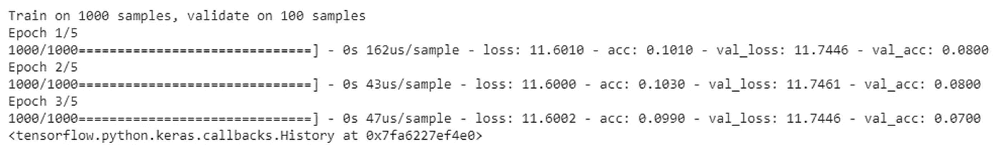

# 神经网络中的误差分析

> 原文：<https://towardsdatascience.com/error-analysis-in-neural-networks-6b0785858845?source=collection_archive---------5----------------------->

误差分析是对误差的分析。呵呵！你不必告诉我这些。事实上，整个错误分析都是直观的。但是，在实际项目中，人们往往会忽略一些要点。我们可以把这看作是一种复习，当挫折让我们忘记了基本知识时，我们可以检查一下。

有了 Pytorch 和 Tensorflow 等丰富的库，现在大多数机器学习算法都是现成的——只需实例化一个对象，并用你拥有的数据训练它。你已经准备好了！

这可以解决琐碎的教科书问题，比如[读取 MNIST 数字](/a-glimpse-of-tensorflow-bd9c6c06ab73)。我们可以尝试一些配置，很快就能达到接近 100%的准确率。但是生活并不是那么简单。当我们试图解决“真正的”问题时，事情变得越来越复杂。

开发一个神经网络模型不仅仅是实例化一个 Python 对象。当我意识到我的模型不像我希望的那样准确时，我该怎么办？该不该加层？我应该修剪模型吗？我应该改变一些超参数吗？这就是错误分析的用处。

# 什么是错误分析

从形式上来说，错误分析指的是检查被您的算法错误分类的 dev 集合示例的过程，以便我们可以理解错误的潜在原因。这可以帮助我们优先考虑哪个问题值得关注以及关注的程度。它为我们处理错误提供了方向。

错误分析不仅仅是最后的补救操作。应该是主流发展的一部分。通常，我们从一个小模型开始，这必然会有低精度(高误差)。然后我们可以开始评估这个模型并分析误差。当我们分析并修正这些错误时，我们可以随着模型一起成长。

# 常见的误差来源

我们会遇到几个误差源。每个模型都有自己独特的误差。我们需要分别看待它们。但是，典型的原因是:

## 标签错误的数据

大部分的数据标注都追溯到人类。我们可以从网络、调查或各种其他来源提取数据。基本的输入来自人类。人类很容易出错。因此，我们应该承认，我们所有的训练/开发/测试数据都有一些错误标记的记录。如果我们的模型构建良好，训练得当，那么它应该能够克服这样的错误。

## 模糊的分界线

当正面和负面明显分开时，分类算法工作良好。例如，如果我们试图对一只蚂蚁和一个人的图像进行分类；分界很清楚，这应该有助于加快训练过程。

但是，如果我们要在男性和女性照片之间进行分类，就没那么简单了。我们非常了解极端情况。但是，界限并不那么清楚。这种分类自然容易出错。在这种情况下，我们必须在这条模糊的分界线附近进行更好的训练——也许在这条线附近提供更多的数据。

## 尺寸过拟合或欠拟合

让我们考虑一个简单的例子来理解这个概念。假设我们正在研究一个图像分类器来区分乌鸦和鹦鹉。除了大小，喙，尾巴，翅膀..最明显的区别是颜色。但是有可能这个模型不知道这种区别。因此，将小乌鸦归类为鹦鹉。

这意味着，模型无法从可用数据中学习维度。当我们注意到这一点时，我们应该尝试收集更多的数据，这些数据可以训练网络基于颜色而不是其他参数进行分类。

类似地，模型可能会过度拟合某个特定维度。假设在一个猫/狗分类器中，我们在错误记录中注意到许多深色狗被分类为猫，而浅色猫被分类为狗。这意味着，训练数据没有足够的记录来针对这种错误分类训练模型。

## 许多其他人

这些只是几种误差源。可能还有更多——可以通过分析错误集来发现。让我们不要“过度适应”我们的理解，将我们的分析局限于这些类型的错误。

每个错误分析都会向我们展示一组新的问题来源。但是正确的方法是识别欠拟合或过拟合的任何倾向-作为一个整体或在一个特定特征或一组特征上或在一些输入特征的特定值附近。

# 眼球装置

现在我们知道我们的模型有误差，并且可能有几个误差源。但是，我们如何识别哪一个呢？我们在训练集中有数百万条记录，在开发集中至少有几千条。测试集还没有出现。

我们无法评估训练集中的每条记录。我们也不能评估 dev 集中的每个记录。为了识别我们的模型产生的错误类型，我们将 dev 集分成两部分——眼球集和黑盒集。

眼球集是我们实际评估的样本集。我们可以手动检查这些记录，猜测错误的来源。因此眼球集应该足够小，以便我们可以手动工作，并且足够大，以便获得整个 dev 集的统计表示。

在分析眼球集合中的误差时，我们可以识别不同的误差源以及每个误差源的贡献。有了这些信息，我们就可以开始研究主要的误差源。当我们进行适当的修复时，我们可以继续挖掘更多的错误来源。

请注意，分析应仅基于眼球集。如果我们使用整个开发集进行分析，我们将会过度适应开发集。但是如果 dev 集不够大，我们必须使用它的全部。在这种情况下，我们应该注意到我们有过度适应开发集的高风险——并相应地计划其余部分。(也许我们可以使用一个循环开发集——每次尝试时，我们从训练集中挑选一个新的开发集。)

# 偏差和方差

当我们进行误差分析时，我们识别一个特定的参数或问题区域；或者我们注意到误差相当一致。我们从这里怎么走？我能得到更多的数据吗？这听起来可能合乎逻辑。但并不总是如此。更多的数据可能并不总是有所帮助——超过某一点，任何更多的数据都可能是多余的。我需要更丰富的模型吗？通过过度拟合，仅仅丰富模型就可以极大地改善数字。这也不对！那么我们如何决定方向呢？

偏差和方差让我们对此有了很好的了解。简而言之，如果训练集和开发集的误差都很大，那么我们就有很大的偏差。而如果训练集是好的，但开发集是坏的，我们有很高的方差。偏差本质上意味着输出对所有数据都是坏的。方差意味着输出对某些数据是好的，对其余的是坏的。

如果我们的模型在训练集上有 60%的准确率。我们自然称之为高偏差。有了这种准确性，我们甚至可能不想检查 dev 集。但是，如果训练集误差比我们的目标好得多，留下 dev 集，我们可以称之为高方差。这是因为，模型的行为在可用数据上变化很大。

人们可以直观地说，如果我们有一个高偏差，这意味着我们不适合。这可能是因为某个特定的特征没有被正确处理，或者模型本身不够丰富。基于此，我们可以更新解决方案以提高性能——通过增强特定的功能或模型本身。

另一方面，高方差意味着我们没有对它进行足够的训练。我们需要更多的数据，或者对现有数据进行更好的处理。有了这个，我们也许能训练出一个更好的模型。

# 减少偏差

机器学习模型只能从它可用的数据中学习。输入数据中有些错误是不可避免的。这不是人类的错误，而是对模型进行分类或测试的人类的真正局限性。例如，如果我不能区分一对同卵双胞胎，我就没有办法生成标记数据并教机器去做！

这种限制被称为不可避免的偏见。剩下的是可以避免的偏见——我们需要关注这一点。因此，当我们进行错误分析，当我们试图找出错误的主要原因时，我们应该考虑可避免的偏差，而不是作为一个整体的偏差。

如果我们的误差分析告诉我们，可避免的偏差是误差的主要来源，我们可以尝试以下步骤

## 增加模型尺寸

高偏差意味着模型不能从可用的数据中学习到它能学到的所有东西。当模型没有足够的学习能力时，就会发生这种情况。如果模型只有两个参数，那么它只能知道这两个参数。除此之外，任何新的训练数据都将覆盖它从以前的记录中学习到的内容。该模型应该有足够的参数来学习，只有这样它才能保存完成所需工作所需的信息。

因此，解决高偏差的主要方法是建立一个更丰富的模型。

## 允许更多功能

我们数据清理的一个主要步骤是减少所有冗余特征。事实上，没有一个功能是真正多余的。但是有些没有其他的有意义。特征约简实质上丢弃了价值较低的特征，从而丢弃了一些低价值的信息。

这是一个好的开始。但是，当我们注意到我们拥有的特征不能携带所需的信息时，我们必须重新进行特征减少步骤，并允许更多的特征通过。这可以使模型更丰富，并给它更多的信息来学习。

## 减少模型正则化

所有的正则化技术本质上都保持模型参数接近于零。即防止每个参数“学习过多”。这是确保模型保持平衡的好方法。但是，当我们意识到模型无法学习足够的知识时，我们应该降低正则化级别，以便网络上的每个节点都能够从可用于训练的数据中学习更多的知识。

## 避免局部最小值

局部最小值是高偏差的另一个常见来源。我们可能有丰富的模型和大量的数据。但是，如果梯度下降停留在局部最小值，偏差将不会减少。有不同的方法来避免局部最小值——随机开始(用不同的初始值反复训练它)。由于每个都采用不同的路径，因此避免了局部最小值)。或者，我们可以给梯度下降增加动量，这也可以防止下降过程中出现浅最小值。

## 更好的网络架构

仅仅增加神经元和层数并不一定能改善模型。使用适当的网络体系结构可以确保新的层确实为 it 增加了价值。

研究人员在过去已经面对并解决了这些问题，并为我们提供了良好的模型架构，可以用来在偏差和方差之间进行更好的权衡——例如 [AlexNet](https://papers.nips.cc/paper/4824-imagenet-classification-with-deep-convolutional-neural-networks.pdf) 、 [ResNet](https://arxiv.org/pdf/1512.03385v1.pdf) 、 [GoogleNet](http://www.cv-foundation.org/openaccess/content_cvpr_2015/papers/Szegedy_Going_Deeper_With_2015_CVPR_paper.pdf) 和[更多](https://scholar.google.com/scholar?as_ylo=2015&q=popular+neural+network+architectures)。与这样的架构保持一致可以帮助我们避免很多问题。

# 减少方差

如果误差分析指出误差的主要原因是高方差，我们可以使用这些技术之一来减少它。

## 添加更多培训数据

这是首要的解决方案。当我们没有足够的数据来训练网络达到最佳性能时，就会产生差异。所以主要的行动点应该是寻找更多的数据。但这有其局限性，因为数据并不总是可用的。

## 添加正则化

L1 或 L2 正则化被证明是减少过度拟合问题的技术，从而避免高方差。本质上，它们使每个参数更接近于 0。这意味着，不允许任何参数学习太多。如果单个参数包含大量信息，模型就会不平衡，导致过度拟合和高方差。

L1 和 L2 正则化技术有助于防止这样的问题。L1 正则化更快并且计算更简单。它生成稀疏模型。自然，L2 更精确，因为它处理更精细的细节。

## 提前停止

当我们用可用的训练数据训练模型时，每一次迭代都会使模型对可用的数据更好一点。但是，这种迭代次数过多会导致过度拟合。人们必须为此找到中庸之道。最好的方法是尽早停止——而不是意识到我们已经超越了极限。

## 减少功能

特征数量越少，模型就越轻，因此过度拟合的范围就越小。我们有几个特征选择算法，如 PCA，可以帮助我们确定一个最小和正交的特征集，可以提供一种更简单的方法来训练模型。

领域知识还可以帮助我们减少功能的数量。我们还可以使用从错误分析中获得的见解来确定应该如何改变特性集，以便获得更好的性能。

## 减小模型尺寸

高方差或过度拟合通常意味着我们有太多的参数需要训练。如果我们没有足够的数据来训练这些参数中的每一个，初始化值的随机性会保留在参数中，从而导致不正确的结果。

缩小模型大小对它有直接影响。

## 使用稀疏模型

有时，我们知道模型的大小是必要的，减小大小只会减少功能。在这种情况下，我们可以考虑训练一个稀疏模型。这给出了更好的模型和更小的方差的良好组合。

## 模型架构

与减少偏差类似，方差也是由模型架构决定的。研究人员为我们提供了良好的模型架构，可以用来在偏差和方差之间进行更好的权衡。与这样的架构保持一致可以帮助我们避免很多问题。

# 摘要

我们看到，在我们训练的模型中可能有许多错误的原因。每个模型都有一组独特的误差和误差源。但是，如果我们遵循这种分析的正式方法，我们可以避免每次都重新发明轮子。