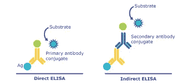
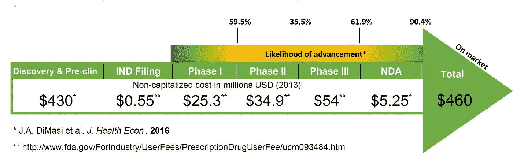
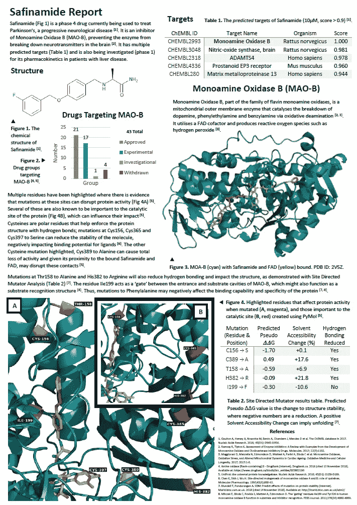

# 逃离实验室

> 原文：<https://towardsdatascience.com/escaping-the-lab-ffb2278c6864?source=collection_archive---------33----------------------->

[Structure Validation Concept](https://commons.wikimedia.org/wiki/File:Structure_validation_concept.jpg)

***“生物信息学最有趣最重要的部分是……”***

蛋白质组学。这就是我们的模块负责人(以及之前的[生物信息学课程](https://www.cranfield.ac.uk/Courses/Taught/Applied-Bioinformatics)主任】[李·拉科姆](http://www.leelarcombe.com/)在我们专注于蛋白质信息学的一开始就试图说服我们的。从 1950 年 Pehr Edman 的工作到两次获得诺贝尔奖的弗雷德里克·桑格的努力，再到蛋白质芯片和微阵列的最新高通量技术，这个领域在短时间内取得了很大的进步。

尽管进展如此迅速，蛋白质表达的实验验证的进展却明显缓慢。我们了解了两种主要方法，其主要特征是是否涉及抗体。埃德曼开发了后者的第一个例子，此后被[质谱](https://www.thermofisher.com/uk/en/home/life-science/protein-biology/protein-biology-learning-center/protein-biology-resource-library/pierce-protein-methods/overview-mass-spectrometry.html)盖过。在更受欢迎的免疫测定法中，特异性抗体通过与蛋白质结合来检测和确认蛋白质的存在。这两种方法都可以产生非常精确的结果，但是成本差异很大。不幸的是，更便宜的免疫检测依赖于从动物身上提取的抗体，这些抗体不能存活。此外，这些抗体的很大一部分没有通过验证测试([，在某些情况下，包括所有的](https://www.mcponline.org/content/7/10/2019.long#sec-4))，并且无论如何都没有被使用。

Basic concept of ELISA: an immunoassay technique for detecting proteins ([Sigma-Aldrich](https://www.sigmaaldrich.com/technical-documents/articles/ivd-immunoassay/clia-chemiluminescent-immunoassay-development.html))

随着研究蛋白质变得越来越容易，开发抗生素替代品的紧迫性也随之增加。抗微生物肽、抗细菌单克隆抗体等正逐步走向对抗抗生素耐药性的最前沿。放大来看，在更大范围内进行药物开发的计算机模拟方法正在帮助医药、商业和伦理领域的两个宿敌改善关系。将实验从物理实验室转移到计算环境中可以节省时间和成本，并且在抗体生产方面有额外的好处，即从药物研究的早期阶段完全去除该过程。

An example of just how skewed the costs of drug development are ([Next Phase](https://blog.lifesciencenation.com/2016/07/28/drug-development-what-does-it-cost-and-who-has-the-capital/))

随着模块的继续，我们了解到 [TeSS](https://tess.elixir-europe.org/) 、 [ELIXIR](https://www.elixir-europe.org/) 的培训电子支持系统，该系统专为浏览和学习各种生命科学资源而构建。特别是对我们来说，这是一个参与结构生物信息学工作流程并了解如何从获得蛋白质结构(或模拟预测版本)到识别功能域和探索突变影响的机会。人们很快发现，无需进入实验室，就可以为最昂贵的药物开发、发现和临床前试验阶段做出贡献。

我们被分配了一种药物，并被要求就我们的发现制作一份适合行业的一页报告，作为使用出色的免费在线分发工具所能完成的工作的例子。你可以在下面看到我的努力。

这用了不到一周的时间，一分钱也没花。显然这只是一个起点，但是它给出了一个更好的概念，即使用当今可用的开源和开放访问资源可以快速收集和整理多少信息。