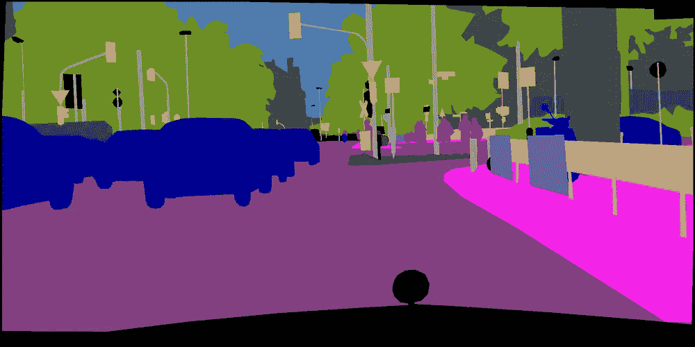
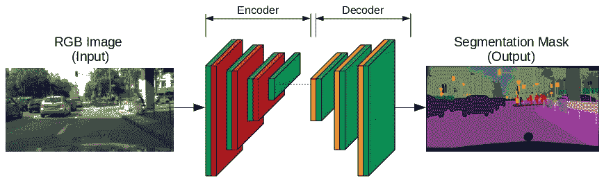
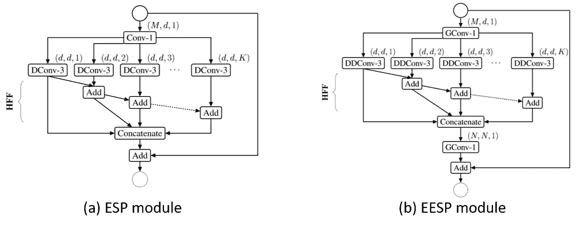
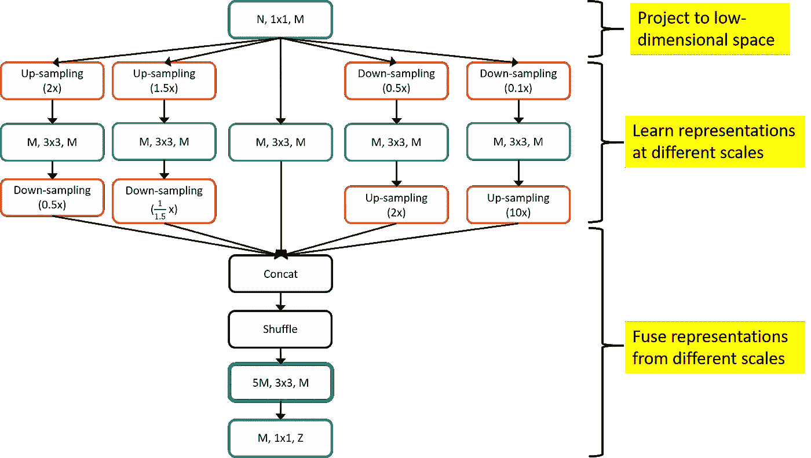
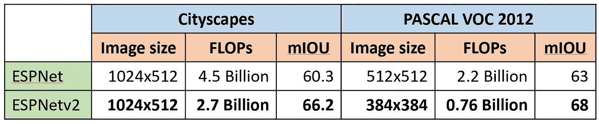

# 用于语义分段的 ESPNetv2

> 原文：<https://towardsdatascience.com/espnetv2-for-semantic-segmentation-9e80f155d522?source=collection_archive---------15----------------------->

> 如今，许多现实世界的应用，如自动驾驶汽车，都涉及到视觉场景理解。语义分割是为视觉场景理解开辟道路的主要任务之一。然而，这是计算机视觉中计算量最大的任务之一。本文概述了在 [ESPNetv2](https://arxiv.org/abs/1811.11431) 论文中使用的高效语义分割网络。

**ESPNet vs ESPNet v2:**ESPNet v2(在 CVPR 19 上被接受)是一个通用架构，可以用于建模*可视化*和*顺序*数据。 [ESPNetv2](https://arxiv.org/pdf/1811.11431.pdf) 用深度扩展的可分离卷积扩展了 [ESPNet](https://arxiv.org/abs/1803.06815) (在 ECCV'18 接受)并将其推广到不同的任务，包括*图像分类、对象检测、语义分割、*和*语言建模*。

**源代码:**我们的源代码以及不同数据集上的预训练模型可在*[***Github***](https://github.com/sacmehta/EdgeNets)上获得。*

# *语义分割*

*语义分割是一个细粒度的推理任务，它预测图像中每个像素的标签。*前景-背景*和*全场景分割*任务示例如下。*

********

***Figure 1:** Top row visualizes a foreground-background segmentation task (e.g. The [PASCAL VOC](http://host.robots.ox.ac.uk/pascal/VOC/) dateset) while the bottom row visualizes a full scene segmentation task (e.g. The [Cityscapes](https://www.cityscapes-dataset.com/) dataset).*

# *编码器-解码器网络概述*

*大部分高效的分割网络，包括 [ENet](https://arxiv.org/abs/1606.02147) 和 [U-Net](https://arxiv.org/abs/1505.04597) ，都采用了编解码结构。简而言之，编码器-解码器结构包括两个组件:(1)编码器和(2)解码器。编码器将 RGB 图像作为输入，并通过执行卷积和下采样操作来学习多尺度的表示。作为下采样操作的结果，空间分辨率和精细细节丢失了。解码器通过执行上采样和卷积运算来逆转这种损失。下图显示了一个普通的编码器-解码器网络。*

**

***Figure 2:** A vanilla encoder-decoder network. The green boxes in encoder and the decoder represents convolutional layers while the red and orange boxes represent down-sampling and up-sampling layers respectively.*

*按照惯例，编码器和解码器使用跳跃连接共享信息。这些跳跃连接已经被证明非常有效。更多详情见 [U-Net](https://arxiv.org/abs/1505.04597) 。*

# *ESPNetv2 中的分段架构*

*像 ESPNet 一样，ESPNetv2 也使用编码器-解码器架构来进行语义分段，但是，它使用更强大和高效的编码和解码块:(1)用于编码器的极其高效的扩展卷积空间金字塔(EESP)模块，以及(2)用于解码器的高效金字塔池(EPP)模块。*

***编码器的 EESP 模块**:为了提高计算效率，EESP 模块用高效的深度扩展卷积替换了 ESP 模块中计算量大的标准卷积层。图 3 比较了电潜泵和 e ESP 模块。有关这些区块的更多详细信息，请参阅我们的论文 ESPNetv2。*

**

***Figure 3:** Comparison between the ESP module and the EESP module. Each convolutional layer (Conv-n: n×n standard convolution, GConv-n:n×n group convolution, DConv-n: n×n dilated convolution, DDConv-n: n×n depth-wise dilated convolution) is denoted by (# input channels, # output channels, and dilation rate). HFF denotes hierarchical feature fusion. See ESPNet and ESPNetv2 papers for more details.*

***解码器的 EPP 模块:**子采样允许学习尺度不变表示。这些操作非常有效，是不同(和流行的)计算机视觉算法的关键组件，包括 SIFT 和卷积神经网络。为了让 ESPNetv2 能够有效地学习比例不变表示，我们引入了一个有效的金字塔池(EPP)模块，如图 4 所示。为了高效和有效，EPP 将 *N* 维特征映射到低维空间，比如说 *M* 维(*N>M*)，然后使用*深度卷积*学习**和*不同尺度*和**的表示。让我们假设我们有 b 分支。我们连接这些 *b* 分支的输出，以产生一个 *bM* 维空间的输出。为了便于学习更丰富的尺度间表示，我们首先打乱这些 *bM* 维特征图，然后使用*组卷积*将它们融合。然后应用逐点卷积来学习在组卷积之后获得的特征图之间的线性组合。*

*请注意，EESP 和 EPP 中的基本操作是相同的，即重新采样。在 EESP 中，使用扩张卷积来实现重采样，而在 EPP 中，使用上采样和下采样操作来实现重采样。*

**

***Figure 4:** EPP module allows to learn scale-invariant representations efficiently. Point-wise, depth-wise, and group-wise convolutions are represented in blue, green, and purple respectively.*

# *ESPNet 和 ESPNetv2 之间的比较*

*表 1 给出了使用两个广泛使用的数据集(Cityscapes 和 PASCAL VOC 2012)的在线服务器对 ***私有测试集*** 进行的定性性能比较。我们可以清楚地看到，ESPNetv2 比 ESPNet 更高效、更准确。*

*请注意，ESPNetv2 在图像大小为 384x384 的情况下获得了 68 的显著平均交集(mIOU)分数；为许多深度和重量级细分架构提供了具有竞争力的性能(更多详细信息，请参见[PASCAL VOC 2012 排行榜](http://host.robots.ox.ac.uk:8080/leaderboard/displaylb.php?challengeid=11&compid=6))。PASCAL 数据集上广泛使用的图像大小是 512x512(或 500x500)。*

**

***Table 1:** The performance of the ESPNet and the ESPNetv2 is compared in terms of FLOPs and the accuracy (in terms of mean intersection over union) on the private test set of two widely used datasets.*