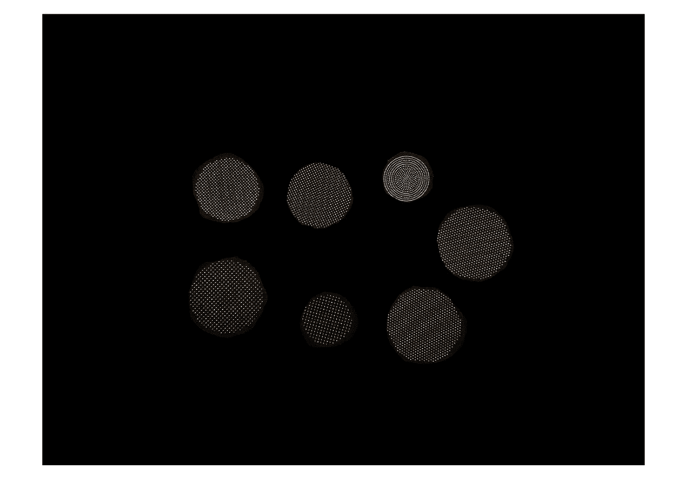
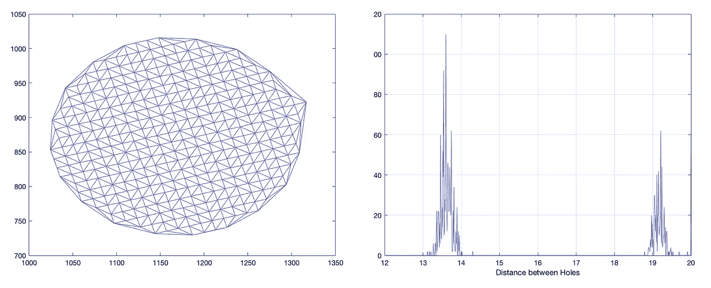

# 浓缩咖啡过滤器:分析

> 原文：<https://towardsdatascience.com/espresso-filters-an-analysis-7672899ce4c0?source=collection_archive---------15----------------------->

我有几台浓缩咖啡机，我决定更深入地了解浓缩咖啡过滤器本身。我已经为我的金特快买了 VST 过滤器，它们绝对让我的浓缩咖啡变得更好，就像白天和黑夜一样。它们是按照严格的规格设计的；证据就在浓缩咖啡里。不摆弄机器，我怎么能确定它的过滤器是否有价值呢？我决定调查一下。

这项调查的一部分是因为购买了一台非常旧的意大利 Enrico 咖啡机。我一时兴起买了这个，因为我本来打算买一个便宜的商业 Gaggia，但[它很可能是偷来的](https://medium.com/overthinking-life/the-tale-of-a-stolen-espresso-machine-6cc24d2d21a3)。我发现这台 Enrico 机器很便宜，然后我出发去旧金山南部，从一艘又旧又脏的船上的一个老人那里买下它。幸运的是，我没有被谋杀和吃掉。

Enrico 没有配备过滤篮，但我想我会找到一个简单的。我错了；这对恩里科来说是一个常见的问题。[我确实在另一个篮子](https://www.espressoparts.com/rancilio-at-63mm-double-portafilter-basket)里找到了一个解决方案，一个朋友打磨了它的边缘，这样它就能适合了。我还必须添加 3D 打印件来保持它在 portafilter 中的设置。在这种迷雾中，我决定如果我继续我买咖啡机的坏习惯，我至少应该知道它们值不值。

杠杆式浓缩咖啡机由三个主要部件组成:一个煮水器、杠杆和过滤器。在恩里科号的情况下，锅炉状况良好，所以我不太担心。浓缩咖啡需要一个好的拉杆，但一个好的工匠可以从一个垃圾机器中拉出好的镜头。在我以前的办公室里，有一个咖啡先生，我从那个垃圾里拍出了好照片。过滤器通常可以更换，但有时在旧机器中，过滤器的尺寸很奇怪，所以这很棘手。

# 概观

对于数据，我有一些机器或访问一些，我想到了一个测量过滤器属性的好方法是通过图像处理。我的目标是测量以下内容:

1.  孔大小
2.  孔径变化
3.  空穴分布
4.  空穴分布的方差
5.  到最近洞的距离分布
6.  过滤器的总开口面积

我用 iPad 以最大亮度背光照明每个滤镜，然后用蓝色圆圈标注每个滤镜，以便更容易找到滤镜。

# 处理

我首先用多个滤镜拍摄了一张图像，但后来，我发现滤镜位于图像中心和 iPad 上的单个图像在准确性和比较方面更好。然而，这第一个图像作为一个伟大的平台，展示了图像处理完成，能够衡量我想要的。像素之间的距离是用 iPad 的长度估算的。

**处理图像**

**缩放和注释**

**滤镜提取轮廓**

**填充并标记的过滤器轮廓**

**仅过滤**

**滤孔提取**

# 放大的单个过滤器:

有一个奇怪的模式，几乎就像过滤器是在一个辊和展平。这种模式只有在像素保持在某个阈值以上时才会出现。

# 数据分析

# **1。孔径**

首先，我们将查看每个过滤器的孔尺寸。最初，孔洞大小是通过确定每个孔洞阈值以上的像素面积并确定直径来计算的。然而，结果并没有显示我正在寻找的细节，因为它是基于整个像素。

对于不熟悉[盒图](https://www.mathworks.com/help/stats/boxplot.html)的人来说，这是一个图例:

下面是仅由阈值(th)以上的像素确定的孔直径的方框图。正如你所看到的，一些过滤器没有显示出任何大小的变化，仅仅是因为该方法在分辨率方面无效。

取而代之的是，我确定了一个面积，这个面积是由穿过这个洞的光的强度来加权的。如果一个像素完全是白色，它的权重为 1。这允许对孔径进行亚像素估计。彩色图是与盒状图相同的数据，其中[方案是喷射颜色方案](https://www.linkedin.com/pulse/depth-data-visualization-robert-mckeon-aloe)，所以红色是分布中的最大计数，深蓝色接近零。

最终的清单扩展到我所有的机器和一些额外的。差异很大，我的标准是 VST 滤波器。[他们声称过滤器上的孔径存在+/-0.02 毫米的差异](https://store.vstapps.com/collections/vst-precision-filter-baskets/products/vst-precision-filter-baskets)。根据这些测量结果，他们肯定能做到这一点。

让我们调整图表，专门查看分布情况，不要担心具体的孔直径。这张图表显示了为什么我的金快速过滤器是可怕的相比，VST 的。然而， [Odea Giro](https://www.philips.ca/c-p/RI9753_47/odea-super-automatic-espresso-machine/reviewandawards) 却相当令人印象深刻。我没想到会有这么多。 [Kompresso](http://cafflano.com/product_kompresso.php?TM=2) 和 [Flair](https://www.flairespresso.com) 也表现非常出色，这是对优质机器的赞美。

# **2。孔分布**

对于孔分布，我计算了所有孔的所有质心之间的 Delaunay 三角剖分，然后查看连接过滤孔的所有边的距离。人们可以假设相似的距离将允许咖啡均匀地流过过滤器。

下面左边是一个 VST 过滤器从每个洞的三角测量。唯一的问题是有两种不同的边长:正方形和对角线。右边的图是点与点之间的距离分布，这种双峰分布并不能提供一个可用的度量标准。我对每个模态的标准差更感兴趣。

让我们看看是否可以使用一些颜色分布来理解同一个图形上的比较和多个分布。左边的方框图具有欺骗性，因为许多滤波器明显是双峰的。在右边，我们可以清楚地看到分布的差异。正方形网格过滤器都是双峰的，但 Flair 和炉顶过滤器([陆丹蓝](https://www.bialetti.com/coffee/stovetop/moka-express-c-1_7_22.html)和 Keleidos)。

# 3.到最近洞的距离

这个指标背后的想法是，浓缩咖啡是关于液体流量的。水进来，浓咖啡出来；浓缩咖啡流出的每一条路径都是一个洞。因此，如果水通过圆盘的任何部分并到达底部，人们会希望到最近的孔的距离在过滤器上是均匀的。

让我们用一个滤镜来想象一下:VST 替身

1.在**左侧**处，是过滤器上所有孔的图像，按照 jet 配色方案中的相对孔尺寸进行着色，其中红色较大，蓝色较小。

2.中间的**和左边的**是同一个图像，但是为了便于观察，所有的孔都被放大了。

3.在**右侧**是到 jet 配色方案中最近的孔的距离的图像，其中蓝色更近，红色更远。

这个指标应该提供一个表面上更容易理解的分布，如下图所示，带有一个箱线图和一个彩色分布。有趣的是，Flair 的最近距离如此之低，而 Kim Single/Double 的差异要大得多，这可能解释了这些过滤器中最好的浓缩咖啡比 VST 过滤器差。

从更高的角度来看，我们可以看到一些不同之处。首先，在所选择的差异度量中，什么是好的浓缩咖啡过滤器有很大的差异。第二，到最近的孔的距离以及孔的直径为机器的好坏提供了特别的洞察力。最后，一杯浓缩咖啡的客观质量很难通过这些机器以一种公平的方式来确定，但在我看来这是一个好的开始。

总的来说，意式浓缩咖啡机比看起来有更多的不同。过滤器是我制作始终如一的浓缩咖啡的关键之一。敬请期待:我计划如上所述发布颜色表示中的[所有滤镜。](https://link.medium.com/0brWIFYDwU)

如果你愿意，可以在 [Twitter](https://mobile.twitter.com/espressofun) 和 [YouTube](https://m.youtube.com/channel/UClgcmAtBMTmVVGANjtntXTw) 上关注我，我会在那里发布不同机器上的浓缩咖啡照片和浓缩咖啡相关的视频。你也可以在 [LinkedIn](https://www.linkedin.com/in/robert-mckeon-aloe-01581595) 上找到我。

我的进一步阅读:

[我的咖啡设置](https://link.medium.com/NMfeoLVpuT)

[工匠咖啡价格过高](https://link.medium.com/PJwoAMYpuT)

[被盗浓缩咖啡机的故事](https://link.medium.com/pxCY5yrquT)

[平价咖啡研磨机:比较](https://link.medium.com/rzGxlDtquT)

[浓缩咖啡:机头温度分析](https://link.medium.com/FMxfCmcOCT)