# Python 中的基本概率:排列和组合

> 原文：<https://towardsdatascience.com/essential-probability-in-python-permutations-and-combinations-7323a2ea39e5?source=collection_archive---------10----------------------->

概率论并不难，至少在数据科学入门所需的水平上是如此。自从你最后一次接触这个话题可能已经有一段时间了，如果你觉得生疏了，这篇文章可能只是一个回到正轨的方法。

Photo by [Brett Jordan](https://unsplash.com/@brett_jordan?utm_source=medium&utm_medium=referral) on [Unsplash](https://unsplash.com?utm_source=medium&utm_medium=referral)

如果你刚开始学习数据科学，快速的谷歌搜索会发现整个领域基于的 4 个主要数学主题:

*   线性代数
*   结石
*   统计数字
*   可能性

最近我讲了[线性代数](/linear-algebra-essentials-with-numpy-part-1-af4a867ac5ca)和[微积分](/taking-derivatives-in-python-d6229ba72c64)，所以如果你对这个话题生疏了，也可以随意阅读这些文章。然而，今天我想介绍概率论中的两个重要概念:**组合**和**排列**。

让我们从概率本身的基本定义开始:

> 概率是对事件发生的可能性进行量化的度量。概率量化为一个介于 0 和 1 之间的数字，粗略地说，0 表示不可能，1 表示确定。事件发生的概率越高，事件发生的可能性就越大。[1]

整个概率领域都很重要，因为**不确定性和随机性几乎出现在你生活的每个方面**，因此对概率有很好的了解将有助于你做出更明智的决定，也有助于理解不确定性。

在深入排列和组合之前，有一个重要的术语需要讨论一下——阶乘。

# 什么是阶乘？

好问题。根据维基百科:

> 正整数 ***n*** 的阶乘，用 ***n 表示！*** 是所有小于等于 n[2]的正整数的乘积

您可以使用以下公式计算阶乘:

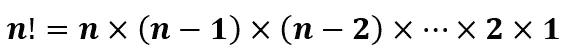

这里有一个快速动手的例子:

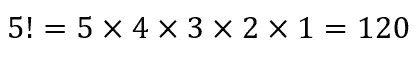

现在你可能想知道如何在 Python 中计算阶乘。虽然我确信各种库中存在现成的函数，但是定义自己的函数真的很容易，这正是我们要做的。

这里有一个简单的递归函数可以完成这项工作:

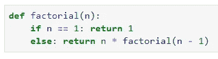

现在我们可以用这个函数来验证上面的例子:

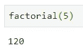

***好吧，那太好了，但是在现实世界中你什么时候会用到阶乘呢？***

假设在某场比赛中有 5 个人，你想知道这 5 个人有多少种方式可以获得第一、第二和第三名。你可以抓起一张纸，写下每一种可能的结果，但是为什么呢？如果有 100 个人呢？

下面是如何使用阶乘来解决前面的任务:

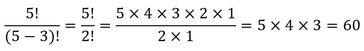

简而言之，这叫做**排列**。

# 排列

让我们再次从定义开始，好吗:

> 在数学中，排列是将一个集合的成员排列成一个序列或顺序的行为，或者，如果该集合已经排序，则重新排列(重新排序)其元素。[3]

有两种主要的方法来计算排列，你是否允许**重复**会有所不同。让我们用一个例子来解决这个问题。

你有一个用户可以注册的网站。他们需要提供一个长度正好为 8 个字符的密码，并且字符**不能**重复。我们首先需要确定英语字母表中有多少个字符和数字:

*   字母数量:26
*   位数:10

总共有 36 个。所以 ***n = 36*** 。 ***r*** 则为 ***8*** ，因为密码需要 8 个字符长。一旦我们知道了这一点，就很容易计算出唯一密码的数量，给出以下公式:

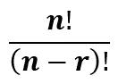

如果你继续手动计算:

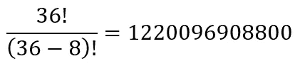

或者甚至在 Python 中，这真的是一个微不足道的任务:

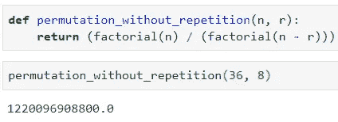

好吧，酷，但是我想允许我的用户重复字符。 没问题，在这种情况下，我们谈论的是重复排列，公式甚至更简单:

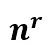

你已经知道什么是**n**(*36*)，什么是**r**(*8*)，那么下面是解决方法:

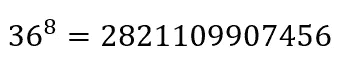

同样，Python 中的实现很简单:

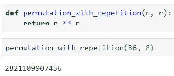

有很多密码选项。继续大声读出这个数字，我谅你也不敢。

# 组合

接下来的日常日程是组合。你可能想知道这些是什么，它们和排列有什么不同。让我们一步一步来。首先，这里有一个定义:

> 组合是从一个集合中选择项目，这样(不同于排列)选择的顺序是无关紧要的[4]

要把重点说清楚，可以考虑下面这句话:**入选一个团队的一群人是同一个组，顺序无所谓。这就是组合背后的全部理念。如果你为这个团队选择了 5 名成员，你可以按名字、身高或其他因素对他们进行排序，但本质上你仍然是同一个团队——排序无关紧要。**

所以，让我们用一个公式来形式化这个想法。一次取*的一组 ***n*** 对象的组合 ***C*** 的数量计算如下:*

*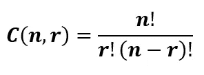*

*现在你可以用这个等式来解决下面的问题:有多少种方法可以从 10 个人中选出 5 个人组成一个足球队？*

*无论排序如何，组都是相同的。那么我们来看看， ***n*** 会等于 ***10*** ， ***r*** 会是 ***5*** :*

*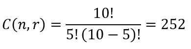*

*使用 Python 也可以轻松做到这一点:*

*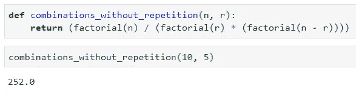*

*太好了！但是现在你可能想知道是否存在一种允许重复的**组合。答案是肯定的。我现在解释一下。***

*想象一下，你正在做一个三明治，由于某种原因，你只能使用 10 种原料中的 4 种。然而，配料不必是独特的，例如，你可以放三次奶酪和一次意大利腊肠。很好，见鬼，我也是一个喜欢奶酪的人，所以向你致敬。*

*但是你如何将这个想法形式化，并以数学的方式表达出来呢？ 答案再一次变得相当简单:*

*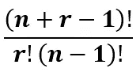*

*让我们用公式算出上面的例子。 ***n*** 将再次成为 ***10*** ( *因为有 10 种不同的配料*)，并且*将成为 ***4*** ( *因为你只能选择 4 个*):**

**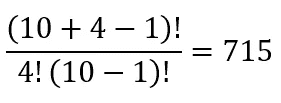**

**同样，您可以使用 Python 进行验证:**

**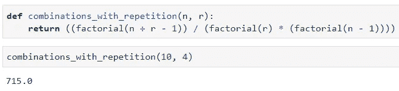**

**干净利落。这对于一篇文章来说已经足够了。**

# **在你走之前**

**虽然组合和排列在数学上很简单，但诀窍在于以这种方式来表示现实世界的问题。换句话说，在日常生活中提取 ***n*** 和 ***r*** 有时会很棘手。**

**虽然我在这方面帮不了你，但我希望这篇文章能让你知道，一旦获得了***【n】***和***【r】***，你能做些什么。**

**感谢您的阅读，一如既往，请不要犹豫，在评论区留下您的想法。**

**喜欢这篇文章吗？成为 [*中等会员*](https://medium.com/@radecicdario/membership) *继续无限制学习。如果你使用下面的链接，我会收到你的一部分会员费，不需要你额外付费。***

** [## 通过我的推荐链接加入 Medium-Dario rade ci

### 作为一个媒体会员，你的会员费的一部分会给你阅读的作家，你可以完全接触到每一个故事…

medium.com](https://medium.com/@radecicdario/membership)** 

# **资源**

**[1][https://en.wikipedia.org/wiki/Probability](https://en.wikipedia.org/wiki/Probability)**

**[2][https://en.wikipedia.org/wiki/Factorial](https://en.wikipedia.org/wiki/Factorial)**

**[3]https://en.wikipedia.org/wiki/Permutation**

**[4]https://en.wikipedia.org/wiki/Combination**