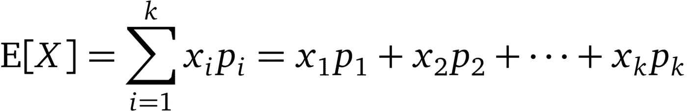
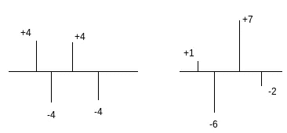
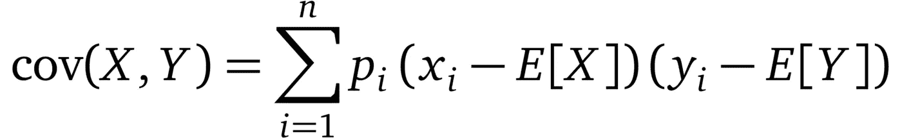
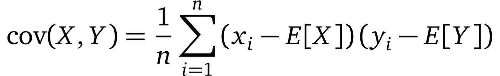
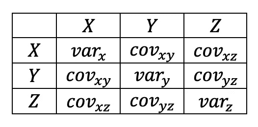

# 初级概率和统计

> 原文：<https://towardsdatascience.com/essential-statistics-for-data-science-ml-4595ff07a1fa?source=collection_archive---------15----------------------->

## [基本问题 4 毫升](http://towardsdatascience.com/tagged/Essential-probNstats-4-ML)

## 期望值、方差、标准差、协方差、相关、协方差矩阵和相关矩阵介绍

为了获得有用的结果，数据科学家/ML 工程师必须分析数据并应用正确的模型。概率和统计是可以提高这种技能的两个研究领域。因此，我决定强调这一点，并就 [Essential probNstats 4 ML](http://towardsdatascience.com/tagged/Essential-probNstats-4-ML) 项目撰写我的第一篇文章。它的内容是基本的概率或统计概念，每个数据科学家和 ML 工程师都应该知道。

# 预期值

随机变量的期望值是该变量的平均值。例如，给定变量 X = [1，2，3，4，5，6]，它表示一个六面骰子，其中每一面出现的概率完全相同，当掷骰数接近无穷大时，其期望值为 E[X] = 1 ⅙ + 2 ⅙ + 3 ⅙ + 4 ⅙ + 5 ⅙ + 6 ⅙ = 3.5。期望值的等式是:

其中 x 是一个随机变量，具有分别以概率(p₁，p₂，…，pₖ)出现的有限数量的有限结果(x₁，x₂,…，xₖ)。如果所有的概率都相等(p₁ = p₂ = … = pₖ)，就像六面骰子的情况一样，那么期望值就等于简单平均值(或算术平均值)。此外，因为概率之和等于 1，所以期望值可以被认为是加权平均值，概率就是权重。

# 方差和标准差

**方差**给定一组(随机)数字，测量这些数字与其平均值相差多远。更正式地说，是随机变量(本例中为 **X** )与其期望值的方差的期望值，通常表示为 **σ** 、 **s** 或 **Var(X)** 。

通过“拆开”外部期望值和(i=1，…，n)的 X=xᵢ，其中 n 是 x 的总体大小，我们得到:

如果所有的概率都相等(p₁ = p₂ = … = pₙ)，那么方差可以写成:

这也被称为**总体方差**，因为我们使用 X 的所有数字(总体)进行计算。

相比之下，我们可以用一个变量总体的样本来计算方差。这被称为**样本方差**，用于人口太大而无法计算的情况。如果我们选择这种技术，公式是不同的:

ȳ是样本 y 的平均值(期望值), n 是该样本的总体规模。请注意，n 减去 1，这使得方差无偏。我不会详细讨论这种偏见，但是你可以在这里阅读它的来源。

找到方差后，我们可以计算该变量的**标准差**，即其方差的平方根。

它也由 **σ** 符号表示。标准差衡量一组数字的变化量。高值表示这些数字可能远离平均值。

但是为什么要计算随机变量与其算术平均值的平方，而不仅仅是简单的偏差呢？

假设以下示例中的数字是数字与其平均值的偏差的输出。

outputs of deviations of numbers from their mean

在第一个例子中，平均值是(4+4–4–4)/4 = 0，因此标准差也是 0。这显然不是这些数字变化量的指标。如果我们计算绝对值的平均值，(|4|+|4|+|-4|+|-4|)/4=4，我们得到的不是 0。这看起来是一个很好的指标，但是如果我们在第二个例子中计算平均值呢？(|1|+|-6|+|7|+|-2|)/4=4 该值与第一个值相同，即使数字分布得更远。通过对数字求平方并计算其标准差，两种情况下的输出分别为√((4 +4 +4 +4 )/4)=4 和√((7 +1 +6 +2 )/4)=4.74…这看起来不错，因为第二种情况有更大的标准差。

# 协方差和相关系数

**协方差**是两个随机变量联合概率的度量。它显示了这些变量的相似性，这意味着如果一个变量的较大值和较小值主要对应于第二个变量的值，则协方差为正。如果情况相反，那么协方差就是负的。如果它近似等于零，则变量彼此独立。对于两个变量 x 和 y，它通常表示为 **cov(X，y)**或 **σ(X，Y)** 并且它的正式定义是:它们与它们各自的期望值(算术平均值)的偏差的乘积的期望值。

通过“拆开”外部期望值，但是对于(i = 1，…，n ),x=xᵢ和 Y=yᵢ之间的 pᵢ具有相等的概率，我们得到:

更普遍的是:

以上是**人口协方差。**我们可以使用适用于样本方差的相同规则来计算**样本协方差**。我们只是使用无偏版本:从每个变量中取相同数量的大小为(n)的观测值，计算它们的期望值并用 1/(n-1)代替 1/n。

协方差的一个特例是当两个变量相同时(一个变量与其自身的协方差)。在这种情况下，它等于该变量的方差。

现在，如果我们将两个变量的协方差除以它们的标准差的乘积，我们将获得**皮尔逊相关系数**。它是协方差的归一化，因此它具有+1 和-1 之间的值，并且用于使量值可解释。

# 协方差和相关矩阵

它是一个方阵，描述了两个或多个变量之间的协方差。随机向量 X 的协方差矩阵通常由 **Kxx** 或**σ表示。**例如，如果我们想计算三个变量(X，Y，Z)之间的协方差，我们必须如下构造矩阵:

每个单元格都是行变量与其对应的列变量之间的协方差。你可能已经注意到，矩阵的对角线包含了协方差的特殊情况(一个变量与其自身的协方差),因此代表了该变量的方差。你可能观察到的另一件事是，矩阵是对称的，对角线下的协方差值与对角线上的相同。

使用相同的逻辑，可以构建**皮尔逊相关系数矩阵**，其中每个协方差除以其对应变量的标准偏差的乘积。在这种情况下，对角线总是等于 1，这表示总的正线性相关。

# 摘要

我们看到了一些基本概念，如期望值、方差、标准差、协方差、相关性、协方差矩阵和相关矩阵。这些构成了研究更复杂的概率或统计概念的基础，并且是许多重要算法(如 PCA)的构建模块。

# 参考

布朗利，J. (2019)。机器学习的线性代数基础:探索 Python 中数据的数学语言。(1.7 版)。

皮尔斯罗德。(2019 年 10 月 10 日)。“标准差和方差”。数学很有趣。于 2019 年 12 月 10 日从[http://www.mathsisfun.com/data/standard-deviation.html](http://www.mathsisfun.com/data/standard-deviation.html)检索

维基百科贡献者。(2019 年 12 月 10 日)。预期值。在*维基百科，免费百科*。检索于 2019 年 12 月 11 日 12:08，来自[https://en.wikipedia.org/w/index.php?title=Expected_value&oldid = 930177129](https://en.wikipedia.org/w/index.php?title=Expected_value&oldid=930177129)

维基百科贡献者。(2019 年 12 月 9 日)。方差。在*维基百科，免费百科*。检索时间:2019 . 12 . 11 12:09，发自【https://en.wikipedia.org/w/index.php?title=Variance】T2&oldid = 929926047

维基百科贡献者。(2019 年 12 月 2 日)。标准差。在*维基百科，免费百科*。检索到 2019 年 12 月 11 日 12:09，来自[https://en.wikipedia.org/w/index.php?title =标准差& oldid=928934524](https://en.wikipedia.org/w/index.php?title=Standard_deviation&oldid=928934524)

维基百科贡献者。(2019 年 12 月 7 日)。协方差。在*维基百科，免费百科*。检索时间:2019 年 12 月 11 日 12:10，来自[https://en.wikipedia.org/w/index.php?title=Covariance&oldid = 929639677](https://en.wikipedia.org/w/index.php?title=Covariance&oldid=929639677)

维基百科贡献者。(2019 年 10 月 21 日)。皮尔逊相关系数。在*维基百科，免费百科*。检索时间 2019 年 12 月 11 日 12 点 11 分，来自[https://en.wikipedia.org/w/index.php?title = Pearson _ correlation _ coefficient&oldid = 922293481](https://en.wikipedia.org/w/index.php?title=Pearson_correlation_coefficient&oldid=922293481)