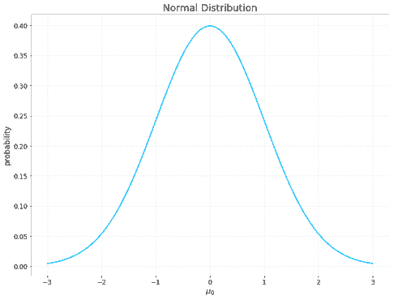
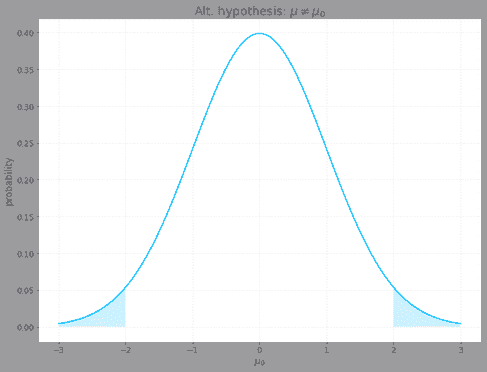
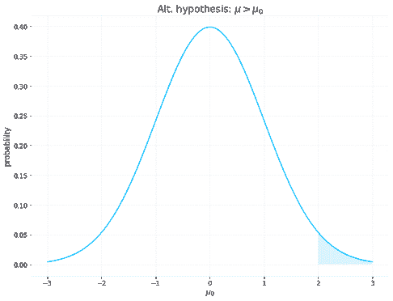
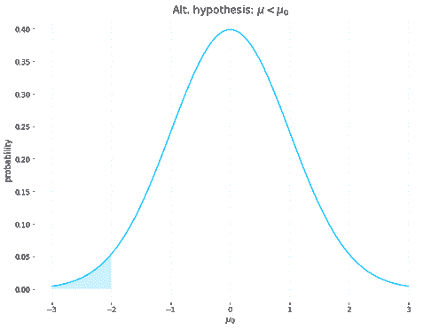
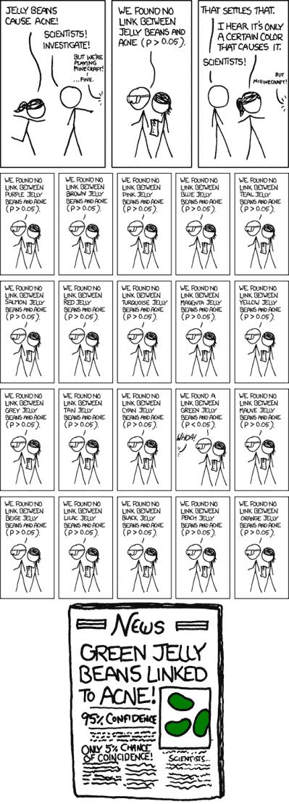

# 假设检验的要点和要避免的错误

> 原文：<https://towardsdatascience.com/essentials-of-hypothesis-testing-and-the-mistakes-to-avoid-b50079d35ee5?source=collection_archive---------16----------------------->

 [## 想在数据科学方面变得更好吗？

### 当我在我发布独家帖子的媒体和个人网站上发布新内容时，请单击此处获得通知。](https://bobbywlindsey.ck.page/5dca5d4310) 

假设检验是科学方法的基石，也是科学进步的基石。它允许你调查你感兴趣的事情，并告诉你你应该对结果感到多么惊讶。侦探会告诉你是否应该继续调查你的理论，或者把精力转移到其他地方。你吃的减肥药真的有效吗？你到底需要多少睡眠？人力资源部要求的团队建设练习真的有助于加强你和同事之间的关系吗？

社交媒体和新闻充斥着“研究表明这一点”和“研究表明那一点”，但是你怎么知道这些研究是否有效呢？对他们来说有效意味着什么？虽然研究肯定会受到数据收集过程的影响，但本文的大部分内容将专注于实际的假设检验本身，以及为什么熟悉它的过程将为您提供一套必要的技能，来执行可重复、可靠和可操作的检验，从而使您更接近真相，并对研究提出质疑。

在任何假设检验中，你都有一个默认假设(零假设)和你感兴趣的理论(替代假设)。无效假设是假设你正在研究的任何干预/理论都没有效果。例如，如果你正在测试一种药物是否有效，无效假设会表明该药物没有效果，而另一个假设会假定它有效果。或者你可能想知道公司网站的重新设计是否真的对销售产生了影响——零假设是重新设计对销售没有影响，另一个假设是有影响。

假设检验有点像和朋友唱反调，但你们两个都出去收集数据，进行可重复的测试，并确定你们中的哪一个更有可能是正确的，而不是只是兜圈子。本质上，拥有一个零假设确保你正在研究的数据不仅与你的任何理论一致，而且与你的理论的*否定*不一致(即零假设)。

# 假设检验的工作原理

一旦确定了你的无效假设和替代假设，你需要进行测试。跳过一堆数学公式，大概是这样的:

1.  进行一次实验(这是你收集数据的地方)。
2.  假设零假设为真，让 *p 值*成为得到至少和你得到的结果一样极端的结果的概率。
3.  如果 p 值相当小(即< 5%), your results are statistically significant which gives you evidence to reject the null hypothesis; otherwise, the null hypothesis can’t be ruled out just yet.

You might be wondering why a p-value of 5% could mean that your results are statistically significant. Let’s say your null hypothesis is that condoms don’t have an effect on STD transmission and you assume this to be true. You run your experiment, collect some data, and turns out you get some results that were very unlikely to get (meaning the probability of getting those results was really small). This might cause you to doubt the assumption you made about condoms having no effect. Why? Because you got results that were very rare to get, meaning your results were significant enough to cast doubt on your assumption that the null hypothesis was true.

Just like with most things in life, you want to minimize your probability of being wrong, including when performing a hypothesis test. So consider the ways you could be wrong when interpreting the results of a hypothesis test: you can either reject the null hypothesis when it’s actually true (a Type I error), or fail to reject it when it’s actually false (a Type II error).

Since you can’t decrease the chance of both types of errors without raising the sample size and you can’t control for the Type II error, then you require that a Type I error be equal to 5% which is a way of requiring that any statistically significant results you get can only have a 5% chance of being a coincidence. It’s damage control to make sure you don’t make an utter fool of yourself and this restriction leaves you with a 95% confidence when claiming statistically significant results and a 5% margin of error.

The statistically significant results in the above condom example could have been a fluke, just coincidence, but it’s only 5% likely. Even though there’s sound reason for having a small p-value, the actually threshold of 5% happens to be a convention created by Ronald Fisher, considered to be the father of modern statistics. This convention exists so that when a scientist talks about how they achieved statistically significant results, other scientists know that the results in question were significant enough to only be coincidence at most 5% of the time.

# A Fuzzy Contradiction

For the mathematically literate, the null hypothesis test might resemble a fuzzy version of the scaffolding for a proof by contradiction whose steps are as such:

1.  Suppose hypothesis, *H* ，则为真。
2.  既然 *H* 为真，那么有些事实 *F* 不可能为真。
3.  但是 *F* 是真的。
4.  因此， *H* 为假。

与假设检验的步骤相比:

1.  假设零假设， *H 而非*为真。
2.  既然 *H not* 为真，那么接下来某个结果 *O* 是非常不可能的。
3.  但是 *O* 确实被观测到了。
4.  所以， *H 不*的可能性很小。

矛盾证明和假设检验步骤的区别？绝对数学确定性与可能性。你可能会认为统计学和数学一样具有确定性，但事实并非如此。统计学是一个推理框架，因此，它依赖于可能不完整或被篡改的数据；更不用说这些数据可能来自一个设置不当的实验，为过多的混淆变量留下了足够的空间。这个领域充满了不确定性，任何统计学家能够给出的最佳答案都是可能性，而不是确定性。

# 实际上在做假设检验

现在谈谈假设检验的技术细节。尽管统计学课程总会想办法把水搅浑，但幸运的是，测试本身并不太复杂。一旦你理解了这些细节，你就可以让计算机为你进行计算。为简单起见，假设您正在通过查看样本均值对干预对总体的影响进行假设检验。但是请记住，这个过程与其他测试非常相似。

首先，在没有干预的情况下，从你选择的*人群中收集足够的数据(最好至少 30 个样本)，并计算其平均值 *μ而不是*。这被称为样本均值，代表总体均值，因为[中心极限定理](https://bobbywlindsey.com/math/2019/01/01/the-central-limit-theorem/)告诉你，随着样本越来越大，样本均值越来越接近总体均值。由于样本均值是一个统计量，它属于一个特殊的抽样分布，即中心极限定理所说的正态分布。*

接下来，计算 *μ而非*的标准差，它等于 *σ/sqrt(n)* 其中 *σ* 是总体标准差， *n* 是样本的大小。但是既然你不知道 *σ* 到底是什么，你可以用样本标准差 *S* 来估计它，这个标准差是从有干预的人群*的数据中找到的。因此，使用*干预从您的群体*中收集 30 多个样本，并计算其平均值 *μ* 和样本标准差 *S* 。*

现在假设零假设为真，问自己，得到 *μ* 的概率是多少？另一种说法是， *μ* 距离 *μ而非*有多少标准差，得到结果*至少*距离 *μ而非*那么多标准差的概率是多少？如前所述，这种概率称为 p 值。

嗯，要计算 *μ not* 离 *μ* 有多少标准差，你从 *μ* 中减去 *μ not* ，除以 *μ not* 的标准差。结果称为标准分数或 Z 分数。

> (μ-μ not)/(S/sqrt(n))

现在，得到一个至少和你得到的一样极端的标准分数的概率是多少？这与询问至少 *(μ-μ not)/(S/sqrt(n))* 偏离 *μ not* 的概率是多少是一样的。这取决于你的替代假设的形式。

如果你的替代假设是*μ*≦*μnot*，那么标准分数的概率就是一减去正态分布的概率密度函数(pdf)的 *-(μ-μ not)/(S/sqrt(n))* 到 *(μ-μ not)/(S/sqrt(n))* 的积分。举个例子，如果 *(μ-μ not)/(S/sqrt(n)) = 2* ，那么“1 减去上面的积分”就会求出曲线下阴影区域的面积(这就是你要找的概率):

如果你的替代假设是 *μ > μ not* ，那么标准分数的概率就是正态分布的 pdf 从*(μ-μnot)/(S/sqrt(n)*到 *∞* 的积分。假设标准分数为 2，如上例所示，这相当于试图在下图中找到面积:

同样，如果你的替代假设是 *μ < μ而不是*，那么标准分数的概率就是正态分布的 pdf 的 *-∞* 到 *(μ-μ not)/(S/sqrt(n))* 的积分。就像上面的例子一样，这一次你试图找到以下区域:

现在你已经找到了结果的概率(通过标准分数)，你可以用这个概率来决定是否拒绝零假设。假设这个概率是 3%。因此，在假设零假设为真的情况下，你在干预措施实施后从人群中收集的数据有 3%的概率发生。但它还是发生了！所以也许零假设终究不是真的。你不确定，但证据似乎表明你可以拒绝。

# 调整显微镜

如前所述，假设检验是一种有一定精确度的科学工具，因此，你必须仔细决定给定实验所需的精确度。一个*不足的*假设测试不足以检测你试图观察的任何效果。这就好比用放大镜来观察你的一个脸颊细胞。但是放大镜太弱了，无法观察这么小的东西，你还不如根本不去做这个测试。通常情况下，当研究一个小群体时，如果群体差异产生的影响刚好大到足以超过 5%的 p 值阈值，那么测试就不够有力。

乔丹·艾伦伯格在他的书《[如何不犯错](https://www.amazon.com/How-Not-Be-Wrong-Mathematical-ebook/dp/B00G3L6JQ4/ref=sr_1_1?keywords=how+not+to+be+wrong&qid=1550615776&s=gateway&sr=8-1)》中给出了一个动力不足测试的很好的例子。他提到《T4 心理科学》杂志上的一篇文章，文章发现处于排卵期的已婚女性更有可能投票给总统候选人米特罗姆尼。共有 228 名妇女接受了调查；在生育高峰期接受调查的女性中，40.4%的人表示支持罗姆尼，而在其他不排卵的已婚女性中，只有 23.4%的人表示支持罗姆尼。在如此小的人口规模下，两组女性之间的差异大到足以通过 p 值测试并拒绝零假设(即已婚女性的排卵对支持米特罗姆尼没有影响)。艾伦伯格在第 149 页继续说道:

> *差别太大。在喜欢米特罗姆尼的已婚女性中，有近一半每月花大量时间支持巴拉克奥巴马，这真的有可能吗？没人会注意到吗？如果一旦排卵期开始，真的会有政治上的右倾，那看起来可能会小很多。但这项研究的规模相对较小，这意味着一个更现实的效应强度评估可能会被 p 值过滤器拒绝，这是自相矛盾的。*

过度研究存在相反的问题。假设进行了这样一项过度研究(即一项大规模人群研究),它表明服用一种新的降压药会使患中风的几率增加一倍。现在有些人可能会因为害怕中风而选择停止服用降压药；毕竟你有两倍的可能性。但是，如果中风的可能性最初是 8000 分之一，一个非常接近于零的数字，那么这个数字翻一番，8000 分之 2，难道*还是*真的接近于零吗？两次一个很小的数字还是很小的数字。

这就是标题——一项被过度压制的研究对微小的影响非常敏感，这些影响可能被认为具有统计学意义，但可能并不重要。如果一名心脏病患者在阅读了“中风几率增加一倍”的标题后，决定停止服用降压药，从而导致心肌梗塞，该怎么办？被压倒的研究拿着显微镜观察一个高尔夫球，从树木中漏掉了森林。阅读或听到此类标题时必须小心，必须提出问题。也就是说，在现实世界中，一项强有力的研究比一项弱有力的研究更受欢迎。如果测试有重要的结果，你只需要确保你以实际的方式解释这些结果。

# 可复制研究的重要性

[*xkcd on significance*](https://xkcd.com/882/)

在这篇文章的开头，你看到了如果零假设是真的，你仍然有 5%的可能拒绝它而选择另一个。这就是为什么你只能说你对你得到的结果有 95%的信心，因为 20 次中有 1 次，你的结果实际上根本不重要，而是由于随机的机会。而这正是上面漫画所指的。测试 20 种不同的软糖与痤疮的联系，毫不奇怪，20 种中有 1 种显示有联系。

这应该会让人们深刻认识到可复制研究的重要性，可复制研究需要遵循相同的研究步骤，但使用新的数据。用新数据重复你的研究有助于确保你不是那种只做了一次研究就发现绿色软糖对痤疮有显著统计学效果的幸运科学家。

# 结束语

假设检验是科学研究中的天赐之物。它允许将精力集中在更有前途的研究领域，并提供了挑战普遍持有的信念和防御有害行为的机会。既然你已经知道了如何进行假设检验，并意识到了其中的陷阱，我希望它不仅能提升你的职业价值，还能提升你的个人生活价值。

*如果你喜欢我在这里写的东西，一定要看看我的* [*个人博客*](https://bobbywlindsey.com) *，在那里我有在媒体上看不到的文章。*

*原载于 2019 年 2 月 19 日*[*bobbywlindsey.com*](https://www.bobbywlindsey.com/2019/02/19/hypothesis-testing/)*。*