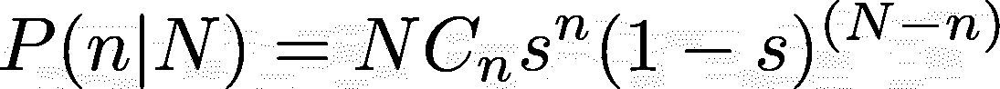
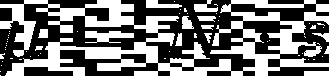

# 从小的随机样本中进行估计——理解潜在的概率！

> 原文：<https://towardsdatascience.com/estimating-from-small-random-samples-understanding-the-underlying-probabilities-at-play-91663f77669d?source=collection_archive---------25----------------------->

假设你被要求证明一个特性有多有用。比方说，你必须估计你的平台上有多少用户会从你的产品的某个特性或变化中受益。

Sampling from a population

你从 1%的用户中挑选一个“随机统一样本”。他们现在可以看到该功能。在一周的时间里，你已经计算出有 1000 个用户在积极地使用这个特性。

现在是时候让这个特性在整个流量中推广了。现在，您必须回答管理层提出的问题，即有多少用户可能从该功能中受益。

你会说 100，000，因为在 1%的随机统一样本中，有 1000 人喜欢它。听起来合理吗？

我就在这里停下来，问这个问题。

假设真的有 10 万人会喜欢这个功能并从中受益。你从这 1%的样本中得到 1000 这个数字的机会(或概率)是多少？

我认为这是人们容易感到困惑的地方。我听过回答说百分百确定。理由是这是一个完全随机的样本，或者准确地说，是随机的均匀样本！

你可以暂停阅读这篇文章，看看上面是否有道理，并找出其中的谬误。

解决这个问题的方法如下:我们需要找到以下条件概率

P(n=1000|N=100000)

其中 N=对这 1%样本感兴趣的人数，N =总体感兴趣的人数。

P(n|N)实际上是一个[二项分布](https://www.khanacademy.org/math/statistics-probability/random-variables-stats-library/binomial-random-variables/v/binomial-distribution)。让我们看看如何。

感兴趣的用户落入该样本的机会是(1 / 100)或样本百分比 *s，*假定它是随机均匀分布。结果是下面的公式:

代入 n = 1000 和 N = 100000 以及 s = 0.01 的值，我们得到

换句话说，期望值 1000 只有 1.2%的机会

再回忆一下，二项分布的均值是:

所以期望值确实是 1000，但是概率相当低！

我认为理解这一点很重要。我知道对 1%的随机流量样本进行测试看起来没有多大意义。让我们继续探索，看看吧！

因此，让我们尝试将样本量增加到 10%。预期值为 10，000。让我们计算同样的概率。

换句话说，尽管样本量更大，概率还是下降到了 0.4%。

另一方面，让我们尝试一个非常非常小的样本量 0.01%。

得到“期望值”10 的概率现在已经上升到接近 12.5%。

正如我们所预期的，样本量越大，我们应该能够以更高的概率获得真实值，但似乎发生了相反的情况。这里的谬误是什么？

在这一点上，重要的是不仅要看个体概率，还要看概率的分布。

Probability Distribution of “n”, given sample size = 1% and N = 10000

这表明“n”的值将主要在 900 到 1100 之间。假设我们得到 N 是 1050，我们对 N = 1050 * 100 = 105,000 的估计不是 100000。这是一个 5%的误差，人们可能会认为这不符合标准。

Probability distribution of ’n’, given sample size = 10% and N = 100000

Probability distribution of ’n’, given sample size = 0.01% and N = 100000

从上面的分布图可以看出，如果采样的“N”结果是 5，那么 N 的估计值将是 50，000，这是 50%的误差！

这就把我们带到了一个我们到目前为止还没有谈到的重要统计数据——方差。让我们看看不同样本量下的方差。

让我们看看不同 s 值的标准差。

随着样本量的增加，标准偏差急剧减小。即使样本量为 1%，标准偏差也只是平均值的 3%。

这个标准差如何帮助我对误差可控有信心？我来介绍一个概念，叫切比雪夫不等式。不要被公式弄得不知所措——我会马上解释的。

这仅仅意味着一个值偏离均值 k 个标准差的几率小于(1 / k)！

应用切比雪夫不等式，我们知道一个值距离平均值至少 3 个标准偏差的概率是 1/(3*3)小于 1/9 或大约 10%。

因此，在我们的具体示例中，如果您选择 1%的采样率，您至少可以 90%确定您获得的值与平均值的偏差不超过 10%!

我认为 90%的置信度，不超过 10%的误差，对于实际应用来说应该足够了！

PS:对于更善于观察的人来说，有一个固有的假设，即我们在此之前知道 N。这是一个稍微高级一点的话题，但是只要 N 足够大，比如说大于 5000，1%的采样率就足够了。这表明可能需要 N 的某种先验知识——至少是 N 所在的范围。

概括地说，这些教训是:

> a)从样本中收集的值*不会*成为您想要的精确测量值，并且会与精确测量值有偏差。重要的是要了解精确测量存在多少偏差或误差。
> 
> b)选择较大的样本量可最大限度地减少偏差。在大多数情况下，1%的采样率就足够了。

*这篇文章也出现在* [*印度分析杂志上。*](https://analyticsindiamag.com/small-vs-random-samples-understanding-underlying-probability/)