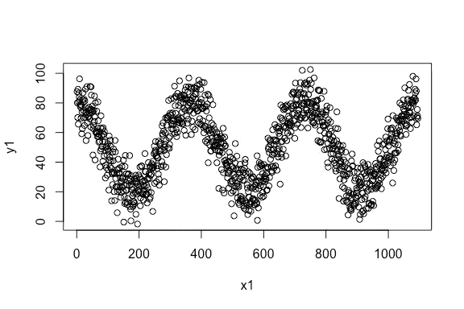
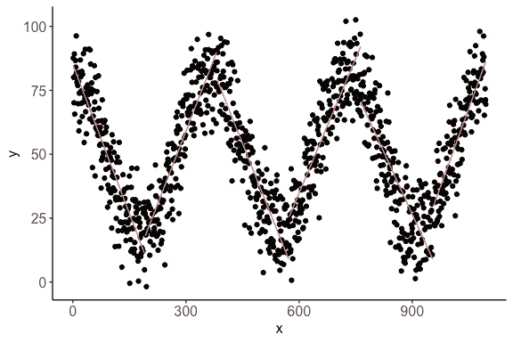
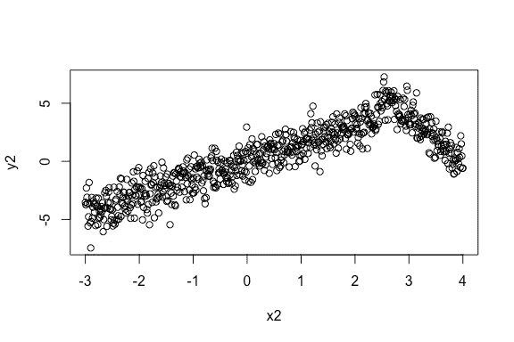
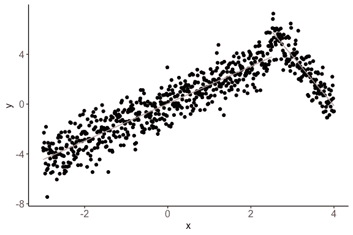
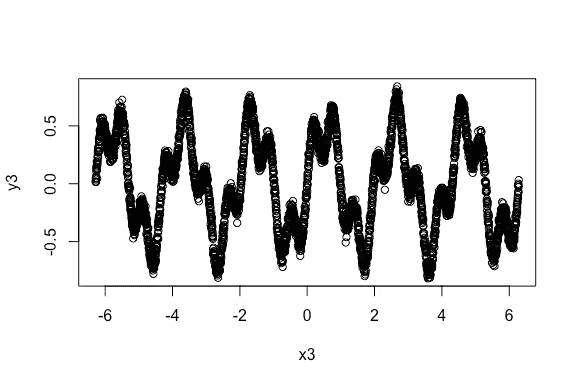
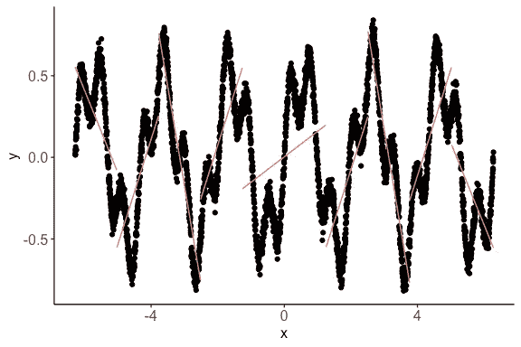
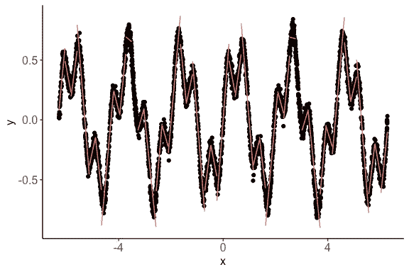

# 估计 R 中的非线性相关性

> 原文：<https://towardsdatascience.com/estimating-non-linear-correlation-in-r-62c6571cb1db?source=collection_archive---------6----------------------->

在本帖中，我们将学习在 r 中使用非线性相关估计函数。我们还将看几个例子。

# 背景

相关估计通常用于各种数据挖掘应用中。根据我的经验，非线性相关在各种过程中相当普遍。由于这个原因，非线性模型，例如 SVM，被用于回归、分类等。然而，估计两个变量之间非线性相关性的方法并不多。

通常估计线性相关性。然而，数据可能具有非线性相关性，但几乎没有线性相关性。在这种情况下，非线性相关变量有时会在高维数据的数据探索或变量选择过程中被忽略。

我们开发了一种新的非线性相关估计量`nlcor`。该估计器在数据探索和非线性预测模型(如 SVM)的变量选择中非常有用。

# 安装`nlcor`

要在 R 中安装`nlcor`,请遵循以下步骤:

1.  安装[开发工具](https://github.com/hadley/devtools)包。你可以从[曲柄](https://cran.r-project.org/)开始操作。您可以直接在 R 控制台中输入:

```
> install.packages("devtools")
```

2.加载 devtools 包。

```
> library(devtools) 
```

3.通过在 R 控制台中键入以下命令，从 GitHub 库中安装`nlcor`。

```
> install_github("ProcessMiner/nlcor")
```

# 非线性相关估计量

在这个包中，我们提供了一个在`nlcor`中使用自适应局部线性相关计算的非线性相关估计方法的实现。函数`nlcor`返回非线性相关估计值、相应的调整后 p 值以及可视化非线性关系的可选图。

相关估计将在 0 和 1 之间。该值越高，非线性相关性越强。与线性相关不同，负值在这里是无效的。由于多个局部相关计算，相关估计的净 p 值被调整(以避免假阳性)。该图显示了局部线性相关性。

下面，我们将通过几个例子来展示它的用法。在给出的例子中，`x`和`y`之间的线性相关性很小，然而，它们之间存在可见的非线性相关性。该包包含这些示例的数据，可用于测试该包。

`nlcor`包有几个样本`x`和`y`向量，在下面的例子中演示。

首先，我们将加载包。

```
> library(nlcor)
```

## 例 1。具有循环非线性相关性的数据。

```
> plot(x1, y1)
```



数据的线性相关性是，

```
> cor(x1, y1)
[1] 0.008001837
```

正如所料，相关性接近于零。我们使用`nlcor`来估计非线性
相关性。

```
> c <- nlcor(x1, y1, plt = T)
> c$cor.estimate
[1] 0.8688784
> c$adjusted.p.value
[1] 0
> print(c$cor.plot)
```



该图显示了数据中存在的分段线性相关性。

## 例 2。具有非均匀分段线性相关性的数据。

```
> plot(x2, y2)
```



数据的线性相关性是，

```
> cor(x2, y2)
[1] 0.828596
```

这一数据的线性相关性相当高。然而，数据中存在
显著且更高的非线性相关性。该
数据模拟了一个点之后相关性改变其方向
的场景。**有时，变化点位于中间，导致
线性相关性接近于零。**此处我们展示了一个
变化点偏离中心的例子，以表明该实施在
非均匀情况下有效。

我们使用`nlcor`来估计非线性相关性。

```
> c <- nlcor(x2, y2, plt = T)
> c$cor.estimate
[1] 0.897205
> c$adjusted.p.value
[1] 0
> print(c$cor.plot)
```



从图中可以看出，`nlcor`可以估计非均匀场景中的分段相关性。此外，非线性相关性高于线性相关性。

## 例 3。具有更高和多个频率变化的数据。

```
> plot(x3, y3)
```



数据的线性相关性是，

```
> cor(x3, y3)
[1] -0.1337304
```

线性相关性预期很小，尽管由于某种线性
而不接近零。

这里我们展示了我们可以细化相关性
计算的粒度。

默认设置下，`nlcor`的输出为:

```
> c <- nlcor(x3, y3, plt = T)
> c$cor.estimate
[1] 0.7090148
> c$adjusted.p.value
[1] 0
> print(c$cor.plot)
```



从图中可以看出，`nlcor`忽略了一些地方关系。我们可以通过改变`refine`参数来改进相关估计。`refine`的默认值设置为 0.5。可以设置为`0`和`1`之间的任意值。值越大，细化程度越高。

但是，更高的细化会对 p 值产生不利影响。也就是说，得到的相关性估计在统计上可能是不重要的(类似于过度拟合)。因此，建议避免过度细化。

对于该数据，我们使用`refine = 0.9`重新运行相关性估计。

```
> c <- nlcor(x3, y3, refine = 0.9, plt = T)
> c$cor.estimate
[1] 0.8534956
> c$adjusted.p.value
[1] 2.531456e-06
> print(c$cor.plot)
Warning: Removed 148 rows containing missing values (geom_path).
```



如图所示，`nlcor`可以识别粒度分段相关性。在该数据中，p 值仍然非常小——相关性*具有统计显著性*。

# 摘要

这个包提供了一种有效的启发式算法来计算数值向量之间的非线性相关性。启发式算法通过自适应地识别多个线性相关的局部区域来估计整体非线性相关。这里用几个例子来说明它的用法。

# 引用

*   **打包‘nlcor’:计算非线性相关性**

[@文章](http://twitter.com/article) {ranjan2020packagenlcor，
title = { Package ' nlcor ':Compute Nonlinear Correlations }，
作者={Ranjan，Chitta and Najari，Vahab}，
期刊={Research Gate}，
年份={2020}，
doi = { 10.13140/rg . 2 . 2 . 33716 . 68480 }
}

Chitta Ranjan 和 Vahab Najari。“软件包‘nlcor’:计算非线性相关性”。在:研究门(2020)。doi:10.13140/rg . 2 . 2 . 33716.68480

*   **nlcor:非线性相关**

[@ article](http://twitter.com/article){ ran Jan 2019 nlcor，
title={nlcor:非线性相关}，
author={Ranjan，Chitta and Najari，Vahab}，
journal={Research Gate}，
year={2019}，
doi = { 10.13140/rg . 2 . 2 . 10123 . 72488 }
}

Chitta Ranjan 和 Vahab Najari。“nlcor:非线性相关”。In:研究门(2019)。doi:10.13140/RG