# 估计机器学习模型中的不确定性—第 1 部分

> 原文：<https://towardsdatascience.com/estimating-uncertainty-in-machine-learning-models-part-1-99fde3b0cbc1?source=collection_archive---------6----------------------->

**作者:Dhruv Nair，数据科学家，Comet.ml**

"我们要求严格界定怀疑和不确定的领域！"

——道格拉斯·亚当斯，《银河系漫游指南》

# 为什么不确定性很重要？

让我们想象一下，我们正在为建筑公司 ABC 建筑公司建造一个计算机视觉模型。该公司对其空中现场监控流程的自动化感兴趣，并希望我们的算法能在他们的无人机上运行。

我们愉快地开始工作，将我们的算法部署到他们的无人机舰队上，回家后认为这个项目取得了巨大的成功。一周后，我们接到 ABC 建筑公司的电话，说无人机不断撞上他们停在所有工地上的白色卡车。你冲到其中一个站点检查视觉模型，并意识到它错误地预测白色卡车的一侧只是明亮的天空。鉴于这一预测，无人机会径直飞向卡车，以为那里什么也没有。

对现实世界中的数据进行预测时，最好对模型的预测可信度进行评估。如果需要模型来做出对人们生活有实际影响的决策，这一点尤其正确。在自动驾驶汽车、医疗保健、保险等应用中，不确定性测量有助于防止严重事故的发生。

# 不确定性的来源

当对任何过程建模时，我们主要关心两种类型的不确定性。

**随机不确定性**:这是我们试图解释的过程中固有的不确定性。例如，由于与周围空气的复杂相互作用，从桌子上方的相同位置落下的乒乓球每次都会落在稍微不同的点上。这一类的不确定性在实践中往往是不可减少的。

**认知不确定性**:这种不确定性归因于对最适合解释数据的模型的知识不足。这种不确定性是可以减少的，因为对手头的问题有了更多的了解。例如，通过向模型添加更多参数、收集更多数据等来减少这种不确定性。

# 那么我们如何估计不确定性呢？

让我们考虑这样一个例子，一家面包店试图根据进入面包店的顾客数量来估计它在一个给定的月内将出售的蛋糕数量。我们将尝试使用一个简单的[线性回归](https://en.wikipedia.org/wiki/Linear_regression)模型来模拟这个问题。然后，我们将尝试从我们现有的可用数据中估计该模型中不同类型的认知不确定性。

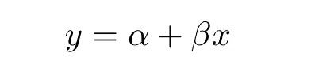

Equation for Linear Regression

这个模型的系数受制于[采样不确定性](https://atmos.washington.edu/~breth/classes/AM582/lect/lect3-notes.pdf)，我们不太可能从样本数据中确定模型的真实参数。因此，提供这些系数的一组可能值的估计将告知我们当前模型能够如何恰当地解释这些数据。

首先，让我们生成一些数据。我们将从经过缩放和移位的单位正态分布中对我们的 ***x*** 值进行采样。我们的 ***y*** 值只是这些 ***x*** 值的扰动。

```
import numpy as npfrom numpy.random import randn, randint
from numpy.random import seed# random number seed
seed(1)# Number of samples
size = 100x = 20 * (2.5 + randn(size)) 
y = x + (10 * randn(size) + 50)
```

我们得到的数据最终看起来像这样

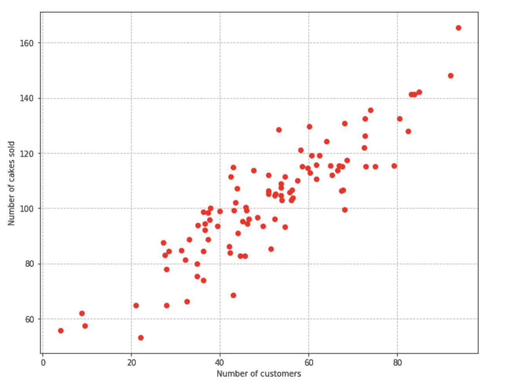

Distribution of Sample Data

我们将从使用 bootstrap 抽样估计模型参数的不确定性开始。Bootstrap 采样是一种通过采样替换原始数据集来构建新数据集的技术。它生成我们数据集的变体，并能给我们一些直观的参数范围来描述数据。

在下面的代码中，我们运行 1000 次 bootstrap 采样迭代，将线性回归模型拟合到每个样本数据集，并记录系数，以及每次迭代时模型的截距。

```
from sklearn.utils import resamplecoefficients = []
intercepts = []for _ in range(1000):
    idx = randint(0, size, size)
    x_train = x[idx]
    y_train = y[idx]

    model = LinearRegression().fit(x_train, y_train)

    coefficients.append(model.coef_.item())
    intercepts.append(model.intercept_)
```

最后，我们从记录的系数中提取 97.5，2.5 个百分点。这给了我们系数和截距的 95%置信区间。使用百分位数来确定区间还有一个额外的优点，就是不需要对系数的抽样分布进行假设。

```
upper_coefficient = np.percentile(coefficients, 97.5)
upper_intercept = np.percentile(intercepts, 97.5)lower_coefficient = np.percentile(coefficients, 2.5)
lower_intercept = np.percentile(intercepts, 2.5)
```

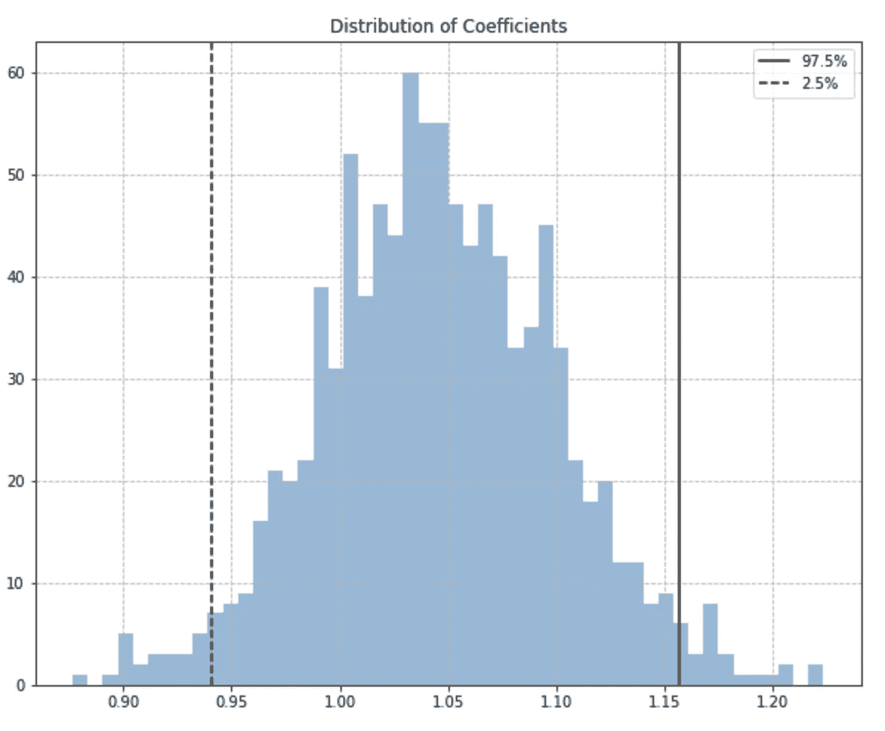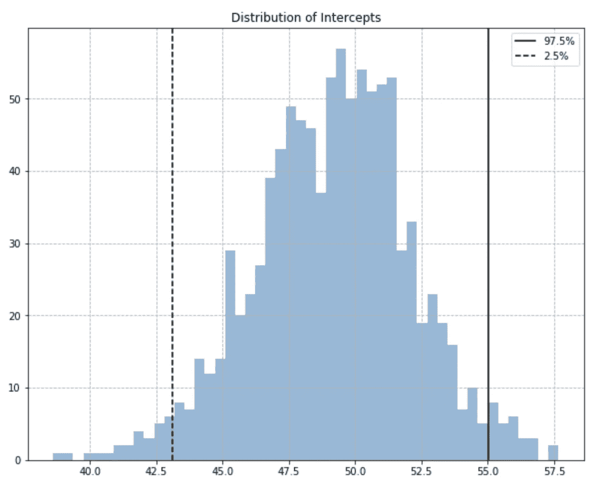

我们现在可以使用这些系数来绘制能够描述数据的曲线族的 95%置信区间。

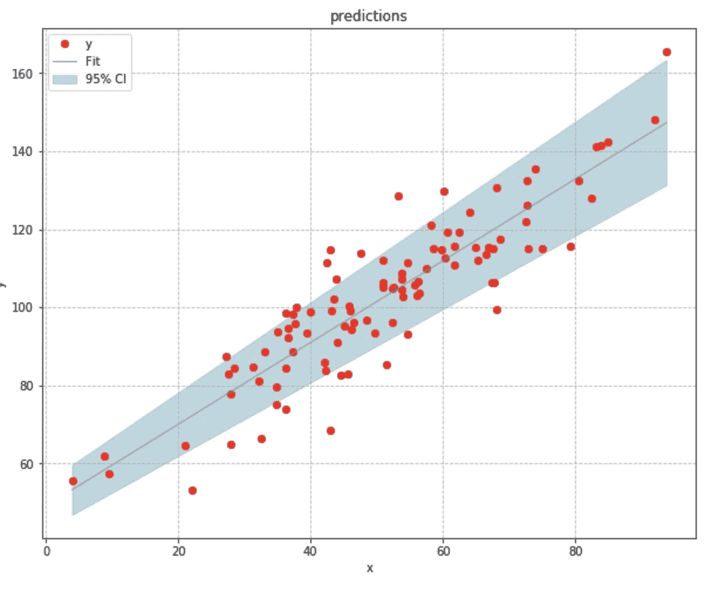

Confidence Interval for Model Parameters

现在让我们估计模型预测的不确定性。我们的线性回归模型预测蛋糕的平均销售数量，假设有 ***x*** 名顾客来到商店。我们预计不同的 ***x*** 值会在*y 中产生不同的均值响应，我们将假设对于一个固定的 ***x*** ，响应 ***y*** 是正态分布的。*

*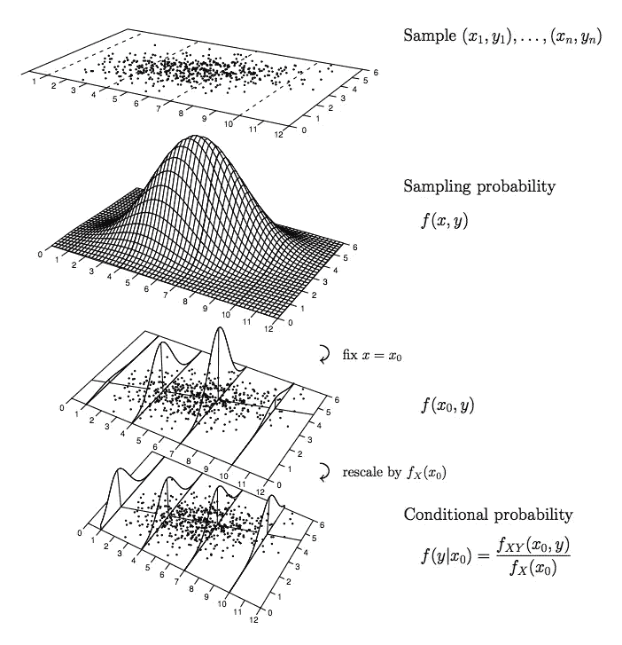*

*[Visualizing the conditional mean](http://www.stat.uchicago.edu/~eichler/stat22000/Handouts/l23.pdf)*

*基于这一假设，我们可以使用来自我们预测的残差来近似以*为条件的 ***y*** 中的方差。有了这个方差，我们就可以计算平均响应的[标准误差](https://en.wikipedia.org/wiki/Standard_error)，并使用它来建立平均响应的置信区间。这是我们对 ***y*** 的真实平均响应的近似程度的度量。这个值越小越好。**

**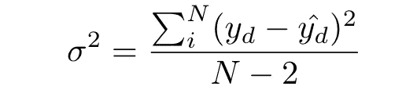****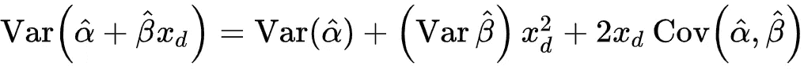****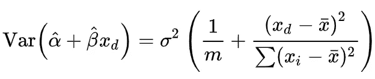****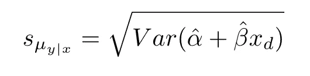****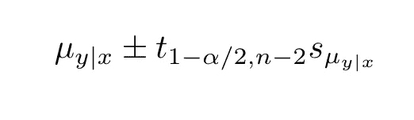****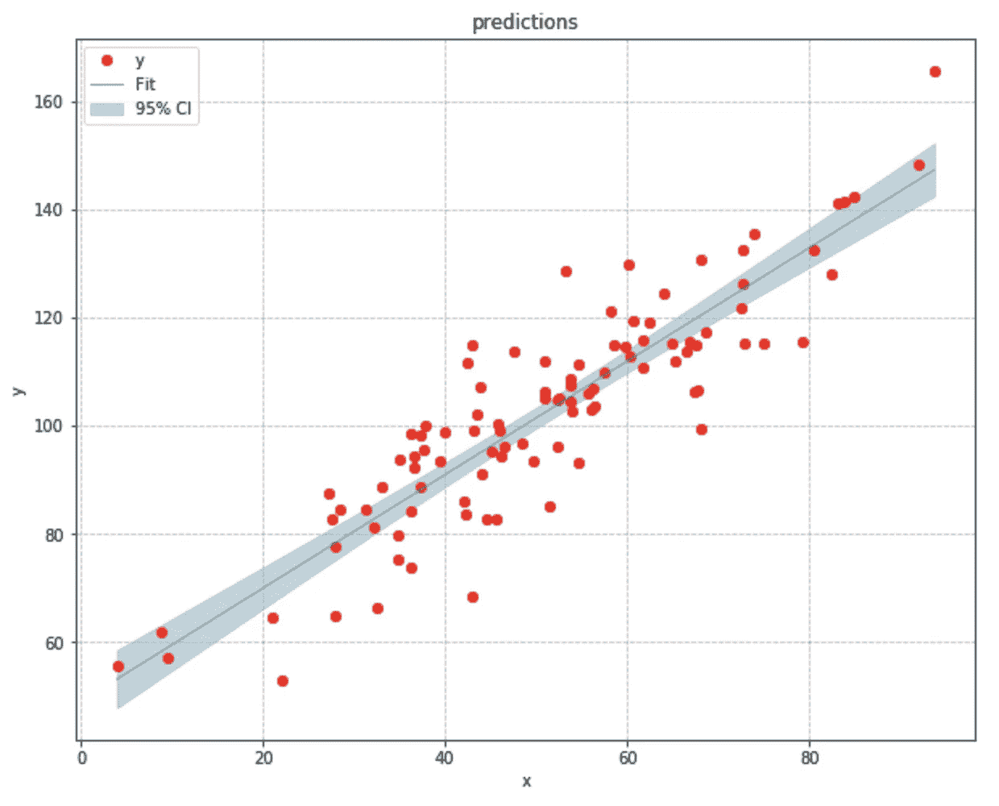**

**Confidence Intervals of the Mean from the Standard Error of the Model**

**条件均值的方差取决于系数和截距的方差。标准误差就是这个方差的平方根。由于条件均值的标准误差与 ***x*** 的值与均值的偏差成正比，所以我们可以看到，随着它越来越接近 ***x*** 的均值，它会变得越来越窄。**

**有了置信区间，面包店就能够确定给定数量的顾客将出售的蛋糕的平均数量的区间，然而，他们仍然不知道给定数量的顾客他们可能出售的蛋糕的可能数量的区间。**

**置信区间仅说明 ***y*** 的平均响应的漂移。对于给定的 ***x*** 值，不提供 ***y*** 所有可能值的区间。为了做到这一点，我们需要使用一个预测区间。**

**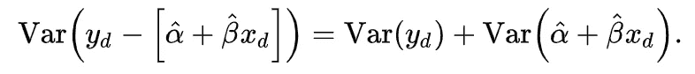****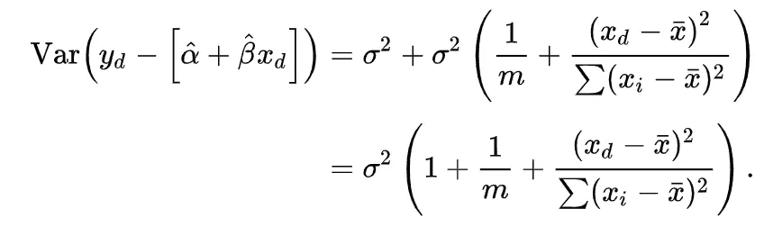****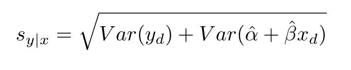**

**预测区间以与置信区间相似的方式导出。唯一不同的是，我们在计算标准误时，包含了我们因变量 ***y*** 的方差，导致区间更宽。**

**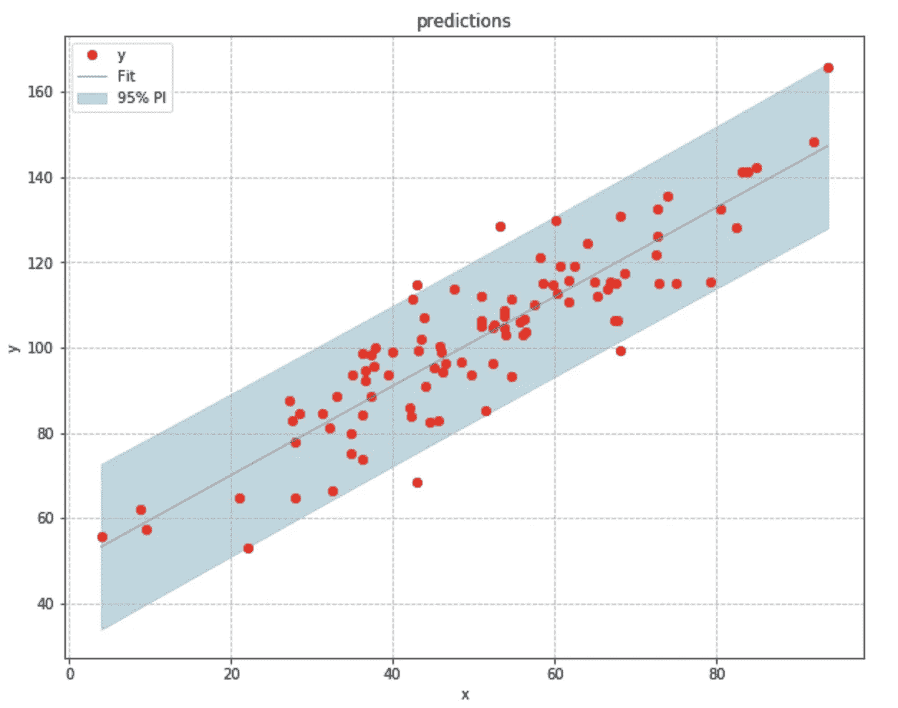**

**Prediction Interval for the Model Predictions**

# **结论**

**在评估不确定性系列的第一部分中，我们研究了在一个简单的回归模型中评估认知不确定性来源的方法。当然，当数据和模型的规模和复杂性增加时，这些评估会变得更加困难。**

**当我们处理大型神经网络时，自举技术不起作用，并且通过标准误差估计置信区间和预测区间仅在对模型残差和参数的采样分布进行正态假设时才起作用。当这些假设被违反时，我们如何衡量不确定性？**

**在本系列的下一部分，我们将着眼于在更复杂的模型中量化不确定性的方法。**

****作者:Dhruv Nair，数据科学家，Comet.ml****