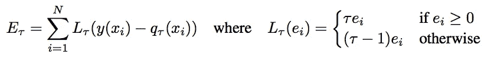

# 估计机器学习模型中的不确定性—第 3 部分

> 原文：<https://towardsdatascience.com/estimating-uncertainty-in-machine-learning-models-part-3-22b8c58b07b?source=collection_archive---------18----------------------->

> *看看这个系列*的第一部([](https://medium.com/comet-ml/estimating-uncertainty-in-machine-learning-models-part-1-2bd1209c347c)**)和第二部(*[](https://medium.com/comet-ml/estimating-uncertainty-in-machine-learning-models-part-2-8711c832cc15)**)***
> 
> ****作者:Dhruv Nair，数据科学家，Comet.ml****

**在关于不确定性估计的系列文章的最后一部分中，我们讨论了大型模型的自举等方法的局限性，并展示了如何使用 [MC Dropout](https://arxiv.org/pdf/1506.02142.pdf) 来估计神经网络预测的不确定性。**

**到目前为止，我们研究的方法包括在数据集或模型参数中创建变量来估计不确定性。这里的主要缺点是，它要求我们要么训练多个模型，要么进行多次预测，以便计算出我们的模型预测的方差。**

**在有延迟约束的情况下，诸如 MC 丢弃之类的技术可能不适合用于估计预测间隔。我们能做些什么来减少估计区间所需的预测次数？**

# **用极大似然法估计区间**

**在本系列的第 1 部分中，我们假设因变量 **μ(y|x)** 、的平均响应呈正态分布。**

**MLE 方法包括建立两个模型，一个用于估计条件平均响应 **μ(y|x)** ，另一个用于估计预测响应中的方差 **σ** 。**

**首先，我们将训练数据分成两半。前半部分模型 **mμ** 使用前半部分数据作为常规回归模型进行训练。然后，该模型用于对数据的后半部分进行预测。**

**第二个模型， **mσ** 使用数据的后半部分进行训练，并将 **mμ** 的残差平方作为因变量。**

********

**最终预测区间可以用以下方式表示**

****

**这里 **α** 是根据高斯分布的期望置信水平。**

# **让我们试一试**

**我们将再次使用自动 MPG 数据集。请注意，在最后一步中，训练数据是如何再次拆分的。**

```
****Mean Variance Estimation Method**dataset_path = keras.utils.get_file("auto-mpg.data", "[http://archive.ics.uci.edu/ml/machine-learning-databases/auto-mpg/auto-mpg.data](http://archive.ics.uci.edu/ml/machine-learning-databases/auto-mpg/auto-mpg.data)")column_names = 
['MPG','Cylinders','Displacement','Horsepower','Weight',
                'Acceleration', 'Model Year', 'Origin']
raw_dataset = pd.read_csv(dataset_path, names=column_names,
                      na_values = "?", comment='\t',
                      sep=" ", skipinitialspace=True)dataset = raw_dataset.copy()
dataset = dataset.dropna()origin = dataset.pop('Origin')dataset['USA'] = (origin == 1)*1.0
dataset['Europe'] = (origin == 2)*1.0
dataset['Japan'] = (origin == 3)*1.0train_dataset = dataset.sample(frac=0.8,random_state=0)
test_dataset = dataset.drop(train_dataset.index)mean_dataset = train_dataset.sample(frac=0.5 , random_state=0)
var_dataset = train_dataset.drop(mean_dataset.index)**
```

**接下来，我们将创建两个模型来估计数据的均值和方差**

```
**import kerasfrom keras.models import Model
from keras.layers import Input, Dense, Dropout
dropout_rate = 0.5def model_fn():
    inputs = Input(shape=(9,))
    x = Dense(64, activation='relu')(inputs)
    x = Dropout(dropout_rate)(x)
    x = Dense(64, activation='relu')(x)
    x = Dropout(dropout_rate)(x)
    outputs = Dense(1)(x)

    model = Model(inputs, outputs)

    return modelmean_model = model_fn()
mean_model.compile(loss="mean_squared_error", optimizer='adam')var_model = model_fn()
var_model.compile(loss="mean_squared_error", optimizer='adam')**
```

**最后，我们将标准化我们的数据，并开始训练**

```
**train_stats = train_dataset.describe()
train_stats.pop("MPG")
train_stats.transpose()def norm(x):
    return (x - train_stats.loc['mean'])/ train_stats.loc['std']normed_train_data = norm(train_dataset)
normed_mean_data = norm(mean_dataset)
normed_var_data = norm(var_dataset)
normed_test_data = norm(test_dataset)train_labels = train_dataset.pop('MPG')
mean_labels = mean_dataset.pop('MPG')
var_labels = var_dataset.pop('MPG')
test_labels = test_dataset.pop('MPG')**
```

**训练好均值模型后，我们可以使用它对数据集的后一半进行预测，并计算残差的平方。**

```
**EPOCHS = 100mean_model.fit(normed_mean_data, mean_labels, epochs=EPOCHS, validation_split=0.2, verbose=0)mean_predictions = mean_model.predict(normed_var_data)
squared_residuals = (var_labels.values.reshape(-1,1) - mean_predictions) ** 2var_model.fit(normed_var_data, squared_residuals, epochs=EPOCHS, validation_split=0.2, verbose=0)**
```

**让我们来看看这种方法产生的音程。**

****

**你会注意到高度不准确的预测在平均值附近有更大的间隔。**

# **使用分位数回归估计区间**

**如果我们不想对我们的响应变量的分布作出假设，而想直接估计我们的目标变量的上限和下限，该怎么办？**

**分位数损失可以帮助我们估计目标百分位数反应，而不是平均反应。也就是说，预测我们目标的 0.25 分位数值将告诉我们，给定我们当前的一组特征，我们期望 25%的目标值等于或小于我们的预测。**

**如果我们训练两个独立的回归模型，一个用于 0.025 百分位，另一个用于 0.9725 百分位，我们实际上是说我们预期 95%的目标值落在这个区间内，即**95%的预测区间****

****

**[分位数回归损失函数](https://arxiv.org/pdf/1806.11222.pdf)**

# **让我们试一试**

**Keras 没有默认的分位数损失，所以我们将使用来自 [Sachin Abeywardana](https://towardsdatascience.com/@sachin.abeywardana) 的[跟随实现](/deep-quantile-regression-c85481548b5a)**

```
**import keras.backend as Kdef tilted_loss(q,y,f):
    e = (y-f)
    return K.mean(K.maximum(q*e, (q-1)*e), axis=-1)model = model_fn()
model.compile(loss=lambda y,f: tilted_loss(0.5,y,f), optimizer='adam')lowerq_model = model_fn()
lowerq_model.compile(loss=lambda y,f: tilted_loss(0.025,y,f), optimizer='adam')upperq_model = model_fn()
upperq_model.compile(loss=lambda y,f: tilted_loss(0.9725,y,f), optimizer='adam')**
```

**由此产生的预测如下所示**

****

**这种方法的一个缺点是它倾向于产生非常宽的间隔。您还会注意到，间隔并不是关于中间估计值(蓝点)对称的。**

# **评估预测间隔**

**在上一篇[文章](https://medium.com/comet-ml/estimating-uncertainty-in-machine-learning-models-part-2-8711c832cc15)中，我们引入了两个指标来评估我们区间预测的质量，PICP 和 MPIW。下表比较了我们用来估计神经网络中不确定性的最后三种方法的这些度量。**

****

**神经网络中不确定性估计技术的比较**

**我们看到，均值-方差估计方法产生最小宽度的区间，这导致其 PICP 分数的降低。MC 下降和分位数回归产生非常宽的区间，导致完美的 PICP 分数。**

**MPIW 和 PICP 之间的平衡是一个开放性的问题，完全取决于模型的应用方式。理想情况下，我们希望我们的区间尽可能紧凑，具有较低的平均宽度，并且在大多数情况下还包括我们的目标值。**

# **结论**

**这些技术可以很容易地在您现有的模型上实现，只需很少的更改，并且为您的预测提供不确定性估计，使它们更值得信赖。**

**我希望你喜欢我们关于不确定性的系列。请继续关注此空间，了解更多精彩内容！！**